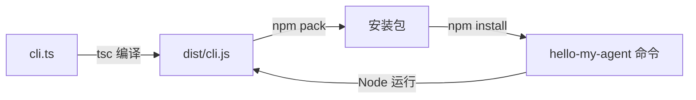

# 第 01 章：从空目录到自己的命令


[全书目录](../README.md) · [完整源码](cli.ts) · [环境与从零搭建](../docs/SETUP.md) · [练习答案](EXERCISES.md)

**本章起点：空目录。** 完成后，你会得到一个支持帮助和版本信息、可以本地安装的 `hello-my-agent` 命令。无需模型 Key，当前为试写稿。

## 问题

我们要写一个 Coding Agent。先不考虑它怎样读文件、改代码，只看使用者启动它的那一刻。

开发时，在项目里写两行代码就能输出一句话：

```ts
#!/usr/bin/env node
// 第一行让类 Unix 系统找到 Node 执行入口；这里先把欢迎语输出到终端。
console.log("你好，我的 Agent！");
```

但另一个人拿到你的程序后，不知道入口在哪，也没有你的开发环境。他希望在自己的项目目录里输入一个命令，就能启动它；忘记用法时能查帮助，遇到问题时能报告版本。

所以，第一个要解决的问题是：**怎样把我们写的程序变成一个可安装的命令？**

## 解决方案

保留一个入口文件，让三件事连起来：TypeScript 写源码，编译器生成 JavaScript，npm 给 JavaScript 创建命令入口。



本章只有一个运行入口 [cli.ts](cli.ts)。Commander 负责参数解析；Agent 的能力以后从这个入口接入。

## 工作原理

### 1. 先决定命令收到参数后做什么

入口中的这一段声明命令行为：

```ts
const program = new Command();

program
  .name("hello-my-agent")
  .description("你好，我的 Agent：从 0 到 npm 发布")
  .version(packageJson.version, "-v, --version", "显示版本号")
  .helpOption("-h, --help", "显示帮助")
  .action(() => {
    console.log("你好，我的 Agent！");
    console.log("命令已启动。下一章，我们会给它接上模型。");
  });

program.parse();
```

`.action()` 保存一个函数，并不立即执行。直到最后的 `.parse()` 读取参数，Commander 才决定这次调用走哪条路径：

| 用户输入 | 实际发生什么 |
| --- | --- |
| 没有参数 | 执行 `.action()` 中的函数 |
| `--help` | 输出帮助并结束 |
| `--version` | 输出版本并结束 |
| 未知参数 | 输出错误，以非零状态结束 |

这里一串 `.name().description()` 叫链式调用：每个方法配置一项信息后返回这个命令对象，因此可以接着调用下一个方法。

### 2. 版本信息属于程序，工作目录属于用户

`packageJson.version` 从哪里来？入口前面读取了根目录的包清单：

```ts
const packageJson = JSON.parse(
  readFileSync(new URL("../package.json", import.meta.url), "utf8"),
);
```

`import.meta.url` 是当前程序文件的位置。相对 `chapter-01-first-command/cli.ts` 向上一层，能找到根目录 `package.json`；编译后的入口在 `dist/cli.js`，同样向上一层就能找到它。根目录的 `tsconfig.build.json` 指定从 `chapter-01-first-command` 编译到 `dist`，因此两边的相对路径一致。

不要改成 `readFileSync("package.json")`。那样会从**当前工作目录**找文件：如果你在别人的项目里运行 Agent，就可能读到别人的版本号，或根本找不到文件。

这条区别以后会一直用到：Agent 自己的配置有自己的位置；它要处理的项目由用户当前工作目录决定。

### 3. npm 负责把命令名连接到文件

[package.json](../package.json) 的 `bin` 字段建立这条连接：

```json
{
  "bin": {
    "hello-my-agent": "dist/cli.js"
  }
}
```

这是清单中的局部字段，不要拿它覆盖完整文件。安装包时，npm 根据它创建 `hello-my-agent` 命令。入口第一行 `#!/usr/bin/env node` 再告诉系统使用 Node 执行这个文件。

用户安装后运行的是 `dist/cli.js`。tsx 只用于开发启动；TypeScript 编译器只用于构建。Commander 会随运行依赖一起安装。

## 动手构建

先完成 [从空目录搭建](../docs/SETUP.md)：建立本章工程，并运行最初两行欢迎语。然后在自己的 `chapter-01-first-command/cli.ts` 中按下面顺序补齐行为。

1. 导入 Node 的文件读取函数和 Commander。
2. 相对入口读取包清单，取出版本号。
3. 创建命令对象，注册帮助、版本和默认操作。
4. 最后解析参数。

完整文件如下，包含与 [本章源码](cli.ts) 一致的中文教学注释。先读文件头的问题与流程，再按 1—4 四个步骤跟写；关键语句旁会解释参数含义和设计原因：

```ts
#!/usr/bin/env node

/**
 * 第 01 章：从空目录到自己的命令。
 *
 * 要解决的问题：别人安装这个包后，怎样在自己的项目里启动它、查用法和报版本？
 * 本章从零增加命令入口、帮助和版本；下一章从这个入口接入模型。
 *
 * 执行流程：
 *   读取本包版本 -> 注册命令行为 -> 解析用户参数
 *                                  | 无参数       -> 显示欢迎语
 *                                  | --help       -> 显示帮助，结束
 *                                  | --version    -> 显示版本，结束
 *                                  | 不支持的参数 -> 报错，结束
 *
 * 两个概念：CLI 是命令行界面；入口文件是 Node 开始执行程序的文件。
 * npm 通过 package.json 的 bin 把 hello-my-agent 命令连接到编译后的入口。
 * 第一行的 #!/usr/bin/env node 让类 Unix 系统通过 PATH 找到 Node 执行它。
 *
 * 安装根目录依赖后，在仓库根目录运行：
 *   npm run chapter:01                 -> 显示欢迎语
 *   npm run chapter:01 -- --help        -> 显示帮助
 *   npm run chapter:01 -- --version     -> 显示 package.json 中的版本
 */

// 1. 准备依赖：Node 负责读本地文件，Commander 负责解析命令参数。
// node:fs 是 Node 自带的文件模块，无需安装；commander 是本项目的运行依赖。
import { readFileSync } from "node:fs";
import { Command } from "commander";

// 2. 读取 Agent 自己的版本，避免在代码里再维护一份版本字符串。
// import.meta.url 指向本文件；new URL("../package.json", ...) 找到它上一层的包清单。
// 源码在 chapter-01-first-command/，编译后在 dist/，两个目录都紧邻包清单。
// 例如用户在 /work/demo 启动已安装的命令，这里仍读取 Agent 安装目录的清单。
// 若只写 readFileSync("package.json")，就会到用户当前目录找，可能读错包或找不到。
// readFileSync 的 "utf8" 让结果成为文本；JSON.parse 再把文本转成可取 version 的对象。
// 本章在启动时同步读取这个小文件；清单缺失或 JSON 无效时会报错，暴露安装包问题。
const packageJson = JSON.parse(
  readFileSync(new URL("../package.json", import.meta.url), "utf8"),
);

// 3. 创建命令对象并登记规则；此时还没有开始解析用户输入。
// 下面的方法返回同一个命令对象，所以可以用 .name().description() 连续配置。
const program = new Command();

program
  // 设置帮助中的命令名；真正让系统找到命令的是 package.json 的 bin 字段。
  .name("hello-my-agent")
  // 这段介绍会出现在 --help 中，让安装者知道命令的用途。
  .description("你好，我的 Agent：从 0 到 npm 发布")
  // 注册 -v 和 --version；解析到它们时打印版本并正常结束，不进入默认操作。
  .version(packageJson.version, "-v, --version", "显示版本号")
  // 给 Commander 的帮助选项设置别名与中文说明；帮助内容由已登记的规则生成。
  .helpOption("-h, --help", "显示帮助")
  // () => { ... } 是交给 Commander 的回调；登记它时不会立即打印欢迎语。
  // 在本章的参数规则下，无参数启动才会执行这里。接入模型时从这个操作继续扩展。
  .action(() => {
    console.log("你好，我的 Agent！");
    console.log("命令已启动。下一章，我们会给它接上模型。");
  });

// 4. 开始执行：默认读取 process.argv，跳过 Node 和入口路径后解析用户参数。
// 例如 node dist/cli.js --help，真正参与选项解析的是 --help。
// npm run chapter:01 -- --help 中，第一个 -- 由 npm 处理，后面的 --help 才交给本程序。
// 必须先登记规则再 parse；未知选项或多余位置参数会由 Commander 报错并以状态 1 结束。
program.parse();
```

在自己的练习目录执行 `npm run chapter:01`，再执行 `npm run chapter:01 -- --help`，观察默认输出和帮助输出怎样分开。这里第一个 `--` 告诉 npm：后面的参数交给我们的程序。

## 相对起点的变化

第一章没有上一章。我们从两行欢迎语出发，得到以下变化：

| 部分 | 起点 | 本章完成后 |
| --- | --- | --- |
| 入口行为 | 每次都打印一句话 | 依据参数执行默认操作、帮助或版本 |
| 版本 | 没有版本信息 | 读取根目录中自己的包清单 |
| 运行方式 | 开发目录里运行源码 | 也能运行编译产物和安装后的命令 |
| 安装入口 | 无 | `bin` 指向 `dist/cli.js` |

后续第二章会保留这些行为，在默认操作中接入模型。第一章目录仍保留这一版本。

## 试一下

要运行本章完整版本，在**仓库根目录**执行：

```bash
npm ci
npm run chapter:01
npm run chapter:01 -- --help
npm run chapter:01 -- --version
```

这里的 `chapter:01` 是根目录 `package.json` 中的脚本名，对应 `tsx chapter-01-first-command/cli.ts`。`npm run cli.ts` 会寻找名为 `cli.ts` 的脚本，因此报 `Missing script`；早期的 `npm run s01` 也已改为 `npm run chapter:01`。不确定名称时，执行 `npm run` 查看列表。

默认操作输出：

```text
你好，我的 Agent！
命令已启动。下一章，我们会给它接上模型。
```

帮助中应该有 `-h, --help` 和 `-v, --version`；版本输出 `0.1.0-dev.1`。观察重点：请求帮助或版本时，还会执行默认欢迎语吗？为什么？

继续在仓库根目录编译，并检查真正的安装包：

```bash
npm run build
node dist/cli.js --version
npm run verify
```

`verify` 会把 tarball 安装到临时前缀，再进入与源码无关的目录启动命令。它检查欢迎语、帮助、版本和参数错误，最后清理自己创建的临时文件。[手动完成相同步骤](../docs/SETUP.md#手动打包安装) 可以看到这条路径中的每一步。

这个检查回答的就是本章最初的问题：程序离开源码目录，还能否正常启动？

## 失败实验：把参数拼错

仍然在仓库根目录中运行：

```bash
node dist/cli.js --versoin
```

应看到 `unknown option '--versoin'`。紧接着执行 `echo $?`，在 macOS / Linux 中得到退出码 `1`。把拼写改回 `--version`，结果恢复，退出码为 `0`。

Commander 帮我们拒绝未知输入。后续让其他程序自动调用 Agent 时，它们也会用退出码判断任务是否成功。

如果改了源码但运行结果没变，检查你是否直接运行了旧的 `dist/cli.js`：重新编译后再运行，或开发时使用 `npm run chapter:01`。安装包里的代码同样必须是编译后的新版本。

## 小练习

给命令增加 `--doctor`，打印 Node 版本、系统与架构、当前工作目录。原来的欢迎语、帮助和版本行为继续保留。

思考：显示当前工作目录时应该使用 `process.cwd()` 还是 `import.meta.url`？为什么这里与读取版本号不同？

[完整答案与运行说明](EXERCISES.md) 可以直接看；[答案源码](cli-with-doctor.ts) 也能通过根目录的 `npm run exercise:01 -- --doctor` 运行。下一章从正式的 `cli.ts` 继续，不依赖练习结果。

## 接下来

命令已经能启动，但回答仍是写死的两行文字。下一章要解决的是：怎样把输入发给模型，以及为什么第二次提问时需要保留第一次的消息。

第 02 章：接通模型并持续对话（待编写）。
