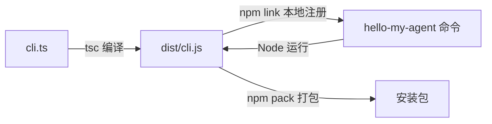

# 第 01 章：从空目录到自己的命令

[全书目录](../README.md) · [完整源码](cli.ts) · [环境与从零搭建](../docs/SETUP.md) · [练习答案](EXERCISES.md)

**本章目标：从空目录开始，做出一个可以安装、支持帮助和版本查询的 `hello-my-agent` 命令。** 本章只输出固定文本，不调用模型，无需 API Key。当前为试写稿。

## 问题

我们要写一个 Coding Agent。先不考虑它怎样读文件、改代码，只看使用者启动它的那一刻。

最简单的入口文件只需要输出一句欢迎语：

```ts
#!/usr/bin/env node
// 第一行让类 Unix 系统找到 Node 执行入口；这里先把欢迎语输出到终端。
console.log("你好，我的 Agent！");
```

另一个人拿到程序后，未必知道入口文件在哪，也未必安装了 TypeScript 编译工具。他希望在自己的项目目录里输入一个命令，就能启动它；忘记用法时能查帮助，遇到问题时能查看版本。

所以，第一个要解决的问题是：**怎样把我们写的程序变成一个可安装的命令？**

## 解决方案

用 TypeScript 编写入口，编译为 JavaScript，再让 npm 把命令名连接到编译后的文件。读者只需记住 `hello-my-agent` 这个命令名。



本章的入口源码是 [cli.ts](cli.ts)，编译后的运行文件是 `dist/cli.js`。Commander 负责解析命令行参数；后续章节在这个基础上增加模型和工具能力。

## 工作原理

### 1. 先决定命令收到参数后做什么

入口中的这一段声明命令行为：

```ts
const program = new Command();

program
  .name("hello-my-agent")
  .description("你好，我的 Agent：从 0 到 npm 发布")
  .version(packageJson.version, "-v, --version", "显示版本号")
  .helpOption("-h, --help", "显示帮助")
  .action(() => {
    console.log("你好，我的 Agent！");
    console.log("命令已启动。下一章，我们会给它接上模型。");
  });

program.parse();
```

`.action()` 保存一个函数，并不立即执行。直到最后的 `.parse()` 读取参数，Commander 才决定这次调用走哪条路径：

| 用户输入 | 实际发生什么 |
| --- | --- |
| `hello-my-agent` | 执行 `.action()` 中的函数 |
| `hello-my-agent --help` | 输出帮助并结束 |
| `hello-my-agent --version` | 输出版本并结束 |
| `hello-my-agent --versoin` | 选项拼写错误，输出错误并以退出码 `1` 结束 |

`.version(packageJson.version, "-v, --version", "显示版本号")` 中，第一项是要打印的版本，第二项注册两个等价选项，第三项是帮助文字。`hello-my-agent -v` 与 `hello-my-agent --version` 都是直接运行同一个命令；本书示例统一采用含义更完整的 `--version`。帮助选项的 `-h` 与 `--help` 同理。

`-v` 和 `--version` 分别是短选项和长选项，前面的短横线属于选项写法。运行时照着输入即可；不要写成 `hello-my-agent version`，本章没有定义这样的子命令。

这里一串 `.name().description()` 叫链式调用：每个方法配置一项信息后返回这个命令对象，因此可以接着调用下一个方法。

### 2. 版本信息属于程序，工作目录属于用户

`packageJson.version` 从哪里来？入口前面读取了根目录的包清单：

```ts
const packageJson = JSON.parse(
  readFileSync(new URL("../package.json", import.meta.url), "utf8"),
);
```

`import.meta.url` 是当前程序文件的 URL。`new URL("../package.json", import.meta.url)` 以这个文件为基准，定位上一级目录中的包清单。源码在 `chapter-01-first-command/cli.ts`，编译产物在 `dist/cli.js`；两者的上一级目录中都有本包的 `package.json`。这个目录关系由根目录的 `tsconfig.build.json` 保证。

`readFileSync(..., "utf8")` 按 UTF-8 编码读取文本，`JSON.parse(...)` 再把 JSON 文本转成对象。这样，后面就能通过 `packageJson.version` 取得版本号。

不要改成 `readFileSync("package.json")`。那样会从**当前工作目录**找文件：如果你在别人的项目里运行 Agent，就可能读到别人的版本号，或根本找不到文件。

例如，在 `/work/demo` 运行已安装的命令时，工作目录是 `/work/demo`，但版本号仍应来自 Agent 安装目录中的包清单。练习中的环境诊断会用到这两个目录的区别。

### 3. npm 负责把命令名连接到文件

[package.json](../package.json) 的 `bin` 字段建立这条连接：

```json
{
  "bin": {
    "hello-my-agent": "dist/cli.js"
  }
}
```

这里只展示 `package.json` 的 `bin` 字段，完整配置见 [环境准备](../docs/SETUP.md#根目录包清单)。执行 `npm link` 或全局安装包时，npm 根据它创建命令入口。在 macOS / Linux 上，文件首行 `#!/usr/bin/env node` 告诉系统通过 `PATH` 找到 Node，执行这个文件。

本地学习时先执行 `npm run build` 生成 `dist/cli.js`，再执行一次 `npm link`，把命令连接到当前项目的入口。修改 TypeScript 后重新构建，命令就会使用新产物。分发安装包时，npm 同样根据 `bin` 建立命令入口；Commander 会随运行依赖一起安装。

## 动手构建

如果你从空目录跟写，先按 [环境准备](../docs/SETUP.md) 建立项目，做到“写第一段代码”，确认 `hello-my-agent` 能打印欢迎语，再回到这里。已经下载配套仓库的读者可以直接对照源码阅读，并按下方“试一下”运行完成版。

在自己的 `chapter-01-first-command/cli.ts` 中，按下面顺序补齐功能：

1. 导入 Node 的文件读取函数和 Commander。
2. 相对入口读取包清单，取出版本号。
3. 创建命令对象，注册帮助、版本和默认操作。
4. 最后解析参数。

完整文件如下，包含与 [本章源码](cli.ts) 一致的中文教学注释。先读文件头的问题与流程，再按 1—4 四个步骤跟写；关键语句旁会解释参数含义和设计原因：

```ts
#!/usr/bin/env node

/**
 * 第 01 章：从空目录到自己的命令。
 *
 * 要解决的问题：别人安装这个包后，怎样在自己的项目里启动命令、查看帮助和版本？
 * 本章实现命令入口、帮助和版本查询；下一章在这个入口接入模型。
 *
 * 执行流程：
 *   读取本包版本 -> 登记命令规则 -> 解析用户参数
 *                                  | 无参数        -> 显示欢迎语
 *                                  | --help / -h   -> 显示帮助，结束
 *                                  | --version / -v -> 显示版本，结束
 *                                  | 不支持的参数  -> 报错，结束
 *
 * 两个概念：CLI 是命令行界面；入口文件是 Node 开始执行程序的文件。
 * npm link 或全局安装时，npm 根据 package.json 的 bin 创建命令入口。
 * 第一行的 #!/usr/bin/env node 让类 Unix 系统通过 PATH 找到 Node 执行它。
 *
 * 首次在项目根目录安装依赖，执行 npm run build，再用 npm link 注册本地命令。
 * 准备完成后直接运行以下命令；修改源码后重新构建即可：
 *   hello-my-agent           -> 显示欢迎语
 *   hello-my-agent --help    -> 显示帮助
 *   hello-my-agent --version -> 显示 package.json 中的版本；-v 是它的简写
 */

// 1. 准备依赖：Node 负责读本地文件，Commander 负责解析命令参数。
// node:fs 是 Node 自带的文件模块，无需安装；commander 是本项目的运行依赖。
import { readFileSync } from "node:fs";
import { Command } from "commander";

// 2. 读取 Agent 自己的版本，避免在代码里再维护一份版本字符串。
// import.meta.url 是当前文件的 URL；new URL("../package.json", ...) 据此定位包清单。
// 源码在 chapter-01-first-command/，编译后在 dist/；从这两个目录向上一层都能找到清单。
// 例如用户在 /work/demo 启动已安装的命令，这里仍读取 Agent 安装目录的清单。
// 若只写 readFileSync("package.json")，就会从当前工作目录查找，可能读错文件或找不到。
// "utf8" 指定文本编码；JSON.parse 把读到的 JSON 文本转成对象，供后面读取 version。
// 这里在启动时同步读取一次小文件；文件缺失或 JSON 无效时直接报错，便于发现安装问题。
const packageJson = JSON.parse(
  readFileSync(new URL("../package.json", import.meta.url), "utf8"),
);

// 3. 创建命令对象并登记规则；此时还没有开始解析用户输入。
// 下面的方法返回同一个命令对象，所以可以用 .name().description() 连续配置。
const program = new Command();

program
  // 设置帮助中显示的命令名；本机的命令入口由 npm 根据 bin 字段创建。
  .name("hello-my-agent")
  // 设置帮助中的简介，让使用者知道命令的用途。
  .description("你好，我的 Agent：从 0 到 npm 发布")
  // 三个参数依次是版本号、等价选项、帮助文字；-v 与 --version 都会显示版本并结束。
  .version(packageJson.version, "-v, --version", "显示版本号")
  // -h 与 --help 都会显示帮助并结束；Commander 根据已登记的规则生成帮助内容。
  .helpOption("-h, --help", "显示帮助")
  // 把 () => { ... } 这个函数交给 Commander，等解析参数后再决定是否调用。
  // 按本章规则，无参数启动时执行这里；请求帮助或版本时不会执行。下一章在此接入模型。
  .action(() => {
    console.log("你好，我的 Agent！");
    console.log("命令已启动。下一章，我们会给它接上模型。");
  });

// 4. 开始解析：不传参数时，parse() 默认读取 Node 提供的命令行参数数组 process.argv。
// 数组前两项是 Node 和入口文件的路径，Commander 跳过它们，再处理用户输入的参数。
// 例如运行 hello-my-agent --help，这里解析的用户参数就是 --help。
// 必须先登记规则再调用 parse()；未知选项或多余的位置参数会报错，并以退出码 1 结束。
program.parse();
```

代码写好后，在跟写项目根目录执行 `npm run build`，更新编译产物。你已经在环境准备中注册过命令，因此无需再次注册；接下来直接运行 `hello-my-agent` 和 `hello-my-agent --help`，比较两次输出。

## 相对起点的变化

第一章从空目录开始，完成后具备以下内容：

| 部分 | 空目录 | 本章完成后 |
| --- | --- | --- |
| 入口行为 | 无 | 根据参数显示欢迎语、帮助或版本 |
| 版本信息 | 无 | 从本包的 `package.json` 读取 |
| 构建过程 | 无 | 将 `cli.ts` 编译为 `dist/cli.js` |
| 安装入口 | 无 | `bin` 把 `hello-my-agent` 连接到编译后的入口 |

后续第二章会保留这些行为，在默认操作中接入模型。第一章目录仍保留这一版本。

## 试一下

首次使用配套仓库时，在**仓库根目录**（包含 `package.json` 的目录）准备命令：

```bash
npm ci
npm run build
npm link
```

`npm ci` 安装工程依赖，`npm run build` 编译源码，`npm link` 在本机注册命令。准备完成后统一这样运行：

```bash
hello-my-agent
hello-my-agent --help
hello-my-agent --version
```

已经按环境说明完成注册的读者，只需在改完代码后重新构建。这些本地操作无需 npm 账号；`npm link` 只注册本机命令，不会发布 npm 包。

默认操作输出：

```text
你好，我的 Agent！
命令已启动。下一章，我们会给它接上模型。
```

帮助中应该有 `-h, --help` 和 `-v, --version`；版本输出 `0.1.0-dev.1`。请求帮助或版本时不会输出欢迎语，因为 Commander 处理这两个选项后就结束了程序，不会执行 `.action()` 中的回调。

继续在仓库根目录检查真正的安装包：

```bash
npm run verify
```

`verify` 先检查类型并构建，再生成 `.tgz` 安装包（tarball）。脚本把包安装到临时目录，并在源码目录之外启动命令，检查欢迎语、帮助、版本和参数错误，最后清理自己创建的临时文件。[手动打包安装](../docs/SETUP.md#手动打包安装) 展示了这些步骤。

从空目录跟写的项目需要先按环境说明准备验收脚本、README 和 LICENSE，再运行 `verify`。

这个检查回答的就是本章最初的问题：程序离开源码目录，还能否正常启动？

## 失败实验：把参数拼错

命令注册完成后，输入一个拼错的选项：

```bash
hello-my-agent --versoin
```

错误输出中应包含 `unknown option '--versoin'`。在 macOS / Linux 终端中，紧接着执行 `echo $?`，应得到退出码 `1`。`$?` 表示上一条命令的退出码，`0` 通常表示成功，非零表示失败。改为运行 `hello-my-agent --version`，再执行 `echo $?`，应得到 `0`。

Commander 帮我们拒绝未知输入。后续让其他程序自动调用 Agent 时，它们也会用退出码判断任务是否成功。

如果改了源码但运行结果没变，先在该项目根目录执行 `npm run build`。若结果仍不符，用 `command -v hello-my-agent` 查看终端找到的命令位置，再按 [命令查找说明](../docs/SETUP.md#注册命令后如何找到它) 检查；需要切换项目时，在目标项目根目录重新执行 `npm link`。

## 小练习

给命令增加 `--doctor`，打印 Node 版本、系统与架构、当前工作目录。原来的欢迎语、帮助和版本行为继续保留。

思考：显示当前工作目录时应该使用 `process.cwd()` 还是 `import.meta.url`？为什么这里与读取版本号不同？

在独立跟写项目中完成练习、构建并注册后，运行 `hello-my-agent --doctor`。具体步骤和完整代码见 [练习答案](EXERCISES.md)。配套仓库的正式 `cli.ts` 没有这个选项；下一章从正式代码继续，不依赖练习结果。

## 接下来

命令已经能启动，但回答仍是写死的两行文字。下一章要解决的是：怎样把输入发给模型，以及为什么第二次提问时需要保留第一次的消息。

第 02 章：接通模型并持续对话（待编写）。
