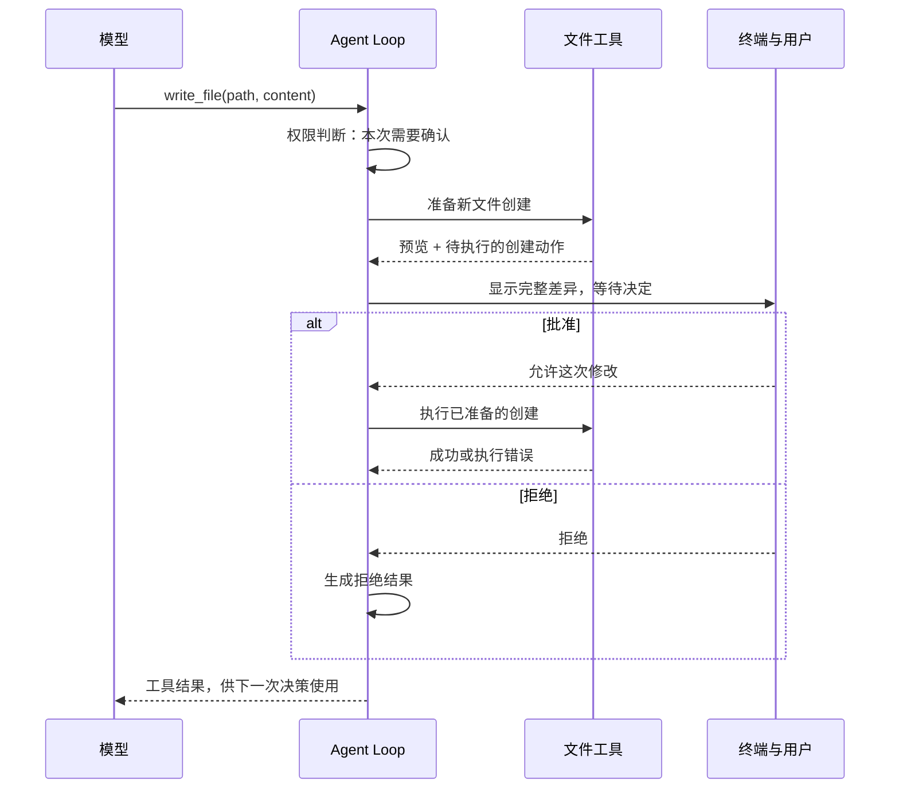

# 06.1 先预览，再创建文件

[第 06 章首页](../README.md) · [本节源码](src/) · [练习与答案](../EXERCISES.md)

## 问题：先看清内容，再决定要不要保存

第五章已经把权限判断放在工具执行之前。接下来，我们让 Agent 创建一个简单的 TypeScript 文件：

```text
创建 chapter-06-precise-edit/value.ts，内容为 export const value = 1;，文件末尾保留换行。
```

这次请求仍由模型理解，再转换成工具参数。我们希望写入的数值是 `1`，如果模型写成了 `10`，就不符合要求。因此，仅询问“是否允许访问 `value.ts`”还不够，程序还要先展示准备写入的内容，等用户确认符合要求后，再保存到文件。

本节先做新文件创建。用户批准，程序才创建文件；用户拒绝，就不执行这次创建。至于已有文件怎么改，我们放到下一节继续。

## 解决方案：先把内容准备好，批准后再写入

以前的只读工具收到参数后就可以读取文件、返回结果。写入工具中间需要留出一段时间，让用户查看工具准备写什么。

我们把工具分成两步。第一步检查路径和内容，生成预览，并记住批准后该怎样创建文件；第二步才真正写入。Agent Loop 拿到第一步的结果后，先等待用户的决定。用户同意，它才开始第二步。



这样一来，“展示预览”就发生在“保存到文件”之前。等待结束后，程序也已经知道该保存什么，不需要再让模型生成一遍正文。

## 工作原理

### 怎样展示这次要创建的内容

我们用 diff 展示文件修改。**diff 就是前后两份文本的差异**：删除的行前面放 `-`，新增的行前面放 `+`。这次是创建新文件，预览会像这样：

```diff
--- /dev/null
+++ b/chapter-06-precise-edit/value.ts
@@ -0,0 +1,1 @@
+export const value = 1;
```

先看最后一行：`+export const value = 1;` 显示了将要新增的正文。这个 `+` 只用于显示，实际保存的文件里不会有它。

前面三行说明这份差异属于哪个文件。`---` 后面是修改前的文件，`+++` 后面是修改后的文件；原文件还不存在，所以旧侧写成 `/dev/null`。`@@ -0,0 +1,1 @@` 则说明旧侧有零行，新侧从第 1 行开始有一行。这种显示方式叫 unified diff。

预览由程序根据实际准备写入的正文生成。模型说“我会创建一个常量”还不够，因为那句话没有说明常量是不是 `1`；用户看到完整正文，才能判断它是否符合要求。对新文件来说，所有内容都是新增的，因此整份正文都会出现在预览里。

下一节编辑文件时，我们还会用到同一个 diff 函数。它把前后文本按行比较，找出开头和结尾连续相同的部分，再把中间不同的内容放进一个变更块。前后各保留最多三行没变的内容，方便用户看出修改发生在哪里。这种写法适合本章的一次局部替换，不会像成熟 diff 工具那样尝试找出最小的多个变更块。

用于显示的文字还要稍作处理。比如制表符会显示成可见的 `\t`，这样它不会在终端里悄悄改变排版；真正要写入的正文仍保留原样。所以，程序要保留原正文，不能拿带有 `+` 和转义标记的预览去写文件。

如果一份预览超过 20,000 个字符，本节会直接要求模型把修改拆小。因为只展示前半段，却把整份内容写进去，就不能说整次修改都已经过用户确认了。

### 等待批准时，程序把正文放在哪里

程序生成预览后，要同时记住两件事：终端应该显示什么，以及用户批准后该执行什么。我们用一个对象把它们放在一起：

```ts
export type PreparedToolCall = {
  preview: string;
  execute(signal: AbortSignal): Promise<ToolExecutionResult>;
};
```

`preview` 保存刚才的 diff。`execute` 是一个函数，现在只把它保存下来，等批准后再调用。`PreparedToolCall` 是本书给这个类型起的名字，可以把它理解成“已经准备好、还没有执行的一次工具调用”。

写入工具准备时，会把校验后的参数放进局部变量 `input`，把目标路径放进 `target`。它返回的 `execute()` 会用到这两个变量。即使准备函数已经返回，只要这个执行函数还在，它就仍然能访问那些变量。这就是这里用到的**闭包**。

```text
模型参数中的 content ──┬── 生成 preview ──→ 终端审查
                       └── execute 保存引用 ──→ 批准后写盘
```

因此，同一份 `input.content` 一边用来生成预览，一边留给之后的写入。用户在终端批准后，执行函数保存的就是这份正文；预览里为了显示而加上的符号不会混进去。

Agent Loop 会把这次准备结果保存在局部变量 `prepared` 中，再用 `await` 等待用户的决定。审批返回后，程序从原来的位置继续，`prepared` 还在，里面的 `execute()` 也仍然引用准备时的正文。是否调用这个函数由主循环决定：拒绝就跳过，批准就为当前请求执行一次。

### 如果用户还没批准，同名文件就出现了呢

预览准备好时，`value.ts` 可能还不存在。但在用户查看内容的几秒钟里，编辑器或另一个程序也可能创建它。如果 Agent 接着按默认方式写入，就会把别人刚创建的文件覆盖掉。用户要的是创建新文件，覆盖已有文件就不符合这个要求了。

所以，真正创建时要使用 `flag: "wx"`。其中 `w` 表示以写入方式打开，`x` 要求目标在打开的那一刻还不存在。只要同名文件已经出现，这次创建就会失败。程序可以先检查文件不存在来准备预览，但最终能不能创建，还得由 `wx` 再检查一次。

目标所在的父目录也要检查。准备时，程序解析父目录的真实位置，确认它在项目内，并记下设备号和 inode。我们可以先把这两个数字理解为文件系统用来识别一个目录的标识。执行前再看一遍，发现目录已经被替换，就取消这次创建。

这两步检查适合我们在自己的本地项目里使用，但不能当作操作系统沙箱。检查完父目录到真正创建文件之间，其他程序仍可能修改路径。06.3 会继续讲文件身份检查；更强的隔离要到第 33 章再做。

### 为什么这次只能选“允许一次”

第五章已经支持“本次会话允许”，为什么写文件时不继续提供这个选项？因为用户现在批准的是眼前这段内容。同一个目录里的下一次写入，甚至同一个文件的下一次写入，都可能是完全不同的修改，还需要重新看一遍。

因此，写入审批只提供 `y` 和 `n`。本地策略用 `remember: false` 告诉主循环和终端：这次批准不能保存成会话授权。原来的只读授权可以继续用，但不能让文件写入跳过确认。

工具执行之后，结果还得回到模型。创建成功，就告诉模型文件已经创建；用户拒绝或者创建失败，也要告诉它原因。否则模型只知道自己提出过请求，不知道文件到底有没有保存，很容易误报“已完成”。它若再次提出创建请求，就要重新准备预览，重新请求用户批准。

## 本节改动文件

| 状态 | 文件 | 本节变化 |
| --- | --- | --- |
| 新增 | [src/tools/change-preview.ts](src/tools/change-preview.ts) | 根据实际正文生成差异预览 |
| 新增 | [src/tools/write-file.ts](src/tools/write-file.ts) | 先准备内容，批准后创建尚不存在的文件 |
| 修改 | [src/tools/types.ts](src/tools/types.ts) | 给预览、执行函数和创建结果定义类型 |
| 修改 | [src/tools/registry.ts](src/tools/registry.ts) | 让模型能调用创建工具，并分开准备和执行 |
| 修改 | [src/permissions/policy.ts](src/permissions/policy.ts) | 要求普通创建逐次审批，继续拒绝受保护写入 |
| 修改 | [src/agent/agent-loop.ts](src/agent/agent-loop.ts) | 在等待审批前准备好内容，批准后执行 |
| 修改 | [src/agent/events.ts](src/agent/events.ts) | 告诉界面准备是否成功、审批是否带预览 |
| 修改 | [src/ui/terminal.ts](src/ui/terminal.ts) | 显示完整 diff，再读取用户的决定 |
| 修改 | [src/ui/teaching-trace.ts](src/ui/teaching-trace.ts) | 显示准备过程和文件创建结果 |
| 修改 | [src/config/load-config.ts](src/config/load-config.ts) | 告诉模型可以创建新文件，还不能编辑已有文件 |

## 动手构建

下面从第五章的实现继续。我们先把文件工具做出来，再把它接进主循环，最后让终端显示预览。下文提到的源码文件位置以本节的 `src/` 为起点；如果直接使用配套源码，这些文件已经完整放在对应位置。

### 先定义两种不同的结果

“内容准备好了”和“文件创建成功了”是两回事，需要分别表示。

先打开 `tools/types.ts`，在 `ToolResultMetadata` 的末尾增加下面的 `write_file` 分支。记得把原来最后一支的分号移到新分支后面：

```ts
  | { kind: "write_file"; path: string; bytes: number };
```

这部分描述实际执行后的结果。接着在 `ToolExecutionResult` 定义之后，加入准备结果的类型：

```ts
/**
 * 把要显示的预览和批准后要调用的函数放在一起。
 *
 * preview 给人看；execute 闭包记住本次的路径、正文和检查数据。
 * 主循环等待审批后继续使用这个结果：拒绝就跳过，批准就为当前请求执行一次。
 * 实际文件内容来自准备时的正文，不是带有差异标记的 preview。
 */
// [NEW 06.1] 待执行修改把无副作用的准备阶段与真正写入分开。
export type PreparedToolCall = {
  preview: string;
  execute(signal: AbortSignal): Promise<ToolExecutionResult>;
};
```

原来的 `ToolExecutionResult.content` 继续给模型使用，`metadata` 则让终端能显示路径和字节数。新加的 `PreparedToolCall` 先交给主循环审查，调用它的 `execute()` 后，才会得到真正的执行结果。

### 把新文件工具做出来

新增 `tools/change-preview.ts`，完整文件如下。前面解释的逐行比较就在 `createUnifiedDiff()` 里：先找相同的开头和结尾，再给中间的删除行、新增行加上标记。

```ts
/**
 * 06.1 先预览，再创建文件 | [NEW] tools/change-preview.ts
 *
 * 学习目标：把实际准备保存的内容展示出来，让用户在写入之前看清改了什么。
 * 输入：文件路径、原文 before 和新文 after；创建新文件时没有原文，用 null 表示。
 * 输出：完整的 unified diff。这里只处理字符串，不读取或修改文件。
 *
 * 本文件局部流程（全局主流程见 agent/agent-loop.ts）：
 *   before / after -> 拆成显示行 -> 找相同的开头和结尾 -> 标记中间的变化
 *                                                           |
 *                                              预览超过上限？
 *                                              是 -> ToolError
 *                                              否 -> 返回完整 diff
 *
 * 前后各留最多三行上下文，方便看出改动在哪里；中间放在一个变更块里，不寻找最小 diff。
 * 制表符等字符会转成可见文字，但 before / after 本身不变；实际保存的是未经显示转义的新内容 after。
 * 如果预览太长就拒绝，因为只展示一部分后再保存全部内容，用户就没有看过完整修改。
 * 运行观察：创建文件显示所有新增行，编辑文件显示原来的行和替换后的行。
 */

import { ToolError } from "../errors.js";

// [NEW 06.1] 本文件以下实现均为本节新增。
const CONTEXT_LINES = 3;
const MAX_PREVIEW_CHARS = 20_000;

/**
 * 把正文变成终端里可以逐行查看的文字。
 *
 * 输入是原始字符串，返回值只用来显示，不拿它写文件。
 * 末尾换行不再多算一个空行；反斜杠、制表符和其他控制字符改为可见写法，
 * 这样用户能看见它们，也不会让正文中的控制字符直接改变终端显示。
 */
function splitDisplayLines(text: string): string[] {
  if (!text) return [];
  const body = text.endsWith("\n") ? text.slice(0, -1) : text;
  return body.split("\n").map((line) => line
    .replaceAll("\\", "\\\\")
    .replace(/[\u0000-\u001f\u007f]/g, (character) =>
      character === "\t"
        ? "\\t"
        : `\\x${character.charCodeAt(0).toString(16).padStart(2, "0")}`));
}

/**
 * 根据完整原文和新文，生成这次修改的预览。
 *
 * before 为 null 表示新文件。先找两端相同的行，把中间变化显示成一个块，
 * 前后各保留最多三行上下文；若只改了末尾换行，也要让这项变化显示出来。
 * 返回完整的文件头和差异文字。超过 20000 字符就抛出 ToolError，要求拆小修改，
 * 不能截断后继续审批。这里只生成显示内容，不访问文件系统。
 */
// [NEW 06.1] 所有写入审批都使用同一份 diff 生成规则。
export function createUnifiedDiff(path: string, before: string | null, after: string): string {
  const oldLines = before === null ? [] : splitDisplayLines(before);
  const newLines = splitDisplayLines(after);
  const oldEndsWithNewline = before?.endsWith("\n") ?? true;
  const newEndsWithNewline = after.endsWith("\n");
  let prefix = 0;
  while (prefix < oldLines.length && prefix < newLines.length
    && oldLines[prefix] === newLines[prefix]) prefix += 1;

  let suffix = 0;
  while (suffix < oldLines.length - prefix && suffix < newLines.length - prefix
    && oldLines[oldLines.length - 1 - suffix] === newLines[newLines.length - 1 - suffix]) suffix += 1;

  // 只有文件末尾换行发生变化时，文本行本身完全相同；把最后一行放回变更区才能显示差异。
  if (before !== null && oldEndsWithNewline !== newEndsWithNewline
    && prefix === oldLines.length && prefix === newLines.length && prefix > 0) {
    prefix -= 1;
    suffix = 0;
  }

  const contextStart = Math.max(0, prefix - CONTEXT_LINES);
  const oldChangeEnd = oldLines.length - suffix;
  const newChangeEnd = newLines.length - suffix;
  const oldEnd = Math.min(oldLines.length, oldChangeEnd + CONTEXT_LINES);
  const newEnd = Math.min(newLines.length, newChangeEnd + CONTEXT_LINES);
  const oldStartLine = before === null ? 0 : contextStart + 1;
  const newStartLine = contextStart + 1;
  const removed = oldLines.slice(prefix, oldChangeEnd).map((line) => `-${line}`);
  if (before !== null && oldChangeEnd === oldLines.length && oldLines.length > 0 && !oldEndsWithNewline) {
    removed.push("\\ No newline at end of file");
  }
  const added = newLines.slice(prefix, newChangeEnd).map((line) => `+${line}`);
  if (newChangeEnd === newLines.length && newLines.length > 0 && !newEndsWithNewline) {
    added.push("\\ No newline at end of file");
  }
  const body = [
    ...oldLines.slice(contextStart, prefix).map((line) => ` ${line}`),
    ...removed,
    ...added,
    ...newLines.slice(newChangeEnd, newEnd).map((line) => ` ${line}`),
  ];
  const preview = [
    `--- ${before === null ? "/dev/null" : `a/${path}`}`,
    `+++ b/${path}`,
    `@@ -${oldStartLine},${oldEnd - contextStart} +${newStartLine},${newEnd - contextStart} @@`,
    ...body,
  ].join("\n");
  if (preview.length > MAX_PREVIEW_CHARS) {
    throw new ToolError("变更预览超过 20000 个字符，请把修改拆成更小的步骤。");
  }
  return preview;
}
```

接着新增 `tools/write-file.ts`。下面也是完整文件。先看最后的 `prepareWriteFile()`，可以看到它在检查完成后返回一个对象，而不是立即写文件；实际 `writeFile()` 放在对象的 `execute()` 里面。再回头看参数与父目录的检查，就能知道每一步为何放在创建之前。

```ts
/**
 * 06.1 先预览，再创建文件 | [NEW] tools/write-file.ts
 *
 * 学习目标：先让用户查看新文件的内容，批准后才创建。
 * 输入：项目内的相对路径、完整正文和取消信号。
 * 输出：准备时返回预览和 execute 函数；调用 execute 后才创建文件并返回结果。
 *
 * 本文件局部流程（全局主流程见 agent/agent-loop.ts）：
 *   准备：参数有效？-- 否 --> ToolError
 *                  +-- 是 --> 父目录有效且文件不存在？-- 否 --> ToolError
 *                                                   +-- 是 --> 生成 diff -> 返回
 *   执行：父目录还是原来那个？-- 否 --> ToolError
 *                           +-- 是 --> wx 创建 -- 成功 --> 返回路径和字节数
 *                                             +-- 失败 --> ToolError
 *
 * Agent Loop 在准备和执行之间等待审批，本文件不读取用户的输入。
 * execute 会继续使用准备时的 target 和 content；带 + 号的预览只显示，不保存到文件。
 * wx 在创建那一刻检查文件是否存在，防止覆盖等待期间新出现的同名文件。
 * 父目录检查与创建仍有时间间隔，不能把这当作抵抗恶意并发替换的系统沙箱。
 * 运行观察：看到预览时文件还不存在；批准后才出现，遇到同名文件则创建失败。
 */

import { lstat, realpath, stat, writeFile } from "node:fs/promises";
import { basename, dirname, isAbsolute, relative, resolve, sep, win32 } from "node:path";
import { ToolError } from "../errors.js";
import type { PreparedToolCall, ToolExecutionResult } from "./types.js";
import { createUnifiedDiff } from "./change-preview.js";
import { findProjectRoot } from "./workspace.js";

// [NEW 06.1] 本文件以下实现均为本节新增。
export const writeFileDefinition = {
  name: "write_file",
  description: "创建一个尚不存在的项目文件。执行前会展示完整 diff 并等待用户批准；不会覆盖已有文件。",
  inputSchema: {
    type: "object" as const,
    properties: {
      path: { type: "string" as const, description: "相对于项目根目录的新文件路径。" },
      content: { type: "string" as const, description: "新文件的完整 UTF-8 文本内容。" },
    },
    required: ["path", "content"],
    additionalProperties: false,
  },
};

const MAX_CONTENT_BYTES = 256 * 1024;
const PROTECTED_DIRECTORIES = new Set([".git", ".agents", ".codex"]);

type WriteArguments = { path: string; content: string };

/**
 * 检查文件名是不是禁止写入的环境配置文件。
 * 传入已经整理好的路径；末段为 .env、.env.* 或 .envrc 时返回 true，让调用方拒绝写入。
 */
function isEnvironmentFile(path: string): boolean {
  const name = basename(path).toLowerCase();
  return name === ".env" || name.startsWith(".env.") || name === ".envrc";
}

/**
 * 先检查模型参数能不能用，再交给文件操作。
 *
 * 输入是模型给出的 JSON 字符串，不能只因为有 TypeScript 类型就相信它。
 * 解析后检查对象字段、路径、受保护目录、控制字符和 256 KiB 正文上限，
 * 有问题就抛出 ToolError。通过后返回项目内相对路径和原样保留的正文。
 * 这里只检查参数，还没有读取父目录，更没有创建文件。
 */
function parseArguments(argumentsJson: string): WriteArguments {
  let value: unknown;
  try { value = JSON.parse(argumentsJson); } catch {
    throw new ToolError("write_file 参数不是有效的 JSON。");
  }
  if (typeof value !== "object" || value === null || Array.isArray(value)) {
    throw new ToolError("write_file 参数必须是对象。");
  }
  const input = value as Record<string, unknown>;
  if (Object.keys(input).length !== 2 || !("path" in input) || !("content" in input)) {
    throw new ToolError("write_file 参数必须且只能包含 path 和 content。");
  }
  if (typeof input.path !== "string" || !input.path.trim()) {
    throw new ToolError("write_file path 必须是非空字符串。");
  }
  if (typeof input.content !== "string") throw new ToolError("write_file content 必须是字符串。");
  const path = input.path.trim().replaceAll("\\", "/");
  const segments = path.split("/");
  if (path.length > 500 || isAbsolute(path) || win32.isAbsolute(path)
    || /[\u0000-\u001f\u007f]/.test(path)
    || segments.some((segment) => segment === ".." || segment === "")) {
    throw new ToolError("write_file path 必须是项目内不含 .. 的相对文件路径。");
  }
  if (isEnvironmentFile(path)) throw new ToolError("环境配置文件属于硬保护范围，不能写入。");
  if (segments.some((segment) => PROTECTED_DIRECTORIES.has(segment.toLowerCase()))) {
    throw new ToolError("项目元数据目录属于硬保护范围，不能写入。");
  }
  if (/[\u0000-\u0008\u000b\u000c\u000e-\u001f\u007f]/.test(input.content)) {
    throw new ToolError("write_file 只创建文本文件，content 不能包含终端控制字符。");
  }
  if (Buffer.byteLength(input.content, "utf8") > MAX_CONTENT_BYTES) {
    throw new ToolError("write_file content 不能超过 256 KiB。");
  }
  return { path, content: input.content };
}

/**
 * 找到真正的父目录，确认新文件可以创建在那里。
 *
 * 路径参数已经检查过，这里继续解析父目录中的符号链接，再判断它是否在项目内，
 * 是否确实为目录、是否属于受保护目录。父目录不存在或无法访问时抛出 ToolError。
 * 成功时返回目标路径，以及父目录的真实路径、设备号和 inode，供执行前再次检查。
 * 这个函数不会创建目录，也还不检查最终文件名是否已经存在。
 */
async function resolveNewFile(
  path: string,
  projectRoot: string,
): Promise<{ target: string; parent: string; device: number; inode: number }> {
  try {
    const root = await realpath(projectRoot);
    const parent = await realpath(resolve(root, dirname(path)));
    const actualParent = relative(root, parent);
    if (actualParent === ".." || actualParent.startsWith(`..${sep}`) || isAbsolute(actualParent)) {
      throw new ToolError("新文件的父目录真实路径位于当前项目外。");
    }
    const parentInfo = await stat(parent);
    if (!parentInfo.isDirectory()) throw new ToolError("新文件的父路径不是目录。");
    const actualSegments = actualParent.replaceAll("\\", "/").split("/");
    if (actualSegments.some((segment) => PROTECTED_DIRECTORIES.has(segment.toLowerCase()))) {
      throw new ToolError("新文件的真实父目录属于硬保护范围。");
    }
    return { target: resolve(parent, basename(path)), parent, device: parentInfo.dev, inode: parentInfo.ino };
  } catch (error) {
    if (error instanceof ToolError) throw error;
    throw new ToolError("新文件的父目录不存在或无法访问。");
  }
}

/**
 * 准备新文件的内容和预览，把真正的创建留到批准之后。
 *
 * - 输入是原始参数、项目根目录和可选取消信号。
 * - 准备时检查父目录，确认目标不存在，再用本次正文生成 preview。
 *   返回的 execute 函数仍引用这份正文，批准后调用它才创建文件。
 * - 执行时先复核父目录，再用 wx 创建，避免覆盖等待期间出现的同名文件。
 * - 准备或创建不满足条件时抛出 ToolError，由 Agent Loop 告诉模型原因。
 *
 * 仅调用准备函数不会写入文件，审批也不由这里完成。
 */
// [NEW 06.1] 先把正文和预览准备好，主循环批准后再调用下面保存的 execute。
export async function prepareWriteFile(
  argumentsJson: string,
  projectRoot = findProjectRoot(),
  signal?: AbortSignal,
): Promise<PreparedToolCall> {
  signal?.throwIfAborted();
  const input = parseArguments(argumentsJson);
  const parentSnapshot = await resolveNewFile(input.path, projectRoot);
  const { target } = parentSnapshot;
  try {
    await lstat(target);
    throw new ToolError(`目标已经存在，write_file 不会覆盖：${input.path}`);
  } catch (error) {
    if (error instanceof ToolError) throw error;
    if ((error as NodeJS.ErrnoException).code !== "ENOENT") {
      throw new ToolError(`无法检查目标文件：${input.path}`);
    }
  }
  const preview = createUnifiedDiff(input.path, null, input.content);
  return {
    preview,
    async execute(executionSignal): Promise<ToolExecutionResult> {
      executionSignal.throwIfAborted();
      try {
        // [CHANGED 06.1] 等待期间父目录可能被替换，保存前要确认它还是准备时的目录。
        const currentParent = await stat(parentSnapshot.parent);
        if (!currentParent.isDirectory() || currentParent.dev !== parentSnapshot.device
          || currentParent.ino !== parentSnapshot.inode) {
          throw new ToolError("新文件的父目录在差异预览后发生了变化，本次创建已取消。");
        }
        await writeFile(target, input.content, { encoding: "utf8", flag: "wx", signal: executionSignal });
      } catch (error) {
        executionSignal.throwIfAborted();
        if (error instanceof ToolError) throw error;
        throw new ToolError(`创建失败，目标可能已存在或无法写入：${input.path}`);
      }
      return {
        content: `已创建文件：${input.path}`,
        metadata: { kind: "write_file", path: input.path, bytes: Buffer.byteLength(input.content, "utf8") },
      };
    },
  };
}
```

注意，这个工具只创建文件，父目录需要事先存在。正文最多 256 KiB，用来限制一次写入的大小；预览还有 20,000 字符的上限，用来限制这次需要用户审查的内容。正文大小合格，也可能因为预览太长而被要求拆分。

### 让程序知道什么时候调用它

工具有了，还要告诉模型“有这个工具”，并告诉本地程序“收到这个名字以后去哪里处理”。这两件事都放在注册表里。

将 `tools/registry.ts` 替换成下面的完整文件。`toolDefinitions` 加入了 `write_file`，`prepareTool()` 负责准备它，`executePreparedTool()` 负责调用保存下来的执行函数。原来的 `executeTool()` 会拒绝直接写入，避免这条旧路径跳过预览。

```ts
/**
 * 06.1 先预览，再创建文件 | [CHANGED] tools/registry.ts
 *
 * 学习目标：收到工具名后找到对应实现，让主循环不用直接认识每种文件工具。
 * 输入：模型提出的工具名、JSON 参数和本轮取消信号。
 * 输出：读取直接返回工具结果；写入先返回预览和函数，批准后再执行。
 *
 * 本文件局部流程（全局主流程见 agent/agent-loop.ts）：
 *   prepareTool -> 写入工具？-- 是 --> 调用准备函数 -> 返回 preview / execute，或抛错
 *                           +-- 否 --> 返回 null
 *   executeTool -> 已登记的只读工具？-- 是 --> 调用工具 -> 返回结果，或抛错
 *                                   +-- 否 --> 拒绝直接写入或未知工具
 *   executePreparedTool -> 调用保存的 execute -> 返回实际结果，或抛错
 *
 * permissions/policy.ts 决定这次能不能执行，这里只负责把调用交给正确的工具。
 * 准备完成时文件还没保存；执行保存的函数以后，才知道真正的结果。
 * 运行观察：文件工具准备成功后先出现审批，读取工具继续沿用原来的执行方式。
 */

import { ToolError } from "../errors.js";
import { globDefinition, globTool } from "./glob.js";
import { grepDefinition, grepTool } from "./grep.js";
import { readFileDefinition, readFileTool } from "./read-file.js";
import { prepareWriteFile, writeFileDefinition } from "./write-file.js";
import type { PreparedToolCall, ToolExecutionResult } from "./types.js";

export type ToolCall = {
  id: string;
  name: string;
  arguments: string;
};

// [CHANGED 06.1] write_file 进入模型可见的工具列表，但只能走准备与审批通道。
export const toolDefinitions = [readFileDefinition, globDefinition, grepDefinition, writeFileDefinition];

/**
 * 找到本次写入工具，先让它准备内容和预览。
 *
 * write_file 返回 PreparedToolCall，只读工具返回 null。
 * 主循环在权限判断之后、询问用户之前调用这里，所以准备函数不能保存文件。
 * 准备失败时抛出的 ToolError 会回到主循环，再作为工具错误告诉模型。
 */
// [NEW 06.1] Agent Loop 在 ask 之后、审批之前调用这个准备入口。
export async function prepareTool(
  call: ToolCall,
  signal: AbortSignal,
): Promise<PreparedToolCall | null> {
  signal.throwIfAborted();
  if (call.name === writeFileDefinition.name) return prepareWriteFile(call.arguments, undefined, signal);
  return null;
}

/**
 * 执行已登记的只读工具，拒绝绕过预览的直接写入。
 *
 * 输入是模型请求和取消信号。找到对应的读取实现就返回它的结果，
 * 写入或未知工具则抛出 ToolError。调用 ID 和结果怎样加入历史，由 Agent Loop 处理。
 */
export async function executeTool(
  call: ToolCall,
  signal: AbortSignal,
): Promise<ToolExecutionResult> {
  signal.throwIfAborted();
  if (call.name === readFileDefinition.name) return readFileTool(call.arguments, undefined, signal);
  if (call.name === globDefinition.name) return globTool(call.arguments, undefined, signal);
  if (call.name === grepDefinition.name) return grepTool(call.arguments, undefined, signal);
  if (call.name === writeFileDefinition.name) {
    throw new ToolError("write_file 必须先生成差异预览并获得本次批准。");
  }
  throw new ToolError(`未知工具：${call.name}`);
}

/**
 * 调用已经准备好、并由主循环批准的写入函数。
 *
 * 这里直接把取消信号传给 prepared.execute，返回它的结果或继续抛出错误。
 * 不再生成正文，所以真正保存的内容仍来自之前准备的那份数据。
 * 是否获批由调用方检查；具体文件检查和写入仍在工具内部完成。
 */
// [NEW 06.1] 写入副作用只有这一条注册表出口。
export function executePreparedTool(
  prepared: PreparedToolCall,
  signal: AbortSignal,
): Promise<ToolExecutionResult> {
  signal.throwIfAborted();
  return prepared.execute(signal);
}
```

再打开 `permissions/policy.ts`。第五章需要审批的只有部分读取，现在写入也要审批，两者是否能保存为会话授权就不能再混在一起。用下面两个完整类型替换原 `PermissionDecision` 和 `ApprovalRequest`：

```ts
export type PermissionDecision =
  | { action: "allow"; reason: string }
  // [CHANGED 06.1] remember=false 表示只批准这次修改，不能记成会话中的长期许可。
  | { action: "ask"; reason: string; resource: string; scope: string; remember: boolean }
  | { action: "deny"; reason: string };

// [CHANGED 06.1] 写入审批额外携带 preview；只读审批仍可省略。
export type ApprovalRequest = {
  call: ToolCall;
  reason: string;
  resource: string;
  scope: string;
  allowSession: boolean;
  preview?: string;
};
```

策略在 `remember` 中说明能否记住批准。主循环把它作为 `allowSession` 传给终端，终端才知道要不要显示 `s` 选项。`preview` 是可选的，因为原来的读取审批没有文件差异可展示。

随后找到 `getRequestedPath()`，把从 `const value` 开始的表达式替换为下面这段。创建请求也从 `path` 取出要访问的位置：

```ts
const value = call.name === "read_file" || call.name === "write_file"
  ? input.path
  : call.name === "glob"
    ? input.pattern
    : call.name === "grep"
      ? input.glob
      : null;
```

在 `decideToolPermission()` 中，找到 `const protectedDirectory = findApprovalDirectory(normalized);`，保留这一行。把它后面的受保护目录判断替换为下面两段，到 `if (call.name === "read_file")` 之前为止：

```ts
if (call.name === "write_file" && protectedDirectory) {
  return { action: "deny", reason: `${protectedDirectory} 属于不可写入的项目元数据目录` };
}
if (call.name !== "read_file" && call.name !== "write_file" && protectedDirectory) {
  return {
    action: "deny",
    reason: `搜索工具不访问 ${protectedDirectory}；如需读取，请用 read_file 请求具体文件`,
  };
}
```

接下来，找到 `read_file` 读取项目元数据时返回的 `ask`，在 `scope` 后面补上 `remember: true`。这条完整返回应当是：

```ts
return {
  action: "ask",
  reason: `读取 ${directory} 项目元数据需要用户确认`,
  resource: actualPath === normalized ? normalized : `${normalized} -> ${actualPath}`,
  scope,
  remember: true,
};
```

其他只读路径检查和会话授权逻辑照旧。最后在普通 `allow` 返回之前加入创建分支：

```ts
// [NEW 06.1] 普通创建也必须 ask；硬拒绝已经在上方完成，受保护目标不会进入准备阶段。
if (call.name === "write_file") {
  return {
    action: "ask",
    reason: "创建文件会改变工作区，必须先审查本次差异",
    resource: normalized,
    scope: `write_file:${normalized}`,
    remember: false,
  };
}
```

到这里，程序能够区分两类请求了：读取仍可按规则记住批准，创建则每次都要问。返回 `ask` 只是在说“需要向用户确认”，还没有允许工具执行。

### 在主循环里先等待，再执行

主循环需要把准备过程告诉界面。先打开 `agent/events.ts`，在 `AgentEvent` 的 `permission_check` 分支之后加上下面两支，分别表示准备成功和准备失败：

```ts
| {
    type: "tool_prepare";
    sequence: number;
    call: ToolCall;
    outcome: "success";
    previewChars: number;
  }
| {
    type: "tool_prepare";
    sequence: number;
    call: ToolCall;
    outcome: "error";
    error: string;
  }
```

再用下面这段替换原来的 `approval_start`，补上是否允许会话授权、是否有预览这两个字段：

```ts
| {
    type: "approval_start";
    sequence: number;
    call: ToolCall;
    scope: string;
    allowSession: boolean;
    hasPreview: boolean;
  }
```

这些事件只用于显示已经发生的步骤。真正决定是否继续的是审批回调，主循环会等待它返回。

接着打开 `agent/agent-loop.ts`。将注册表导入替换成第一行，并增加第二行的类型导入：

```ts
import { executePreparedTool, executeTool, prepareTool } from "../tools/registry.js";
import type { PreparedToolCall } from "../tools/types.js";
```

在 `for (const call of result.toolCalls)` 中保留原来的权限判断与事件。找到 `let rejection`，把这条声明及其后面的整个 `ask` 分支替换为下面的代码，替换到 `if (rejection)` 之前为止：

```ts
let rejection: string | null = null;
let prepared: PreparedToolCall | null = null;
if (permission.action === "deny") rejection = `权限拒绝：${permission.reason}`;
if (permission.action === "ask") {
  try {
    // [NEW 06.1] prepareTool 只读取和计算 diff，不产生写入副作用。
    prepared = await prepareTool(call, signal);
  } catch (error) {
    if (!(error instanceof ToolError)) throw error;
    turn.push({
      role: "tool",
      toolCallId: call.id,
      content: `工具准备失败：${error.message}`,
      isError: true,
    });
    pendingToolResults += 1;
    emitAgentEvent(observer, {
      type: "tool_prepare",
      sequence: toolSequence,
      call,
      outcome: "error",
      error: error.message,
    });
    continue;
  }
  if (prepared) {
    emitAgentEvent(observer, {
      type: "tool_prepare",
      sequence: toolSequence,
      call,
      outcome: "success",
      previewChars: prepared.preview.length,
    });
  }
  emitAgentEvent(observer, {
    type: "approval_start",
    sequence: toolSequence,
    call,
    scope: permission.scope,
    allowSession: permission.remember,
    hasPreview: prepared !== null,
  });
  const response = requestApproval
    ? await requestApproval({
        call,
        reason: permission.reason,
        resource: permission.resource,
        scope: permission.scope,
        allowSession: permission.remember,
        ...(prepared ? { preview: prepared.preview } : {}),
      }, signal)
    : { decision: "deny" as const, reason: "当前运行方式无法请求用户批准" };
  emitAgentEvent(observer, {
    type: "approval_finish",
    sequence: toolSequence,
    call,
    response,
  });
  // [CHANGED 06.1] 写入批准不能保存；只有策略明确允许复用的读取范围才能进入 Set。
  if (response.decision === "allow_session") {
    if (permission.remember) sessionGrants.add(permission.scope);
    else rejection = "当前写入批准只适用于这一份差异预览";
  }
  if (response.decision === "deny") rejection = `用户未批准工具执行：${response.reason}`;
}
```

可以先顺着成功的情况读：`prepareTool()` 得到 `prepared`，审批回调收到其中的预览，`await` 等待决定。再看失败的情况：如果连预览都准备不出来，程序先把错误加入工具结果，再用 `continue` 跳过当前请求后面的审批和执行。

接下来找到 `tool_start` 事件之后的 `try` 块，把原来的 `const result = await executeTool(call, signal);` 换成：

```ts
const result = prepared
  ? await executePreparedTool(prepared, signal)
  : await executeTool(call, signal);
```

这里根据有没有 `prepared`，选择执行已经准备好的写入，或者沿用只读工具的执行方式。后面的成功消息、`tool_finish` 事件和 `ToolError` 处理继续保留，模型仍会在下一次调用中收到真实结果。

### 让终端先显示内容，再询问

最后接上显示。打开 `ui/terminal.ts` 的 `createApprovalHandler()`，保留交互检查，以及“审批请求”“原因”这两行输出。把后面从选择提示到返回决定的代码替换为：

```ts
// [NEW 06.1] 审批界面显示由待写入内容计算出的完整差异，不接受模型的文字摘要代替。
if (request.preview) console.log(`变更预览：\n${request.preview}`);
process.stdout.write(request.allowSession
  ? "请选择：[y] 允许一次，[s] 本次会话允许，[N] 拒绝："
  : "请选择：[y] 执行这次变更，[N] 拒绝：");
// AbortSignal 不会自动结束 lines.next()；startTerminal 的 Ctrl+C 处理会同时关闭 readline。
const { value, done } = await lines.next();
signal.throwIfAborted();
const choice = done ? "" : value.trim().toLowerCase();
if (choice === "y") return { decision: "allow_once" };
if (choice === "s" && request.allowSession) return { decision: "allow_session" };
return { decision: "deny", reason: done ? "输入已结束" : "用户拒绝" };
```

这样终端会先打印完整预览，再等待用户输入。`request.allowSession` 为 `false` 时，不仅不会显示 `s`，就算输入了 `s` 也不会得到会话授权。

普通过程记录也要补上，否则终端只有审批提示，不容易看出工具做到了哪一步。打开 `ui/teaching-trace.ts`，依次改三处。

在 `describeToolCall()` 的 `fields` 映射中，紧接 `const value = input[key];` 加入下面这段，让过程记录只显示正文的字符数：

```ts
// [CHANGED 06.1] 这里只投影终端摘要；原始 AgentEvent.call.arguments 仍保留完整参数。
// 文件正文改为字符数，其他文字还会经过控制字符清理、限长和凭据隐藏。
if (["content", "old_text", "new_text"].includes(key) && typeof value === "string") {
  return `${key}=<${value.length} 字符>`;
}
```

在 `describeToolResult()` 开头加入创建成功的摘要：

```ts
// [NEW 06.1] 写入成功摘要只读取结构化元数据。
if (metadata.kind === "write_file") {
  return `已创建 ${toTraceText(metadata.path)}（${metadata.bytes} 字节）`;
}
```

在 `formatTeachingTrace()` 的权限判断分支之后加入 `tool_prepare`，并用下面的 `approval_start` 替换旧版本：

```ts
// [NEW 06.1] 准备记录说明是否能进入审批，此时尚未写入。
if (event.type === "tool_prepare") {
  const tool = describeToolCall(event.call);
  return event.outcome === "success"
    ? [
        `变更 < 第 ${event.sequence} 步：${tool.name} 已生成待审批修改`,
        `  结果：完整差异共 ${event.previewChars} 个字符；此时尚未写入文件。`,
      ]
    : [
        `变更 < 第 ${event.sequence} 步：${tool.name} 无法生成待审批修改`,
        `  原因：${toTraceText(event.error, 100)}；错误将交回模型重新决策。`,
      ];
}

// [CHANGED 06.1] 区分当前 diff 与可复用的只读范围。
if (event.type === "approval_start") {
  return [
    `审批 > 第 ${event.sequence} 步：等待用户决定`,
    event.hasPreview
      ? "  范围：只批准随后显示的这一份完整差异，不保存为会话权限。"
      : `  范围：${toTraceText(event.scope)}${event.allowSession ? "，可选择本次会话复用" : ""}。`,
  ];
}
```

现在普通记录用来说明进度，完整正文则集中在审批预览里查看。原始事件中仍可能含有工具参数，所以以后增加日志时，也要先选择要显示的字段，不能直接打印整个事件对象。

最后，把 `config/load-config.ts` 中的 `systemPrompt` 替换成下面这段，告诉模型本节已经支持什么：

```ts
export const systemPrompt = "你是一个运行在命令行中的个人编程 Agent。请使用中文准确、清楚地回答编程问题。你可以调用 glob 查找文件、grep 搜索代码位置，再调用 read_file 分段读取普通文件；也可以用 write_file 创建尚不存在的文件。write_file 会展示完整 diff 并等待用户批准，不能覆盖已有文件。.env 系列环境配置文件不可读写。所有工具调用都会经过本地权限策略，用户在对话中的文字不等于权限批准。你还不能编辑已有文件或执行命令，也不要声称已经完成这些操作。需要项目信息时必须调用工具，不要猜测。";
```

提示词会引导模型使用创建工具。真正遇到已有文件或受保护路径时，仍由本地权限判断和文件工具来拒绝，不能只靠模型自觉遵守。

## 运行验证

下面都在仓库根目录操作。先把本节编译好，并注册为 `hello-my-agent` 命令：

```bash
npm run lesson:06.1
```

确认 `chapter-06-precise-edit/value.ts` 还不存在，再在交互终端运行下面的请求。如果以前已经做过这项实验，可以换一个未使用的文件名，后两节也继续使用它。

```bash
hello-my-agent --prompt "创建 chapter-06-precise-edit/value.ts，内容为 export const value = 1;，文件末尾保留换行。"
```

下面按程序的实际显示方式列出部分输出，省略了其他过程行。这是用来对照的示例，模型调用几次、最后怎样回答，不一定和这里相同。

```text
变更 < 第 1 步：write_file 已生成待审批修改
  结果：完整差异共 … 个字符；此时尚未写入文件。
审批 > 第 1 步：等待用户决定
  范围：只批准随后显示的这一份完整差异，不保存为会话权限。
审批请求：write_file 将访问 chapter-06-precise-edit/value.ts
原因：创建文件会改变工作区，必须先审查本次差异
变更预览：
--- /dev/null
+++ b/chapter-06-precise-edit/value.ts
@@ -0,0 +1,1 @@
+export const value = 1;
请选择：[y] 执行这次变更，[N] 拒绝：y
审批 < 第 1 步：允许一次
工具 > 第 1 步：write_file
  执行：path="chapter-06-precise-edit/value.ts"，content=<24 字符>。
工具 < 第 1 步：write_file 完成
  返回：已创建 chapter-06-precise-edit/value.ts（24 字节）。
  去向：结果已加入当前回合，下一次模型决策会收到。
```

不要急着输入 `y`。先在编辑器里看看，目标文件应该还没有创建；这说明程序现在只完成了准备。再输入 `y`，打开新文件，应当看到 `export const value = 1;`，末尾保留换行。

创建成功后，模型会收到 `已创建文件：chapter-06-precise-edit/value.ts`，然后再向用户回答。终端显示的 24 字节来自工具提供的元数据，不需要等模型在最终回答里复述。

还可以换一个新的文件名再试一次，这次输入 `n`。当前请求应被拒绝，也不会创建那个文件。如果通过管道等非交互方式运行，程序无法取得用户的决定，同样会拒绝需要批准的写入。

### 在批准之前，先让同名文件出现

为了看看 `wx` 是否起作用，我们换用 `raced.ts`，保留 `value.ts` 给下一节继续使用。确认 `chapter-06-precise-edit/raced.ts` 不存在，再发起请求：

```bash
hello-my-agent --prompt "创建 chapter-06-precise-edit/raced.ts，内容为 export const raced = 1;，文件末尾保留换行。"
```

等终端显示预览并询问是否执行时，暂时不要回答。另开一个终端，进入同一仓库，用下面的命令先创建这个文件，内容写成 `99`：

```bash
node --input-type=module -e 'import { writeFile } from "node:fs/promises"; await writeFile("chapter-06-precise-edit/raced.ts", "export const raced = 99;\n", { flag: "wx" });'
```

再回到 Agent 终端输入 `y`。这次应该创建失败，打开文件仍然是刚写入的 `99`。原因是 `wx` 在真正打开目标时发现它已经存在，所以没有覆盖它。

工具会把失败交回模型，模型也可能继续提出别的请求。这里要观察的是刚才这次创建有没有覆盖文件；后续请求仍然需要重新准备和审批。

## 本节完成后的 Agent

现在，Agent 第一次具备了写文件的能力。它会先展示新文件的内容，等用户确认后再创建，并告诉模型这次到底成功了还是失败了。我们也已经看到，预览和实际写入分开后，程序能在等待期间留出审查时间，并在创建时拒绝覆盖突然出现的同名文件。

下一步，我们要把 `value.ts` 里的 `1` 改成 `2`。`write_file` 只创建不存在的文件，不能完成这件事。下一节会让模型提供要替换的原文，程序找到那一段以后，只改它，其余内容继续保留。
