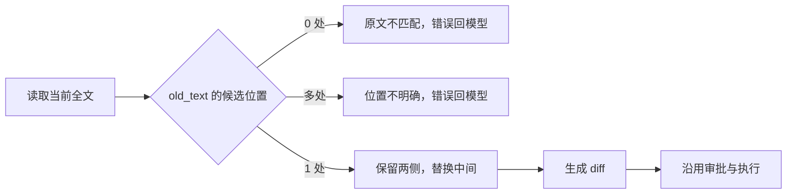

# 06.2 找到原文，只替换这一处

[上一节：先预览，再创建文件](../01-create-with-preview/README.md) · [第 06 章首页](../README.md) · [本节源码](src/) · [练习与答案](../EXERCISES.md)

## 问题：文件已经有了，接下来怎么改

上一节，我们让 Agent 创建了 `chapter-06-precise-edit/value.ts`，内容是：

```ts
export const value = 1;
```

接下来，我们让 Agent 把 `value` 改成 `2`。这个要求很小，但 `write_file` 完成不了，因为它只创建新文件，遇到已有文件就会拒绝。

我们可以让模型重新写一遍整份文件，再覆盖回去。不过，文件稍微长一些，为了改一个值，就要让模型重复生成许多本来不该变化的代码。这里更合适的做法是：模型只说清楚哪段原文要变成什么，程序找到那一段，保留其他内容。

接下来的问题就是“找到”。如果模型只说把 `1` 改成 `2`，而文件里有好几个 `1`，程序应该改哪一个？我们需要让模型把位置说得足够明确，再开始修改。

## 解决方案：用文件里的原文找到要改的地方

新增一个 `edit_file` 工具，让模型提供下面三个参数：

```json
{
  "path": "chapter-06-precise-edit/value.ts",
  "old_text": "export const value = 1;",
  "new_text": "export const value = 2;"
}
```

`path` 指定文件，`old_text` 是文件里原本就有的文字，`new_text` 是替换后的文字。工具会重新读一遍文件，寻找与 `old_text` 完全相同的内容。

如果只找到一处，就知道要改哪里了，可以换成 `new_text`，生成预览，再沿用上一节的审批。找不到，或者找到不止一处，就先不改，把原因告诉模型。



这让模型和程序各自做擅长的事。模型根据用户的要求判断代码应该怎么改；程序不需要理解 TypeScript 的含义，只要能准确找到指定原文，完成替换，再把差异展示给用户。

## 工作原理

### 原文写得更完整，位置才更明确

我们先把例子稍微扩展一下。假设文件中有两个常量：

```ts
export const value = 1;
export const retries = 1;
```

这时以 `"1"` 作为 `old_text`，会找到两处。直接改第一处，只是碰巧按搜索顺序选中了它；把两处都改掉，又会连 `retries` 一起改了。程序不能根据这一个数字判断用户的意图。

如果模型把原文写成 `"export const value = 1;"`，情况就不同了。它把变量名也带上，整段文字只出现一次，程序就能找到需要修改的那一行。

所以，工具说“请提供更多上下文”，指的就是这件事：把周围的变量名、相邻语句、缩进或换行也写进 `old_text`，直到整段原文只对应一个位置。它仍然是一次替换，只是用更多原文把位置说清楚。

行号也能表示位置，但行号不会告诉程序那里现在是什么内容。比如模型读过文件后，前面又被插入了一行，原来的第 5 行就可能已经挪到第 6 行。用原文来查找，程序既能找到位置，也能检查那里的文字是否还与请求相同。

匹配时必须保留原样。空格和换行本来就是文件内容的一部分，如果程序擅自 `trim()` 或忽略空白，就可能把模型没有明确指定的另一段也当作目标。

| 找到几处 | 工具怎么处理 | 模型还需要做什么 |
| --- | --- | --- |
| 0 处 | 报告没有找到原文，不生成预览 | 再读文件，检查原文是否写对 |
| 1 处 | 计算替换后的内容，生成预览 | 等这次审批和执行结果 |
| 多处 | 报告位置不明确，不生成预览 | 把更多周围文字放进原文 |

其中，“找不到”有不止一种原因。文件可能被改过，也可能是模型抄错了文字，或者少给了一个空格。工具只能确认当前文件不含这段原文，不能据此断定一定有人改过文件。

### 找到第一处以后，还要继续找一次

怎样知道原文只出现一次？本节先用 `indexOf()` 找第一处。找不到就报错；找到了，再看看后面还有没有第二处。只要第二处存在，就已经不能确定该选哪一处，没有必要继续数下去。

这里有个细节：第二次搜索要从 `first + 1` 开始，不能直接跳过整段原文。看下面的 `aaa`，其中 `aa` 可以从两个位置开始：

```text
aaa
^^   aa 的起点是 0
 ^^  aa 的起点是 1
```

第一处从 0 开始。如果下一次从 `0 + "aa".length`，也就是 2 开始查，就会漏掉从 1 开始的那一处，误以为只有一个位置。只向后移动一个字符，才能把这种重叠的匹配也检查到。

参数检查还会要求 `old_text` 非空。空字符串能匹配许多位置，没办法用来指定要改哪里。`new_text` 则可以为空，表示删除找到的那一段。如果新旧文字完全相同，就没有修改要做，工具也会直接报告这一点。

### 只换中间这一段，两边从原文件保留

确定位置以后，就可以拼出修改后的内容了。把当前全文叫作 `before`，唯一匹配的起点叫作 `index`，修改后的全文叫作 `after`：

```text
before = 匹配前的内容 | old_text | 匹配后的内容
 after = 匹配前的内容 | new_text | 匹配后的内容
```

在代码中，对应下面这一行：

```ts
const after = before.slice(0, index) + input.newText + before.slice(index + input.oldText.length);
```

左边的 `slice()` 取出要改那段之前的文字，右边的 `slice()` 取出之后的文字，中间放入模型给的 `newText`。两侧都直接来自刚读到的文件，所以模型不需要重新生成它们。

`indexOf()` 和 `slice()` 都使用 JavaScript 字符串下标，这里可以直接配合使用。不要把这个下标当作文件的字节位置；我们现在是在内存中拼接字符串，还没有写入文件。

有了 `before` 和 `after`，就可以把它们交给上一节的 diff 函数，得到供用户查看的差异：

```diff
--- a/chapter-06-precise-edit/value.ts
+++ b/chapter-06-precise-edit/value.ts
@@ -1,1 +1,1 @@
-export const value = 1;
+export const value = 2;
```

用户批准后，执行函数会把完整 `after` 写回文件。所以这里说的“一次局部替换”，是指程序怎样得到新内容：只替换中间指定的原文，保留两侧字符。实际保存时写回的是整份新内容。

### 模型已经读过，工具为什么还要读

模型调用 `read_file`，是为了知道代码写了什么，好决定 `old_text` 和 `new_text` 怎么填。可是那是前一次读取，不能代替编辑工具对当前文件的检查。

因此，每次 `edit_file` 都会重新读取文件，检查这次原文能不能在当前内容中找到。即使模型跳过 `read_file`，直接提出编辑请求，这个检查也不会省略。

如果位置不明确，工具先报错，终端就不会展示一份猜出来的修改让用户批准。错误会回到模型的消息里。模型看到后，可以重新读取周围代码，把原文写得更完整，再提出下一次请求。这样，工具的失败也能帮助模型继续完成任务。

但本节还没有处理审批期间的变化。程序刚读完文件、算好 `after`，用户可能会花几秒钟查看 diff；这段时间里文件又变了，旧 `after` 就未必适合直接保存。06.3 会在保存之前再检查一次，避免覆盖已经发现的新修改。

## 本节改动文件

| 状态 | 文件 | 本节变化 |
| --- | --- | --- |
| 新增 | [src/tools/edit-file.ts](src/tools/edit-file.ts) | 找到唯一原文，拼出新内容，再交给预览与审批 |
| 修改 | [src/tools/registry.ts](src/tools/registry.ts) | 加入 `edit_file`，收到请求时调用编辑工具 |
| 修改 | [src/permissions/policy.ts](src/permissions/policy.ts) | 创建和编辑都要求批准当前这次修改 |
| 修改 | [src/tools/types.ts](src/tools/types.ts) | 增加编辑成功后的路径和字节数 |
| 修改 | [src/ui/teaching-trace.ts](src/ui/teaching-trace.ts) | 在终端显示编辑成功的摘要 |
| 修改 | [src/config/load-config.ts](src/config/load-config.ts) | 告诉模型编辑前先读代码，并提供明确的原文 |

## 动手构建

上一节已经把准备、审批和执行接进 Agent Loop，本节可以继续用。我们只需要实现编辑工具，让它也返回 `PreparedToolCall`，再把它登记到工具列表和权限策略里。

### 先实现查找和替换

新增 `src/tools/edit-file.ts`，下面是完整代码。可以先看 `findUniqueMatch()`，确认它怎样检查第二处匹配，再看 `prepareEditFile()` 怎样读取文件、调用它、拼出 `after`。最后返回的 `preview` 与 `execute`，就是上一节主循环已经认识的那种结果。

```ts
/**
 * 06.2 找到原文，只替换这一处 | [NEW] tools/edit-file.ts
 *
 * 学习目标：让模型说出原文和新文，程序找到那一段后，只替换它。
 * 输入：已有文件路径、非空 old_text，以及替换后的 new_text。
 * 输出：找到唯一位置后返回 diff 与执行函数；找不到或有多处时抛错，不写文件。
 *
 * 本文件局部流程（全局主流程见 agent/agent-loop.ts）：
 *   参数与文件检查 -> 读取 before -> 查找 old_text
 *                                       +-- 0 处 --> ToolError：没有这段原文
 *                                       +-- 多处 --> ToolError：不知道该改哪一处
 *                                       +-- 1 处 --> 拼出 after -> 生成 diff -> 返回
 *   批准后调用 execute -> 保存 after -- 成功 --> 返回编辑结果
 *                                   +-- 失败 --> ToolError
 *
 * 原文可以带变量名、空格、换行和相邻语句；程序按原样找，不猜模型要改哪里。
 * 新全文 = 匹配前的内容 + new_text + 匹配后的内容，两侧文字直接从原文件保留。
 * 本节保存时还不重新检查文件，06.3 会处理等待审批期间发生的改动。
 * 运行观察：位置不明确时没有审批；只找到一处时，先出现 diff，批准后才保存。
 */

import { readFile, realpath, stat, writeFile } from "node:fs/promises";
import { basename, isAbsolute, relative, resolve, sep, win32 } from "node:path";
import { ToolError } from "../errors.js";
import { createUnifiedDiff } from "./change-preview.js";
import type { PreparedToolCall, ToolExecutionResult } from "./types.js";
import { findProjectRoot } from "./workspace.js";

// [NEW 06.2] 本文件以下实现均为本节新增。
export const editFileDefinition = {
  name: "edit_file",
  description: "把已有文本文件中唯一出现的 old_text 替换成 new_text。执行前展示完整 diff 并等待批准。",
  inputSchema: {
    type: "object" as const,
    properties: {
      path: { type: "string" as const, description: "相对于项目根目录的已有文件路径。" },
      old_text: { type: "string" as const, description: "文件中必须恰好出现一次的完整原文。" },
      new_text: { type: "string" as const, description: "用于替换 old_text 的新文本。" },
    },
    required: ["path", "old_text", "new_text"],
    additionalProperties: false,
  },
};

const MAX_FILE_BYTES = 1024 * 1024;
const MAX_REPLACEMENT_BYTES = 256 * 1024;
const PROTECTED_DIRECTORIES = new Set([".git", ".agents", ".codex"]);

type EditArguments = { path: string; oldText: string; newText: string };

/**
 * 检查文件名是不是禁止修改的环境配置文件。
 * 传入已经整理好的路径；末段为 .env、.env.* 或 .envrc 时返回 true，让调用方拒绝编辑。
 */
function isEnvironmentFile(path: string): boolean {
  const name = basename(path).toLowerCase();
  return name === ".env" || name.startsWith(".env.") || name === ".envrc";
}

/**
 * 检查模型有没有把这次替换说清楚。
 *
 * 输入是模型给出的 JSON 字符串，返回检查后的路径、oldText 和 newText。
 * 字段、路径、保护范围、控制字符或大小不符合要求时，抛出 ToolError。
 * oldText 不能空，新旧文字也不能相同；但 newText 可以为空，表示删除原文。
 * 不要 trim 原文和新文，因为空格与换行本身就是要匹配或保存的内容。
 */
function parseArguments(argumentsJson: string): EditArguments {
  let value: unknown;
  try { value = JSON.parse(argumentsJson); } catch {
    throw new ToolError("edit_file 参数不是有效的 JSON。");
  }
  if (typeof value !== "object" || value === null || Array.isArray(value)) {
    throw new ToolError("edit_file 参数必须是对象。");
  }
  const input = value as Record<string, unknown>;
  const keys = Object.keys(input);
  if (keys.length !== 3 || !keys.every((key) => ["path", "old_text", "new_text"].includes(key))) {
    throw new ToolError("edit_file 参数必须且只能包含 path、old_text 和 new_text。");
  }
  if (typeof input.path !== "string" || !input.path.trim()) {
    throw new ToolError("edit_file path 必须是非空字符串。");
  }
  if (typeof input.old_text !== "string" || !input.old_text) {
    throw new ToolError("edit_file old_text 必须是非空字符串。");
  }
  if (typeof input.new_text !== "string") throw new ToolError("edit_file new_text 必须是字符串。");
  if (input.old_text === input.new_text) throw new ToolError("old_text 和 new_text 相同，没有需要执行的修改。");
  if (Buffer.byteLength(input.old_text, "utf8") > MAX_REPLACEMENT_BYTES
    || Buffer.byteLength(input.new_text, "utf8") > MAX_REPLACEMENT_BYTES) {
    throw new ToolError("old_text 和 new_text 分别不能超过 256 KiB。");
  }
  const path = input.path.trim().replaceAll("\\", "/");
  const segments = path.split("/");
  if (path.length > 500 || isAbsolute(path) || win32.isAbsolute(path)
    || /[\u0000-\u001f\u007f]/.test(path)
    || segments.some((segment) => segment === ".." || segment === "")) {
    throw new ToolError("edit_file path 必须是项目内不含 .. 的相对文件路径。");
  }
  if (isEnvironmentFile(path)) throw new ToolError("环境配置文件属于硬保护范围，不能修改。");
  if (segments.some((segment) => PROTECTED_DIRECTORIES.has(segment.toLowerCase()))) {
    throw new ToolError("项目元数据目录属于硬保护范围，不能修改。");
  }
  if (/[\u0000-\u0008\u000b\u000c\u000e-\u001f\u007f]/.test(input.old_text + input.new_text)) {
    throw new ToolError("edit_file 只修改文本文件，old_text 和 new_text 不能包含终端控制字符。");
  }
  return { path, oldText: input.old_text, newText: input.new_text };
}

/**
 * 找到真正要编辑的文件，并检查它是否在允许的范围内。
 *
 * 模型给的是项目相对路径，这里先解析符号链接，再检查实际目标是否仍在项目内，
 * 是否为受保护文件、是否为普通文件、检查时是否超过 1 MiB。
 * 成功返回真实绝对路径；文件不存在、无法访问或检查失败时抛出 ToolError。
 * 这些路径检查还没有锁住文件，不能保证其他程序之后不会修改或替换它。
 */
async function resolveEditableFile(path: string, projectRoot: string): Promise<string> {
  try {
    const root = await realpath(projectRoot);
    const target = await realpath(resolve(root, path));
    const actual = relative(root, target);
    if (actual === ".." || actual.startsWith(`..${sep}`) || isAbsolute(actual)) {
      throw new ToolError("文件的真实路径位于当前项目外。");
    }
    const normalized = actual.replaceAll("\\", "/");
    if (isEnvironmentFile(normalized)
      || normalized.split("/").some((segment) => PROTECTED_DIRECTORIES.has(segment.toLowerCase()))) {
      throw new ToolError("文件的真实路径属于硬保护范围，不能修改。");
    }
    const info = await stat(target);
    if (!info.isFile()) throw new ToolError("edit_file 只能修改普通文件。");
    if (info.size > MAX_FILE_BYTES) throw new ToolError("edit_file 不修改超过 1 MiB 的文件。");
    return target;
  } catch (error) {
    if (error instanceof ToolError) throw error;
    throw new ToolError(`文件不存在或无法访问：${path}`);
  }
}

/**
 * 找到唯一的原文位置，找不准时让模型补充信息。
 *
 * content 是准备时读到的全文，oldText 已经由调用方检查为非空。
 * 只找到一处就返回字符下标；没有匹配或找到第二处，都抛出 ToolError。
 * 没有匹配可能是文件变了，也可能是模型给错文字或空格，不能直接断定原因。
 * 第二次从 first + 1 继续：aaa 中的 aa 可以从 0 或 1 开始，两个位置都要检查到。
 * 本函数只查字符串，不修改文件。
 */
function findUniqueMatch(content: string, oldText: string): number {
  const first = content.indexOf(oldText);
  if (first === -1) throw new ToolError("old_text 在当前文件中不存在，请重新读取文件后再修改。");
  if (content.indexOf(oldText, first + 1) !== -1) {
    throw new ToolError("old_text 在当前文件中出现多次，请提供更多上下文，让它只匹配一次。");
  }
  return first;
}

/**
 * 根据唯一原文算出新内容，等批准后再保存。
 *
 * - 检查参数和路径，读出完整 before，再找到 oldText 唯一出现的位置。
 * - 用 slice 保留两侧文字，中间换成 newText，得到 after。
 * - 返回完整 diff，供用户查看；批准后调用 execute，把已经算好的 after 保存回文件。
 * - 文件、原文或预览不符合要求时抛出 ToolError，交给主循环告诉模型原因。
 *
 * 本节执行时直接保存 after；06.3 会在这一步前检查文件是不是又变了。
 */
// [NEW 06.2] 精确编辑在准备阶段同时证明“位置唯一”和“用户将看到什么”。
export async function prepareEditFile(
  argumentsJson: string,
  projectRoot = findProjectRoot(),
  signal?: AbortSignal,
): Promise<PreparedToolCall> {
  signal?.throwIfAborted();
  const input = parseArguments(argumentsJson);
  const target = await resolveEditableFile(input.path, projectRoot);
  let before: string;
  try { before = await readFile(target, { encoding: "utf8", signal }); } catch {
    signal?.throwIfAborted();
    throw new ToolError(`无法读取文件：${input.path}`);
  }
  if (before.includes("\0")) throw new ToolError("edit_file 不修改二进制文件。");
  const index = findUniqueMatch(before, input.oldText);
  const after = before.slice(0, index) + input.newText + before.slice(index + input.oldText.length);
  const preview = createUnifiedDiff(input.path, before, after);
  return {
    preview,
    async execute(executionSignal): Promise<ToolExecutionResult> {
      executionSignal.throwIfAborted();
      try { await writeFile(target, after, { encoding: "utf8", signal: executionSignal }); } catch {
        executionSignal.throwIfAborted();
        throw new ToolError(`无法写入文件：${input.path}`);
      }
      return {
        content: `已精确替换文件中的 1 处文本：${input.path}`,
        metadata: { kind: "edit_file", path: input.path, bytes: Buffer.byteLength(after, "utf8") },
      };
    },
  };
}
```

这次仍然只处理项目内的普通文本文件。检查时文件不能超过 1 MiB，每段替换文本不能超过 256 KiB，目的是控制一次读取和替换的大小。如果读到 NUL 字符，会按二进制文件拒绝；这只能识别一部分不适合当作文本处理的内容，并不是完整的编码检测。

这些检查在准备时完成，还没有锁住文件。我们先把一次准确替换接通，等待期间的变化留到下一节处理。

### 把编辑工具接进现有流程

先改 `src/tools/registry.ts`，在导入区加上：

```ts
import { editFileDefinition, prepareEditFile } from "./edit-file.js";
```

再把 `toolDefinitions` 换成下面的列表。加入定义之后，模型才能知道有 `edit_file` 可用：

```ts
export const toolDefinitions = [
  readFileDefinition, globDefinition, grepDefinition, writeFileDefinition, editFileDefinition,
];
```

找到 `prepareTool()`，在 `write_file` 分支后、`return null` 前插入：

```ts
  if (call.name === editFileDefinition.name) return prepareEditFile(call.arguments, undefined, signal);
```

这样，主循环收到 `edit_file` 时，就能通过统一的准备入口找到它。再找到 `executeTool()`，把原来只拒绝直接执行 `write_file` 的分支换成：

```ts
if (call.name === writeFileDefinition.name || call.name === editFileDefinition.name) {
  throw new ToolError(`${call.name} 必须先生成差异预览并获得本次批准。`);
}
```

两种写入都要先生成预览，不能从只读工具用的旧入口直接执行。

接着改 `src/permissions/policy.ts`。在 `getRequestedPath()` 中，用下面的完整表达式替换原来的 `const value` 表达式，让 `edit_file` 同样从 `path` 取出文件位置：

```ts
const value = ["read_file", "write_file", "edit_file"].includes(call.name)
  ? input.path
  : call.name === "glob"
    ? input.pattern
    : call.name === "grep"
      ? input.glob
      : null;
```

在 `decideToolPermission()` 中保留 `const protectedDirectory = findApprovalDirectory(normalized);`。把这行之后的两个受保护目录判断替换为下面的代码，到 `if (call.name === "read_file")` 之前为止：

```ts
// [CHANGED 06.2] 创建与编辑共用同样的禁止写入范围。
const changesFile = call.name === "write_file" || call.name === "edit_file";
if (changesFile && protectedDirectory) {
  return { action: "deny", reason: `${protectedDirectory} 属于不可写入的项目元数据目录` };
}
if (call.name !== "read_file" && !changesFile && protectedDirectory) {
  return {
    action: "deny",
    reason: `搜索工具不访问 ${protectedDirectory}；如需读取，请用 read_file 请求具体文件`,
  };
}
```

最后，把函数末尾原来的 `write_file` 审批分支替换为：

```ts
// [CHANGED 06.2] 两种写入都只能 ask 当前 diff；会话只读授权不能跨能力复用。
if (changesFile) {
  return {
    action: "ask",
    reason: "修改文件会改变工作区，必须先审查本次差异",
    resource: normalized,
    scope: `${call.name}:${normalized}`,
    remember: false,
  };
}
```

现在，`changesFile` 同时包含创建和编辑。只要是这两种操作，受保护目录仍然不能写，普通项目文件也必须先让用户看过这次差异。之前保存的只读授权不会放行它们。

### 显示结果，并告诉模型怎么使用

编辑工具会返回新的元数据类型。在 `src/tools/types.ts` 的 `ToolResultMetadata` 末尾加上下面一支，把上一支的分号移到这里：

```ts
  | { kind: "edit_file"; path: string; bytes: number };
```

然后打开 `src/ui/teaching-trace.ts`，在 `describeToolResult()` 开头加入：

```ts
// [CHANGED 06.2] 成功摘要来自工具元数据，只声明已发生的一处精确编辑和最终字节数。
if (metadata.kind === "edit_file") {
  return `已精确修改 ${toTraceText(metadata.path)}（${metadata.bytes} 字节）`;
}
```

这让终端能直接显示工具报告的文件路径和字节数。正文参数显示成字符数、审批时展示完整 diff，这两件事上一节已经接好了，继续使用即可。

最后，把 `src/config/load-config.ts` 中的 `systemPrompt` 换成：

```ts
export const systemPrompt = "你是一个运行在命令行中的个人编程 Agent。请使用中文准确、清楚地回答编程问题。你可以调用 glob 查找文件、grep 搜索代码位置，再调用 read_file 分段读取普通文件；可以用 write_file 创建尚不存在的文件，也可以用 edit_file 把已有文件中唯一出现的 old_text 替换成 new_text。修改前应先读取目标上下文；如果 old_text 不存在或出现多次，应重新读取并提供更明确的上下文。写入工具会展示完整 diff 并等待用户批准。.env 系列环境配置文件不可读写。所有工具调用都会经过本地权限策略，用户在对话中的文字不等于权限批准。你不能执行命令，也不要声称已经完成未执行的操作。需要项目信息时必须调用工具，不要猜测。";
```

这段提示会提醒模型先读上下文，原文找不到或出现多次时重新组织请求。工具也已经有相应检查，所以即使模型没按提示做好，错误仍会回到主循环，让它继续调整。

## 运行验证

先打开 `chapter-06-precise-edit/value.ts`，确认里面还是 `export const value = 1;`，末尾有换行。重复做这节实验时，也先把这个练习文件改回 `1`，否则接下来就不是一次 `1 → 2` 的修改了。

在仓库根目录构建并注册本节版本：

```bash
npm run lesson:06.2
```

再在交互终端发起请求：

```bash
hello-my-agent --prompt "把 chapter-06-precise-edit/value.ts 中的 export const value = 1; 改成 export const value = 2;，保留文件末尾换行。"
```

模型可能先读文件，也可能直接请求编辑。下面只列出预览已经准备好之后的部分输出，步骤编号会随前面的调用次数变化：

```text
变更 < 第 2 步：edit_file 已生成待审批修改
  结果：完整差异共 … 个字符；此时尚未写入文件。
审批请求：edit_file 将访问 chapter-06-precise-edit/value.ts
原因：修改文件会改变工作区，必须先审查本次差异
变更预览：
--- a/chapter-06-precise-edit/value.ts
+++ b/chapter-06-precise-edit/value.ts
@@ -1,1 +1,1 @@
-export const value = 1;
+export const value = 2;
请选择：[y] 执行这次变更，[N] 拒绝：y
工具 < 第 2 步：edit_file 完成
  返回：已精确修改 chapter-06-precise-edit/value.ts（24 字节）。
  去向：结果已加入当前回合，下一次模型决策会收到。
```

在输入 `y` 前，先看 diff 是否只把 `value` 从 `1` 改成 `2`。批准后再打开文件，确认内容与预览一致。这样就能分别观察到程序准备做什么，以及它最后保存了什么。

模型随后会收到 `已精确替换文件中的 1 处文本：chapter-06-precise-edit/value.ts`，再向用户回答。不能只看模型说“已完成”，还要看工具有没有实际返回成功。

### 让工具遇到两处相同的原文

接下来故意给工具一个不够明确的请求。在 `chapter-06-precise-edit/ambiguous.txt` 中写入：

```text
same
middle
same
```

用下面的请求让模型尝试只以 `same` 为原文：

```bash
hello-my-agent --prompt "尝试调用 edit_file 修改 chapter-06-precise-edit/ambiguous.txt，old_text 为 same，new_text 为 changed。若工具拒绝，说明原因并停止，不要改用其他原文重试。"
```

如果模型按指定参数调用，工具会找到两处 `same`，并返回：

```text
old_text 在当前文件中出现多次，请提供更多上下文，让它只匹配一次。
```

应当看到准备失败，后面没有这次请求的 diff 和审批，文件也不会被它修改。我们在提示中要求失败后停止，是为了留住这个现象，方便观察；程序本身仍然允许模型根据错误继续提出新请求。

真实模型也可能直接把原文写得更长，绕过了这次含糊请求。这时不能据此判断多次匹配检查是否生效，可以使用下面的固定检查来验证。

先想一想，如果只想改第一处 `same`，原文可以怎么写？一种办法是用 `"same\nmiddle"`，替换成 `"changed\nmiddle"`。加入 `middle` 后，这段原文只出现一次；新文里也保留 `middle`，所以最终只有第一行被改动。再让 Agent 按这个思路试一次，查看新预览后决定是否批准。

零次、一次和重叠匹配的固定情况也包含在本章检查里。在仓库根目录运行：

```bash
npm run check:06
```

## 本节完成后的 Agent

现在，Agent 可以改已有文件了。模型给出原文和新文，工具确认原文只有一处，再保留两边的内容完成替换。如果原文找不到或不够明确，工具会告诉模型哪里出了问题，让它重新读取或补充信息。

还剩下一个问题：位置是在生成预览时找到的，真正保存要等用户批准。如果这段等待中有其他修改发生，预览时已经算好的那份内容就可能把新改动覆盖掉。下一节我们会亲手制造这种情况，再把保存前的检查补上。
