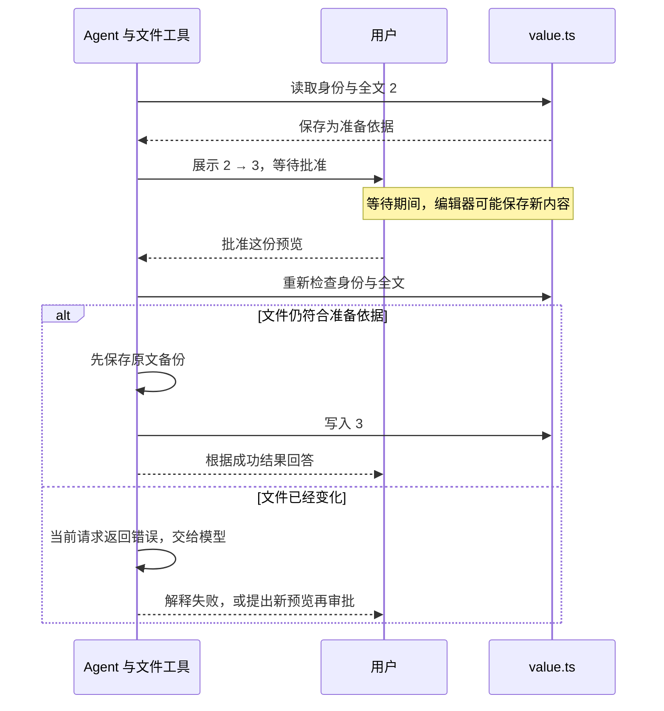

# 06.3 保存之前，检查文件有没有变化

[上一节：找到原文，只替换这一处](../02-exact-replacement/README.md) · [第 06 章首页](../README.md) · [本节源码](src/) · [练习与答案](../EXERCISES.md)

## 问题：用户在看预览，编辑器也可能在改文件

上一节已经把 `value.ts` 改成了 `export const value = 2;`。现在，我们让 Agent 继续把它改成 `3`，终端会展示这样的差异：

```diff
-export const value = 2;
+export const value = 3;
```

这时用户还没有输入 `y`。假设编辑器中的另一次修改先保存了，把文件改成 `export const value = 99;`，接下来会怎样？

06.2 的执行函数已经准备好了新全文，里面写的是 `3`。用户批准以后，它会直接把这份内容保存回去，不会再次读取当前文件。于是刚保存的 `99` 就被覆盖了。

刚才展示的预览是“把 `2` 改成 `3`”，里面没有说明会覆盖新出现的 `99`。所以，审批通过以后还不能马上写入，程序需要先看看文件是不是已经变了。

## 解决方案：记住准备时的文件，保存前再检查

准备修改时，除了算出新内容，我们再让程序记下原文件的完整内容和文件身份。等用户批准后，程序重新打开文件，把现在的情况与准备时保存的记录比较。

如果文件还是原来那一个，内容也没变，就先备份原文，再保存新内容。如果不一样，就停止这次修改，把原因交回模型，让它重新读取。



这个方案没有在用户看预览的时候锁住文件，所以其他程序还能正常编辑。代价是保存前需要再检查一次：既然文件已经变了，之前算好的修改就不能直接拿来覆盖它。

## 工作原理

### 文件其他地方的修改，也要保留下来

先沿用上一节的两个名字：`before` 是准备时读到的完整文件，`after` 是替换后准备保存的完整内容。diff 展示的就是它们之间的变化。

保存前，程序会把当前全文与 `before` 比较，而不是只检查 `old_text` 还在不在。为什么需要看整个文件？因为执行函数最终写回的是整个 `after`，文件中任何没被它包含的新内容都会丢失。

比如预览准备好之后，有人在文件末尾加了一条注释：

```ts
export const value = 2;
// 这行是在审批期间添加的。
```

原来的 `export const value = 2;` 还在，也仍然只出现一次。只检查这一行，程序会以为可以继续。但旧 `after` 里没有新注释，一旦保存回去，注释就没了。

比较全文以后，程序能发现多出来的这一行，于是在写入前停下来。模型收到错误，再读取文件，就能基于带注释的新内容重新准备 `2 → 3`。这次的 `after` 会保留注释，预览也要重新展示给用户。

### 同一个路径下面，也可能已经换了文件

只比较文字还不够。文件路径是一个名字，名字不变，它下面的文件却可能被换掉。例如某些编辑器保存时会写出新文件，再替换原文件。程序仍然打开同一个路径，但文件系统里已经是另一个文件。

这里我们采用一个保守的做法：文件被替换了，也让旧请求停止，即使新文件的文字恰好与原来相同。这样程序会重新读取和准备，而不是把旧请求继续用在另一份文件上。

Node.js 的 `stat()` 结果里有两个字段可以帮助识别文件：`dev` 表示所在设备，`ino` 表示该设备上的 inode 编号。准备时记下这两个值，执行时再比较，就能发现常见的文件替换。

| 比较什么 | 用来发现什么 |
| --- | --- |
| 准备时和执行时的 `dev`、`ino` | 路径下面换成了另一个文件 |
| 当前全文和 `before` | 文件里的文字变了，包括本次替换以外的地方 |

两个比较解决的问题不同。一个文件可以保持身份不变，只修改内容；也可以换成另一个内容相同的文件。所以我们把它们都检查一遍。

还要留意符号链接。准备时，`realpath()` 会找到原始路径实际指向的目标，并保存为 `target`。假设 `link.ts` 当时指向 `value.ts`，之后改成指向 `other.ts`，当前实现仍然检查并修改原先保存的 `value.ts`，不会重新跟随链接去修改 `other.ts`。接下来比较身份时，检查的是这个已经保存的真实目标路径。

### 打开一次，检查和写入都用这个句柄

我们在第五章就区分过表面路径与真实路径。这里还要再往下走一步：真正打开文件之后，尽量让检查和写入都指向这次打开的文件。

Node.js 的 `open()` 会返回一个**文件句柄**。后续可以通过它读取内容、查询文件状态、写入和关闭文件。如果我们先检查，关闭文件，再按路径打开一次写入，中间路径可能已经指向另一个文件。用同一个句柄完成检查和写入，就不必在这两步之间重新按路径找文件。

准备阶段先用 `r` 只读打开，从这个句柄取得身份和 `before`，读完就关闭。用户批准后，程序再用 `r+` 打开准备时保存的 `target`。`r+` 允许读取和写入，但打开时不会先清空文件，所以程序能先检查，再决定是否保存。

```text
准备阶段：open("r")  → stat + 读取 before → 关闭
                         ↓ 保存身份、before、after 与 preview
等待审批
                         ↓
执行阶段：open("r+") → stat + 读取 current → 比较 → 备份 → 写入 → 关闭
```

因此，准备阶段和执行阶段各有一次打开。“用同一个句柄”说的是执行阶段：这一次打开以后，检查和后面的写入都通过它完成。程序没有在整段审批等待期间一直拿着准备阶段的句柄。

文件句柄也不是文件锁。它让我们的操作指向同一个已打开文件，但挡不住其他进程写入。另一个程序仍可能在我们比较完内容后修改文件，这是本节还没有消除的时间窗口。

### 检查通过以后，先留一份原文备份

检查通过，只能说明这次修改现在可以继续，不代表接下来的写入一定成功。这一版代码会先清空目标文件，再把 `after` 写进去。如果中途发生写入错误，原文件可能只剩一部分内容，甚至是空的。

所以在清空之前，先把 `before` 保存为备份。程序会在系统临时目录下创建一个独立目录，再用 `wx` 写入备份文件，权限设为 `0600`，也就是只允许文件所有者读写。只有这一步完整成功，才记下备份路径并继续修改目标。

备份失败就停止，因为这时目标文件还没有被清空。备份成功后，程序才清空目标、写入 `after`，最后调用 `sync()` 请求同步这次文件写入。普通写入错误会带回可用的备份路径，方便找到修改前的内容。

这仍然不是自动回滚。写入中途失败后，程序不会自动把备份恢复回去；它也没有把备份和写入做成“要么全部成功，要么原文件完全不变”的原子事务。当前备份只是恢复材料，具体还要看目标文件留下了什么。

系统临时目录也可能被清理。如果希望长期保留修改历史，就需要管理备份的保存位置和生命周期，第 14 章会继续实现可恢复检查点。

### 为什么写入时要指定从 0 开始

同一个句柄先读再写，还有一个细节需要处理。读取完整文件后，句柄的当前位置已经到了旧文件末尾。调用 `truncate(0)` 只会把文件长度清零，不会把当前位置也移回开头。

所以写入时必须明确传入字节位置 `0`。否则程序可能从旧文件末尾的位置开始写，在开头留下空洞。源码里的 `handle.write(after, 0, "utf8")` 就是在处理这个问题。

到这里，程序能够停止已经检查出文件变化的旧请求，并在覆盖前保存原文。但检查与写入之间仍可能有其他进程参与，路径检查与打开之间也还有间隔。我们现在是在自己信任的本地项目里使用它，不能把这些检查当成系统沙箱。第 27、28 章会处理多任务争用和工作区隔离，第 33 章再学习操作系统级隔离。

## 本节改动文件

| 状态 | 文件 | 本节变化 |
| --- | --- | --- |
| 修改 | [src/tools/edit-file.ts](src/tools/edit-file.ts) | 记住原文件，保存前重新检查，先备份再写入 |
| 修改 | [src/tools/types.ts](src/tools/types.ts) | 编辑成功时把备份路径一并返回 |
| 修改 | [src/ui/teaching-trace.ts](src/ui/teaching-trace.ts) | 在终端显示实际备份位置 |

## 动手构建

这一节的修改集中在 `edit_file` 里面。主循环仍然先准备、再审批、最后调用 `execute()`，只是这个执行函数现在要先检查文件和保存备份，不能直接写回 `after`。

### 把检查和备份加进编辑工具

打开 `src/tools/edit-file.ts`，把文件系统和路径的导入替换为下面三行，其他导入保留。新加入的文件句柄用来检查和写入，临时目录相关函数用来放备份：

```ts
import { mkdtemp, open, realpath, stat, writeFile, type FileHandle } from "node:fs/promises";
import { tmpdir } from "node:os";
import { basename, isAbsolute, join, relative, resolve, sep, win32 } from "node:path";
```

接着保留参数检查、路径检查和 `findUniqueMatch()`，用下面的完整函数替换原 `prepareEditFile()`：

```ts
/**
 * 把准备时读到的文件记下来，批准后先比较，再备份和保存。
 *
 * - 输入是编辑参数、项目根目录和可选取消信号。准备时通过一个只读句柄取得
 *   设备号、inode 和 before，再按唯一匹配生成 after 与预览。
 * - 返回的 execute 会打开已保存的真实目标，通过同一个 r+ 句柄检查身份和全文。
 * - 文件已变就停止；没变才先保存 0600 临时备份，再清空目标、从字节 0 写入并 sync。
 * - 检查或备份失败时还没有覆盖目标；普通写入错误会报告已经留下的备份位置。
 *
 * 这里没有文件锁或自动回滚，内容比较之后仍可能有其他进程写入。
 */
// [CHANGED 06.3] 待执行修改同时保存 before 和 after，执行时用 before 检测审批后的外部变化。
export async function prepareEditFile(
  argumentsJson: string,
  projectRoot = findProjectRoot(),
  signal?: AbortSignal,
): Promise<PreparedToolCall> {
  signal?.throwIfAborted();
  const input = parseArguments(argumentsJson);
  const target = await resolveEditableFile(input.path, projectRoot);
  let before: string;
  let preparedDevice = 0;
  let preparedInode = 0;
  let preparationHandle: FileHandle | undefined;
  try {
    // [NEW 06.3] 身份和 before 必须来自同一已打开文件；两次按路径访问可能观察到不同对象。
    preparationHandle = await open(target, "r");
    const preparedInfo = await preparationHandle.stat();
    if (!preparedInfo.isFile() || preparedInfo.size > MAX_FILE_BYTES) {
      throw new ToolError("文件在准备修改时已不再是 1 MiB 以内的普通文件。");
    }
    preparedDevice = preparedInfo.dev;
    preparedInode = preparedInfo.ino;
    before = await preparationHandle.readFile({ encoding: "utf8" });
    signal?.throwIfAborted();
  } catch {
    signal?.throwIfAborted();
    throw new ToolError(`无法读取文件：${input.path}`);
  } finally {
    try { await preparationHandle?.close(); } catch { /* 读取失败已经转换成工具错误。 */ }
  }
  if (before.includes("\0")) throw new ToolError("edit_file 不修改二进制文件。");
  const index = findUniqueMatch(before, input.oldText);
  const after = before.slice(0, index) + input.newText + before.slice(index + input.oldText.length);
  const preview = createUnifiedDiff(input.path, before, after);
  return {
    preview,
    async execute(executionSignal): Promise<ToolExecutionResult> {
      executionSignal.throwIfAborted();
      let backupPath: string | null = null;
      let handle: FileHandle | undefined;
      try {
        // [NEW 06.3] 复核和后续写入共用这个 r+ 句柄；身份不同或 current !== before 时本次修改作废。
        handle = await open(target, "r+");
        const currentInfo = await handle.stat();
        if (currentInfo.dev !== preparedDevice || currentInfo.ino !== preparedInode) {
          throw new ToolError("文件在差异预览后被替换，本次修改已取消；请重新读取并生成新的修改。");
        }
        if (!currentInfo.isFile() || currentInfo.size > MAX_FILE_BYTES) {
          throw new ToolError("文件在差异预览后类型或大小发生了变化，本次修改已取消。");
        }
        const current = await handle.readFile({ encoding: "utf8" });
        executionSignal.throwIfAborted();
        if (current !== before) {
          throw new ToolError("文件在差异预览后发生了变化，本次修改已取消；请重新读取并生成新的修改。");
        }

        // [NEW 06.3] 先以 0600 和 wx 保存 before；这一步失败时还没有截断目标文件。
        const backupDirectory = await mkdtemp(join(tmpdir(), "hello-my-agent-backup-"));
        const backupCandidate = join(backupDirectory, `${basename(input.path)}.bak`);
        try {
          await writeFile(backupCandidate, before, { encoding: "utf8", flag: "wx", mode: 0o600 });
        } catch {
          throw new ToolError(`无法创建修改前备份，目标文件未修改：${input.path}`);
        }
        // 只有 writeFile 完整成功后，这个路径才代表真实可用的恢复副本。
        backupPath = backupCandidate;
        executionSignal.throwIfAborted();
        await handle.truncate(0);
        // [NEW 06.3] readFile 已把句柄位置推进到旧 EOF；显式 position=0 防止截断后写出 NUL 空洞。
        const { bytesWritten } = await handle.write(after, 0, "utf8");
        if (bytesWritten !== Buffer.byteLength(after, "utf8")) {
          throw new ToolError(`文件只写入了 ${bytesWritten} 字节，原内容备份位于：${backupPath}`);
        }
        await handle.sync();
        await handle.close();
        handle = undefined;
      } catch (error) {
        executionSignal.throwIfAborted();
        if (error instanceof ToolError) throw error;
        throw new ToolError(backupPath
          ? `写入失败；原内容备份位于：${backupPath}`
          : `无法安全写入文件：${input.path}`);
      } finally {
        // 已知写入错误优先返回带备份位置的 ToolError；清理失败不覆盖这个诊断。
        try { await handle?.close(); } catch { /* 文件句柄会随进程退出释放。 */ }
      }
      return {
        content: `已精确替换文件中的 1 处文本：${input.path}\n修改前备份：${backupPath}`,
        metadata: {
          kind: "edit_file",
          path: input.path,
          bytes: Buffer.byteLength(after, "utf8"),
          backupPath: backupPath as string,
        },
      };
    },
  };
}
```

可以分两遍看这段代码。第一遍看准备阶段：只读打开文件，记下 `preparedDevice`、`preparedInode` 和 `before`，然后按上一节的方法拼出 `after`。第二遍看 `execute()`：打开目标，先比较身份，再读取全文比较，一切符合条件后才创建备份并写入。

`backupPath` 一开始是 `null`，等备份真正写成功以后才赋值。这让后面的错误处理能够区分两种情况：尚未留下可用备份，或者已经有一份原文可以找回。两处 `finally` 则负责关闭各自打开的句柄，失败时也会尝试清理。

### 把备份位置交给模型和终端

函数现在返回了备份路径，还需要让结果类型和终端认识它。先打开 `src/tools/types.ts`，将 `ToolResultMetadata` 中的 `edit_file` 分支替换为：

```ts
  | { kind: "edit_file"; path: string; bytes: number; backupPath: string };
```

再打开 `src/ui/teaching-trace.ts`，把 `describeToolResult()` 中原来的 `edit_file` 分支换成：

```ts
if (metadata.kind === "edit_file") {
  return `已精确修改 ${toTraceText(metadata.path)}（${metadata.bytes} 字节）；备份：${toTraceText(metadata.backupPath, 120)}`;
}
```

给模型的工具正文中也会写出实际备份路径，模型可以据此告诉用户原文保存在什么地方。终端直接从元数据里读取路径和字节数，不用等模型回答，也不用从回答里解析这些信息。

## 运行验证

先把练习文件 `chapter-06-precise-edit/value.ts` 确认或恢复成 `export const value = 2;`，末尾保留换行。下面先做一次没有外部改动的正常编辑。

在仓库根目录构建并注册：

```bash
npm run lesson:06.3
```

然后运行：

```bash
hello-my-agent --prompt "把 chapter-06-precise-edit/value.ts 中的 export const value = 2; 改成 export const value = 3;，保留文件末尾换行。"
```

查看 diff 后输入 `y`，这次等待期间不要改文件。下面是成功输出的后半段示例，实际运行时的步骤编号可能有所不同：

```text
审批 < 第 1 步：允许一次
工具 > 第 1 步：edit_file
  执行：path="chapter-06-precise-edit/value.ts"，old_text=<23 字符>，new_text=<23 字符>。
工具 < 第 1 步：edit_file 完成
  返回：已精确修改 chapter-06-precise-edit/value.ts（24 字节）；备份：/…/hello-my-agent-backup-…/value.ts.bak。
  去向：结果已加入当前回合，下一次模型决策会收到。
```

打开目标文件，应当看到 `3`；再打开终端给出的实际备份路径，应当看到原来的 `2`。这样就能把结果与代码顺序对应起来：先留下原文，再保存新内容。

模型会在工具结果中收到“已精确替换”和“修改前备份”，之后再向用户回答。这一次，除了知道改成了什么，它还知道原文存在哪里。

### 看预览时，把文件改成 99

接下来做一次会失败的编辑。**先把 `value.ts` 恢复成 `export const value = 2;`，末尾保留换行**。不要直接沿用上一项实验已经写成 `3` 的文件。

再发起请求：

```bash
hello-my-agent --prompt "把 chapter-06-precise-edit/value.ts 中的 export const value = 2; 改成 export const value = 3;。若工具报告文件已经变化，请说明原因并停止，不要重新发起修改。"
```

等到终端展示 `2 → 3` 并询问是否执行时，先不要回答。转到编辑器，把文件改成下面这样并保存：

```ts
export const value = 99;
```

再回到终端输入 `y`。工具应该报告失败。具体是哪一项检查先发现问题，取决于编辑器怎样保存：原地写入会改变全文；如果编辑器换了一个新文件，则会先被 `dev/ino` 检查发现。

```text
工具 < 第 1 步：edit_file 失败
  返回：执行失败。
  去向：错误已加入当前回合，下一次模型决策会收到。
```

打开磁盘上的文件，内容应该仍然是 `99`。刚才那份 `2 → 3` 的请求已经在备份和覆盖之前停止，所以它既没有写入 `3`，也没有为这次失败创建备份。

详细错误会交回模型，告诉它文件被替换了，或者内容已经变化。模型可能进一步提出新请求。为了先看清这次实验的结果，请拒绝后续新的修改审批；停止的是刚才这份旧请求，并不是从此不允许这个会话再写文件。

还可以重新从 `2` 开始，在等待审批时只追加一条注释。原来的 `old_text` 仍然存在，但旧请求也应该停止，否则保存旧 `after` 就会丢掉注释。如果这次保存没有替换文件，发现变化的就会是全文比较。

### 保持内容相同，只换掉文件

最后单独看文件身份检查。从内容为 `2` 的文件重新准备预览，等审批时把原文件改名保存到另一个未使用的文件名，再在原路径创建内容完全相同的新文件。

回到终端批准，当前请求应当因为身份不同而失败。文字虽然没变，原路径下面已经换了文件，`dev/ino` 比较会先发现这一点。这也说明为什么身份和全文需要分别检查。

通过这些实验，我们可以观察本节增加的检查，但不代表已经排除了所有并发情况。零次和唯一匹配、文件变化、备份等固定行为，也可以在仓库根目录用已有检查验证：

```bash
npm run check:06
```

通过后会输出：

```text
✓ 第 06 章差异预览、唯一替换、变化检测和修改前备份检查通过
```

## 本节完成后的 Agent

现在，Agent 已经能完成一次经过用户确认的文件修改：先读文件、算出差异，用户批准后再检查文件有没有变化。发现变化就停止旧请求，把原因交回模型；没有变化才留下备份并保存。

我们也知道了它当前没有做什么：备份不会自动恢复，文件没有被锁住，临时目录也不是长期历史。这些限制不影响我们理解本章的顺序，但在继续扩展 Agent 时需要逐步处理。

先完成[章末练习](../EXERCISES.md)，让“原文出现多次”的错误告诉模型到底有几处。第 07 章再加入受控 shell：文件保存以后，Agent 才能运行编译和测试，看看这次修改是否真的解决了问题。
