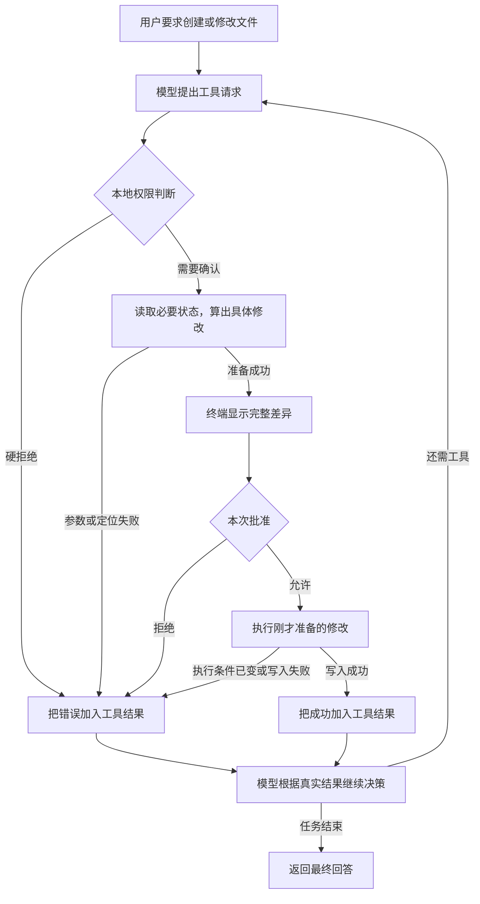

# 第 06 章：让 Agent 先预览，再修改文件

[06.1 先预览，再创建文件](01-create-with-preview/README.md) · [06.2 找到原文，只替换这一处](02-exact-replacement/README.md) · [06.3 保存之前，检查文件有没有变化](03-change-guard/README.md) · [练习与答案](EXERCISES.md)

前五章中，Agent 已经能找到代码、读懂相关内容，并在需要确认时停下来询问用户。现在我们往前走一步：让它根据用户的要求，把代码真正保存到文件里。

写文件比读文件多了一层顾虑。Agent 读错了位置，还可以继续找；如果它把不合要求的内容写进文件，就会改变项目。所以，光是问“允许访问这个文件吗”还不够，我们还要让程序展示准备修改的内容，等用户看过以后再决定。

## 这一章要完成什么

我们从一个很小的文件开始。先让 Agent 创建 `chapter-06-precise-edit/value.ts`，写入 `export const value = 1;`；然后把 `1` 改成 `2`，再把 `2` 改成 `3`。

代码虽然只有一行，但每一步都会带出一个实际问题。

| 我们要完成的操作 | 程序需要解决的问题 | 对应小节 |
| --- | --- | --- |
| 创建一个新文件 | 怎样先把完整内容展示给用户，等批准后再保存？ | [06.1 先预览，再创建文件](01-create-with-preview/README.md) |
| 把文件里的 `1` 改成 `2` | 文件里可能有多个 `1`，怎样知道要改哪一个？ | [06.2 找到原文，只替换这一处](02-exact-replacement/README.md) |
| 看完 `2 → 3` 的预览，再批准 | 如果用户看预览时，编辑器已经把文件改成 `99`，怎么办？ | [06.3 保存之前，检查文件有没有变化](03-change-guard/README.md) |

学完以后，我们就能解释一次文件修改是怎样发生的：模型提出要改什么，程序找到对应位置并算出新内容，用户查看差异并批准，程序最后再检查文件、保存修改。哪一步没有完成，都要把原因告诉模型，让它知道当前做到哪里了。

## 写文件仍然要走 Agent Loop

我们会加入两个工具。`write_file` 用来创建不存在的文件，模型提供路径和完整正文；`edit_file` 用来修改已有文件，模型提供路径、要替换的原文和新文字。

这两个工具都会先做准备工作。程序检查参数，算出修改后的内容，再生成供用户查看的 diff，也就是修改前后的差异。这时只是在读取文件和计算字符串，还没有保存这次修改。



等用户批准后，Agent Loop 才让工具执行已经准备好的写入。代码里用 `PreparedToolCall` 把“供用户查看的预览”和“批准后要调用的函数”放在一起，06.1 会具体说明它为什么这样设计。

如果工具成功，模型就会收到创建或修改成功的结果；如果用户拒绝，或者工具发现位置不明确、文件已经变化，模型也会收到相应错误。这样它才能决定是继续读取、换一段更明确的原文，还是告诉用户这次没有改成。模型再次提出修改时，仍然要重新生成预览、重新请求批准。

第五章的会话只读授权会继续保留。它可以减少重复读取时的询问，但不能代替写入审批：用户同意 Agent 读取某个目录，并不代表已经看过它接下来准备修改的内容。

## 学完以后，还差哪一步

本章先把小型文本文件的创建和局部替换做出来。保存前的检查能发现已经发生的文件变化，但不会锁住其他程序；保存的备份也只是临时恢复材料。到了 06.3，我们会顺着实际写入过程解释这些限制，以及备份在什么时候能帮上忙。

有了文件工具，Agent 可以把修改保存下来，但还不能自己验证代码是否能运行。[第 07 章](../docs/PROGRESS.md)会加入受控 shell，让它运行编译或测试，再根据退出码和输出决定是否需要继续修改。

## 怎么阅读和运行

按 06.1、06.2、06.3 的顺序继续即可。每节先讲清楚方法，再在“动手构建”里给出需要新增或替换的代码；各节自己的 `src/` 都可以独立构建。最后的[章末练习](EXERCISES.md)会让编辑失败时返回的信息更具体。

可以用真实模型完成每节的操作，观察预览、审批和结果。模型可能多读一次文件，也可能换一种方式回答，这些差异都正常。要检查程序在固定条件下是否做对了，可以在仓库根目录运行：

```bash
npm run check:06
```

成功时会看到：

```text
✓ 第 06 章差异预览、唯一替换、变化检测和修改前备份检查通过
```

这个检查会在临时项目里模拟工具请求，检查预览、文件创建、唯一替换、文件变化和备份。它检查的是本地程序的行为，不要求真实模型每次都提出完全相同的请求。
