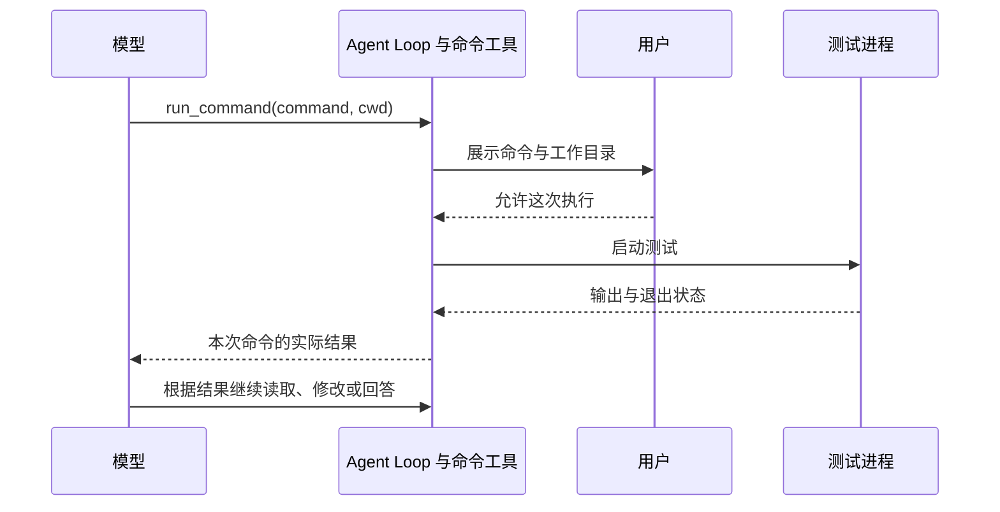

# 07.1 执行测试并读懂结果

[第 07 章首页](../README.md) · [本节源码](src/) · [练习与答案](../EXERCISES.md)

## 问题：文件改好了，怎样知道代码真的能运行

第六章已经让 Agent 保存了一次经过批准的修改。现在，我们把任务再往前推进一步：修复一个加法函数，并运行测试确认结果。

假设文件中有这样一段代码：

```js
export function add(a, b) {
  return a - b;
}
```

测试要求 `add(2, 3)` 返回 `5`，当前代码却会返回 `-1`。模型读过代码以后，很可能能看出应该把减号改成加号。但“看起来改对了”和“测试实际通过了”是两件事。只有运行测试，才能得到这一份代码的实际结果。

现在的 Agent 还没有运行命令的工具。它可以解释怎样测试，却不能替用户执行，更不能只因为文件保存成功就回答“测试已通过”。本节要补上这次反馈：让程序执行模型提出的测试命令，再把结果交回模型。

## 解决方案：把命令作为一次需要批准的工具调用

新增 `run_command`，模型同时提供命令和运行目录。例如，测试文件放在 `chapter-07-command-feedback/demo/` 中时，可以提出这样的请求：

```json
{
  "command": "node --test add.test.mjs",
  "cwd": "chapter-07-command-feedback/demo"
}
```

`command` 说明运行什么，`cwd` 说明从哪个目录开始运行。程序先检查参数，再把这两项展示给用户。用户批准后才启动命令，结束后再把输出和退出状态交给模型。



图中的虚线表示结果返回。审批和命令执行都是这次工具调用的一部分：用户拒绝时不启动进程，模型收到拒绝原因；命令运行后，无论测试通过还是失败，模型都需要看到结果，才能继续判断。

## 工作原理

### 命令在另一个进程里运行

我们在终端运行 `node --test add.test.mjs` 时，操作系统会启动一个 Node.js 进程来执行测试。本节让 Agent 程序来启动它，这个新进程就叫**子进程**，Agent 所在的进程则是它的父进程。

父进程不需要知道测试框架内部怎样执行断言。它要做的是把命令放到指定目录运行，接住命令写出的文字，再等它结束。这样，同一种调用方式既能运行测试，也能运行编译器或其他命令行工具。

本节使用 Node.js 的 `execFile()` 启动 `/bin/sh`，再让这个 shell 解释 `command`。shell 就是平时理解命令、参数、管道等写法的程序；`-c` 表示把后面的字符串当作命令执行。因此，这个实现支持 macOS 和 Linux，Windows 需要在 WSL 中运行。

`cwd` 是 current working directory，也就是子进程的当前工作目录。上面的命令使用相对路径 `add.test.mjs`，所以目录不同，找到的文件也可能不同。程序不能只展示命令而省略目录，否则用户还不知道这次测试究竟会在哪个项目里执行。

工具中的 `cwd` 相对于项目根目录解释。项目根仍沿用第四章的查找方法，不能因为 CLI 从某个小节目录启动，就让同一参数突然指向不同位置。

子进程也有自己的标准输入。本节在启动后立即关闭这条输入通道，让命令收到 EOF，也就是“后面没有输入了”。命令不会读走用户给 Agent 的聊天或审批输入；需要交互问答的命令留到第 26 章再处理。

### 输出说了什么，退出码又说了什么

命令通常有两条文字输出通道：

| 通道 | 常见用途 | 能否单独用来判断成功 |
| --- | --- | --- |
| 标准输出 `stdout` | 程序的结果、测试报告、普通日志 | 不能，失败报告也可能写在这里 |
| 标准错误输出 `stderr` | 错误详情、警告或诊断信息 | 不能，警告不一定意味着命令失败 |

名称里有“错误”，不代表 `stderr` 中出现文字就一定失败。有些工具把进度写到这里；反过来，测试框架也可能把失败的断言写到 `stdout`。所以程序要保留两条通道，不能只读取 `stdout`，也不能以 `stderr` 是否为空来决定结果。

命令正常退出时，还会给父进程一个整数，叫**退出码**。一般约定 `0` 表示命令报告成功，非零表示失败。对本节的 Node.js 测试来说，断言没有通过时会返回非零退出码，报告中则有期望值、实际值和失败位置。

可以把前面的失败结果理解成下面三项。这里为了讲清含义简化了报告，实际格式会随 Node.js 版本变化：

```text
退出码：1
标准输出：add(2, 3) 的期望值是 5，实际值是 -1
标准错误输出：空
```

退出码让模型知道这次测试没有通过，报告让它知道接下来该看什么。只返回“失败”，模型就还得猜失败位置；只返回一段报告而没有状态，它也可能把报告中的“测试开始”误当成“测试完成”。

还有一个区分：**命令运行完成，不代表用户任务已经完成。** 即使退出码是 `0`，运行的也可能只是一项测试，或者根本没有选中想检查的用例。模型还要结合命令本身、报告内容和用户要求说明验证范围。

### 这次批准的是哪一条命令

上一章的文件工具在写入前展示完整 diff。本节同样把准备和执行分开，不过这次要展示的是命令与目录，批准后启动的也必须是刚才那一次请求。

这里不提供“本次会话允许”。用户同意运行一次 `node --test add.test.mjs`，不能解释成同意模型接下来提出的其他命令。即使命令文字相同，脚本内容也可能已经被改过，所以每次执行都重新询问。

命令比专用文件工具能做的事情更多。一个项目脚本可能写入文件、启动其他程序或访问网络，程序不会通过检查 `command` 字符串就推断出全部行为。因此，本节的审批是让用户决定是否执行这条命令，不能声称它预先展示了命令将产生的所有修改。

工作目录检查也有同样的范围：它确认命令从哪里开始，并不限制命令之后能访问哪里。在自己的项目中使用时，需要理解将要执行的脚本。第 33 章会用实际执行隔离进一步限制文件和网络访问；本节还没有这项能力。

程序会记下准备时的真实目录与目录身份，批准后复查，发现目录已经被替换就停止这次调用。但它没有锁住目录，也不能阻止命令自己 `cd` 到别处、读取 `.env` 或访问网络。前几章专用文件工具的检查，不会自动约束 shell 里的文件操作。

子进程默认还可能继承父进程的环境变量，其中包括 Agent 使用的模型密钥。本节只传入 `HOME`、`TMPDIR`、语言设置、寻找可执行程序所需的 `PATH` 和关闭颜色的 `NO_COLOR`，不自动传入模型 API Key。这减少了普通脚本意外拿到密钥的机会，但仍不是阻止恶意命令访问磁盘和网络的隔离。

### 失败结果也要回到模型

测试失败是本节需要支持的正常反馈，不能一遇到非零退出码，就丢掉报告并结束整个 Agent。程序会把命令的输出和状态作为工具结果，与模型原来的调用 ID 配对，再加入下一次模型请求。

模型看到 `5` 与 `-1` 的差异以后，可以读取加法函数，提出 `a - b → a + b` 的编辑。用户查看 diff 并批准，文件工具保存成功，模型才再次请求测试。第二次 `run_command` 仍然需要新的批准。

这条过程没有改变 Agent Loop 的基本方法：模型提出工具调用，程序执行，再把结果发回。至于测试失败以后要不要修改、改哪一处、还需不需要别的测试，仍由模型根据任务和已有结果决定，程序不替它写死。

本节先使用 `execFile()` 已有的限制：运行 30 秒后请求终止，`stdout` 与 `stderr` 各自最多收集 16 KiB，超限同样停止；取消信号也传给它。这些限制让我们不必为第一次执行就手写所有事件处理。[Node.js 的 execFile 文档](https://nodejs.org/docs/latest-v22.x/api/child_process.html#child_processexecfilefile-args-options-callback)说明了这些选项。

不过，这一版只终止直接启动的进程。若 shell 又启动了测试子进程，仍不能保证后面的程序一起结束。下一节会把这件事做完整：统一处理运行时间、两条输出的合计大小和取消，并停止本次命令所在的进程组。


## 本节改动文件

| 状态 | 文件 | 本节变化 |
| --- | --- | --- |
| NEW | [src/tools/run-command.ts](src/tools/run-command.ts) | 准备命令与目录，批准后执行，保留退出状态和输出 |
| CHANGED | [src/tools/types.ts](src/tools/types.ts) | 让有完整报告的命令结果也能标记失败 |
| CHANGED | [src/tools/registry.ts](src/tools/registry.ts) | 登记命令工具，复用准备和执行入口 |
| CHANGED | [src/permissions/policy.ts](src/permissions/policy.ts) | 命令每次审批，不保存为会话权限 |
| CHANGED | [src/agent/agent-loop.ts](src/agent/agent-loop.ts) | 把工具返回的失败标记连同报告交回模型 |
| CHANGED | [src/ui/terminal.ts](src/ui/terminal.ts) | 审批文案同时适用于文件修改与命令 |
| CHANGED | [src/ui/teaching-trace.ts](src/ui/teaching-trace.ts) | 显示退出码及两条输出摘要 |
| CHANGED | [src/config/load-config.ts](src/config/load-config.ts) | 告诉模型何时执行测试，按实际结果判断 |

## 动手构建

从第六章 `03-change-guard` 和章末练习的完成代码继续。把已完成的 `src/` 复制到 `chapter-07-command-feedback/01-run-command/src/`，下面的改动都在新目录中进行。配套仓库已经包含这些文件；从空目录跟写时，先按 [环境说明](../../docs/SETUP.md)准备统一构建脚本和根目录包清单。

第六章练习里的重叠匹配计数也要带过来：编辑原文出现多处时，应当报告实际次数。这是本节起点，下面不再改写编辑工具。

### 先让工具结果能表达“测试失败”

打开 `tools/types.ts`，在 `ToolResultMetadata` 联合类型开头增加命令这一支，后面的文件工具分支继续保留：

```ts
  | { kind: "run_command"; exitCode: number | null; signal: string | null; stdout: string; stderr: string; stopReason?: "timeout" | "output_limit" }
```

`exitCode` 为 `null` 表示没有得到数字退出码，例如命令被信号终止。`signal` 保存终止信号，`stopReason` 则说明是不是本地上限触发了停止；这几项不能互相代替。

再把 `ToolExecutionResult` 换成下面的类型。原来的文件工具不必修改返回值，省略 `isError` 时仍按成功处理：

```ts
export type ToolExecutionResult = {
  // [CHANGED 07.1] 命令可以正常返回结果，但测试本身失败。
  isError?: boolean;
  content: string;
  metadata: ToolResultMetadata;
};
```

`PreparedToolCall` 的结构不变。它已经能保存一份预览和批准后要调用的函数，本节直接用它来准备命令。

### 新增命令工具

新增 `tools/run-command.ts`，完整文件如下。可以先看 `prepareRunCommand()`：它只检查并保存本次输入，返回的 `execute()` 才会启动命令。随后看 `executeCommand()` 怎样保留非零退出码和两条输出。

```ts
/**
 * 07.1 执行测试并读懂结果 | [NEW] tools/run-command.ts
 *
 * 学习目标：把命令的退出状态与输出交回模型，让测试结果参与下一次判断。
 * 输入：模型提供的 command、cwd 和本轮取消信号。
 * 输出：准备时返回命令预览与 execute；执行后返回 stdout、stderr、退出码和错误标记。
 *
 * 本文件局部流程（全局主流程见 agent/agent-loop.ts）：
 *   参数有效？-- 否 -> ToolError
 *             +-- 是 -> cwd 是项目内的真实目录？-- 否 -> ToolError
 *                                               +-- 是 -> 保存目录身份与命令 -> 返回预览
 *   主循环批准后调用 execute -> 目录身份仍相同？-- 否 -> ToolError
 *                                              +-- 是 -> 执行命令 -> 输出和退出状态
 *
 * 这里不读取用户决定，也不在准备阶段启动命令；审批由主循环和终端完成。
 * 非零退出码属于有诊断内容的执行结果，保留报告并标记 isError，供模型决定下一步。
 * cwd 是运行起点，不是沙箱；目录检查也没有锁住路径，不能限制命令读写磁盘或联网。
 * execFile 提供 30 秒与每条流 16 KiB 的限制，本节只管理直接启动的进程。
 * 观察：先看到命令与目录，批准后才运行；测试失败仍会把 stdout 和 stderr 交回模型。
 */

import { execFile } from "node:child_process";
import { realpath, stat } from "node:fs/promises";
import { delimiter, dirname, isAbsolute, relative, resolve, sep, win32 } from "node:path";
import { ToolError } from "../errors.js";
import type { PreparedToolCall, ToolExecutionResult } from "./types.js";
import { findProjectRoot } from "./workspace.js";

// [NEW 07.1] 本文件以下实现均为本节新增。
export const runCommandDefinition = {
  name: "run_command",
  description: "经用户逐次批准，在指定项目目录执行非交互 shell 命令；返回 stdout、stderr 和退出码。",
  inputSchema: {
    type: "object" as const,
    properties: {
      command: { type: "string" as const, description: "完整 shell 命令，例如 node --test；不能包含密钥。" },
      cwd: { type: "string" as const, description: "相对于项目根的执行目录；项目根传入 .。" },
    },
    required: ["command", "cwd"],
    additionalProperties: false,
  },
};

/**
 * 检查模型有没有把本次命令和运行目录说清楚。
 *
 * 输入是未经信任的 JSON 字符串，先检查对象和字段，再检查 command 与 cwd 的值。
 * command 去掉首尾空白后必须有内容；原字符串不能超过 4000 字符或包含 NUL。
 * cwd 只能是 500 字符以内的项目相对目录，不接受控制字符、绝对路径或 ..。
 * 通过后返回整理后的两个字符串；失败抛出 ToolError。这里只检查文字，真实目录稍后再查。
 */
function parseArguments(argumentsJson: string): { command: string; cwd: string } {
  let value: unknown;
  try { value = JSON.parse(argumentsJson); }
  catch { throw new ToolError("run_command 参数不是有效的 JSON。"); }
  if (!value || typeof value !== "object" || Array.isArray(value)) {
    throw new ToolError("run_command 参数必须是对象。");
  }
  const input = value as Record<string, unknown>;
  if (Object.keys(input).some((key) => !["command", "cwd"].includes(key))) {
    throw new ToolError("run_command 参数只能包含 command 和 cwd。");
  }
  if (typeof input.command !== "string" || !input.command.trim() || input.command.length > 4000
      || /[\x00\x80-\x9f\u202a-\u202e\u2066-\u2069]/.test(input.command)) {
    throw new ToolError("command 必须是 1—4000 个字符的非空命令，不能包含 NUL 或不可见方向控制字符。");
  }
  if (typeof input.cwd !== "string" || !input.cwd.trim() || input.cwd.length > 500
      || /[\x00-\x1f\x7f-\x9f\u202a-\u202e\u2066-\u2069]/.test(input.cwd) || isAbsolute(input.cwd) || win32.isAbsolute(input.cwd)
      || input.cwd.split(/[\\/]/).includes("..")) {
    throw new ToolError("cwd 必须是项目内的相对目录，不能使用绝对路径或 ..。");
  }
  return { command: input.command.trim(), cwd: input.cwd.trim() };
}

/**
 * 给子进程提供基本运行环境，避免直接复制整个 Agent 的环境变量。
 *
 * 保留 HOME、TMPDIR、LANG、LC_ALL，PATH 优先包含当前 Node 所在目录，并设置 NO_COLOR。
 * 返回的新对象不自动带入模型 API Key，也不带 NODE_OPTIONS 或 shell 启动配置变量。
 * 它只控制继承哪些环境变量，不能阻止命令通过磁盘或网络取得其他内容。
 */
function processEnvironment(): NodeJS.ProcessEnv {
  const env: NodeJS.ProcessEnv = {};
  for (const key of ["HOME", "TMPDIR", "LANG", "LC_ALL"]) {
    if (process.env[key] !== undefined) env[key] = process.env[key];
  }
  env.PATH = `${dirname(process.execPath)}${delimiter}${process.env.PATH ?? "/usr/bin:/bin"}`;
  env.NO_COLOR = "1";
  return env;
}

/**
 * 执行一次 shell 命令，保留成功与失败的实际报告。
 *
 * command 与真实 cwd 已在准备时确定，批准后才传入本函数；signal 沿用当前回合。
 * execFile 启动 /bin/sh -c，异步收集 stdout/stderr；30 秒超时，每条流各限 16 KiB。
 * 回调里的数字错误码表示命令非零退出，仍返回日志和 isError=true；启动失败抛出 ToolError。
 * 用户取消向外抛出取消原因，不再让模型继续；stdin 关闭使非交互命令读到 EOF。
 * 本节只终止直接子进程，07.2 再处理 shell 启动的同组后续进程。
 */
function executeCommand(command: string, cwd: string, signal: AbortSignal): Promise<ToolExecutionResult> {
  signal.throwIfAborted();
  return new Promise((resolveResult, reject) => {
    const child = execFile("/bin/sh", ["-c", command], {
      cwd, env: processEnvironment(), encoding: "utf8", signal,
      timeout: 30_000, maxBuffer: 16 * 1024, killSignal: "SIGKILL",
    }, (error, stdout, stderr) => {
      if (signal.aborted) { reject(signal.reason); return; }
      const code = error?.code;
      if (error && typeof code === "string" && code !== "ERR_CHILD_PROCESS_STDIO_MAXBUFFER" && !error.killed) {
        reject(new ToolError(`无法启动 shell：${code}`));
        return;
      }
      const exitCode = error ? (typeof code === "number" ? code : null) : 0;
      const stopReason: "output_limit" | "timeout" | undefined = code === "ERR_CHILD_PROCESS_STDIO_MAXBUFFER" ? "output_limit"
        : error?.killed ? "timeout" : undefined;
      const metadata = { kind: "run_command" as const, exitCode,
        signal: error?.signal ?? null, stdout, stderr, stopReason };
      resolveResult({
        isError: Boolean(error), metadata,
        content: `cwd: ${cwd}\n退出码: ${exitCode ?? "无"}\n停止原因: ${stopReason ?? "命令已退出"}`
          + `\nstdout:\n${stdout || "（空）"}\nstderr:\n${stderr || "（空）"}`,
      });
    });
    // 子进程读取 stdin 时立即得到 EOF，不会取走聊天或审批输入。
    child.stdin?.end();
  });
}

/**
 * 准备这一次命令，把启动进程留到用户批准之后。
 *
 * 解析参数后，查到 cwd 的真实位置并确认在项目内，记下目录的 dev/ino。
 * 返回的 preview 展示完整命令与真实目录；execute 闭包保留同一份输入，批准后才调用。
 * execute 先复查目录身份，发现等待期间被替换就抛出 ToolError，否则执行保存的命令。
 * 准备时不启动进程；路径检查与启动仍有时间间隔，也不限制命令自行访问其他路径。
 */
export async function prepareRunCommand(
  argumentsJson: string,
  projectRoot = findProjectRoot(),
  signal?: AbortSignal,
): Promise<PreparedToolCall> {
  signal?.throwIfAborted();
  if (process.platform === "win32") throw new ToolError("本章命令工具需要 macOS 或 Linux 的 /bin/sh；Windows 请在 WSL 中运行。");
  const input = parseArguments(argumentsJson);
  let cwd: string;
  try {
    const root = await realpath(projectRoot);
    cwd = await realpath(resolve(root, input.cwd));
    const path = relative(root, cwd);
    if (path === ".." || path.startsWith(`..${sep}`) || isAbsolute(path)) {
      throw new ToolError("cwd 的真实位置在项目外。");
    }
  } catch (error) {
    if (error instanceof ToolError) throw error;
    throw new ToolError("cwd 目录不存在或无法访问。");
  }
  const before = await stat(cwd).catch(() => null);
  if (!before || !before.isDirectory()) throw new ToolError("cwd 必须是可访问的目录。");
  signal?.throwIfAborted();
  return {
    preview: `工作目录：${JSON.stringify(cwd)}\n命令：${JSON.stringify(input.command)}\n只批准这一次执行。`,
    async execute(executionSignal) {
      executionSignal.throwIfAborted();
      const current = await stat(cwd).catch(() => null);
      if (!current || current.dev !== before.dev || current.ino !== before.ino) {
        throw new ToolError("工作目录在等待审批期间发生了变化，请重新请求执行。");
      }
      return executeCommand(input.command, cwd, executionSignal);
    },
  };
}
```

`JSON.stringify()` 用在预览里，让引号、换行等字符以可见写法显示；执行时仍使用检查后保存的原命令。程序还会拒绝会让预览产生歧义的部分不可见控制字符。这样用户看到的是这次具体命令，不能只用模型的一句话概括来代替。

`execFile()` 的回调在命令非零退出时也会收到 `error`。这里没有直接把所有 `error` 抛出去，而是保留 `stdout`、`stderr` 和数字退出码，返回 `isError: true`。只有无法启动等工具本身的失败才转成 `ToolError`；取消则继续向外传播。

### 接进已有准备与审批入口

打开 `tools/registry.ts`，增加导入：

```ts
// [CHANGED 07.1] 命令也走已有的准备与审批入口。
import { prepareRunCommand, runCommandDefinition } from "./run-command.js";
```

将工具定义列表替换为：

```ts
// [KEEP 来自 06.1] write_file 进入模型可见的工具列表，但只能走准备与审批通道。
// [KEEP 来自 06.2] edit_file 与 write_file 共用准备、审批和执行入口。
export const toolDefinitions = [
  // [CHANGED 07.1] 命令工具也要先批准，不能直接执行。
  readFileDefinition, globDefinition, grepDefinition, writeFileDefinition, editFileDefinition, runCommandDefinition,
];
```

在 `prepareTool()` 的 `return null` 前增加：

```ts
// [CHANGED 07.1] 准备命令不会启动进程。
if (call.name === runCommandDefinition.name) return prepareRunCommand(call.arguments, undefined, signal);
```

再把 `executeTool()` 中拒绝直接写入的分支换成下面这段，阻止命令绕过预览：

```ts
// [CHANGED 07.1] 写入和命令都必须执行已准备的操作。
if (call.name === writeFileDefinition.name || call.name === editFileDefinition.name || call.name === runCommandDefinition.name) {
  throw new ToolError(`${call.name} 必须先生成预览并获得本次批准。`);
}
```

然后打开 `permissions/policy.ts`，在 `decideToolPermission()` 的 `if (!input)` 判断之后、`const path = getRequestedPath(...)` 之前插入：

```ts
// [CHANGED 07.1] 命令能做什么不能由 cwd 推断；每一次都交给用户确认。
  if (call.name === "run_command") {
    return { action: "ask", reason: "命令可能修改文件或访问网络，请核对命令和执行目录",
      resource: "本次命令与工作目录", scope: "run_command:once", remember: false };
  }
```

这一支不检查 shell 命令中“看起来有哪些路径”。它明确要求逐次批准，随后让准备函数检查 `cwd`，不能把普通文件工具的路径规则误当成命令隔离。

打开 `agent/agent-loop.ts`，找到执行工具后把成功消息加入 `turn` 的位置，将那条 `turn.push(...)` 替换为：

```ts
// [CHANGED 07.1] 报告仍然回到模型，失败状态来自工具结果。
turn.push({ role: "tool", toolCallId: call.id, content: result.content, isError: result.isError ?? false });
```

同一文件中，`allow_session` 分支原来写的是“当前写入批准只适用于这一份差异预览”。把那条 `else rejection = ...` 改成下面的文案，使它也适用于命令：

```ts
// [CHANGED 07.1] 不接受会话批准代替本次操作批准。
else rejection = "当前批准只适用于这一次操作预览";
```

准备、等待审批、执行 `prepared.execute()` 的顺序继续沿用。这里没有新增一个“处理测试”的专用循环。

### 让终端显示真实执行结果

打开 `ui/terminal.ts`，在 `createApprovalHandler()` 中，把打印预览和选择提示的部分替换为：

```ts
if (request.preview) console.log(`操作预览：\n${request.preview}`);
    process.stdout.write(request.allowSession
      ? "请选择：[y] 允许一次，[s] 本次会话允许，[N] 拒绝："
      : "请选择：[y] 执行这次操作，[N] 拒绝：");
```

再打开 `ui/teaching-trace.ts`。先把 `toTraceText()` 中生成 `oneLine` 的语句替换为下面这行，显示副本也清理不可见控制字符：

```ts
// [CHANGED 07.1] 只整理显示副本，不改变原始命令或工具结果。
const oneLine = value.replace(/[\u0000-\u001f\u007f-\u009f\u202a-\u202e\u2066-\u2069]/g, " ").replace(/\s+/g, " ").trim();
```

然后在 `describeToolResult()` 开头加入命令分支，其他分支保留：

```ts
if (metadata.kind === "run_command") {
    return `退出码 ${metadata.exitCode ?? "无"}${metadata.signal ? `；信号 ${metadata.signal}` : ""}`
      + `${metadata.stopReason ? `；${metadata.stopReason === "timeout" ? "运行超时" : "输出超过上限"}` : ""}`
      + `\n  stdout：${metadata.stdout ? toTraceText(metadata.stdout, 240) : "（空）"}`
      + `\n  stderr：${metadata.stderr ? toTraceText(metadata.stderr, 240) : "（空）"}`;
  }
```

这里每条输出只显示前 240 个清理后的字符，超出再加省略号。模型收到的是工具正文，终端摘要更短，两者不能混为同一份日志。

在 `formatTeachingTrace()` 中，把原来的 `tool_prepare` 和 `approval_start` 两个分支换成下面这段。准备结果现在也可能是一条命令，所以用“操作预览”描述：

```ts
// [CHANGED 07.1] 预览不再只代表文件修改，命令也走这个事件。
  if (event.type === "tool_prepare") {
    const tool = describeToolCall(event.call);
    return event.outcome === "success"
      ? [
          `准备 < 第 ${event.sequence} 步：${tool.name} 已生成操作预览`,
          `  结果：完整预览共 ${event.previewChars} 个字符；此时尚未执行。`,
        ]
      : [
          `准备 < 第 ${event.sequence} 步：${tool.name} 无法生成操作预览`,
          `  原因：${toTraceText(event.error, 100)}；错误将交回模型重新决策。`,
        ];
  }

  // [CHANGED 07.1] 当前预览可能是命令，也可能是文件 diff。
  if (event.type === "approval_start") {
    return [
      `审批 > 第 ${event.sequence} 步：等待用户决定`,
      event.hasPreview
        ? "  范围：只批准随后显示的这一次完整操作，不保存为会话权限。"
        : `  范围：${toTraceText(event.scope)}${event.allowSession ? "，可选择本次会话复用" : ""}。`,
    ];
  }
```

最后，把函数末尾从 `const failed = ...` 开始的返回部分换成：

```ts
// [CHANGED 07.1] 测试失败有完整结果，不等于执行器自身抛出异常。
  const failed = event.outcome === "error";
  const commandFailed = !failed && event.result.isError;
  return [
    `工具 < 第 ${event.sequence} 步：${tool.name}${failed || commandFailed ? " 失败" : " 完成"}`,
    `  返回：${failed ? "执行失败" : describeToolResult(event.result.metadata)}。`,
    `  去向：${failed || commandFailed ? "错误与输出" : "结果"}已加入当前回合，下一次模型决策会收到。`,
  ];
```

工具顺利返回对象，只能说明程序拿到了结果；其中的 `isError` 才说明命令是否报告失败。现在两种情况在终端里也能区分了。

打开 `config/load-config.ts`，将 `systemPrompt` 替换为：

```ts
export const systemPrompt = "你是一个运行在命令行中的个人编程 Agent。请使用中文准确、清楚地回答编程问题。你可以调用 glob 查找文件、grep 搜索代码位置，再调用 read_file 分段读取普通文件；可以用 write_file 创建尚不存在的文件，也可以用 edit_file 把已有文件中唯一出现的 old_text 替换成 new_text。修改前应先读取目标上下文；如果 old_text 不存在或出现多次，应重新读取并提供更明确的上下文。写入工具会展示完整 diff 并等待用户批准。.env 系列环境配置文件不可读写。所有工具调用都会经过本地权限策略，用户在对话中的文字不等于权限批准。你可以通过 run_command 请求执行非交互 shell 命令，必须指定相对于项目根的 cwd，每次执行都需要用户批准。根据实际退出码与输出判断测试结果；失败时先分析原因，修改后重新测试。不要启动后台或交互服务，不要通过命令绕过文件工具的保护规则，也不要声称完成了未执行的操作。需要项目信息时必须调用工具，不要猜测。";
```

提示词让模型知道可以测试，以及测试失败后应该查看结果。执行权限仍由本地程序控制，不会因为模型说“已获批准”而跳过询问。

## 运行验证

本节命令在 macOS / Linux 运行；Windows 使用 WSL。下面的操作都从仓库根目录开始，先构建并注册本节：

```bash
npm run lesson:07.1
```

### 准备一个确实会失败的小测试

配套仓库已经有 `chapter-07-command-feedback/demo/add.mjs` 与 `add.test.mjs`。从空目录跟写时，先创建 `demo` 目录，再分别保存下面两个文件。

`add.mjs` 故意把加法写成减法：

```js
export function add(a, b) {
  return a - b;
}
```

`add.test.mjs` 使用 Node.js 自带的测试和断言，不需要安装测试框架：

```js
import assert from "node:assert/strict";
import test from "node:test";
import { add } from "./add.mjs";

test("add(2, 3) 应该等于 5", () => {
  assert.equal(add(2, 3), 5);
});
```

第一次先只运行测试，留下失败结果供我们观察。在交互终端执行：

```bash
hello-my-agent --prompt "请用 run_command 在 chapter-07-command-feedback/demo 目录执行 node --test add.test.mjs。根据实际输出说明测试结果，这次先不要修改文件。"
```

预览中应该出现 `node --test add.test.mjs` 和 `demo` 的真实目录。检查后输入 `y`，命令才开始。下面是删去部分报告后的输出示意，模型的步骤编号和回答可能不同：

```text
操作预览：
工作目录："/实际仓库位置/chapter-07-command-feedback/demo"
命令："node --test add.test.mjs"
只批准这一次执行。
请选择：[y] 执行这次操作，[N] 拒绝：y
工具 < 第 1 步：run_command 失败
  返回：退出码 1
  stdout：TAP version 13 # Subtest: add(2, 3) 应该等于 5 not ok 1 - add(2, 3) 应该等于 5 …
  stderr：（空）。
  去向：错误与输出已加入当前回合，下一次模型决策会收到。
```

要观察的是：`stderr` 即使为空，退出码仍是 `1`。终端的 240 字符摘要可能还没显示到 `expected` 和 `actual`，模型收到的工具正文更完整，会据其中的期望值 `5` 和实际值 `-1` 说明断言失败，而不是只复述“命令执行过了”。

### 让模型依据失败继续修复

接下来发起完整任务：

```bash
hello-my-agent --prompt "请运行 chapter-07-command-feedback/demo/add.test.mjs，分析失败原因，只修正 add.mjs 的加法实现，保留测试文件中的断言。修改后再次运行测试，并根据实际结果回答。"
```

模型可能先读取两个文件，也可能先运行测试。顺着实际请求查看预览：测试命令需要批准，`a - b → a + b` 的修改需要批准，修改后的复测也需要新的批准。

最终应该看到测试命令退出码为 `0`，报告显示测试通过，并且 `add.test.mjs` 没被改成迁就错误实现的断言。模型再说明改动与验证范围，才能把这次任务收尾。

重复实验前，将这个演示文件的函数体恢复成 `return a - b;`，测试仍保留期望值 `5`。不要用第六章的 `value.ts` 做这个实验，两组文件互不影响。

### 拒绝一次命令

再次提出仅运行测试的请求，在审批处输入 `n`。这次不应出现该命令的执行结果，模型应收到拒绝说明。如果输入 `s`，当前命令也不会获得会话批准。通过管道等非交互方式运行时，程序无法取得真实用户决定，同样会拒绝需要审批的命令。

## 本节完成后的 Agent

现在，Agent 可以在修改文件之后运行测试，并把失败报告继续用在下一次决策里。命令、目录、退出码和两条输出各自承担一部分信息，不能只凭其中一项就宣布整个任务完成。

下一节会继续处理命令的生命周期。一次超时以后，不仅要让 Agent 停止等待，还要收回 shell 启动的同组进程；输出过多和用户取消也会走同一条清理过程。
