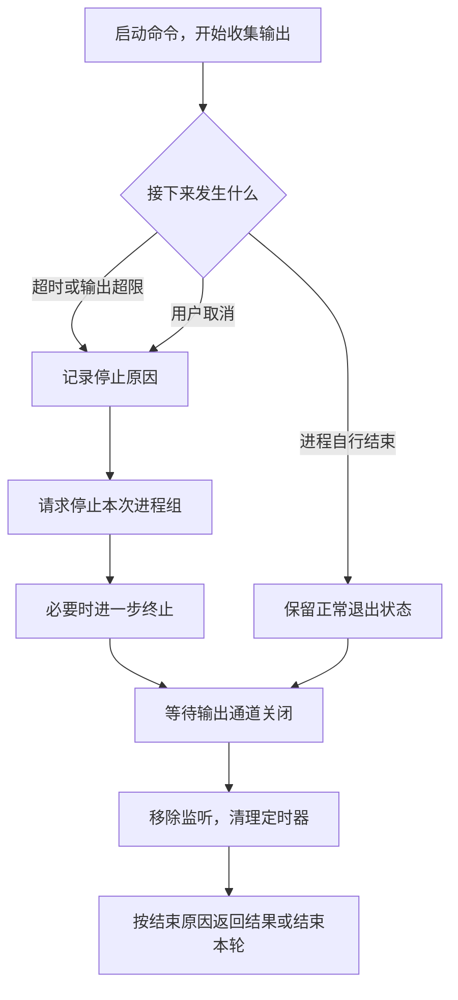

# 07.2 停止卡住或输出过多的命令

[上一节：执行测试并读懂结果](../01-run-command/README.md) · [第 07 章首页](../README.md) · [本节源码](src/) · [练习与答案](../EXERCISES.md)

## 问题：测试没有结束，Agent 就一直等下去吗

上一节可以运行测试，并在命令结束后把结果交回模型。不过，并不是所有命令都会自行结束。

例如，测试命令误用了监听模式。它运行完第一遍以后继续等待文件变化，终端已经出现测试报告，子进程却还活着。上一节的 `execFile()` 有 30 秒超时，但它只直接管理启动的那个进程；如果 shell 又启动了测试进程，只停下 shell 仍可能留下测试继续运行。

还有一种情况恰好相反：命令不是没有动静，而是不停打印日志。上一节已经分别限制两条输出，本节会把它们放到同一个预算里管理，并在超限时采用同一套停止与清理方法。

本节要解决同一个问题：**命令没有按预期结束时，由谁让它停下来。** 我们让启动子进程的程序同时负责停止和清理，不能只把等待命令的那段代码提前退出。

## 解决方案：给执行设限，再等待进程确实结束

程序为每次命令设置 30 秒运行时间，以及两条输出合计 32 KiB 的收集上限，同时接收已有的取消信号。正常结束就返回结果；触发上限或取消时，就请求停止本次启动的进程，等它关闭以后再完成清理。



超时、输出超限和用户取消采用同一套停止过程，但含义不同。前两种说明当前命令没有在约定范围内完成；用户取消则说明这次任务不再继续。模型和终端都需要保留这个区别，不能统一显示成“测试失败”。

## 工作原理

### 不再等待，不等于命令已经停止

最容易想到的办法是同时等待命令和一个计时器，谁先完成就返回。比如超时以后返回一句“命令超时”，看起来工具已经结束了。

问题是，计时器只改变父进程的等待结果。它不会替操作系统停止子进程。那个测试仍然可能占用 CPU、继续写文件，或者又启动新的程序。Agent 已经在处理下一条请求，上一条命令却还在运行，后面的结果也就难以判断了。

所以，我们把“需要停止”与“已经关闭”分开。计时器响起时先记下原因，再向子进程发送停止信号；等子进程结束、输出管道关闭以后，才能释放这次执行的监听器和定时器，返回最终状态。

子进程的结束与输出读完也有先后之分。进程结束时，管道里可能还留着最后一段报告。Node.js 的 `close` 事件表示子进程已经结束，并且它的标准输入输出流已经关闭；以这个时刻完成收集，才能把管道里已经收到的尾部内容一起处理。

### 为什么要停止一组进程

模型提出的可能是 `npm test`。程序先启动 shell，shell 再启动 npm，npm 又启动测试进程。这时“当前命令”不一定只对应一个进程。

```text
Agent
  └─ shell
      └─ npm
          └─ 测试进程
```

如果只停止 shell，后面的测试有可能还在运行。它还可能继续占着输出管道，让父进程迟迟等不到关闭。所以，本节会在 macOS / Linux 上让新命令拥有自己的进程组，再向这一组发送停止信号。

先向进程组发送 `SIGTERM`，给程序清理资源的机会；300 毫秒后再向仍存在的进程组发送 `SIGKILL`，终止没有退出的程序。`SIGKILL` 不会等程序做完自己的清理，因此它是回收仍未退出进程的手段，不能当成撤销已经发生的操作。

直接启动的进程正常退出时，也要检查同组残留。比如 shell 启动了一个后台任务后先退出，程序不能把那个后台任务继续留在本次调用之外。本节会请求清理同组进程，再等输出管道关闭；关闭后也会尝试清理仍在同组的剩余进程。

30 秒表示开始请求停止的时刻，不是承诺整次调用严格在第 30 秒返回。发送信号之后还要等进程和管道关闭，期间仍会处理已进入管道的数据。

这个范围也要说清楚：进程组能一起管理正常留在同组里的子进程，不等于追踪了操作系统中的所有后代。主动脱离进程组的程序，以及长期后台服务的归属，需要更完整的任务管理。第 26 章会继续处理交互命令和后台任务，第 33 章再加入更强的执行隔离。

### 输出太多时，停止收集还不够

输出上限首先限制保留到内存中的数据。程序收到一段输出时，先看看还剩多少空间，只保留允许的部分；超过上限以后，结果要明确说明内容不完整。两条输出先到的数据先占用同一份 32 KiB 预算，限制的是保存下来的原始字节，不是某一条流的字符数。

如果只停止收集，却让子进程继续打印，它仍然可能一直占用 CPU。若不继续读取管道，管道缓冲区还可能塞满，导致子进程卡在写输出。因此，本节触发输出上限后会停止执行，用同一套进程清理流程收尾。

这里不能把截断输出当成一份完整测试报告。模型需要知道“命令因为输出过多被停止”，才可能缩小测试范围或减少日志，再提出下一次调用。只返回保留下来的前半段，可能让模型误以为最后没有报错。

本节先控制每次命令保留的输出，不保存整份日志。第 15 章会继续区分完整日志和送入模型的摘要，让上下文有限时仍能找到原始结果。

### 输入结束与用户取消分别意味着什么

有些命令会等待标准输入，例如安装程序询问是否继续。本节只执行不需要交互的命令，不把 Agent 的聊天输入直接接给子进程。否则同一行用户输入可能被聊天、审批和命令争抢，程序也不知道这一行究竟是说给谁的。

子进程得到输入结束标记 EOF 后，会知道没有更多输入。它可以按自己的规则退出或报错；如果它忽略 EOF 后仍继续等待，运行时间上限会负责停止它。EOF 不是“替用户回答同意”，也不能保证任意程序都会立刻结束。

用户在 Agent 终端按下 Ctrl+C，则会触发已有的取消信号。只把信号传到工具函数还不够，进程执行代码也要监听它，主动停止当前命令，不能等命令自己结束以后才检查“刚才有人取消了”。

停止命令也不会回滚它已经写入的文件。程序能阻止后续执行，却不能假定本次命令什么都没做过。终端应当如实显示中断；第 08 章再把任务中断与退出程序拆开，让用户取消当前任务后继续交谈。


## 本节改动文件

| 状态 | 文件 | 本节变化 |
| --- | --- | --- |
| NEW | [src/processes/run-process.ts](src/processes/run-process.ts) | 收集两条输出，处理时间、输出上限、取消与同组清理 |
| CHANGED | [src/tools/run-command.ts](src/tools/run-command.ts) | 把实际进程控制交给执行器，继续返回命令结果 |
| CHANGED | [src/ui/terminal.ts](src/ui/terminal.ts) | 单次提问也把 Ctrl+C 传到当前工具 |

## 动手构建

从 07.1 继续，把整个 `src/` 复制到 `chapter-07-command-feedback/02-process-lifecycle/src/`。下面修改新目录中的副本。主循环、权限策略与结果类型继续保留，不为命令停止再增加另一条工具调度路线。

### 单独负责一次进程的开始和结束

新增 `processes/run-process.ts`，完整代码如下。这一层只接收“运行哪个程序”和“传入哪些参数”，因此下一节的搜索也能使用它。

```ts
/**
 * 07.2 停止卡住或输出过多的命令 | [NEW] processes/run-process.ts
 *
 * 学习目标：启动外部程序后，负责它的输出、停止和同组进程清理。
 * 输入：程序名称、参数数组、真实 cwd、取消信号、时间与合计输出上限。
 * 输出：stdout/stderr、退出码、终止信号与可选停止原因；启动失败或取消向外抛出。
 *
 * 本文件局部流程（全局主流程见 agent/agent-loop.ts）：
 *   参数有效？-- 否 -> ToolError
 *             +-- 是 -> spawn 独立进程组 -> 读取两条输出
 *   超时 / 超量 / 取消 -> 首次停止？-- 是 -> SIGTERM -> 300 ms 后 SIGKILL
 *                                   +-- 否 -> 保留第一次停止原因
 *   直接子进程 exit -> 请求清理同组残留 -> 等 close
 *   close -> 清理定时器和取消监听 -> 再清理同组残留
 *         -> 已取消？-- 是 -> 抛出取消原因
 *                    +-- 否 -> 启动失败？-- 是 -> ToolError
 *                                       +-- 否 -> 返回结果
 *
 * 输出预算按两条流的字节合计，默认 32 KiB；超出部分继续从管道读出，但不保存在内存。
 * 默认 30 秒只触发停止请求，随后还要等进程与管道关闭，不能把计时器返回当成进程已结束。
 * stdin 使用 ignore，子进程读到 EOF，不取走聊天或审批输入。
 * 只管理仍在本次 POSIX 进程组里的程序；脱离进程组的服务与操作系统隔离留到后续章节。
 * 观察：超时和超量返回已有日志与停止原因，取消在清理后向外结束本轮。
 */

import { spawn } from "node:child_process";
import { delimiter, dirname } from "node:path";
import { ToolError } from "../errors.js";

// [NEW 07.2] 本文件以下实现均为本节新增。
export type ProcessResult = {
  stdout: string;
  stderr: string;
  exitCode: number | null;
  signal: NodeJS.Signals | null;
  stopReason?: "timeout" | "output_limit";
};

/**
 * 给外部程序构造必要的环境变量，不直接复制 Agent 的全部环境。
 *
 * 返回包含 HOME、TMPDIR、语言设置、PATH 和 NO_COLOR 的新对象。
 * PATH 优先包含当前 Node 的目录，方便相同机器上的测试调用同一个 Node。
 * 不自动传递模型 API Key、NODE_OPTIONS 或 BASH_ENV；它并不限制磁盘与网络访问。
 */
function processEnvironment(): NodeJS.ProcessEnv {
  const env: NodeJS.ProcessEnv = {};
  for (const key of ["HOME", "TMPDIR", "LANG", "LC_ALL"]) {
    if (process.env[key] !== undefined) env[key] = process.env[key];
  }
  env.PATH = `${dirname(process.execPath)}${delimiter}${process.env.PATH ?? "/usr/bin:/bin"}`;
  env.NO_COLOR = "1";
  return env;
}

/**
 * 运行一次非交互进程，并在结束前处理它的输出和同组进程。
 *
 * file/args 直接交给 spawn，函数本身不拼接 shell 命令；调用方若传入 /bin/sh，才会执行 shell。
 * 时间与输出上限必须为正整数。两条输出共用字节预算，观察到超出字节时才记录 output_limit。
 * 超时或超量返回已有日志和停止原因，由调用方解释；用户取消在 close 后抛出 signal.reason。
 * 启动失败转换成 ToolError。close 时清理监听、定时器及同组残留，再决定成功返回还是抛错。
 * 它不保存完整日志、不回滚副作用，也不能追踪主动脱离当前 POSIX 进程组的程序。
 */
export function runProcess(
  file: string,
  args: string[],
  { cwd, signal, timeoutMs = 30_000, maxOutputBytes = 32 * 1024 }: {
    cwd: string; signal?: AbortSignal; timeoutMs?: number; maxOutputBytes?: number;
  },
): Promise<ProcessResult> {
  signal?.throwIfAborted();
  if (process.platform === "win32") throw new ToolError("本章进程组控制需要 macOS/Linux；Windows 请使用 WSL。");
  if (!Number.isSafeInteger(timeoutMs) || timeoutMs < 1 || !Number.isSafeInteger(maxOutputBytes) || maxOutputBytes < 1) {
    throw new ToolError("进程时间与输出上限必须是正整数。");
  }
  return new Promise((resolveResult, reject) => {
    const stdout: Buffer[] = [];
    const stderr: Buffer[] = [];
    let bytes = 0;
    let stopReason: ProcessResult["stopReason"];
    let stopping = false;
    let killTimer: ReturnType<typeof setTimeout> | undefined;
    const child = spawn(file, args, {
      cwd, env: processEnvironment(), shell: false, detached: true,
      // ignore 使子进程读取 stdin 时得到 EOF，不会争抢用户的输入。
      stdio: ["ignore", "pipe", "pipe"],
    });

    // detached 在 POSIX 下建立新进程组；负 pid 只指向本次启动的这一组。
    const killGroup = (sentSignal: NodeJS.Signals) => {
      if (!child.pid) return;
      try { process.kill(-child.pid, sentSignal); }
      catch (error) {
        if ((error as NodeJS.ErrnoException).code !== "ESRCH") child.kill(sentSignal);
      }
    };
    // 只接受第一次停止原因，避免同一次超量随后又被超时覆盖。
    const stop = (reason?: ProcessResult["stopReason"]) => {
      if (stopping) return;
      stopping = true;
      stopReason = reason;
      killGroup("SIGTERM");
      killTimer = setTimeout(() => killGroup("SIGKILL"), 300);
    };
    const onAbort = () => stop();
    const timer = setTimeout(() => stop("timeout"), timeoutMs);
    // 两条管道先到的数据先占用同一预算；超过预算的内容读出后直接丢弃。
    const collect = (chunks: Buffer[], chunk: Buffer) => {
      const remaining = Math.max(0, maxOutputBytes - bytes);
      if (remaining) chunks.push(Buffer.from(chunk.subarray(0, remaining)));
      bytes += Math.min(remaining, chunk.length);
      if (chunk.length > remaining) stop("output_limit");
    };
    child.stdout.on("data", (chunk: Buffer) => collect(stdout, chunk));
    child.stderr.on("data", (chunk: Buffer) => collect(stderr, chunk));
    signal?.addEventListener("abort", onAbort, { once: true });
    if (signal?.aborted) onAbort();

    // 直接子进程先退出、后台子进程仍持有管道时，也不能一直等 close。
    child.once("exit", () => {
      if (!stopping) {
        killGroup("SIGTERM");
        killTimer = setTimeout(() => killGroup("SIGKILL"), 300);
      }
    });
    let spawnError: Error | undefined;
    child.once("error", (error) => { spawnError = error; });
    child.once("close", (exitCode, exitSignal) => {
      clearTimeout(timer);
      clearTimeout(killTimer);
      signal?.removeEventListener("abort", onAbort);
      // 即使剩余子进程关闭了管道，也清理仍属于本次组的进程。
      killGroup("SIGKILL");
      if (signal?.aborted) { reject(signal.reason); return; }
      if (spawnError) {
        reject(new ToolError(`无法启动 ${file}：${(spawnError as NodeJS.ErrnoException).code ?? "未知错误"}`));
        return;
      }
      resolveResult({ stdout: Buffer.concat(stdout).toString("utf8"), stderr: Buffer.concat(stderr).toString("utf8"),
        exitCode, signal: exitSignal, stopReason });
    });
  });
}
```

先从 `spawn()` 看起。`detached: true` 在本节支持的 POSIX 系统上建立新的进程组，程序后面才能用负的 PID 向这一组发信号；它在这里不表示把任务交给后台长期运行。`stdio` 让标准输入读到 EOF，两条输出则通过管道交回父进程。

再看 `stop()`。`stopping` 让停止过程只开始一次：输出超限以后，即使计时器又响了，也不会把最初的 `output_limit` 改写成 `timeout`。`collect()` 只保存预算内的字节，超出的数据读出来后就丢弃，避免管道塞满。

最后看 `close`。这里先清理定时器与取消监听，再决定怎样完成 Promise。超时和输出超限返回结果，命令工具还能把已经收集的日志交回模型；取消则抛出取消原因，让当前回合停止。进程已经启动时，不能收到取消信号就立即返回，留下清理在后面继续跑。

### 命令工具只负责解释结果

打开 `tools/run-command.ts`，删除 `execFile` 导入，将路径模块导入改成：

```ts
import { isAbsolute, relative, resolve, sep, win32 } from "node:path";
```

增加执行器导入：

```ts
// [CHANGED 07.2] 进程生命周期交给共用执行器。
import { runProcess } from "../processes/run-process.js";
```

删除原来的 `processEnvironment()`，这项工作已经移到新文件。再把 `executeCommand()` 连同前面的说明替换为：

```ts
/**
 * 把受控进程的结束状态与输出整理成模型能够使用的工具结果。
 *
 * 输入是本次批准的 command、真实 cwd 和取消信号；runProcess 负责实际进程生命周期。
 * 退出码不是 0，或者因时间/输出上限停止时，返回 isError=true，同时保留已收集的日志。
 * stdout 和 stderr 不用来互相推断成功与失败；信号终止时可能没有数字退出码。
 * 启动失败抛出 ToolError，由主循环转成工具错误交回模型，模型仍可继续决策。
 * 用户取消则向外传播取消原因，结束当前回合，不再请求模型。
 */
// [CHANGED 07.2] 命令不再自行管理子进程；搜索将在 07.3 复用同一执行器。
async function executeCommand(command: string, cwd: string, signal: AbortSignal): Promise<ToolExecutionResult> {
  const result = await runProcess("/bin/sh", ["-c", command], { cwd, signal });
  const { exitCode, signal: exitSignal, stdout, stderr, stopReason } = result;
  return {
    isError: exitCode !== 0 || Boolean(stopReason),
    metadata: { kind: "run_command", ...result },
    content: `cwd: ${cwd}\n退出码: ${exitCode ?? "无"}\n信号: ${exitSignal ?? "无"}`
      + `\n停止原因: ${stopReason ?? "命令已退出"}`
      + `\nstdout:\n${stdout || "（空）"}\nstderr:\n${stderr || "（空）"}`,
  };
}
```

`prepareRunCommand()` 继续沿用，不改变本次命令、目录与审批的关系。只是批准以后，执行函数现在把取消信号交给 `runProcess()`；返回的 `stopReason` 和信号也会写进工具正文。

### 单次提问也要能够停止命令

连续会话原来已经有 `AbortController`，Ctrl+C 会取消当前回合。上一节的 `--prompt` 路径还没有使用同一套信号处理，所以这里需要补齐。

打开 `ui/terminal.ts`，把整个 `runSinglePrompt()` 连同说明替换为：

```ts
/**
 * 运行一次 --prompt 提问，同时保留真实审批和取消入口。
 *
 * 输入是模型与已校验的问题；交互终端创建一个行迭代器供审批使用，非交互时默认拒绝审批。
 * 本节让 Ctrl+C 与 SIGINT 共用 AbortController，取消正在等待的模型或工具，并设置退出码 130。
 * 正常结束才显示回答；取消不再请求模型，finally 关闭输入并移除信号监听。
 * 它不会回滚已发生的副作用，也还不能在单次中断后继续聊天。
 */
export async function runSinglePrompt(model: Model, prompt: string): Promise<void> {
  const interactive = Boolean(process.stdin.isTTY && process.stdout.isTTY);
  const input = interactive
    ? createInterface({ input: process.stdin, output: process.stdout, terminal: true })
    : undefined;
  const lines = input?.[Symbol.asyncIterator]();
  // [CHANGED 07.2] 单次模式也传播 Ctrl+C，先取消子进程再关闭输入。
  const controller = new AbortController();
  const stop = () => {
    controller.abort();
    input?.close();
    process.exitCode = 130;
  };
  input?.on("SIGINT", stop);
  process.on("SIGINT", stop);
  try {
    const signal = controller.signal;
    const reply = await agentLoop(
      model,
      [],
      prompt,
      signal,
      printProgress,
      createApprovalHandler(lines, interactive),
      new Set<string>(),
    );
    if (!controller.signal.aborted) printReply(reply);
  } catch (error) {
    if (!controller.signal.aborted) throw error;
  } finally {
    controller.abort();
    process.off("SIGINT", stop);
    input?.off("SIGINT", stop);
    input?.close();
  }
}
```

`stop()` 同时取消回合、关闭等待输入的 readline，并设置退出码 `130`。注册表和工具已经在传递这个信号，因此新函数不必直接找到子进程；它只要取消回合，执行器就会收回当前命令。

结束时的 `finally` 移除自己添加的信号监听，避免之后的调用还触发旧处理函数。本章的取消仍然意味着退出，下一章再让“结束当前任务”与“结束程序”分开。

## 运行验证

在仓库根目录构建并注册本节：

```bash
npm run lesson:07.2
```

下面几项命令只用于观察停止行为，均在交互终端运行。每项都单独发起，先查看预览再批准。

### 等待超过 30 秒

让 Node.js 留下一个定时器，不自行退出：

```bash
hello-my-agent --prompt '请调用 run_command，cwd 为 .，command 为 node -e "setInterval(() => {}, 1000)"。这次只观察超时，收到结果后说明原因并停止，不要重试。'
```

批准后先等待。大约 30 秒会触发停止请求，进程关闭后，工具正文中应有：

```text
停止原因: timeout
```

这里没有测试断言失败，而是命令没有在指定时间内完成。模型应说明超时，不能把保留下来的空输出解释成“测试通过”。具体终止信号取决于进程怎样响应停止，实验不要求每次出现相同信号。

### 输出超过合计上限

下面的命令向标准输出写出 40,000 个 `x` 字节，超过本节的 32 KiB 合计预算：

```bash
hello-my-agent --prompt '请调用 run_command，cwd 为 .，command 为 node -e "process.stdout.write(Buffer.alloc(40000, 120))"。收到结果后说明停止原因并结束，不要重试或输出整段日志。'
```

工具应报告 `output_limit`。终端只会显示一小段摘要，不会把整段重复文字全部打印出来；模型收到的输出也只能是执行器保留下来的部分。

这个命令自身结束得很快，有时甚至已经返回数字退出码。无论具体退出码是什么，只要本地记录了 `output_limit`，这次结果就不完整，不能按一次完整成功执行来解释。

### 子进程读到 EOF

下面的命令开始读取标准输入，但不需要任何输入内容：

```bash
hello-my-agent --prompt '请调用 run_command，cwd 为 .，command 为 node -e "process.stdin.resume()"。说明实际退出码，不要修改文件。'
```

批准后应当直接结束，退出码为 `0`。原因是这条子进程输入从一开始就关闭了，没有占用 Agent 的聊天输入。这个实验针对的是子进程的 EOF，不是让用户在审批时结束输入；审批处遇到 EOF 仍表示没有获得批准。

### 运行中按 Ctrl+C

重新发起前面的定时器命令，批准后不要等 30 秒，直接按 Ctrl+C。Agent 应停止本次命令并退出。在同一终端紧接着查看上一条命令的退出码：

```bash
echo $?
```

应看到 `130`。这里检查的是 Agent 的退出状态；它与测试子进程的退出码是两件事。本章没有把取消后的半轮消息提交到历史，也不会在退出前再请求模型生成一段总结。

手工观察能看到程序退出，不能单凭终端关闭就证明孙进程已经消失。配套的固定检查还会记录同组子进程 PID，再核对取消后的进程状态。完成 07.3 并安装 `rg` 后，可以在完整配套仓库运行本章的 `npm run check:07`。

## 本节完成后的 Agent

现在，命令执行除了能返回结果，也有了结束过程。运行时间到了、输出超过预算、用户主动取消，都会进入停止与清理；前两种带回原因和已有日志，取消则结束当前回合。

接下来，我们把这套能力用在搜索上。第四章的 `grep` 在主进程里执行正则，同步匹配繁忙时无法及时响应取消。下一节让 `rg` 在单独进程中搜索，Agent 就能继续处理定时器与停止请求。
