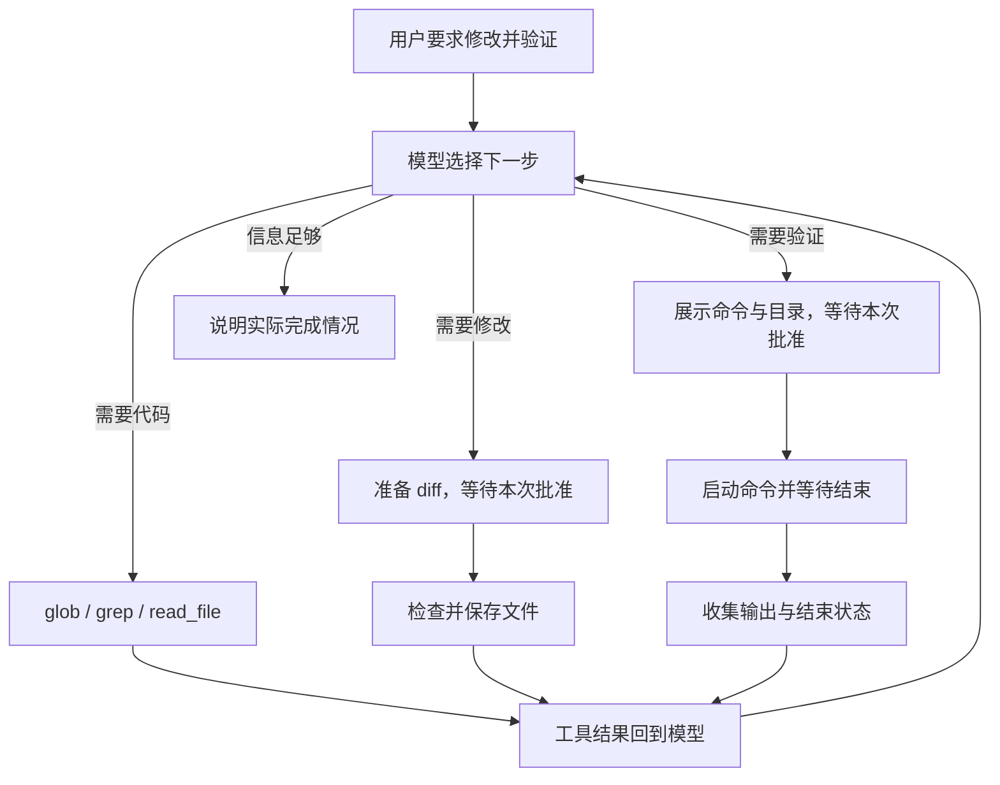

# 第 07 章：执行测试并读取结果

[07.1 执行测试并读懂结果](01-run-command/README.md) · [07.2 停止卡住或输出过多的命令](02-process-lifecycle/README.md) · [07.3 让搜索也使用受控子进程](03-ripgrep-search/README.md) · [练习与答案](EXERCISES.md)

第六章结束时，Agent 已经能读取代码、准备修改、展示差异，并在用户批准后保存文件。它也会检查审批期间的文件变化，避免继续使用已经过时的修改。

不过，文件成功保存，还不能说明这次修改解决了问题。模型可能漏掉一个分支，也可能没有发现其他代码依赖旧行为。我们平时会运行测试或编译，让程序检查修改；Agent 也需要拿到这些实际结果，才能判断接下来该继续改，还是向用户说明已经完成了什么。

## 这一章要完成什么

我们先让 Agent 运行一个小测试。测试失败时，工具把失败报告和退出码交回模型；模型可以读取相关代码、提出修改，等用户批准后再运行一次测试。这样，前面几章的读取和修改就有了后续反馈。

这次执行也会引出新的问题。测试可能一直等下去，命令可能不停打印日志，用户也可能在运行中按下 Ctrl+C。调用一个外部程序以后，Agent 还要负责它什么时候结束，以及结束后把什么结果交回来。

| 学习步骤 | 要解决的问题 | 对应小节 |
| --- | --- | --- |
| 运行测试，查看结果 | 命令输出的文字和退出码分别说明什么，怎样影响模型的下一步？ | [07.1 执行测试并读懂结果](01-run-command/README.md) |
| 停止没有正常结束的命令 | 不再等待时，怎样让已经启动的进程也停下来？ | [07.2 停止卡住或输出过多的命令](02-process-lifecycle/README.md) |
| 把同一种执行方法用于搜索 | 怎样把第四章的搜索移出主进程，让它也能超时和取消？ | [07.3 让搜索也使用受控子进程](03-ripgrep-search/README.md) |

## 命令结果怎样接回已有 Agent

本章加入 `run_command` 工具。模型提供命令和工作目录，程序先展示这次请求，用户批准后才启动命令。命令结束时，工具带回标准输出、标准错误输出和结束状态，Agent Loop 仍按原来的方式把结果交给模型。



比如一次测试失败，模型接下来可能读取报告指出的文件、修正实现，再提出新的测试命令。这个过程继续使用已有的工具循环，不需要在里面再写一套专门的“测试失败后重试”循环。工具负责提供实际结果，模型根据用户任务决定下一步，每次新的修改和命令仍要经过对应的审批。

我们也要区分两种批准。文件工具让用户查看将要保存的 diff；命令工具让用户查看将要执行的命令。程序不能仅凭 `npm test` 这个名称知道脚本的全部副作用，因此命令批准不等于批准了一份确定的文件差异。`cwd` 只说明命令从哪个目录开始执行，也不把它限制在这个目录内。真实的文件与网络隔离留到第 33 章实现。

## 学完以后，Agent 能做到哪里

本章结束后，Agent 可以把“读代码、改文件、运行测试、根据结果再判断”连成一次任务。命令和搜索有自己的运行上限，用户取消时，程序也会尝试收回本次启动的进程。

这里仍是普通终端中的非交互命令。等待用户输入的程序、需要完整终端环境的命令和长期后台服务，会在第 26 章接入 PTY 与任务管理。第 08 章先继续改善眼前的交互：模型逐段输出时及时显示，任务被打断后还能接着输入。

本章从第六章及章末练习的完成代码继续，保留“原文出现 N 次”的编辑错误。按三个小节的顺序构建即可；每一节的 `src/` 都包含当时完整的实现。

## 怎么阅读和检查

按 07.1、07.2、07.3 的顺序继续，先读原理，再完成各节的构建与实验。07.1 的加法示例故意保留失败起点；模型修复以后，再做实验需要把演示函数恢复成减法，测试断言仍保留加法要求。

完成 07.3、确认系统 `rg` 可用后，在完整配套仓库根目录检查本章：

```bash
npm run check:07
```

固定检查使用实际 shell、子进程与 rg，模型请求用本地可控输入模拟。它覆盖测试失败后修复再复测，以及拒绝、输出、超时、EOF、取消和搜索错误；真实模型的工具选择与回答需要另外观察。

本章还没有流式显示、长期日志或后台服务管理。第 08 章先接上流式输出和中断，第 15 章处理完整日志与上下文预算，第 26 章处理 PTY 与后台任务，第 33 章提供真实操作系统隔离。
