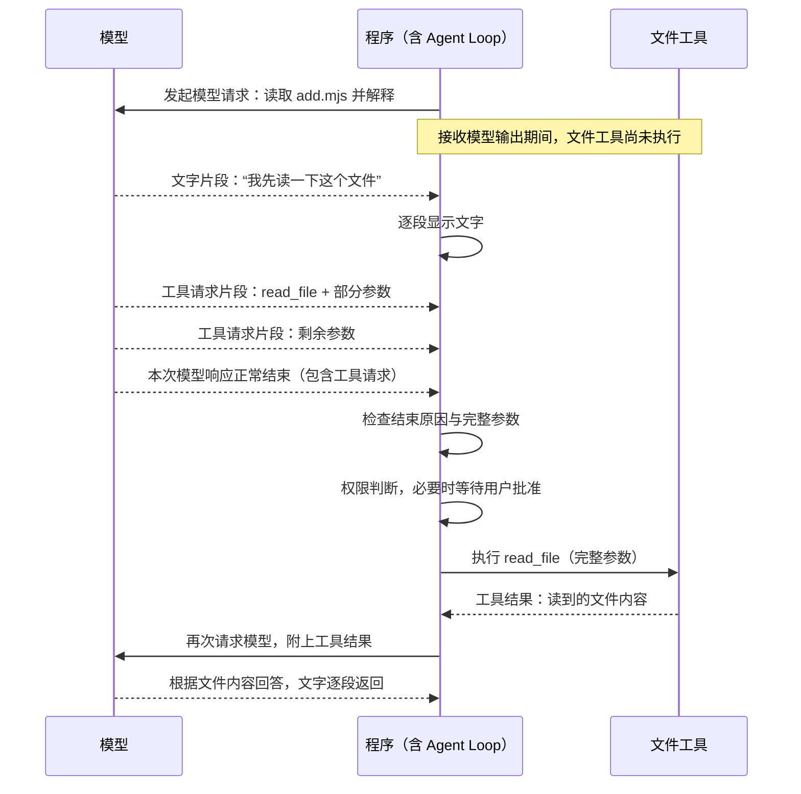

# 08.2 收齐工具参数，再执行

[上一节：让回答逐段显示](../01-text-stream/README.md) · [第 08 章首页](../README.md) · [本节源码](src/) · [下一节：中断当前任务，继续对话](../03-cancel-and-continue/README.md)

## 问题：文字可以边收边看，工具可以边收边执行吗

上一节让模型的文字逐段出现在终端。比如模型先发来“我来看看”，程序就能显示这几个字，不必等后面的话也写完。

现在，我们请 Agent 做一件需要工具的事：

> 请读取 `chapter-07-command-feedback/demo/add.mjs`，说明 `add` 函数做了什么。

模型可能先说“我先读一下这个文件”，再提出 `read_file` 请求。文字仍然可以马上显示，但工具名称和 JSON 参数也是通过流传来的，不一定一次到齐。假如参数刚收到 `{"path":"chapter-07-command-feedback/demo/`，文件名还没出现，程序就不能去打开文件。

**这一节要解决的就是：流式响应里的工具请求，怎样从陆续到达的片段，变成一份可以交给工具处理的完整请求。**

## 解决方案：先收齐模型的工具请求，再执行工具

Agent Loop 向模型发出“读取文件并解释内容”的请求后，模型会陆续返回文字和工具调用信息。程序收到文字就可以显示，收到工具名称和参数片段则先保存起来。这次模型响应正常结束后，程序再检查收齐的参数和读取权限，检查通过后才调用 `read_file` 读取文件。读取完成后，Agent Loop 把文件内容交回模型，让模型根据实际代码回答。



图中的“程序”把流式接收代码和 Agent Loop 合在一列：接收代码收齐模型响应，Agent Loop 安排工具执行，并把结果发回模型。**工具请求由模型提出，工具结果在工具执行后才产生。**

## 工作原理

### 先看一份读取请求怎样收完整

继续刚才读取 `add.mjs` 的任务。假设模型给这次调用起了一个 ID，叫 `read_add`，并把参数分成三段发来。接收过程可以简化成下面这样：

| 接收顺序 | 这次收到什么 | 程序此时做什么 |
| --- | --- | --- |
| 1 | 名称 `read_file`、ID `read_add`，以及参数 `{"path":"chapter-07-command-feedback/demo/` | 保存名称、ID 和第一段参数 |
| 2 | 参数继续：`add.mjs","offset":1,` | 接在第一段参数后面 |
| 3 | 参数继续：`"limit":20}` | 得到完整参数，继续等待响应结束 |
| 4 | 这次响应正常结束，结束原因是“工具请求” | 结束接收，检查完整请求 |

表中省略了接口的事件字段，并假定名称一次收到，重点是看参数怎样累积。实际的名称和参数怎样分段，由模型服务和传输决定。接收方要做的是按顺序保留这些内容，不能每来一段就调用一次 `read_file`。

三段参数拼起来以后，才得到下面这份 JSON：

```json
{"path":"chapter-07-command-feedback/demo/add.mjs","offset":1,"limit":20}
```

这时程序知道，模型想从 `add.mjs` 的第 1 行开始，最多读取 20 行。到这里还没有真正读取文件；程序只是把模型想做的事接收完整了。

### 参数看起来完整以后，还要等响应正常结束

表中第 3 步和第 4 步是两个不同的时刻。第 3 步的参数已经能被 `JSON.parse()` 解析，但这只能说明这一段文本是合法 JSON，不能证明整个模型响应已经正常结束。

模型接口还会单独给出**结束原因**，说明这次生成为什么停下。例如，“正常工具结束”表示模型完成了这次工具请求；“达到输出长度上限”则表示生成被截断。网络不再传来内容，也可能只是连接断了，不能当成模型说“我已经写完”。

所以，这里需要同时确认两件事：

- **响应正常完成了工具请求。** 即使刚才那份参数已经完整，后面却发生断流或长度截断，程序也不执行其中的工具。
- **收齐的参数确实是完整 JSON 对象。** 即使接口报告正常工具结束，模型仍可能写出缺少结尾的 JSON。程序要对原始参数运行严格的 `JSON.parse()`，并确认结果是对象，才能继续。

例如，参数最后停在 `{"path":"chapter-07-command-feedback/demo/add.mjs","offset":1,"limit":`，程序不会替模型猜一个行数，也不会补上右花括号。接收完成与 JSON 检查缺一不可：前者确认这次响应正常写完，后者确认收到的参数能够完整解析。

### 把完整请求交给工具，再把真实内容交给模型

刚才的请求正常收完以后，模型适配层还会确认调用 ID、工具名称和参数字符串都不是空值，然后把它们作为完整的 `ToolCall` 返回。主循环确认结束原因与工具请求相符，才进入原来的工具处理流程。

这时，权限层检查本次读取是否允许，`read_file` 再检查字段、行号、数量和文件路径。本例读取项目内的普通文件，按现有规则可以直接执行；如果换成需要批准的读取、文件修改或命令，程序仍会按原来的规则询问用户，必要时先展示预览。

这里还要分清**JSON 完整**和**工具参数合法**。如果模型把 `offset` 写成 `0`，这仍然是合法 JSON，却不是合法的起始行号。原有工具会拒绝读取，把参数错误作为工具结果交给模型，让模型决定是否重新提出请求。本节没有替代这些工具检查。

本例的 `path`、`offset: 1` 和 `limit: 20` 通过检查后，工具才真正打开文件。以当前演示文件为例，返回给模型的内容是：

```text
1: export function add(a, b) {
2:   return a + b;
3: }
[显示第 1-3 行；已到文件末尾]
```

主循环把这个结果与调用 ID `read_add` 放在一起，再次请求模型。这个 ID 让模型知道，返回的源码回答的是刚才哪一次读取请求。模型现在有了实际内容，就能解释：“`add(a, b)` 返回 `a + b`，传入两个数字时，结果是它们的和。”这次解释也按 08.1 的方式逐段显示。

这样，一次读取就走完了：模型提出请求，程序收齐并检查，工具读取文件，模型根据读取结果回答。流式响应改变了请求到达的方式，工具结果推动下一次模型决策的循环仍然相同。

### 如果模型一次想读两个文件，就分别收集两份请求

理解一次读取后，再把任务扩展成“读取 `add.mjs` 和 `add.test.mjs`，比较实现与测试要求”。模型可能在同一个响应中提出两次 `read_file` 调用。我们把同一个响应里的这些调用称为一批工具请求。

接收方现在需要知道每个片段属于哪一次调用。以 OpenAI Chat Completions 为例，工具片段带有 `index`，表示它在当前响应中是第几次调用。两份参数可能这样交错到达：

| 到达次序 | 工具序号 index | 本次收到的字段或参数片段 |
| --- | --- | --- |
| 1 | `0` | ID 为 `read_add`，名称为 `read_file`，参数为 `{"path":"chapter-07-command-feedback/demo/` |
| 2 | `1` | ID 为 `read_test`，名称为 `read_file`，参数为 `{"path":"chapter-07-command-feedback/demo/` |
| 3 | `0` | 参数继续：`add.mjs","offset":1,"limit":20}` |
| 4 | `1` | 参数继续：`add.test.mjs","offset":1,"limit":40}` |

程序把 `index = 0` 的片段放在一起，把 `index = 1` 的片段放在另一处，最后得到两份完整参数，不能把所有到达的片段拼成同一个字符串。后续片段可能只带 `index` 和新增参数，不再重复 ID 与名称，所以前面收到的内容也要保留。

`index` 帮助程序在接收时归拢片段，`id` 帮助模型在之后配对请求和结果。下一次模型响应又可能从 `index = 0` 开始，不能拿这个序号代替调用 ID。同一批请求的 ID 也不能重复，否则就分不清一条结果回答的是哪次调用；程序会拒绝这批请求，不会自行编一个新 ID 修补它。

这里仍然等**整个响应**收完。即使 `read_add` 的参数已经完整，只要 `read_test` 的 JSON 残缺、调用 ID 重复，或者响应异常结束，这一批工具就都不执行。模型适配层先检查整批调用的基础字段、ID 和 JSON 格式，再把列表交给主循环。

但后面的工具字段和权限检查仍是逐项进行的。例如，两份 JSON 都完整，第二份只是把 `offset` 写成 `0`，第一份读取仍可能已经执行，第二份才返回参数错误。本节保证的是整批请求已经完整收到，不是提前验证完所有工具的业务参数。

通过接收检查后，主循环还是按列表顺序逐个处理工具。片段交错到达不等于本地工具同时运行；受控并行留到第 27 章。

### 让 SDK 收集片段，在适配层交出完整结果

上面的收集工作放在 `models/client.ts` 中，也就是把不同模型接口转换成统一结果的地方。两种接口的事件格式不同，但主循环只需要拿到相同的完整 `ToolCall`，不需要了解每个参数片段来自哪种协议。

OpenAI 路径继续使用 SDK 的聚合能力：SDK 按调用序号累积名称和参数，`finalChatCompletion()` 返回整次响应的最终结果。我们从中取出完整的 `function.arguments` 字符串，再检查这一批调用。

Anthropic 路径在本节也改为流式请求。它用内容块组织响应：一个工具块开始，接收参数增量，随后结束；内容块按顺序出现，不采用上表那种工具参数交错方式。程序通过 SDK 的 `finalMessage()` 取得最终消息，并检查工具块和整条消息都已结束。

这里额外保留了一份原始参数文本。SDK 为了显示“目前已经收到哪些字段”，可能宽松解析尚未结束的 JSON，提前给出一个中间对象。例如，界面已经能看到 `path`，不代表后面的引号、字段和右花括号都到了。这样的中间对象不能用于执行。

因此，程序按内容块序号保存 `input_json_delta` 中的 `partial_json`，收完后把它们拼成的原始字符串交给严格的 `JSON.parse()`。SDK 的最终消息负责提供完整响应，原始文本检查负责确认参数没有缺失，两者各有用途。[Anthropic 流式消息说明](https://platform.claude.com/docs/en/build-with-claude/streaming)中可以看到这些参数增量事件。

如果接收过程中断流、被截断或被拒绝，程序就停止本轮，本批工具不会进入执行流程。本章关闭 SDK 自动重试，也不自动重跑整个任务，因为任务先前可能已经完成过文件修改，重跑可能再次执行这些操作。先前发生的修改不会回滚；本节失败时也还不会提交本轮临时历史，08.3 再解决中断后怎样保留已完成操作的记录。故障分类与重试会在第 34 章继续扩展。

## 本节改动文件

| 状态 | 文件 | 本节变化 |
| --- | --- | --- |
| CHANGED | [src/models/client.ts](src/models/client.ts) | 增加 Anthropic 流，统一结束原因，校验整批工具 ID 与完整 JSON |
| CHANGED | [src/agent/events.ts](src/agent/events.ts) | 模型结束事件带上结束原因与未完成状态 |
| CHANGED | [src/agent/agent-loop.ts](src/agent/agent-loop.ts) | 在权限与执行之前拒绝异常结束和内容不一致 |
| CHANGED | [src/ui/teaching-trace.ts](src/ui/teaching-trace.ts) | 显示拒绝、截断等未完成情况 |

## 动手构建

把 08.1 的完整 `src/` 复制到 `chapter-08-streaming-turns/02-complete-tool-calls/src/`。我们继续扩展 `models/client.ts` 中的协议适配，文字事件沿用上一节，工具执行仍交给已有 Agent Loop。

### 给完整结果补上结束原因

在 `models/client.ts` 中，保留 `Reply` 与 `Model` 接口，把原来的 `ModelResult` 类型替换为：

```ts
export type ModelFinishReason = "stop" | "tool_calls" | "length" | "refusal" | "unsupported";
// [CHANGED 08.2] 完整结果同时携带结束原因，主循环据此决定是否继续。
export type ModelResult = Reply & { toolCalls: ToolCall[]; finishReason: ModelFinishReason };
```

`finishReason` 把刚才讲的“为什么结束”带回主循环。两种接口的名称不同，我们先转换成程序自己的五种状态：

| 统一状态 | 含义与处理 |
| --- | --- |
| `stop` | 正常文字结束；应当没有工具请求 |
| `tool_calls` | 正常工具结束；应当有完整的工具请求 |
| `length` | 达到输出上限，响应未完成；本批工具不执行 |
| `refusal` | 请求被拒绝或过滤；本批工具不执行 |
| `unsupported` | 缺少结束原因，或返回了本节尚不支持的状态；停止本轮 |

OpenAI 的 `stop`、`tool_calls` 分别对应 Anthropic 的 `end_turn`、`tool_use`；Anthropic 的 `stop_sequence` 也归为正常文字结束，不过本课程没有设置自定义停止序列。网络中断由 SDK 抛出错误，不会被转换成正常结束。这些映射依据 [OpenAI 的结束字段](https://developers.openai.com/api/reference/resources/chat)和 [Anthropic 的流式结束事件](https://platform.claude.com/docs/en/build-with-claude/streaming)。

接着在 `normalizeToolCall()` 之后、消息转换函数之前，新增下面两个函数：

```ts
/**
 * 检查完整响应中的整批调用，避免先执行前一个、随后才发现后一个参数损坏。
 *
 * - 输入：基础字段已经归一化的 ToolCall 数组；空数组表示本次没有工具请求。
 * - 输出：全部通过时返回同一数组，检查本身不执行任何工具。
 * - 关键步骤：检查这一批 ID 是否重复，再用 JSON.parse 检查每份参数是完整 JSON 对象。
 * - 失败方式：重复 ID、无效 JSON、null、数组或其他非对象值都会抛出 UserFacingError。
 * - 职责边界：工具是否存在、对象允许哪些字段、字段值与路径是否合法，仍由权限和工具实现检查。
 */
// [NEW 08.2] JSON.parse 检查完整语法，不采用流中途的部分解析对象。
function validateToolCalls(calls: ToolCall[]): ToolCall[] {
  const ids = new Set<string>();
  for (const call of calls) {
    if (ids.has(call.id)) throw new UserFacingError("模型返回了重复的工具调用 ID，本批工具未执行。");
    ids.add(call.id);
    let value: unknown;
    try { value = JSON.parse(call.arguments); }
    catch { throw new UserFacingError("工具参数没有收齐或不是合法 JSON，本批工具未执行。"); }
    if (!value || typeof value !== "object" || Array.isArray(value)) {
      throw new UserFacingError("工具参数必须是完整 JSON 对象，本批工具未执行。");
    }
  }
  return calls;
}
```

```ts
/**
 * 把两种协议的结束原因转换成主循环认识的几种状态。
 *
 * - 输入：接口给出的原始结束原因，运行时也可能是未知值。
 * - 输出：普通结束、工具请求、长度上限、拒绝，或 unsupported；未知值不会默认为成功。
 * - 关键原因：收到最后一个片段只说明流停止，不能说明回答或工具参数已经正常完成。
 * - 职责边界：这里只转换值；网络中断由 SDK 抛错，是否接受结果由 Agent Loop 判断。
 */
// [NEW 08.2] stop_sequence 属于正常文本停止，本课程不设置自定义停止序列。
function finishReason(reason: unknown): ModelFinishReason {
  if (reason === "stop" || reason === "end_turn" || reason === "stop_sequence") return "stop";
  if (reason === "tool_calls" || reason === "tool_use") return "tool_calls";
  if (reason === "length" || reason === "max_tokens") return "length";
  if (reason === "content_filter" || reason === "refusal") return "refusal";
  return "unsupported";
}
```

第一段落实“参数完整”：检查整批 ID，并严格解析每一份参数；第二段落实“正常结束”：把接口的结束标记转换成上表中的状态。这里还不调用任何工具，工具字段和路径仍由原有工具检查。

### 从 OpenAI 的完整结果取得这一批调用

仍在 `requestResult()` 的 OpenAI 分支中，保留上一节的 `.stream()`、文字监听、`finalChatCompletion()` 和 `choice` 存在性检查。把后面的 `const toolCalls`、正常结束判断及 `return` 部分替换为：

```ts
    const reason = choice.message.refusal ? "refusal" : finishReason(choice.finish_reason);
    if (choice.message.tool_calls?.some((call) => call.type !== "function")) {
      throw new UserFacingError("接口返回了本章尚不支持的工具类型，本批工具未执行。");
    }
    const calls = reason === "tool_calls" || reason === "stop"
      ? (choice.message.tool_calls ?? []).filter((call) => call.type === "function")
        .map((call) => normalizeToolCall(call.id, call.function.name, call.function.arguments))
      : [];
    return {
      text: choice.message.content ?? "", toolCalls: validateToolCalls(calls), finishReason: reason,
      inputTokens: tokenCount(response.usage?.prompt_tokens),
      outputTokens: tokenCount(response.usage?.completion_tokens),
      truncated: reason === "length",
    };
```

响应被拒绝或截断时不接收其中的工具请求，但仍把结束原因交给主循环，让它显示相应说明。正常结束时，再将整批调用交给 `validateToolCalls()`。`stop` 却带工具，或者 `tool_calls` 却没有工具，稍后也会被主循环拒绝。

### 接入 Anthropic 流，并保留原始参数

把 `requestResult()` 中原来的整个 Anthropic 分支替换为下面这一段；它从 `const stream` 开始，直到函数末尾的 `return`，函数最后的右花括号保留：

```ts
  const stream = client.messages.stream({
    model, system: systemPrompt, messages: toAnthropicMessages(messages),
    tools: toolDefinitions.map((tool) => ({
      name: tool.name, description: tool.description, input_schema: tool.inputSchema,
    })),
    max_tokens: 2048,
  }, { signal });
  const argumentsByIndex = new Map<number, { json: string; initial: unknown; closed: boolean }>();
  let messageStopped = false;
  let invalidSequence = false;
  stream.on("text", (text) => onText?.(text));
  stream.on("streamEvent", (event) => {
    if (event.type === "message_stop") messageStopped = true;
    if (event.type === "content_block_start" && event.content_block.type === "tool_use") {
      if (argumentsByIndex.has(event.index)) invalidSequence = true;
      argumentsByIndex.set(event.index, { json: "", initial: event.content_block.input, closed: false });
    }
    if (event.type === "content_block_delta" && event.delta.type === "input_json_delta") {
      const part = argumentsByIndex.get(event.index);
      if (!part || part.closed) invalidSequence = true;
      else part.json += event.delta.partial_json;
    }
    if (event.type === "content_block_stop") {
      const part = argumentsByIndex.get(event.index);
      if (part) part.closed = true;
    }
  });
  const response = await stream.finalMessage();
  if (!messageStopped || invalidSequence) {
    throw new UserFacingError("模型流没有完整结束或工具片段顺序无效，本批工具未执行。");
  }
  const reason = finishReason(response.stop_reason);
  const calls: ToolCall[] = [];
  if (reason === "tool_calls" || reason === "stop") {
    for (const [index, block] of response.content.entries()) {
      if (block.type === "text") continue;
      if (block.type !== "tool_use") throw new UserFacingError("接口返回了本章不支持的内容类型，本批工具未执行。");
      const part = argumentsByIndex.get(index);
      if (!part?.closed) throw new UserFacingError("工具参数还没有结束，本批工具未执行。");
      // SDK 的部分 JSON 快照方便界面展示，但执行必须检查完整的原始参数字符串。
      calls.push(normalizeToolCall(block.id, block.name, part.json || JSON.stringify(part.initial)));
    }
  }
  return {
    text: response.content.filter((block) => block.type === "text").map((block) => block.text).join(""),
    toolCalls: validateToolCalls(calls), finishReason: reason,
    inputTokens: tokenCount(response.usage?.input_tokens),
    outputTokens: tokenCount(response.usage?.output_tokens),
    truncated: reason === "length",
  };
```

`argumentsByIndex` 为每个工具内容块保存三个信息：参数原文、开始事件里的初始输入，以及内容块是否结束。它不读取网络字节，`streamEvent` 已经是 SDK 解析后的协议事件。

`messageStopped` 表示收到整条消息的结束事件，`closed` 表示某一个工具块结束。两者都要检查，因为一个工具块先结束，不代表整条消息已经结束。片段找不到对应开始事件，或者工具块结束后仍继续追加参数，也会被判为无效顺序。

最终只取完整原始字符串进行 JSON 校验。没有参数增量时才使用开始事件里的输入对象；存在半份参数时不会退回初始对象，掩盖缺失的后半段。

### 让主循环按结束原因决定能否继续

在 `agent/events.ts` 的导入区增加：

```ts
import type { ModelFinishReason } from "../models/client.js";
```

把 `model_finish` 事件里的原 `outcome` 字段替换为下面两个字段，其他字段保留：

```ts
      outcome: "tools" | "final" | "empty" | "incomplete";
      finishReason: ModelFinishReason;
```

在 `agent/agent-loop.ts` 中，用下面这一段替换 `model_finish` 的发出位置，并把紧随其后的结束检查一起加入。它位于用量累计之后、原有 `if (result.toolCalls.length === 0)` 分支之前：

```ts
    emitAgentEvent(observer, {
      type: "model_finish",
      call: modelCall,
      // [CHANGED 08.2] 长度上限和拒绝不会伪装成成功回答。
      finishReason: result.finishReason,
      outcome: !["stop", "tool_calls"].includes(result.finishReason) ? "incomplete"
        : result.toolCalls.length > 0 ? "tools" : result.text.trim() ? "final" : "empty",
      toolRequests: result.toolCalls.length,
      text: result.text,
    });

    // [NEW 08.2] 正常结束与工具数量必须一致，完整响应才允许进入权限判断。
    if (result.finishReason === "length") throw new UserFacingError("回答达到输出上限，本次响应未完成；其中的工具请求不会执行。");
    if (result.finishReason === "refusal") throw new UserFacingError("模型拒绝了本次请求，本次响应中的工具请求不会执行。");
    if (result.finishReason !== (result.toolCalls.length ? "tool_calls" : "stop")) {
      throw new UserFacingError("模型结束原因与内容不一致，或当前接口返回了不支持的结束原因。");
    }
```

下面的工具循环继续沿用，没有新增按服务商判断的执行分支。程序在到达那段循环之前，已经确定整次响应完成，并且结束原因与工具数量一致。

最后，在 `ui/teaching-trace.ts` 的 `formatTeachingTrace()` 中，只替换 `model_finish` 分支：

```ts
  if (event.type === "model_finish") {
    const result = event.outcome === "tools"
      ? `${event.toolRequests} 个工具请求。`
      // [CHANGED 08.2] 已经看到文字，也可能仍是未完成的响应。
      : event.outcome === "incomplete"
        ? `响应未完成（${event.finishReason}），本次响应中的工具不会执行。`
      : event.outcome === "final"
        ? "最终回答，交给终端显示。"
        : "空结果，本轮将停止并报告错误。";
    return [`模型 < 第 ${event.call} 次决策`, `  返回：${result}`];
  }
```

这样屏幕上的步骤记录也会区分“已完成回答”和“响应未完成”，不会仅仅因为出现过文字，就告诉用户模型已经成功结束。

## 运行验证

在仓库根目录构建本节：

```bash
npm run lesson:08.2
```

先从同一目录运行贯穿本节的单文件任务。`add.mjs` 是上一章已有的演示文件：

```bash
hello-my-agent --prompt "请读取 chapter-07-command-feedback/demo/add.mjs，说明 add 函数做了什么。只读取，不修改，也不执行命令。"
```

预期先完成模型的工具请求，再出现 `read_file` 的权限与执行记录；读取结束后，模型根据文件内容回答。若文件仍是正文展示的版本，回答应说明函数返回 `a + b`。模型在读取前说了什么、文字分成多少段，不要求与正文示例相同。

再把任务扩展为读取两个文件：

```bash
hello-my-agent --prompt "请读取 chapter-07-command-feedback/demo/add.mjs 和 chapter-07-command-feedback/demo/add.test.mjs，再解释实现与测试要求是否一致。只读取，不修改，也不执行命令。"
```

模型可能在一次响应中提出两个读取，也可能分两次请求。两种情况都应先收完整响应，再出现对应工具的权限与执行记录；一次拿到两个调用时，工具仍依次执行。最后的比较要以实际读到的实现和测试为准，不预设文件有错误。

本节 Anthropic 也会逐段显示文字。配置好对应接口后，可给同一命令增加 `--provider anthropic` 观察；模型具体的分片和工具选择不要求逐字、逐次相同。

终端记录能帮助我们观察“请求完成以后才执行、结果回来以后再回答”。至于交错片段、残缺 JSON、重复 ID、长度截断和中途断流，不适合靠提示词碰运气。这些情况使用本章的本地模拟接口固定发送，检查失败后权限与工具入口没有被调用；观察一次真实回答不能证明所有失败分支都已覆盖。

## 本节完成后的 Agent

现在，两种接口都能边接收文字边显示，并在完整响应结束后返回统一结果。只有正常的工具结束与完整参数通过检查，已有权限、审批和工具执行才会继续。工具结果仍带着原调用 ID 回到模型，支持下一次决策。

接下来我们处理用户主动停下的情况。[08.3](../03-cancel-and-continue/README.md)会让 Ctrl+C 取消当前任务，同时保留终端和已完成操作的记录，让下一次输入能够接着说。
