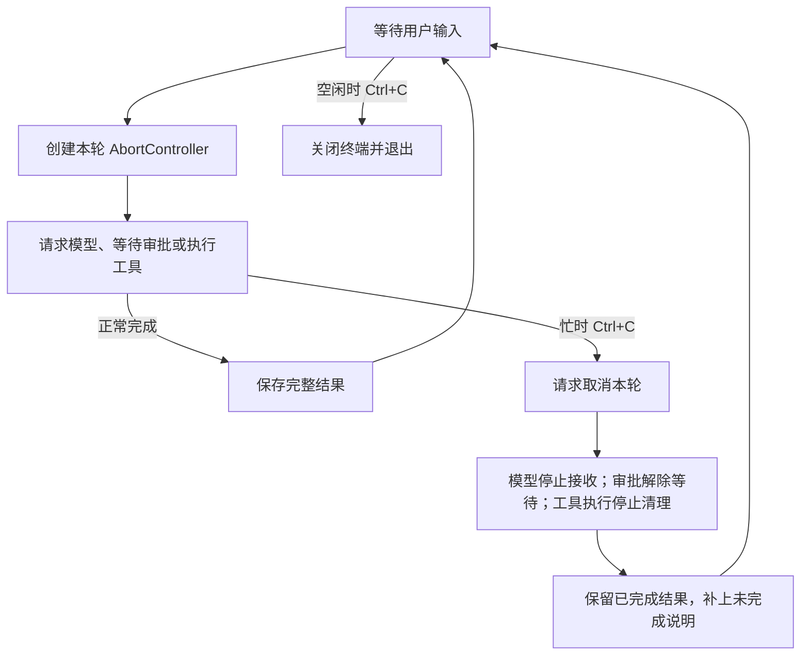

# 08.3 中断当前任务，继续对话

[上一节：收齐工具参数，再执行](../02-complete-tool-calls/README.md) · [第 08 章首页](../README.md) · [本节源码](src/) · [练习与答案](../EXERCISES.md)

## 问题：停下这次任务，为什么必须退出整个程序

经过前两节，模型的文字已经能逐段出现，工具也会等参数收齐后再执行。我们可以更早看见模型打算怎样处理任务，也就更容易在过程中发现方向需要调整。

比如 Agent 已经保存了一次修改，现在准备运行测试。我们这时只想先检查文件，不希望继续测试，于是按下 Ctrl+C。第七章会停止正在运行的请求与工具，同时退出程序；若还想接着说，就要重新启动，之前的内存历史也没有了。

我们希望 Ctrl+C 在忙的时候表示“这次先停下来”，回到输入提示后还能继续问。不过，仅仅去掉关闭终端的代码还不够：正在等待的审批要解除，工具要完成停止，已经保存的文件也必须继续出现在对话记录里。

## 解决方案：本轮任务有自己的取消信号，终端继续保留

本节让每次用户任务创建一个新的 `AbortController`。同一轮中的模型请求、审批等待和工具共用它的 `signal`；用户在任务运行时按 Ctrl+C，程序请求取消这一轮，等它退出以后再显示输入提示。

历史也要按实际进度保留。已经完成的工具调用和结果继续存在；一个工具已经开始却没有得到完整结果，要说明它可能执行了部分操作；尚未启动的工具则说明未执行。最后再记录本轮是被取消，或因其他错误而停止。



用户发出取消以后，不需要等模型再回答“已取消”。这是本地程序处理的控制信号。下一轮任务要等当前轮真正退出后才开始，避免上一轮命令还在运行，下一轮就开始修改同一批文件。

## 工作原理

### 控制器属于一轮任务，历史属于整个会话

`AbortController` 提供一个可以传递给异步操作的取消信号。调用 `abort()` 会把 `signal.aborted` 设为真，并通知监听这个信号的代码。它发出的是“停止请求”，具体怎样停止仍要由正在运行的操作配合。

这个状态不会自动恢复。一个已经取消的控制器不能拿来开始下一轮；否则新请求刚启动，就会看见 `signal.aborted === true`，立刻再次退出。因此，控制器在每轮开始时创建，在本轮结束后释放；下一次输入再创建新的控制器。

消息历史和本次会话的只读授权则留在终端循环外。取消只结束当前任务，不等于 `/reset`，也不意味着撤销授权。`/reset` 仍是用户明确清空对话的本地命令，文件修改也仍不会被它回滚。

终端用“当前有没有一轮尚未结束”区分 Ctrl+C 的含义。忙时请求取消并等待；空闲时关闭输入、退出程序。单次 `--prompt` 没有等待下一次聊天的阶段，取消后仍以退出码 `130` 结束。

### 发出取消以后，为什么还不能立即开始下一轮

模型、审批和工具等待的东西不同，收到同一个信号以后也会以不同方式退出。

| 当前正在做什么 | 取消时要解除的等待 |
| --- | --- |
| 接收模型响应 | 通知 SDK 停止本次网络请求，不再处理后续片段 |
| 等待用户审批 | 结束本次审批输入等待，不关闭整段对话的输入来源 |
| 执行命令或 rg 搜索 | 请求停止本次进程组，等待进程与输出管道清理 |
| 进行本地文件操作 | 在已经设置的可中断位置检查信号；已经完成的写入保留 |

第七章已经实现命令与搜索的停止清理。本节继续等待那个 Promise 结束，随后才允许下一轮输入进入 Agent Loop。取消不是跳过 `await`，也不是立即把当前函数当成成功返回。

这不承诺按下 Ctrl+C 的瞬间所有动作都消失。同步代码运行期间无法被 JavaScript 的取消回调抢占；已经完成的文件写入不会被 AbortSignal 撤销。程序能做的是停止后续工作、等待可控资源退出，并如实记下完成与未完成的部分。

### 审批取消以后，下一句话应该回到聊天

上一章让聊天和审批共用同一个输入来源，避免两个读取器争抢一行。现在输入来源要活得更久，而每一次“等用户回答”可以单独取消。

考虑这个过程：终端正显示“是否执行本次命令”，用户按 Ctrl+C，然后输入“先解释刚才的修改”。后一句应该成为新的聊天内容。如果旧的审批读取还挂着，它就可能先拿走这句话，把它当成一次拒绝，真正的聊天循环反而没有收到输入。

所以，输入层需要知道当前是哪一个等待者。审批等待绑定本轮信号，取消时解除这一项等待；读取器本身继续存在，下一轮聊天再成为新的等待者。取消与清理期间输入的内容不能悄悄留给过期审批使用。

这里也不能只用 `Promise.race()` 让外层先返回。输了竞争的那个 `lines.next()` 仍可能继续等着拿下一行，问题并没有消失。我们要取消的是输入层里的待处理读取，而不仅是“不再等待它的结果”。

另外还有尚未按回车的文字。假如用户在审批处输入了 `y`，还没回车就按 Ctrl+C，这个 `y` 只是输入框里的草稿，尚未构成批准。取消时除了清空已经排队的整行，终端还要清掉正在编辑的这一行。否则新的“先解释修改”可能接在旧 `y` 后面，变成另一句话。

本节先等输入提示重新出现，再输入新的任务。运行中补充要求、排队和撤回输入会在第 12 章建立明确的交互方式。

### 保留已经发生的操作，模型才能接着处理

以前每轮先把消息放到临时数组，只有拿到最终回答才一起加入历史。对于尚未执行工具的聊天，这能避免留下半次回答；但对于已经修改过文件的任务，整个临时数组一丢，下一轮模型就看不到真实发生的操作了。

假设模型先创建一个文件，再请求运行测试。文件已经创建成功，测试运行中用户取消。文件系统不会回到创建前，所以历史也不该让这次创建像从未发生过一样消失。否则用户接着说“继续检查刚才的文件”时，模型可能没有可用记录，甚至再次尝试创建。

本节在中断时保存已经确认的消息，并让完整工具请求与结果保持配对。用一个简化例子看保留的内容：

```text
user：创建文件，然后运行测试。
assistant：完整的 write_file 请求，ID=create_1。
tool(create_1)：文件已创建。
assistant：完整的 run_command 请求，ID=test_1。
tool(test_1)：执行已中断，可能已执行部分操作；继续前先核实。
assistant：本轮已在本地中断，以上结果保留；未完成部分不能当作成功。
```

最后一句是本地程序加上的状态说明，不是模型生成的最终结论。它让下一轮模型知道前面的工具结果为什么没有接着得到完整回答。

对于同一批工具请求，程序也要区分已经开始和尚未开始。例如第一条命令运行中被取消，第二条还在列表中等待，第一条的结果只能说可能做了部分工作，第二条则可以明确说“未执行”。不能把二者都写成成功，也不能因为没有正常结果就把它们删掉。

而尚未收完整的模型文字和工具参数没有这样的完整性。屏幕上可能留下“测试已经……”，但这半句不能进入历史冒充最终回答；半份参数也不能存成一条完整工具请求。上一节已经确认的完整调用可以保留，当前未完成的片段则停止在显示层。

即使中断前没有执行任何工具，原用户问题与本地中断说明也会保留。这样用户接着说“把刚才的解释再说短一点”时，模型仍能知道原来在讨论什么。

### 继续对话，不等于自动继续执行

中断之后，程序回到输入提示，等待用户提出下一步。它不会自动重发刚才的模型请求，也不会重跑历史里的命令。

用户可以说“先读取刚才的文件，确认内容，再告诉我做到哪里”。新一轮模型会收到保留的工具结果和中断说明，结合当前文件选择是否继续。对于“可能已执行部分操作”的命令，先核实状态比直接重复命令更可靠。

断流也采用相同的历史保留方式，只是本地状态说明记录的是失败。网络恢复以后，用户可以继续输入；这不等于从网络断开的字节位置继续下载，也不保证后续模型会生成相同答案。

本章的记录只保存在当前进程的内存里。正常退出以后恢复会话、保存中断状态与恢复时避免重复执行，会在第 13 章继续实现。

## 本节改动文件

| 状态 | 文件 | 本节变化 |
| --- | --- | --- |
| NEW | [src/ui/input.ts](src/ui/input.ts) | 聊天与审批共用一个可单独取消读取的输入来源 |
| CHANGED | [src/ui/terminal.ts](src/ui/terminal.ts) | 每轮创建取消控制器，忙时停止任务，清理结束后继续输入 |
| CHANGED | [src/agent/agent-loop.ts](src/agent/agent-loop.ts) | 中断时保留已完成工具记录，并补未完成调用与本轮状态 |

## 动手构建

把 08.2 的完整 `src/` 复制到 `chapter-08-streaming-turns/03-cancel-and-continue/src/`。前两节的流式接收和完整响应检查继续沿用，这次调整本轮生命周期、终端输入等待与中断时的历史保存。

### 让一次输入等待可以单独取消

新增 `ui/input.ts`，完整文件如下：

```ts
/**
 * 08.3 中断当前任务，继续对话 | [NEW] ui/input.ts
 *
 * 学习目标：让取消解除当前的输入等待，同时保留终端给下一轮使用。
 * 输入：readline 的 line / close 事件，以及可选的单轮取消信号。
 * 输出：read 返回一行或 EOF；取消则拒绝本次 Promise，不关闭 readline。
 *
 * 本文件局部流程（全局主流程见 agent/agent-loop.ts）：
 *   [NEW] line -> 有等待者？-- 是 -> 清理取消监听 -> 交给等待者
 *                           +-- 否 -> 放入队列
 *   read -> 已取消或已有等待者？-- 是 -> 抛错
 *                                +-- 否 -> 队列有行？-- 是 -> 取出一行
 *                                                     +-- 否 -> 已关闭？-- 是 -> EOF
 *                                                                      +-- 否 -> 等待
 *   等待 -> line -> 返回一行 / close -> EOF / abort -> 移除等待者并拒绝
 *   clear -> 丢弃排队行；dispose -> 结束等待并移除本文件监听
 *
 * [NEW] 表示本文件本节新增。聊天和审批只在轮到自己时调用 read，不能并行争抢输入。
 * 取消先清空 pending，再拒绝 Promise；下一次 read 因此不会留下旧审批等待者。
 * 输入队列只属于当前终端，没有持久化；dispose 不替调用方关闭终端。
 * 运行观察：审批时 Ctrl+C 后，新输入会被下一轮聊天读取，不会变成旧审批的答案。
 */
import type { Interface } from "node:readline";

// [NEW 08.3] 本文件以下实现均为本节新增。
/**
 * 为一个 readline 输入建立可以取消的单消费者读取入口。
 *
 * - 输入：调用方创建的 readline Interface；本函数立即订阅 line 和 close，保存提前到达的行。
 * - 输出：read 按顺序返回一行，关闭且队列已空时返回 EOF；clear 丢弃队列，dispose 清理监听。
 * - 等待方式：队列没有行时才保存一个 pending，line、close 或 abort 都会先解除它再结束等待。
 * - 失败方式：信号已取消或同时发起第二个读取时抛错；等待期间取消则以 signal.reason 拒绝 Promise。
 * - 职责边界：取消一个 read 不关闭终端；dispose 结束本地等待，readline 本身仍由创建者关闭。
 */
export function createLineReader(input: Interface) {
  const queue: string[] = [];
  let closed = false;
  let pending: { resolve: (value: IteratorResult<string>) => void; reject: (reason: unknown) => void; cleanup: () => void } | undefined;
  // line 只交给当前等待者；没有等待者时排队，保留提前送达的管道输入。
  const onLine = (value: string) => {
    if (!pending) { queue.push(value); return; }
    const waiter = pending;
    pending = undefined;
    waiter.cleanup();
    waiter.resolve({ value, done: false });
  };
  // EOF 结束当前等待；已经排队的行仍可以被后续 read 取完。
  const onClose = () => {
    closed = true;
    if (!pending) return;
    const waiter = pending;
    pending = undefined;
    waiter.cleanup();
    waiter.resolve({ value: undefined, done: true });
  };
  input.on("line", onLine);
  input.on("close", onClose);
  return {
    read(signal?: AbortSignal): Promise<IteratorResult<string>> {
      signal?.throwIfAborted();
      if (pending) throw new Error("同一终端只能有一个输入等待者。");
      if (queue.length) return Promise.resolve({ value: queue.shift()!, done: false });
      if (closed) return Promise.resolve({ value: undefined, done: true });
      return new Promise((resolve, reject) => {
        // 先移除旧等待者，再拒绝 Promise，下一次 read 才能安全接管输入。
        const abort = () => {
          pending = undefined;
          signal?.removeEventListener("abort", abort);
          reject(signal?.reason);
        };
        pending = { resolve, reject, cleanup: () => signal?.removeEventListener("abort", abort) };
        signal?.addEventListener("abort", abort, { once: true });
      });
    },
    clear() { queue.length = 0; },
    dispose() { onClose(); input.off("line", onLine); input.off("close", onClose); },
  };
}
```

`pending` 只保存当前的一次读取。正常收到一行、输入结束或取消，都会先移除等待者和对应监听，再让 Promise 结束。`queue` 接住没有等待者时已经到达的整行输入，避免管道一次给出多行时丢失后续内容。

`clear()` 只清空尚未取出的行，`dispose()` 只解除这个读取器安装的监听。是否关闭 `readline`，仍由创建终端的函数决定。因此，取消审批可以拒绝当前 `read()`，同时继续保留下一轮聊天要用的输入来源。

### 让审批使用本轮取消信号

在 `ui/terminal.ts` 的导入区增加：

```ts
import { createLineReader } from "./input.js";
```

把 `createApprovalHandler()` 第一个参数的类型由 `AsyncIterator<string> | undefined` 改为 `ReturnType<typeof createLineReader> | undefined`。函数内部只替换原来的 `await lines.next()`：

```ts
    const { value, done } = await lines.read(signal);
```

后面的 `signal.throwIfAborted()` 与 y / s / n 判断继续保留。这样取消先解除读取，再向核心抛出取消原因，不把它当成一次普通拒绝继续请求模型。

### 分开终端会话与当前任务

把同一文件中的 `startTerminal()` 替换为：

```ts
/**
 * 持续读取聊天输入，并把一次任务的取消与整个会话的退出分开。
 *
 * - 输入：已创建的 Model；用户文字、本地命令和 Ctrl+C 来自同一个终端。
 * - 输出：每轮显示回答或中断原因，结束清理后继续读取；/exit、EOF 或空闲时 Ctrl+C 退出。
 * - 关键步骤：普通提问各自创建 AbortController，本轮尚未结束时只保留这个 active。
 * - 取消处理：运行中 Ctrl+C 取消 active，丢弃排队行和未提交草稿；等 agentLoop 清理后才清空 active。
 * - 状态处理：历史由 Agent Loop 保存，失败与取消轮次也保留本地状态；/reset 才主动清空历史。
 * - 职责边界：继续对话不等于撤销旧操作；这里也不自动重试刚才的模型请求或工具。
 */
// [CHANGED 08.3] controller 属于当前回合，终端与历史属于整个会话。
export async function startTerminal(model: Model): Promise<void> {
  const history: Message[] = [];
  const terminal = Boolean(process.stdin.isTTY && process.stdout.isTTY);
  const input = createInterface({ input: process.stdin, output: process.stdout, terminal });
  const lines = createLineReader(input);
  const requestApproval = createApprovalHandler(lines, terminal);
  const sessionGrants = new Set<string>();
  let active: AbortController | undefined;
  let exiting = false;
  const stop = () => {
    if (active) {
      active.abort();
      lines.clear();
      // [NEW 08.3] 丢弃未按回车的审批草稿，避免 y 残留成下一轮的 ynext。
      if (terminal) {
        input.write(null, { ctrl: true, name: "u" });
        input.write(null, { ctrl: true, name: "k" });
        process.stdout.write("\n");
      }
      return;
    }
    exiting = true;
    input.close();
    process.exitCode = 130;
  };
  input.on("SIGINT", stop);
  process.on("SIGINT", stop);
  console.log("输入消息开始对话；运行中 Ctrl+C 取消本轮，空闲时 Ctrl+C 退出。/permissions 查看权限，/reset 清空历史，/exit 退出。");
  try {
    while (!exiting) {
      if (terminal) process.stdout.write(`${colorLabel("你", 36)} > `);
      const { value, done } = await lines.read();
      if (done) break;
      const text = value.trim();
      if (!text) continue;
      if (text === "/exit") break;
      if (handlePermissionCommand(text, sessionGrants)) continue;
      if (text === "/reset") {
        history.length = 0;
        console.log("已清空当前对话，下次提问将开始新的上下文。");
        continue;
      }
      active = new AbortController();
      const renderer = createTurnRenderer();
      try {
        const reply = await agentLoop(model, history, text, active.signal,
          renderer.observe, requestApproval, sessionGrants);
        renderer.reply(reply);
        process.exitCode = 0;
      } catch (error) {
        renderer.finish();
        if (active.signal.aborted) {
          console.log("已取消本轮，可以继续输入。已执行的操作不会自动撤销。");
          process.exitCode = 0;
        } else {
          console.error(`错误：${explainError(error)} 已保留本轮状态，可以继续输入；程序不会自动重试。`);
          process.exitCode = 1;
        }
      } finally {
        // 必须先等请求或工具完成清理，再允许下一轮使用新信号。
        active = undefined;
      }
    }
  } finally {
    active?.abort();
    lines.dispose();
    input.off("SIGINT", stop);
    input.close();
    process.off("SIGINT", stop);
  }
}
```

`active` 在一轮开始时创建，直到 `await agentLoop()` 成功或失败以后才清空。用户在等待清理时再次按 Ctrl+C，看到的仍然是忙状态；新一轮不会在清理完成前开始。

这里不会在忙时关闭整个输入。空闲时 Ctrl+C、`/exit` 或 EOF 才结束连续对话；最终的 `finally` 负责取消仍在运行的任务，并解除输入和信号监听。

`runSinglePrompt()` 仍以 `130` 表示用户取消，只把审批输入换成新读取器。在创建 `input` 之后，用下面这一行替换原来的异步迭代器：

```ts
  const lines = input ? createLineReader(input) : undefined;
```

再在它的 `finally` 中、`input?.off("SIGINT", stop)` 之前加入 `lines?.dispose();`。原有取消、显示器收尾和关闭输入继续保留。

### 记住正在执行哪个工具

在 `agent/agent-loop.ts` 的 `agentLoop()` 内，`pendingToolResults` 初始化之后增加：

```ts
  let executingCallId: string | undefined;
```

接下来用一个外层 `try` 包住原有的模型 `for` 循环及循环后的次数上限错误。原循环主体继续保留，在里面补上以下位置：

| 位置 | 增加的操作 |
| --- | --- |
| 每次权限检查结束，声明 `rejection` 和 `prepared` 后 | `signal.throwIfAborted();` |
| 等待审批的表达式返回后，发出 `approval_finish` 之前 | `signal.throwIfAborted();` |
| 原来的 `tool_start` 事件之前 | 先检查取消，再把 `call.id` 保存为 `executingCallId` |
| 成功执行后的 `turn.push({ role: "tool", ... })` 之后 | `executingCallId = undefined;` |
| `ToolError` 转成工具结果的 `turn.push(...)` 之后 | 同样清空 `executingCallId` |

工具开始处的完整替换片段是：

```ts
        signal.throwIfAborted();
        executingCallId = call.id;
        emitAgentEvent(observer, { type: "tool_start", sequence: toolSequence, call });
```

只有真正准备进入执行时才记录 ID，拿到成功结果或明确工具错误后再清空它。取消可能发生在异步权限检查或审批期间，所以这些 `await` 之后也要重新检查信号，避免仍按旧状态继续执行或保存授权。

### 在外层失败处理里保留本轮进度

在刚才的外层 `try` 末尾，加上下面的 `catch`。它接在原来的“模型调用次数用尽”错误之后，`agentLoop()` 最后用于结束函数的右花括号仍保留：

```ts
  } catch (error) {
    // [NEW 08.3] 保存完整调用及其状态；未收齐的模型输出从未进入 turn。
    // 每个批次单独配对：后续模型请求即使复用同一个 ID，也不能借用前一批的完成记录。
    const lastBatch = turn.map((message) => message.role === "assistant" && Boolean(message.toolCalls?.length)).lastIndexOf(true);
    const completed = new Set(turn.slice(lastBatch + 1).filter((message) => message.role === "tool").map((message) => message.toolCallId));
    for (const message of lastBatch < 0 ? [] : [turn[lastBatch]]) {
      if (message.role !== "assistant") continue;
      for (const call of message.toolCalls ?? []) {
        if (completed.has(call.id)) continue;
        turn.push({ role: "tool", toolCallId: call.id, isError: true,
          content: call.id === executingCallId
            ? "操作已开始，但本轮中断前没有取得完整结果。可能已发生部分修改，请先核实当前文件或进程状态，不要直接重试。"
            : "本轮在该工具启动前中断，这个调用未执行。" });
        completed.add(call.id);
      }
    }
    // 这条状态由本地程序生成，明确标注来源，不把它冒充模型完成的回答。
    turn.push({ role: "assistant", content: signal.aborted
      ? "[本地状态] 用户已取消本轮。已执行的操作不会自动撤销；继续前先核实工具结果。"
      : "[本地状态] 本轮因错误中断。已执行的操作不会自动撤销；继续前先核实工具结果。" });
    history.push(...turn);
    throw error;
  }
```

这段处理不会重新执行工具。它检查本轮已经存下的完整请求与结果，只为缺少结果的调用补中断说明，再把本地状态与已有消息一起加入历史。随后继续抛出原错误，让终端按取消或失败显示不同提示。

正常回答仍在原有成功分支提交。文字片段从未进入 `turn`，所以这里也不会把半句话补成模型回答。工具已经完成的结果则原样保留，下一次调用模型时会和新的用户问题一起发送。

## 运行验证

在仓库根目录构建本节：

```bash
npm run lesson:08.3
```

再启动连续对话：

```bash
hello-my-agent
```

### 回答还没结束时取消

输入一个需要较长解释、但不调用工具的问题。文字还在增加时按 Ctrl+C，预期本轮停止，终端给出中断说明，然后重新显示输入提示。继续输入一个简短问题，下一轮应能正常回答，不会刚启动就再次被取消。

这说明新的任务使用了新的取消信号。屏幕上先前已显示的文字可能仍在，但它没有被当成一份完整回答保存。

### 审批时取消，再继续聊天

请求一条只用于观察的长时间命令：

```text
请调用 run_command，cwd 为 .，command 为 node -e "setInterval(() => {}, 1000)"，timeout_ms 为 60000。先让我确认。
```

审批提示出现时，先键入 `y`，不要按回车，再按 Ctrl+C。此时尚未作出批准，命令应当没有启动。回到输入提示后，输入“刚才的命令有没有执行”并回车；这句话应进入新的聊天，不会被旧审批消耗，前面也不会残留一个 `y`。最终回答仍取决于模型，命令未启动这一行为由固定检查确认。

再提出同一请求，这次输入 `y` 并回车批准。命令开始运行后按 Ctrl+C，预期停止进程并完成清理，然后回到输入提示。这个例子没有修改项目文件，适合观察取消；它不能证明任意 shell 命令都能撤销自己的副作用。

### 区分单次取消与空闲退出

空闲、已经显示输入提示时按 Ctrl+C，程序应退出。单次模式也保留退出行为：

```bash
hello-my-agent --prompt "不调用工具，分几段详细解释模型、工具和审批各自负责什么。"
```

回答进行中按 Ctrl+C，程序停止以后，可在终端查看退出状态：

```bash
echo $?
```

预期为 `130`。它只表示这次命令被用户中断，不表示此前的文件操作已经回滚。

### 用固定输入检查历史

先完成[章末练习](../EXERCISES.md)，在临时项目里亲手创建文件、取消半次回答，再检查下一轮收到的消息。这个实验不调用真实模型，适合逐项观察已完成工具结果、未完成文字与中断说明的区别。

使用完整配套仓库并完成 08.3 后，也可以在仓库根目录运行：

```bash
npm run check:08
```

它用本地 HTTP 接口发送确定的 SSE 片段，检查两种协议、完整工具参数、异常结束和断流；还覆盖工具结果保存、输入等待取消与继续交流。真实终端的审批草稿清除也有单独验证。本章没有用真实模型 API 验证服务商的回答质量或账号配置。

## 本节完成后的 Agent

现在，取消信号属于当前用户任务，连续对话的终端与历史可以继续保留。模型流、审批输入和受控工具都会收到停止请求；程序等这一轮退出以后才开始下一轮，并保留已经完成的操作和未完成说明。

至此，Agent 不仅能读、改、测，还能让用户在过程中看见文字、停下任务、基于实际进度继续交流。先做[章末练习](../EXERCISES.md)，再从 [09.1](../../chapter-09-observable-runs/01-run-lifecycle/README.md)继续：文字停止、工具结束和整轮任务结束分别意味着什么，界面应该根据哪一个更新任务状态。
