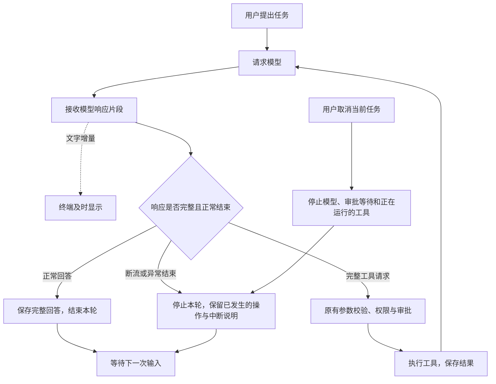

# 第 08 章：流式输出与任务中断

[08.1 让回答逐段显示](01-text-stream/README.md) · [08.2 收齐工具参数，再执行](02-complete-tool-calls/README.md) · [08.3 中断当前任务，继续对话](03-cancel-and-continue/README.md) · [练习与答案](EXERCISES.md)

第七章把读取、修改和测试接在了一起。Agent 可以运行测试，把失败报告交回模型，再根据实际结果继续处理。完成章末练习以后，每次命令还能在本地规定的范围内选择等待时间，用户在批准时会看到同一个值。

不过，任务运行时还有两种不太顺手的体验。模型写一段较长的解释，终端要等整段回答回来才一起显示；发现当前方向不合适时，按 Ctrl+C 又会结束整个程序。我们已经能让 Agent 做事，这一章继续解决做事过程中的交流。

## 这一章要完成什么

我们希望文字生成到哪里，就尽早显示到哪里。这样不用等最后一句写完，也能开始阅读前面的内容。这个变化看起来只是输出方式不同，却让程序第一次接触“还没收完的模型响应”：一段话可以先读，半份工具参数却不能马上执行。

接下来，程序还要允许用户停下本轮任务，保留终端并继续交流。假如文件已经保存，测试还没结束，取消并不会把文件变回原样。下一轮模型必须知道已经完成了什么、什么没有完成，才能接着处理。

| 学习步骤 | 我们要弄明白的事情 | 对应小节 |
| --- | --- | --- |
| 先显示收到的文字 | 服务端生成、网络分段与终端显示分别在做什么？ | [08.1 让回答逐段显示](01-text-stream/README.md) |
| 等工具请求完整 | 怎样区分“又收到一段参数”和“这次响应正常结束”？ | [08.2 收齐工具参数，再执行](02-complete-tool-calls/README.md) |
| 停下后继续交流 | 怎样传播取消、释放等待，并保留已经发生的操作？ | [08.3 中断当前任务，继续对话](03-cancel-and-continue/README.md) |

08.1 先让 OpenAI 兼容接口使用流式响应，Anthropic 暂时沿用完整响应；08.2 再把 Anthropic 接入同样的显示方式，并统一完整工具请求和结束原因的检查。两种接口最终都回到已有的 Agent Loop，不各自建立工具执行流程。

## 文字先显示，执行仍等完整结果

继续沿用上一章的任务：读取实现和测试，解释失败原因，经过批准后修改，再运行测试。模型在回答时，文字增量可以送到终端；模型要调用工具时，程序仍要先收齐并检查整次响应，再进入原有的参数校验、权限、预览和审批。



虚线表示只用于显示的文字；实线表示决定执行与保存的过程。终端已经显示了一句“接下来运行测试”，不代表测试已经开始。真正的执行仍由完整工具请求触发，并经过前几章建立的检查。

同样，屏幕上已经出现半段回答，也不代表本轮成功结束。程序要知道响应为何停止，才能决定保存完整回答、处理工具，还是告诉用户任务没有完成。

## 学完以后，Agent 能做到哪里

本章结束后，模型文字可以逐段显示；同一响应中的多个工具请求会各自收齐参数，并在完整检查后进入原有执行流程。连续对话中，忙时 Ctrl+C 停止本轮，空闲时 Ctrl+C 退出。停止过程中，程序先等待正在运行的工具完成清理，再接收下一轮任务。

取消和断流都不会自动重做任务。已经完成的工具调用与结果留在本次进程的消息历史里，未完成部分会有明确说明；下一次提问可以沿这些记录继续。这是内存中的连续对话，第 13 章才加入关闭程序后仍能恢复的会话文件。

本章仍使用普通终端文本。Markdown 标记按原文显示，不在流式接收期间反复排版。第 09 章会继续整理已经存在的事件，建立 JSONL 等输出约定；第 10 章再用 React / Ink 实现消息区、输入区和任务状态。

## 从哪里继续

本章从 [07.3](../chapter-07-command-feedback/03-ripgrep-search/README.md)及[第七章练习](../chapter-07-command-feedback/EXERCISES.md)的完成代码继续，保留 `run_command.timeout_ms`。按三个小节顺序阅读和构建；每节的 `src/` 都是当时完整的实现。

完成 08.3 后，再做[章末练习](EXERCISES.md)。练习使用本地可控的模型替身，亲手取消一次已经创建文件的任务，再检查下一轮实际收到的历史。它让我们不用真实模型，也能观察“停止任务”和“抹掉已经发生的操作”之间的区别。

使用完整配套仓库并完成本章后，在仓库根目录运行固定检查：

```bash
npm run check:08
```

检查通过后，再用 `npm run exercise:08` 检查已创建的练习文件。本章的固定输入不访问真实模型 API；真实服务的响应分段、工具选择和回答质量，要按各节实验另外观察。
