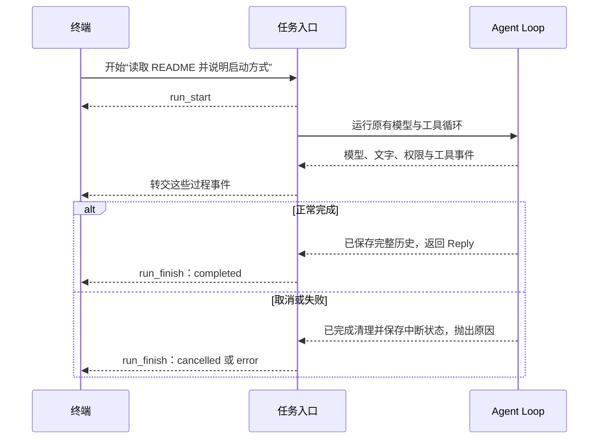

# 09.1 让界面知道任务何时结束

[上一章：流式输出与任务中断](../../chapter-08-streaming-turns/README.md) · [第 09 章首页](../README.md) · [本节源码](src/) · [练习与答案](../EXERCISES.md)

## 问题：文字停止增加，这一轮就完成了吗

先让 Agent 处理这样一个请求：

```text
请读取 README.md，告诉我这个项目怎样启动。
```

模型可能先返回一个 `read_file` 工具请求。程序读完文件，把读取结果交给模型，模型再写出说明。这期间会出现一次工具结束、两次模型响应结束，但用户提出的任务只结束一次。

第八章的终端已经能收到这些过程事件。不过，终端仍要另外等待 `agentLoop()` 返回 `Reply`，才能把本轮当作成功；如果它抛出错误，终端还要检查取消信号，区分用户取消与运行失败。过程走事件，整轮结果走另一套判断。

我们接下来要把执行过程交给不同界面。每个界面都重新判断这些返回值和错误，会重复相同的工作。更直接的办法是：程序已经知道这一轮怎样结束，就把这个结果也作为事件告诉界面。

## 解决方案：给一轮任务补上开始和结束

我们把从一次用户输入开始，到最终回答、取消或失败为止的过程称为一次 **run**，也就是本书所说的“一轮任务”。一轮任务内部仍可以多次请求模型、调用多个工具。

本节增加两个事件：`run_start` 告诉界面“这一轮开始了”，`run_finish` 告诉界面“这一轮结束了，以及为什么结束”。任务入口先发出开始事件，再等待原来的 Agent Loop；等它返回或完成失败处理以后，只发出一次结束事件。



图里的 `alt` 表示二选一的分支：正常完成就走上半部分，中断就走下半部分。两条路线最后都回到同一种结束事件，终端不用再从最后一句话猜测任务状态。

## 工作原理

### 模型结束、工具结束与任务结束分别说明什么

回到刚才的读文件任务。假设模型先请求一次读取，再给出最终回答，事件会经过下面这些关键步骤。表中省略了文字片段和部分权限细节，方便先看清一轮任务的范围。

| 先后顺序 | 程序刚刚完成的事 | 界面收到的事件 |
| --- | --- | --- |
| 1 | 开始处理用户这次输入 | `run_start` |
| 2 | 第一次模型响应已收齐，其中要求读取文件 | `model_finish`，`outcome: "tools"` |
| 3 | 文件工具已经返回读取结果 | `tool_finish` |
| 4 | 程序把工具结果带给模型，再次请求 | 第二个 `model_start` |
| 5 | 第二次模型响应已收齐，其中是最终回答 | `model_finish`，`outcome: "final"` |
| 6 | Agent Loop 完成检查并保存本轮历史 | `run_finish`，状态为 `completed` |

`tool_finish` 只说明一次工具调用取得了结果。模型还要读这份结果，才能回答“怎样启动”；所以工具结束后，任务通常还要继续。`model_finish` 也只说明一次模型响应已经结束，这份响应可能是工具请求，甚至可能由于长度限制而未完成。

即使已经收到最终回答，核心还要检查取消并保存本轮历史。任务入口等这些工作结束后，才发出 `run_finish`。界面因此有了一个明确的依据，可以用这个事件更新整轮任务状态。

### 三种结束状态，来自程序已经走过的分支

一轮任务只能有一个最后结果：

| 结束状态 | 程序怎样得到它 | 随事件交出的内容 |
| --- | --- | --- |
| `completed` | Agent Loop 正常返回 | 完整 `Reply`，含回答与本轮用量 |
| `cancelled` | 本轮信号已取消，核心结束等待和清理 | 供界面显示的取消说明 |
| `error` | 核心因其他错误停止 | 整理后的失败说明 |

任务入口负责把这三条路线合到一起。开始时发出 `run_start`，等待过程中继续转交原有事件；正常返回与捕获异常是互斥的分支，各自发出一次 `run_finish`。这样就不会把“工具结束”“模型结束”和“整个任务结束”都当作整轮成功。

这里的 `completed` 表示本轮执行正常结束，得到了最终回答。它不能证明模型的答案一定正确，也不能证明每个工具都成功。例如工具被拒绝后，模型可以如实解释无法完成某项操作，这一轮对话仍然可能正常结束。判断具体工具的结果，还要看相应工具和权限事件。

### 为什么把这层放在 Agent Loop 外面

Agent Loop 已经负责模型判断、工具执行和历史保存。它知道什么时候可以返回完整回答，什么时候应该停止并抛出错误。我们不用把这些逻辑再写一遍，只在外面增加一个 `runAgent()` 入口，把返回和抛错整理成结束事件。

这种包装保留了已有职责：核心继续完成任务，新入口描述整轮开始与结束。本节先保留终端等待 Promise 的显示方式，让 `runAgent()` 继续返回完整回答、继续向外抛出错误；与此同时，事件观察者已经能收到整轮结果。下一节再让终端从事件流里取出这个结果。

这样分两步改动，先明确程序应报告什么，再改变界面怎样接收。后续更换终端时，新的界面也能使用这一入口，不必进入核心里找“成功时在哪里打印”。

原来的事件观察者仍是显示旁路。它收到事件副本，可以选择打印，也可以忽略；观察者自身的异常不会被当作模型或工具失败。第 09.2 节会继续处理“消费者需要异步等待”和“消费者主动停止接收”的情况，那是运行入口要管理的另一层关系。

### 结束事件要等取消清理完成

第八章已经区分了“请求取消”和“本轮已经退出”。用户按下 Ctrl+C 时，取消信号立即发出；正在执行的命令还要完成停止和输出清理，核心还要保存已经发生的操作。

所以，终端不能刚调用 `abort()` 就发出 `run_finish`。它只负责请求停止，任务入口继续等 Agent Loop 退出，再报告 `cancelled`。连续对话也仍然等到这里才接受下一轮任务。

取消只结束这一轮，不撤销此前的文件修改。开始和结束事件描述的是运行状态，不是文件回滚记录；已完成工具结果和中断说明仍按第八章的规则保留。

## 本节改动文件

| 状态 | 文件 | 本节变化 |
| --- | --- | --- |
| NEW | [src/agent/run.ts](src/agent/run.ts) | 包装原有循环，报告整轮开始和唯一结束状态 |
| CHANGED | [src/agent/events.ts](src/agent/events.ts) | 增加 `run_start` 和三种结果的 `run_finish` |
| CHANGED | [src/ui/terminal.ts](src/ui/terminal.ts) | 两个终端入口改为调用 `runAgent()` |
| CHANGED | [src/ui/teaching-trace.ts](src/ui/teaching-trace.ts) | 忽略新增的整轮事件，避免把它们当作工具步骤显示 |

## 动手构建

从 08.3 的完整 `src/` 继续，目标目录是 `chapter-09-observable-runs/01-run-lifecycle/src/`。第八章练习没有修改正式源码，这里保留原有的流式模型、工具循环、审批与取消处理。

### 先让事件类型认识整轮任务

在 `agent/events.ts` 中，把模型类型的导入改为同时导入 `Reply`：

```ts
import type { ModelFinishReason, Reply } from "../models/client.js";
```

然后把 `AgentEvent` 开头到 `text_delta` 的部分替换成下面这段。后面的 `model_start`、`model_finish` 和工具事件分支接在它后面，保持原样：

```ts
// [CHANGED 09.1] 整轮任务开始与结束也使用事件通知。
export type AgentEvent =
  | { type: "run_start" }
  | { type: "run_finish"; outcome: "completed"; reply: Reply }
  | { type: "run_finish"; outcome: "cancelled" | "error"; message: string }
  | { type: "text_delta"; call: number; text: string }
```

`completed` 分支有 `reply`，取消与错误分支有 `message`。先检查 `outcome`，TypeScript 就能知道接下来可以访问哪组字段；界面也不会误把失败说明当成完整回答。

### 在原有循环外报告开始和结束

新增 `agent/run.ts`，完整文件如下：

```ts
/**
 * 09.1 让界面知道任务何时结束 | [NEW] agent/run.ts
 *
 * 学习目标：给整轮任务一个明确的开始和结束通知，区分它与单次模型请求。
 * 输入：模型、历史、用户问题、取消信号、可选观察者、审批函数和会话只读授权。
 * 输出：run_start 与一次 run_finish 通知；成功返回 Reply，失败继续抛出原因。
 * 状态：核心仍负责成功或中断后的历史提交；外层通知不新增工具副作用，也不负责回滚。
 *
 * 本文件局部流程（全局主流程见 agent/agent-loop.ts）：
 *   [NEW] run_start -> 调用原有 agentLoop -> 成功？-- 是 -> run_finish/completed -> 返回 Reply
 *                                                   +-- 否 -> 选择取消原因或原错误
 *   信号已取消且原因不是 UserFacingError？-- 是 -> run_finish/cancelled -> 抛出原因
 *                                        +-- 否 -> run_finish/error -> 抛出原因
 *
 * 整轮可能包含多次模型请求；model_finish 只说明一次模型返回，run_finish 才说明整轮结束。
 * 事件发送复用 emitAgentEvent，观察者直接抛错不会成为任务失败；同步观察仍会占用当前线程。
 * 运行观察：普通任务收到开始、模型与工具过程、结束；取消或失败也有对应的结束状态。
 */
import { agentLoop } from "./agent-loop.js";
import { emitAgentEvent, type AgentObserver } from "./events.js";
import { explainError, UserFacingError } from "../errors.js";
import type { Message, Model, Reply } from "../models/client.js";
import type { ApprovalHandler } from "../permissions/policy.js";

// [NEW 09.1] 本文件以下实现均为本节新增。
/**
 * 为一次完整任务通知开始和结束，让消费者不用猜最后一次模型响应是否已经结束任务。
 *
 * - 输入：沿用核心所需的模型、历史、问题、取消信号，以及观察者、审批函数和会话只读授权。
 * - 输出：先发 run_start；核心返回后发 completed 结束事件，再原样返回 Reply。
 * - 失败方式：核心抛错时优先采用已取消信号的 reason，发结束事件后继续抛出同一原因。
 * - 状态区分：信号已取消且原因不是 UserFacingError 时记为 cancelled；其余失败记为 error。
 * - 职责边界：本函数不重新实现模型与工具循环；历史提交、审批和资源清理由原有核心及工具负责。
 * - 观察限制：观察者抛错会被事件函数捕获；同步回调仍占用当前线程，并不代表显示可以无限耗时。
 */
export async function runAgent(
  model: Model, history: Message[], input: string, signal: AbortSignal,
  observer?: AgentObserver, requestApproval?: ApprovalHandler,
  sessionGrants: Set<string> = new Set(),
): Promise<Reply> {
  // 先通知开始，即使传入的信号已经取消，外层仍能说明这次任务的结束状态。
  emitAgentEvent(observer, { type: "run_start" });
  try {
    const reply = await agentLoop(model, history, input, signal, observer, requestApproval, sessionGrants);
    emitAgentEvent(observer, { type: "run_finish", outcome: "completed", reply });
    return reply;
  } catch (error) {
    // 内部停止也可能使用取消信号；UserFacingError 表示需要报告的失败，不能全算用户取消。
    const reason = signal.aborted ? signal.reason : error;
    const cancelled = signal.aborted && !(reason instanceof UserFacingError);
    emitAgentEvent(observer, { type: "run_finish", outcome: cancelled ? "cancelled" : "error",
      message: cancelled ? "本轮任务已取消。" : explainError(reason) });
    throw reason;
  }
}
```

先看 `await agentLoop(...)`：模型、历史、取消信号、观察者和审批函数都原样交给核心。这个包装没有接管工具执行，也没有重新保存历史。

正常返回以后，程序把同一份 `Reply` 放进结束事件，再作为返回值交给旧调用方。失败时先报告结束事件，再继续抛出原因。这里预留了一种区分：取消信号也可以由程序因故障发出，所以带 `UserFacingError` 的停止原因记为错误；下一节的队列超限会用到它。

### 让两个终端入口使用新包装

在 `ui/terminal.ts` 中，把原来导入 `agentLoop` 的语句替换为：

```ts
// [CHANGED 09.1] 整轮通知由 runAgent 包装，Agent Loop 的决策逻辑沿用。
import { runAgent } from "../agent/run.js";
```

`startTerminal()` 中原来调用 `agentLoop()` 的两行，替换为：

```ts
// [CHANGED 09.1] 同一个核心外包一层整轮通知，审批与历史参数原样传入。
const reply = await runAgent(model, history, text, active.signal,
  renderer.observe, requestApproval, sessionGrants);
```

`runSinglePrompt()` 中原来调用 `agentLoop()` 的整段，替换为：

```ts
// [CHANGED 09.1] 单次模式也发送整轮开始和结束通知。
const reply = await runAgent(
  model,
  [],
  prompt,
  signal,
  renderer.observe,
  createApprovalHandler(lines, interactive),
  new Set<string>(),
);
```

两处后面的 `renderer.reply(reply)`、错误处理和清理保持原样。本节仍用返回值显示最终用量，下一节再切换到从事件流取得 `Reply`。

最后，在 `ui/teaching-trace.ts` 的 `formatTeachingTrace()` 函数开头、判断 `text_delta` 之前加入：

```ts
// [CHANGED 09.1] 整轮事件供界面判断任务状态，不重复打印最终正文。
if (event.type === "run_start" || event.type === "run_finish") return [];
```

教学步骤只整理模型、权限和工具过程。新增的整轮事件先返回空数组，不额外打印一份最终回答；事件本身仍然发送给观察者。

## 运行验证

在仓库根目录构建本节：

```bash
npm run lesson:09.1
```

再运行一次读取任务：

```bash
hello-my-agent --prompt "请调用 read_file 读取 README.md，告诉我这个项目怎样启动。"
```

观察读取之后是否还有第二次模型请求，以及最后的完整回答和用量。工具结束后继续请求模型，说明工具结果仍沿原来的路线回到模型；本轮用量只在任务完成后输出。模型可能选择不同的回答措辞，具体输出不要求与正文相同。

也可以启动连续对话：

```bash
hello-my-agent
```

输入一个需要较长回答的问题，在文字仍在增加时按 Ctrl+C。预期本轮完成清理后显示取消说明，再次出现输入提示；继续输入一个简短问题，应能正常回答。这个体验与第八章相同，新入口既保留原返回行为，也报告统一结束事件。

事件的具体数量、唯一结束状态与错误分支会在本章固定检查中使用确定输入验证。真实模型的回答不能单独证明“一轮只发一次结束事件”。

## 本节完成后的 Agent

现在，界面可以从事件中知道一轮任务何时开始，以及它是完成、取消还是失败。模型、工具和审批仍各有自己的过程事件，任务入口只在它们外面补上整轮范围。

事件目前还是通过同步回调送到界面。若界面写入一条记录需要等待，后面到来的事件该放在哪里？[下一节](../02-event-stream/README.md)让消费者使用 `for await`，按顺序接收这一轮事件。
