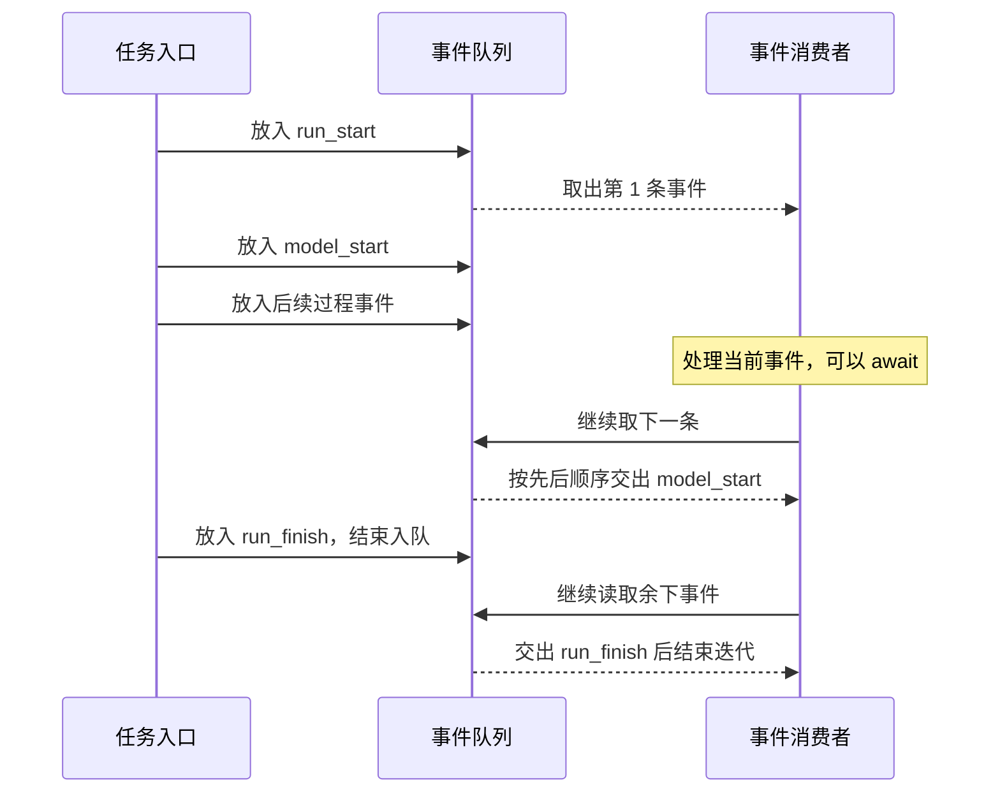

# 09.2 按顺序接收执行事件

[上一节：让界面知道任务何时结束](../01-run-lifecycle/README.md) · [第 09 章首页](../README.md) · [本节源码](src/) · [练习与答案](../EXERCISES.md)

## 问题：界面还没处理完，下一条事件已经来了

上一节给“读取 README 并说明启动方式”这轮任务补上了开始和结束。终端现在能根据同一组事件，显示文字、工具状态和整轮结果。

目前核心一产生事件，就同步调用一次观察者。直接打印一行文字时，这样很方便；但下一节要把事件交给输出管道，管道可能暂时写不进去，需要等待。如果把观察者改成 `async`，原来的调用方也不会自动等待它返回的 Promise，后面的事件仍可能继续到来。

我们需要在“事件已经产生”和“界面已经处理完”之间留出一个地方：先暂存后续事件，让消费者完成当前一条后，再取下一条。

## 解决方案：事件先排队，消费者逐条读取

本节增加 `streamAgentRun()`。它继续调用上一节的任务入口，但把回调收到的事件按顺序放进队列，再以异步迭代的方式提供给界面。

**异步迭代**可以理解成“一条条读取，中间允许等待”。消费者用 `for await` 取出一条事件，处理完再取下一条；队列暂时为空时，它就等下一条到来，不用反复查询任务有没有新进度。



图中画的是正常结束。如果本轮失败，队列也先交出 `run_finish`，让消费者得知失败状态；已经排队的事件读完后，迭代再抛出原因，让调用方进入原有的错误处理，不能继续当作成功执行。

这里没有启动另一个线程，也没有让工具并行运行。Agent Loop 仍按原来的顺序请求模型、执行工具；队列只是让事件产生与事件显示各自前进。

## 工作原理

### 一条事件要带上它属于哪轮、排在第几条

连续对话会执行多轮任务。假如我们记录了几次 `tool_start`，仅看事件名称，无法知道它们是否属于同一轮。因此，队列不直接交出事件，而是在外面加一层记录信息。本书把这一层叫作**事件封套**。

下面是一条开始事件的示例。`runId` 在真实运行时由程序生成，这里的文字只用于说明字段：

```json
{
  "version": 1,
  "runId": "本轮生成的唯一编号",
  "sequence": 1,
  "event": { "type": "run_start" }
}
```

`version` 表示这份输出采用第 1 版格式，方便未来扩展时识别不同结构。`runId` 在同一轮保持不变，下一轮重新生成。外层 `sequence` 从 1 开始，每加入一条事件就增加 1；消费者可以据此查看和检查接收顺序。

工具事件里原本也有一个 `sequence`，它表示“本轮第几次工具请求”，含义不同。比如第 5 条事件是第 1 次工具开始，第 6 条事件是同一次工具结束：外层编号分别是 5 和 6，事件里的工具编号都为 1。

| 字段位置 | 编号的对象 | 用途 |
| --- | --- | --- |
| `record.sequence` | 每一条事件 | 判断事件先后 |
| `record.event.sequence`，仅相关工具事件存在 | 每一次工具请求 | 配对同一次工具的权限、审批、开始与结果 |

章末练习会使用第二个编号配对工具开始与结束。若混合记录多轮任务，还要同时使用 `runId`，避免把两轮里的“第 1 次工具”当作同一次调用。

### 消费者在哪里等待

读一轮事件时，消费者的结构会像这样：

```ts
for await (const record of streamAgentRun(/* 本轮的模型、历史、输入与信号 */)) {
  // 处理完当前 record，才会取下一条。
  // 需要等待输出时，可以在这里 await。
}
```

这是一段结构示意，完整参数在后面的构建步骤中给出。`for await` 不会把事件一次性收集成数组；每次只取出当前可用的一条。循环体里的等待结束后，它再向队列要下一条。

队列使用 Node.js 已有的 `Readable`，并打开 `objectMode`，让它存放事件对象。`Readable` 原生支持 `for await`，不需要再实现一套等待通知。[Node.js 文档](https://nodejs.org/docs/latest-v22.x/api/stream.html#readablesymbolasynciterator)说明了这一读取方式。

核心收到的观察者仍然是一个同步函数，只做“给事件编号并放进队列”。后面的异步等待留给消费者，不改变每个模型与工具调用的写法。

每次调用 `streamAgentRun()` 都有自己的队列、编号和取消控制器。上一轮的等待不会被拿到下一轮使用；会话历史仍由终端保存并传入，两者的生命周期与第八章一致。

### 消费者长期跟不上，不能一直往内存里塞

队列解决了短暂的速度差，但没有让慢消费者突然变快。模型不断发出文字片段，消费者却长时间写不进去，待处理事件就会越来越多。

本节把普通待处理事件的上限设为 128 条。达到上限后，如果还有新事件要入队，运行入口请求取消本轮，并报告“事件接收速度跟不上执行速度”的失败。结束事件可以额外占用一条位置，让消费者在读取现有事件后仍能知道为什么停止。

这次停止由程序发起，所以结束状态和保存的历史都记为错误，不能写成“用户主动取消”。本节用已有的 `UserFacingError` 表示这种可解释的失败，并在核心保存中断说明时区分它。

这不是把整个核心改成“每发一条事件都等界面确认”。原有观察回调仍然不等待，队列只吸收有限的速度差；超过这个范围就停止任务。第九章因此不需要改动所有事件产生位置，也不会因为一个不再读取的输出端一直占用内存。

128 限制的是排队事件数量，不是字节数。单条事件可能带有工具参数或结果，仍要遵守已有的工具与内容上限；这组限制不能合并解释成“所有内存最多多少字节”。

### 不再读取以后，也要停下这一轮

消费者可能在 `for await` 中途 `break`，也可能因为自己的输出失败而退出。此时如果 Agent Loop 还在后台请求模型或执行命令，用户会看不到后续动作。

所以，事件流用自己的取消控制器管理本轮。消费者退出读取时，流的清理分支会请求取消，并继续等待核心完成资源清理。只有等到这一轮退出，调用方才完成离开事件流。

Node.js 在异步迭代提前 `break`、`return` 或抛错时，会销毁正在读取的 `Readable`。销毁队列只关闭了接收事件这一侧，本书仍要自己取消模型与工具，并 `await` 核心退出；不能把“队列已关闭”当作“命令进程已结束”。

外部 Ctrl+C 也会传到同一轮；内部为了停止当前流而取消时，则不会修改下一轮将使用的控制器。取消仍然是协作停止，已经完成的文件操作不会因此撤销。

“观察者打印失败不影响核心”与这里并不矛盾：前者是某个旁路观察函数抛错；后者是本轮消费者已经明确离开，或本轮队列已经无法继续接收，运行入口需要结束自己负责的任务。

### 审批仍然走原来的等待通道

观察到 `approval_start`，表示程序已经进入审批阶段。消费者可以更新显示，但不能对这个事件返回一个 `true` 就批准工具；事件迭代本身没有这样的返回约定。

Agent Loop 仍直接等待原来的审批函数。审批函数显示预览、读取用户选择，把 `allow_once`、`allow_session` 或 `deny` 返回给核心。核心收到允许后才执行工具，把结果回传模型，再继续生成最终回答。

因此，换成异步读取事件以后，权限和工具路线保持原样。我们改变的是进度怎样送到界面，不是用户怎样授予执行权限。

## 本节改动文件

| 状态 | 文件 | 本节变化 |
| --- | --- | --- |
| NEW | [src/agent/run-stream.ts](src/agent/run-stream.ts) | 事件加上封套，进入有限队列，以异步迭代送达；退出时取消并等待清理 |
| CHANGED | [src/ui/terminal.ts](src/ui/terminal.ts) | 从事件流驱动显示器，并从正常结束事件提取完整回答 |
| CHANGED | [src/agent/agent-loop.ts](src/agent/agent-loop.ts) | 保存中断说明时，区分用户取消与输出积压造成的失败 |

## 动手构建

把 09.1 的完整 `src/` 复制到 `chapter-09-observable-runs/02-event-stream/src/`。本节在任务入口外增加事件流，再让终端从流中读取事件。

### 用原生队列提供一轮事件

新增 `agent/run-stream.ts`，完整文件如下：

```ts
/**
 * 09.2 按顺序接收执行事件 | [NEW] agent/run-stream.ts
 *
 * 学习目标：用原生 Readable 暂存事件，让消费者按自己的读取进度接收记录。
 * 输入：模型、历史、问题、外部取消信号、审批函数与会话只读授权。
 * 输出：带 version、runId、sequence、event 的异步记录流；任务失败会在已入队记录之后抛出。
 * 状态：队列与序号属于一轮；历史由核心更新，停止消费不撤销已发生的工具操作。
 *
 * 本文件局部流程（全局主流程见 agent/agent-loop.ts）：
 *   [NEW] 首次拉取 -> 创建队列、runId 和合并信号 -> 启动 runAgent
 *   收到事件 -> run_finish？-- 是 -> 使用预留位置入队
 *                           +-- 否 -> 已发生送达错误？-- 是 -> 不再入队
 *                                                      +-- 否 -> 已有 128 条？-- 是 -> abort(UserFacingError)
 *                                                                           +-- 否 -> 加序号入队
 *   for await -> yield 下一条；runAgent 结束 -> queue.push(null)
 *   队列读完 -> 等 done -> 任务失败？-- 是 -> 抛出原因
 *                                  +-- 否 -> 结束迭代
 *   正常结束 / 消费者提前退出 -> finally -> 请求取消 -> 等 done 清理 -> 销毁队列
 *
 * MAX_BUFFERED_EVENTS 控制普通事件条数，run_finish 可占额外一个位置；这里没有限制单条事件字节数。
 * Readable 的 highWaterMark 不是这里的硬上限；本文件通过 readableLength 主动检查并停止过慢的任务。
 * 失败原因先保存，避免生产者 Promise 无人接收；消费者读到结束记录后仍会得到失败异常。
 * 运行观察：同一轮 runId 相同、sequence 递增；提前 break 要等待本轮清理后才完成退出。
 */
import { randomUUID } from "node:crypto";
import { Readable } from "node:stream";
import { runAgent } from "./run.js";
import type { AgentEvent } from "./events.js";
import { UserFacingError } from "../errors.js";
import type { Message, Model } from "../models/client.js";
import type { ApprovalHandler } from "../permissions/policy.js";

// [NEW 09.2] 本文件以下实现均为本节新增。
// 外壳描述交付记录；event 仍是原有 AgentEvent，不把模型调用编号或工具步骤号改成全局序号。
export type AgentRecord = { version: 1; runId: string; sequence: number; event: AgentEvent };
// ponytail: 128 条普通事件后取消，不暂停上游网络；这是条数上限，不是总字节内存上限。
// 若需持续支持慢消费者，再增加可等待的生产端，或合并允许合并的文字增量。
const MAX_BUFFERED_EVENTS = 128;

/**
 * 把同步产生的事件暂存起来，让界面用 for await 按顺序接收一次任务。
 *
 * - 输入：模型、会话历史、问题和外部取消信号；审批仍由单独的 requestApproval 处理。
 * - 启动时机：异步生成器首次被拉取时才创建本轮 runId、队列和内部取消信号，并启动 runAgent。
 * - 输出：每次 yield 一条 AgentRecord，version 固定为 1，runId 本轮不变，sequence 从 1 递增。
 * - 容量规则：最多暂存 128 条普通事件，另外给 run_finish 留 1 个位置；限制的是条数，不是总字节数。
 * - 失败方式：队列装满后用 UserFacingError 请求停止，后续普通事件不再入队；结束事件说明 error。
 * - 交付顺序：先送完已入队事件，再抛出任务失败原因；序号只统计入队记录，不是工具步骤号。
 * - 提前退出：消费者 break 或抛错会进入 finally，取消本轮并等待 done，确认模型或工具结束清理。
 * - 职责边界：提前退出的消费者未必能读到结束事件；已经发生的工具操作不会因停止消费而撤销。
 */
export async function* streamAgentRun(
  model: Model, history: Message[], input: string, signal: AbortSignal,
  requestApproval?: ApprovalHandler, sessionGrants: Set<string> = new Set(),
): AsyncGenerator<AgentRecord> {
  const controller = new AbortController();
  // 用户取消和队列自己的停止请求都要传给同一次核心执行。
  const combined = AbortSignal.any([signal, controller.signal]);
  const queue = new Readable({ objectMode: true, read() {} });
  const runId = randomUUID();
  let sequence = 0;
  let deliveryError: UserFacingError | undefined;
  let failed = false;
  let failure: unknown;
  const done = runAgent(model, history, input, combined, (event) => {
    if (queue.destroyed) return;
    if (event.type !== "run_finish") {
      if (deliveryError) return;
      if (queue.readableLength >= MAX_BUFFERED_EVENTS) {
        // 超限事件不入队，随后也不再积累普通事件；预留位置仍允许送出结束状态。
        deliveryError = new UserFacingError("事件接收速度跟不上执行速度，已停止本轮。已发生的操作不会撤销。");
        controller.abort(deliveryError);
        return;
      }
    }
    // 结束事件绕过普通事件容量检查，最多成为队列里的第 129 条记录。
    queue.push({ version: 1, runId, sequence: ++sequence, event } satisfies AgentRecord);
  }, requestApproval, sessionGrants).catch((error: unknown) => {
    // 立刻接住生产者错误，等消费者取完队列后再向它抛出。
    failed = true;
    failure = error;
  }).finally(() => { if (!queue.destroyed) queue.push(null); });
  try {
    for await (const record of queue) yield record as AgentRecord;
    await done;
    if (failed) throw failure;
  } finally {
    // break 也会执行 finally；先等真实任务结束，不能只把队列销毁后留下后台工具。
    controller.abort();
    await done;
    queue.destroy();
  }
}
```

`async function*` 声明一个异步生成器。调用它会得到可迭代对象，真正开始读取时才运行函数体；`yield` 交出一条记录，等消费者来取下一条时再继续。

这里的 `read() {}` 不主动请求模型，因为数据由 `runAgent()` 的观察回调调用 `queue.push()` 放进来。核心退出后放入的 `null` 是 Node.js 的流结束标记，不是要交给消费者的一条任务事件。

`done` 保存核心运行结束的 Promise。它的 `catch` 先记住失败，避免没有消费者接住异步错误；等队列读完后再抛出，让消费者先有机会读到失败结束事件。无论正常读完还是提前退出，`finally` 都会等 `done`，因此不留下还在运行的旧任务。

### 把程序主动停止写成错误状态

队列超限会用 `UserFacingError` 取消当前执行。若核心仍把所有已取消信号都写成“用户已取消”，下一轮模型读到的历史就不准确。

在 `agent/agent-loop.ts` 最后的 `catch` 中，保留前面补齐工具结果的处理，把生成本地状态说明的部分替换为下面这段，后面的 `history.push(...turn)` 与 `throw error` 保留：

```ts
// 这条状态由本地程序生成，明确标注来源，不把它冒充模型完成的回答。
// [CHANGED 09.2] 按取消原因写入本地状态；队列或输出故障是错误，普通取消才记为取消。
const cancelled = signal.aborted && !(signal.reason instanceof UserFacingError);
turn.push({ role: "assistant", content: cancelled
  ? "[本地状态] 本轮已取消。已执行的操作不会自动撤销；继续前先核实工具结果。"
  : "[本地状态] 本轮因错误中断。已执行的操作不会自动撤销；继续前先核实工具结果。" });
```

`UserFacingError` 已由这个文件导入，不需要新增错误类型。我们只改变“为什么停止”的说明，工具结果和实际副作用仍按原规则保留。

### 让终端从记录流取得事件与最终回答

在 `ui/terminal.ts` 中，用下面两条导入替换原来的 `runAgent` 与 `explainError` 导入：

```ts
import { streamAgentRun, type AgentRecord } from "../agent/run-stream.js";
import { explainError, UserFacingError } from "../errors.js";
```

在 `createTurnRenderer()` 之后、`createApprovalHandler()` 之前新增 `showRun()`：

```ts
// [NEW 09.2] 显示与执行分开推进，结果仍由同一条事件流给出。
/**
 * 顺序显示一轮记录，并从正常结束事件中取回完整回答。
 *
 * - 输入：streamAgentRun 返回的异步记录和本轮 renderer；记录外壳在这里拆出 event。
 * - 输出：每条事件交给 renderer.observe，读完整条流后返回 completed 事件中的 Reply。
 * - 关键原因：text_delta 只表示一段文字，只有 run_finish/completed 才能提供本轮成功结果。
 * - 失败方式：事件流抛错时继续向外传播；流正常结束却没有完整回答时抛出 UserFacingError。
 * - 提前退出：显示抛错会结束异步迭代，生成器随后取消任务并等待清理；这里不提交会话历史。
 */
async function showRun(records: AsyncIterable<AgentRecord>, renderer: ReturnType<typeof createTurnRenderer>): Promise<Reply> {
  let reply: Reply | undefined;
  for await (const { event } of records) {
    renderer.observe(event);
    if (event.type === "run_finish" && event.outcome === "completed") reply = event.reply;
  }
  if (!reply) throw new UserFacingError("任务没有返回完整结果。");
  return reply;
}
```

显示器只需要 `event`，不用知道封套里的编号。`showRun()` 一边转交事件，一边记住正常结束事件中的 `Reply`；只有整条流正常读完，才返回这份回答。流抛错时会直接进入外层错误处理，不会落到“显示成功用量”这一步。

在 `startTerminal()` 中，把上一节调用 `runAgent()` 的部分替换为：

```ts
// [CHANGED 09.2] 同一份事件流驱动本轮显示。
const reply = await showRun(streamAgentRun(model, history, text, active.signal,
  requestApproval, sessionGrants), renderer);
```

在 `runSinglePrompt()` 中，把上一节调用 `runAgent()` 的部分替换为：

```ts
// [CHANGED 09.2] 单次提问复用同一个事件消费者。
const reply = await showRun(streamAgentRun(model, [], prompt, signal,
  createApprovalHandler(lines, interactive), new Set<string>()), renderer);
```

两处已有的成功显示、取消处理和终端清理继续沿用。审批函数仍作为单独参数传给事件流，并由它交给核心等待，不经过 `showRun()` 返回决定。

## 运行验证

在仓库根目录构建本节：

```bash
npm run lesson:09.2
```

再运行同一个读取任务：

```bash
hello-my-agent --prompt "请调用 read_file 读取 README.md，告诉我这个项目怎样启动。"
```

普通终端仍然显示文字与步骤。这一节没有要求用户学习新的交互命令，变化发生在终端背后：显示器收到的事件现在来自同一个 `for await` 循环。

再启动连续对话，重复一次取消后继续提问：

```bash
hello-my-agent
```

预期仍然要等本轮清理后才出现新的输入提示。取消不会关闭整段对话；新的一轮使用新的队列与编号。

人工看屏幕不容易证明队列顺序或清理是否发生。本章固定检查会用可控模型产生事件，检查顺序连续、各轮编号不同，以及中途停止读取后核心确实收到取消；章末练习则让我们亲手写一个消费者，读取真实工具事件。

## 本节完成后的 Agent

现在，一轮任务会按顺序交出带编号的事件。消费者可以在处理一条事件时等待；短暂积压由队列承接，长期跟不上或提前离开则会停止这一轮，并等待清理完成。

文本终端已经成为这个事件流的一个消费者。[下一节](../03-jsonl-output/README.md)再增加一个消费者，把每条记录写成 JSONL，交给脚本读取。
