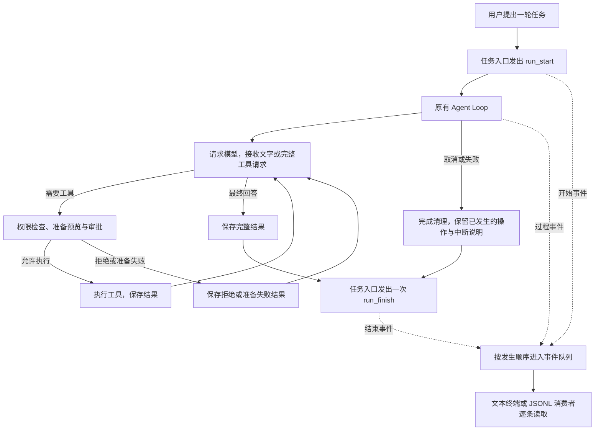

# 第 09 章：让执行过程可以被界面观察

[09.1 让界面知道任务何时结束](01-run-lifecycle/README.md) · [09.2 按顺序接收执行事件](02-event-stream/README.md) · [09.3 让脚本读懂执行过程](03-jsonl-output/README.md) · [练习与答案](EXERCISES.md)

第八章让文字逐段出现，也让我们可以停下当前任务，再接着交流。终端已经能显示模型请求、工具执行和审批过程。不过，终端知道这些事的方式还没有完全统一：过程来自事件，整轮成功或失败却要另外等 `agentLoop()` 返回或抛错。

这在一个文本终端里能够工作。接下来要加入任务状态栏、把执行过程交给脚本处理时，每个界面都需要弄清楚同一件事：这次任务是否开始了，现在发生了什么，最后怎样结束。我们这一章就把这些消息接成一条完整的事件流，让不同的显示方式使用同一份执行过程。

## 这一章要完成什么

继续用一个小任务贯穿本章：读取项目的 `README.md`，说明项目怎样启动。模型可能先请求读文件，程序执行读取并把结果交回模型，模型再写出最终回答。对用户来说，这是一轮任务；对程序来说，它可能包含两次模型请求和一次工具调用。

我们先给这一轮任务补上明确的开始与结束，再让界面能够一条条等待事件，最后把同样的事件写成脚本可以逐行读取的 JSON。

| 学习步骤 | 我们要弄明白的事情 | 对应小节 |
| --- | --- | --- |
| 描述整轮任务 | 模型响应结束、工具执行结束，分别与整轮任务结束有什么区别？ | [09.1 让界面知道任务何时结束](01-run-lifecycle/README.md) |
| 按顺序接收 | 界面处理一条事件需要等待时，后面的事件放在哪里？ | [09.2 按顺序接收执行事件](02-event-stream/README.md) |
| 输出给脚本 | 怎样让程序读取事件，同时保留清楚的失败提示和退出状态？ | [09.3 让脚本读懂执行过程](03-jsonl-output/README.md) |

第四章已经建立的模型、工具、权限与审批事件继续使用，第八章的文字增量也继续使用。我们只补上缺少的整轮状态和送达方式，模型判断、工具执行、权限检查与历史保存仍由原来的 Agent Loop 负责。

## 同一轮执行，可以有不同的显示方式

模型请求读取 `README.md` 时，Agent Loop 先检查权限，再调用真实文件工具。工具结果仍然回到下一次模型请求里。这条完成任务的路线没有改变。

与此同时，程序把已经发生的步骤写成事件。例如 `tool_start` 表示读取即将开始，`tool_finish` 表示这次读取已取得结果。文本终端可以把它们显示成中文步骤，脚本可以记录它们，第十章的界面也可以用它们更新工具状态。



虚线表示程序向外报告进展。收到“等待审批”事件，只能让界面知道当前状态；真正的批准仍要通过 Agent Loop 正在等待的审批函数返回。记录日志或绘制界面的代码不能因为收到了事件，就获得执行工具的权力。

## 学完以后，Agent 能做到哪里

本章结束后，一轮任务有自己的编号；每条事件也有该轮内的顺序号。消费者能够辨认开始、过程和唯一的结束状态，还能在异步读取时保持顺序。消费者提前离开或输出无法继续时，程序会取消本轮，并等待已有请求和工具完成清理。

文本终端继续给人阅读。`--output jsonl` 则把同一轮事件逐行交给脚本，标准输出中不混入欢迎语、审批提示或用量说明。权限规则照常执行，脚本模式没有真实审批输入时，待确认的调用默认拒绝。

这里的 JSONL 是一次运行的输出格式，不是可恢复的会话存档。它可能包含用户问题、工具参数和工具内容，保存或分享前需要按用途处理这些数据。第十三章再加入会话保存与恢复；[第十章](../chapter-10-terminal-ui/README.md)先把本章的事件接到 React / Ink 界面：保存当前显示状态，随着事件重新绘制消息与工具进展，再加入审批和取消后继续。

## 从哪里继续

本章从 [08.3](../chapter-08-streaming-turns/03-cancel-and-continue/README.md)及[第八章练习](../chapter-08-streaming-turns/EXERCISES.md)继续。第八章练习是调用正式代码的独立实验，不改变正式源码；因此，这一章的代码起点就是 08.3 的完整 `src/`。

按三个小节顺序阅读和构建。完成 09.3 后，再做[章末练习](EXERCISES.md)：编写一个事件消费者，用真实读取产生的 `tool_start` 与 `tool_finish` 记录本地观察耗时。它不修改 Agent Loop，也不需要真实模型账号。

使用完整配套仓库并完成本章后，在仓库根目录运行固定检查：

```bash
npm run check:09
```

练习的运行方法见[练习与答案](EXERCISES.md)。固定检查使用可控的本地输入确认顺序、结束状态、取消清理和输出格式；真实模型是否选择读取、怎样组织回答，仍按各节实验观察。

完成练习后，从 [10.1 把对话放进一个界面](../chapter-10-terminal-ui/01-first-screen/README.md)继续。计时实验不改变正式源码，下一章直接接着 09.3 的实现增加界面。
