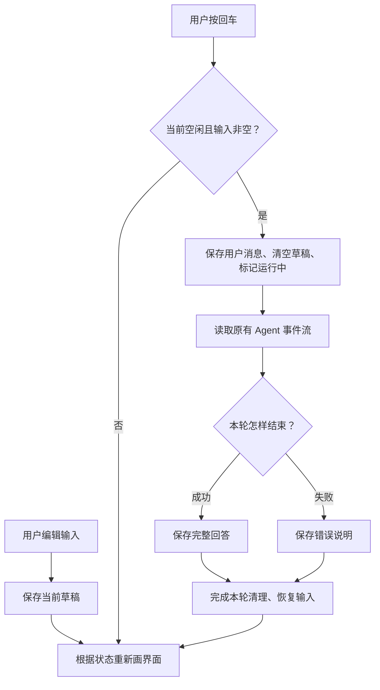

# 10.1 把对话放进一个界面

[第 10 章首页](../README.md) · [上一节：09.3 让脚本读懂执行过程](../../chapter-09-observable-runs/03-jsonl-output/README.md) · [下一节：10.2 让界面跟着执行变化](../02-live-progress/README.md)

## 问题：同一段终端内容，怎样随着任务改变

前面的终端在用户输入后启动任务，再把回答和过程依次打印出来。现在，我们希望在同一个画面里看到对话、输入区和当前状态：空闲时可以打字，提交以后显示“正在执行”，回答完成后重新出现输入区。

这里多出来的工作不只是给文字加一个框。程序需要知道画面当前处在哪个阶段，才能决定哪些内容应该出现。例如，用户按下回车后，输入文字要进入消息区，输入区要清空；同一轮仍在运行时，还不能再启动第二轮。若各个位置分别打印提示，就很难一起改变。

我们先把目标缩小到一个完整往返：在界面里输入一句话，等待已有 Agent 执行，把完整回答放进消息区。流式文字和工具过程暂时不展开，下一节再接进来。

## 解决方案：用数据描述当前画面

界面先保存三类信息：已经显示的消息、尚未提交的输入，以及当前是否正在执行。绘制时只读取这些信息，决定要显示什么。

下面是完成一轮问答时的示意，回答内容不要求逐字一致：

```text
Hello, My Agent

你 > 请读取 README.md，说明项目怎样启动。
Agent > 先安装依赖，再运行项目中指定的启动命令……

状态：可以继续输入
你 > |
```

用户提交后，程序启动第九章的 `streamAgentRun()`。收到正常的 `run_finish` 时，把事件携带的完整回答保存到消息列表。消息列表发生变化以后，React 重新计算画面，Ink 再把新画面显示到终端。

这一节只让 TUI 消费完整结束结果。核心仍然会产生文字增量、调用工具并回传结果；界面暂时没有把这些中间过程画出来。遇到需要批准的操作，因为本节还没有 TUI 审批入口，会沿用“没有审批通道就拒绝”的行为。需要交互审批时，仍可显式使用已经实现的文本终端。

## 工作原理

### 1. 组件描述画面，状态记住会变化的内容

React 中的组件是一个返回界面描述的函数。它读到消息数组为空时，可以显示欢迎提示；读到数组里已经有一条回答时，就把回答也包含在返回的画面中。我们不需要在收到回答的地方亲自移动光标，去找到终端中的某一行再覆盖它。

组件重新执行时，普通局部变量会重新创建。消息和输入却需要保留，所以我们把它们放进 React 的 state，也就是组件保存的状态。更新状态会请求一次新的渲染；React 用新状态再次调用组件，得到下一份界面描述。这是 [React 的状态与渲染关系](https://react.dev/learn/state-as-a-snapshot)。

这个关系可以压缩成一句话：**先改变保存的数据，再根据新数据决定画面。** 后面加入工具状态和审批区时，也继续使用同一办法。

### 2. Ink 把组件画到终端

浏览器里的 React 常用 `div` 和 `span` 描述页面。本章使用 Ink 的 `Box` 和 `Text`：`Box` 安排内容的位置，`Text` 显示文字。比如一个纵向的 `Box`，可以依次放置消息区、状态行和输入区。Ink 是面向终端的 React 渲染器，布局方式可见 [Ink 官方说明](https://github.com/vadimdemedes/ink#readme)。

带有这类标签的 TypeScript 文件使用 `.tsx` 扩展名。标签表达的是组件关系，不是要发送给模型的文本，也不是浏览器页面。本章新增的界面入口放在 `ui/tui/app.tsx`，模型与工具仍使用原来的 TypeScript 文件。

输入使用现成的 `ink-text-input` 组件。它把编辑后的文字交给 `onChange`，把回车提交的文字交给 `onSubmit`；应用保存当前值，并在提交回调中启动任务。这个输入组件的基本约定见 [官方用法](https://github.com/vadimdemedes/ink-text-input#usage)。复杂输入编辑留到第十一章，本节不自己实现光标编辑器。

### 3. 画一次界面，不能重新执行一次任务

React 可能因为用户打字、状态变化而多次调用组件。如果在组件函数的普通执行路径里调用 Agent，那么每次重新绘制都可能再次发送模型请求。

所以，组件计算只负责描述画面。真正的执行从提交动作开始：先判断当前是否空闲，再保存用户消息、清空草稿，随后异步读取本轮事件。完成或失败时更新状态，组件根据结果重新绘制。



这里有两份用途不同的数据。模型的消息历史要保留完整工具请求和结果，供下一次模型调用使用；屏幕上的消息只保存准备展示给用户的文字。界面不能拿显示列表替换模型历史，否则下一轮可能丢掉真正执行过的工具信息。

### 4. 第一个界面也要能完整退出

TUI 会接管按键输入和终端绘制。用户要求退出时，不能只停止画面，把仍在请求的模型或正在运行的工具留在后台。

本节先采用明确的规则：`Ctrl+C` 请求取消当前任务，然后结束整个界面。程序等待事件流结束清理，再卸载 Ink。普通文本模式保留第八章已有的取消后继续行为；TUI 中“只取消本轮、继续留在界面”将在 10.4 实现。

TUI 还需要真实终端提供交互能力。显式选择 `--output tui` 时，入口会检查标准输入和标准输出都连接着终端，终端类型不是表示简单输出环境的 `TERM=dumb`，且没有同时提供单次 `--prompt`。这里暂时保留文本作为默认输出；等界面的交互规则齐全以后，10.4 再加入自动选择。

## 本节改动文件

| 状态 | 文件 | 本节变化 |
| --- | --- | --- |
| NEW | [src/ui/tui/app.tsx](src/ui/tui/app.tsx) | 保存输入与消息，挂载界面，用原有事件流完成问答，退出时取消并等待清理 |
| CHANGED | [src/cli.ts](src/cli.ts) | 增加显式 TUI 选项，检查终端条件，只在选择 TUI 时加载界面 |

## 动手构建

跟写起点是 09.3 的完整实现，本节目标目录是 `chapter-10-terminal-ui/01-first-screen/`。保留原有 `src/` 内容，再完成下面的界面与入口改动。前一章练习只是独立实验，不需要把它加入正式入口。

本章继续要求 Node.js 22 或更高版本。React `19.3.0`、Ink `7.1.1` 和 `ink-text-input` `6.0.0` 由根目录锁文件统一维护，构建脚本也已支持 `.tsx`。完成本节文件以后，运行 `npm run lesson:10.1` 就会安装和构建对应依赖，不需要另外修改编译配置或单独安装一套界面工程。

### 新增保存输入与消息的界面

新增 `src/ui/tui/app.tsx`，完整文件如下：

```tsx
/**
 * 10.1 把对话放进一个界面 | [NEW] ui/tui/app.tsx
 *
 * 学习目标：用 React 描述终端画面，把输入、等待状态和完整回答放在一个连续会话里。
 * 输入：已创建的模型、键盘输入和同一 Agent 事件流；界面使用 .tsx 中的 JSX 描述布局。
 * 输出：终端里的留存消息与当前交互区域；普通问题交给 streamAgentRun 执行。
 * 状态：Session 持有模型历史、只读授权和本轮任务；React state 只保存需要重新绘制的画面数据。
 * 失败：本轮异常显示本地状态，事件生成器清理结束后才恢复输入；已经发生的工具操作不回滚。
 *
 * 本文件局部流程（全局主流程见 agent/agent-loop.ts）：
 *   startTui -> 创建 Session、注册退出监听 -> 挂载 TuiApp
 *   Enter -> 正在执行或关闭？-- 是 -> 忽略提交
 *                            +-- 否 -> 空白？-- 是 -> 等待输入
 *                                           +-- 否 -> 本地命令？-- 是 -> 处理后返回或退出
 *                                                              +-- 否 -> 新建本轮信号、设为忙碌
 *   本轮事件 -> 只在 run_finish/completed 时追加完整回答
 *   ask -> 尚未传入审批回调 -> 核心返回拒绝结果；本节没有审批输入框
 *   本轮结束 / 抛错 -> finally -> 清理本轮引用 -> 仍在界面？-- 是 -> 留下结果、恢复输入
 *                                                        +-- 否 -> 不再更新画面
 *   Ctrl+C / Ctrl+D / 退出信号 -> quit
 *   quit -> closing=true -> abort -> 等 session.done -> 卸载 Ink
 *   startTui finally -> 再确认任务结束 -> 移除信号与输入监听 -> 返回
 *
 * React 更新状态时会重新调用组件，描述应该出现的画面；实际任务只能由提交回调启动。
 * history 在组件外，所以重新绘制不会清空上下文；Static 的显示记录也不能替代这份模型历史。
 * 本文件只组织输入和显示，模型判断、工具执行、权限范围与历史提交仍由已有执行链负责。
 * 运行观察：发送问题后输入区进入等待，完整回答留在上方；任务结束后可以继续提问。
 */
import { useState } from "react";
import { Box, Static, Text, render, useInput } from "ink";
import TextInput from "ink-text-input";
import type { Message, Model } from "../../models/client.js";
import { streamAgentRun } from "../../agent/run-stream.js";
import { explainError } from "../../errors.js";

// [NEW 10.1] 本文件以下实现均为本节新增。
// Session 属于一次 startTui 调用；组件重新绘制不会重建模型历史、授权或正在运行的任务。
type Session = {
  history: Message[];
  grants: Set<string>;
  controller?: AbortController;
  done?: Promise<void>;
  closing: boolean;
};
type Entry = { label: "你" | "Agent" | "本地"; text: string };

/**
 * 把终端控制字符显示成可见文字，同时保留正文的换行。
 *
 * - 输入：模型、工具或用户提供的显示文本；这些内容不能直接取得终端控制能力。
 * - 输出：被处理的控制字符写成可见的反斜杠 u 加四位十六进制，制表符显示为四个空格。
 * - 关键原因：直接删除字符会让预览看不出原文含有什么；可见转义保留了这项信息。
 * - 职责边界：只生成显示副本，不改模型历史、待写入正文或审批请求，也不做凭据脱敏。
 */
function screenText(value: string): string {
  return value.replace(/[\x00-\x08\x0b-\x1f\x7f-\x9f\u202a-\u202e\u2066-\u2069]/g, (character) => `\\u${character.charCodeAt(0).toString(16).padStart(4, "0")}`).replace(/\t/g, "    ");
}

/**
 * 保存界面输入和已显示消息，并把普通问题交给已有执行链。
 *
 * - 输入：入口创建的模型、整次会话共用的 Session，以及等待清理后退出的 quit 函数。
 * - 输出：描述终端布局的 JSX；Ink 将 Box 和 Text 绘制到终端，不会创建网页元素。
 * - 状态：useState 保存草稿、显示消息、忙闲与提示；调用 setter 后 React 会再次调用组件得到新画面。
 * - 执行时机：模型任务只在 submit 里启动，重新绘制只计算画面，不能再次提交同一个问题。
 * - 事件处理：持续取走整轮记录，但本节只在 completed 时显示完整回答；ask 尚无界面处理函数。
 * - 失败方式：运行异常显示本地说明；finally 等事件生成器完成清理后解除忙碌，关闭期间不再更新界面。
 * - 职责边界：显示消息与模型 history 分开；后者和只读授权保存在组件外的 Session 中。
 */
function TuiApp({ model, session, quit }: { model: Model; session: Session; quit: (code: number) => void }) {
  // 这些值描述画面；setter 通知 React 重新绘制，不能把模型任务写进组件渲染过程。
  const [draft, setDraft] = useState("");
  const [entries, setEntries] = useState<Entry[]>([]);
  const [busy, setBusy] = useState(false);
  const [status, setStatus] = useState("就绪");
  // 函数式更新接在上一次 entries 后追加，连续事件不依赖某次绘制时捕获的旧数组。
  const append = (label: Entry["label"], text: string) => setEntries((old) => [...old, { label, text: screenText(text) }]);

  useInput((input, key) => {
    if (key.ctrl && input === "c") quit(130);
    if (key.ctrl && input === "d") quit(0);
  });

  const submit = (value: string) => {
    // session.done 立即成为并发保护；不必等 React 把输入框换成忙碌画面后才阻止再次发送。
    if (session.done || session.closing) return;
    const prompt = value.trim();
    if (!prompt) return;
    setDraft("");
    // 本地命令只改本地会话；它们不作为 user 消息送给模型。
    if (prompt === "/exit") { quit(0); return; }
    if (prompt === "/reset") { session.history.length = 0; append("本地", "对话历史已清空；会话授权保留。"); return; }
    if (prompt === "/permissions reset") { session.grants.clear(); append("本地", "本次会话的只读授权已撤销。"); return; }
    if (prompt === "/permissions") { append("本地", session.grants.size ? [...session.grants].join("\n") : "当前没有会话授权。"); return; }
    append("你", prompt);
    setBusy(true);
    setStatus("执行中");
    // 一轮只对应一个控制器；history 与 grants 比这一轮活得更久，不能一起重新创建。
    const controller = new AbortController();
    session.controller = controller;
    session.done = (async () => {
      try {
        for await (const { event } of streamAgentRun(model, session.history, prompt, controller.signal, undefined, session.grants)) {
          if (session.closing) continue;
          if (event.type === "run_finish" && event.outcome === "completed") {
            append("Agent", event.reply.text);
            setStatus(`已完成 · 输入 ${event.reply.inputTokens ?? "未知"} / 输出 ${event.reply.outputTokens ?? "未知"} token`);
          }
        }
      } catch (error) {
        if (!session.closing) {
          append("本地", explainError(error));
          setStatus("本轮未完成");
        }
      } finally {
        // for await 完成或抛错前会等待生成器的 finally；此时才解除本轮占用。
        session.controller = undefined;
        session.done = undefined;
        if (!session.closing) setBusy(false);
      }
    })();
  };

  // .tsx 允许在 TypeScript 中写 JSX。Static 只追加已完成消息，下面的 Box 随状态重绘。
  return <Box flexDirection="column">
    <Static items={entries}>{(entry, index) => <Box key={index} flexDirection="column" marginBottom={1}>
      <Text color={entry.label === "你" ? "cyan" : entry.label === "Agent" ? "magenta" : "yellow"} bold>{entry.label}</Text>
      <Text>{entry.text}</Text>
    </Box>}</Static>
    <Box borderStyle="round" paddingX={1} flexDirection="column">
      <Text bold>Hello, My Agent</Text>
      <Text color={busy ? "yellow" : "green"}>状态：{status}</Text>
      {busy ? <Text dimColor>正在处理本轮任务…</Text> : <Box><Text color="cyan">你 &gt; </Text>
        <TextInput value={draft} onChange={(value) => setDraft(screenText(value).replace(/[\r\n\t]/g, " "))} onSubmit={submit} placeholder="输入问题，Enter 发送" />
      </Box>}
      <Text dimColor>/reset 清空对话 · /permissions 查看授权 · /exit 退出 · Ctrl+C 停止并退出</Text>
    </Box>
  </Box>;
}

/**
 * 持有整次 TUI 会话，并在退出前等待当前任务和终端监听完成清理。
 *
 * - 输入：CLI 已创建的 Model；终端是否可交互由 CLI 在调用前检查。
 * - 输出：界面卸载且清理完成后返回；进程退出码由相应的退出入口设置。
 * - 生命周期：Session 在组件外只创建一次，React 重新绘制时仍使用同一份 history 和只读授权。
 * - 退出顺序：先标记 closing 防止新任务和界面更新，再取消并等待 session.done，最后卸载 Ink。
 * - 按键与信号：本节 Ctrl+C / SIGINT 结束界面；Ctrl+D、输入结束、SIGTERM 与 SIGHUP 也统一清理。
 * - 失败方式：挂载或等待抛错仍进入 finally；移除本函数的监听后由调用方报告错误。
 * - 职责边界：Ink 卸载负责恢复终端输入模式；本函数不持久化会话，也不撤销已发生的工具操作。
 */
export async function startTui(model: Model): Promise<void> {
  // 组件可以多次重新绘制，这个对象只随本次 startTui 创建与销毁。
  const session: Session = { history: [], grants: new Set(), closing: false };
  let instance: ReturnType<typeof render> | undefined;
  const quit = (code: number) => {
    if (session.closing) return;
    // 先封住新的提交和状态更新，再等待当前任务；否则退出期间仍可能继续绘制。
    session.closing = true;
    session.controller?.abort();
    void Promise.resolve(session.done).then(() => { process.exitCode = code; instance?.unmount(); });
  };
  const interrupt = () => quit(130);
  const terminate = () => quit(143);
  const hangup = () => quit(129);
  const endInput = () => quit(0);
  process.on("SIGINT", interrupt);
  process.on("SIGTERM", terminate);
  process.on("SIGHUP", hangup);
  process.stdin.on("end", endInput);
  try {
    // 关闭 Ink 默认的 Ctrl+C 退出，由 quit 先等任务清理；界面内的输出统一由组件负责。
    instance = render(<TuiApp model={model} session={session} quit={quit} />, { exitOnCtrlC: false, patchConsole: false });
    await instance.waitUntilExit();
  } finally {
    session.closing = true;
    session.controller?.abort();
    await session.done;
    instance?.unmount();
    // 无论正常退出还是挂载失败，只移除本次添加的监听，避免下次进入界面收到重复通知。
    process.off("SIGINT", interrupt);
    process.off("SIGTERM", terminate);
    process.off("SIGHUP", hangup);
    process.stdin.off("end", endInput);
  }
}
```

这里可以按三层读代码。`Session` 在 `startTui()` 中只创建一次，保存模型历史、授权与活动任务；`TuiApp` 的状态保存草稿和当前画面；提交回调才会启动真正的 Agent 任务。

`Static` 用于已经完成的显示记录：新消息追加上去以后，后续进度更新不会反复重画它。下方的 `Box` 则随忙闲状态更新。这样先区分了留存消息和当前交互区域，后面加入文字增量时可以继续使用这个布局。

`quit()` 先把会话标为关闭，防止继续提交，再取消并等待 `session.done`，最后卸载界面。`exitOnCtrlC: false` 让 Ink 把退出决定留给这段清理逻辑，避免按键一到就直接结束显示。

### 让命令入口选择这个界面

在 `src/cli.ts` 中保留第一行 `#!/usr/bin/env node`，把紧随其后的文件头教学注释替换为：

```ts
/**
 * 10.1 把对话放进一个界面 | [CHANGED] cli.ts
 *
 * 学习目标：显式选择 TUI，并让已有 text / JSONL 入口继续独立使用。
 * 输入：命令行模型选项、--prompt 与 --output；输出格式默认是 text。
 * 输出：装配模型后选择一个消费者；入口错误由 stderr 说明并设置 exitCode=1。
 * 状态：入口不保存历史或授权；参数不符合运行方式时不启动任务，运行失败不回滚工具操作。
 *
 * 本文件局部流程（全局主流程见 agent/agent-loop.ts）：
 *   --help / --version -> 显示文字 -> 结束；--doctor -> 显示环境 -> 结束
 *   [CHANGED] 输出格式受支持？-- 否 -> 抛出 UserFacingError
 *                            +-- 是 -> 继续检查运行方式
 *   tui？-- 是 -> stdin/stdout 为 TTY、TERM 非 dumb，且没有 --prompt？
 *                否 -> 抛错；是 -> 读取配置、创建模型 -> 动态载入 app -> startTui
 *        +-- 否 -> jsonl 但缺少 --prompt？-- 是 -> 抛错
 *                                          +-- 否 -> 读取配置、创建模型
 *   非 TUI 分支 -> 无 --prompt？-- 是 -> startTerminal
 *                              +-- 否 -> 内容为空？-- 是 -> 抛错
 *                                                  +-- 否 -> jsonl / text 单次消费者
 *   运行抛错 -> explainError -> stderr、exit 1；单次用户取消由消费者设 exit 130
 *
 * 本节默认仍是 text；只有显式指定 --output tui 才进入新界面。
 * TUI 只接受连续输入，单次任务继续用 text 或 jsonl；JSONL 必须同时给 --prompt。
 * 动态 import 只在 tui 分支载入 React / Ink，脚本模式不需要初始化终端界面。
 * --help、--version 和 --doctor 不读取模型配置；界面选择不改变模型、工具或权限协议。
 * 运行观察：--output tui 进入界面；非交互环境会给出明确提示，text 与 jsonl 仍按原约定运行。
 */
```

继续保留原来的导入、帮助、版本和模型选项。找到 `--output` 选项，将它前面的说明注释、选项本身以及后面的整个 `.action(...)` 替换为：

```ts
  // [CHANGED 10.1] 输出选项增加 tui；默认仍保留 text。
  .option("--output <format>", "输出格式：tui、text 或 jsonl", "text")
  // [KEEP 来自 09.3] 默认动作先检查输出约定，再装配模型并选择对应消费者。
  .action(async () => {
    const options = program.opts<CliOptions>();
    if (options.doctor) {
      printDoctor();
      return;
    }
    // [CHANGED 10.1] 把 tui 纳入入口允许的输出格式。
    if (!["tui", "text", "jsonl"].includes(options.output ?? "text")) throw new UserFacingError("--output 只能是 tui、text 或 jsonl。");
    // [NEW 10.1] 只有真实终端才能把按键交给 Ink；单次问题继续使用已有输出模式。
    if (options.output === "tui" && (!process.stdin.isTTY || !process.stdout.isTTY || process.env.TERM === "dumb")) {
      throw new UserFacingError("TUI 需要交互终端，请使用 --output text 或 --output jsonl --prompt 提问。");
    }
    if (options.output === "tui" && options.prompt !== undefined) throw new UserFacingError("TUI 使用连续输入；单次提问请使用 --output text 或 jsonl。");
    if (options.output === "jsonl" && options.prompt === undefined) throw new UserFacingError("JSONL 模式需要 --prompt 提供一次任务。");
    const config = readConfig(options);
    const model = createModel(config);
    if (options.prompt === undefined) {
      // [NEW 10.1] 选择 TUI 时才载入 React / Ink，不让脚本模式初始化界面。
      if (options.output === "tui") {
        const { startTui } = await import("./ui/tui/app.js");
        await startTui(model);
        return;
      }
      await startTerminal(model);
      return;
    }
    if (!options.prompt.trim()) throw new UserFacingError("提问内容不能为空。");
    // [KEEP 来自 09.3] 两种显示方式共用核心。
    if (options.output === "jsonl") await runJsonlPrompt(model, options.prompt);
    else await runSinglePrompt(model, options.prompt);
  });
```

末尾的 `program.parseAsync()` 与错误处理继续保留。这里使用动态 `import()`：只有实际选择 TUI 才加载 React / Ink 界面。文本与 JSONL 仍进入原来的消费者，模型配置和执行核心不需要改变。

## 运行验证

在仓库根目录构建本节：

```bash
npm run lesson:10.1
```

构建完成后，在真实终端里显式启动 TUI：

```bash
hello-my-agent --output tui
```

在输入区输入并按回车：

```text
请使用 read_file 读取 README.md，说明项目怎样启动。
```

用户消息应进入已完成消息区，输入区暂时变成运行提示。等本轮结束后，完整回答出现，输入区恢复。这里不要求模型回答逐字一致，也暂时看不到它分段生成的过程。

再输入一个跟上一问有关的问题，确认界面仍使用同一份模型历史：

```text
把刚才的启动说明缩短成一句话。
```

可以输入 `/reset` 清空模型对话历史，输入 `/permissions` 查看当前会话授权，输入 `/exit` 退出。这些是本地操作，不会当成问题发给模型；`/reset` 不会撤销只读授权，也不会抹掉终端中已经打印的消息。

### 比较显示与执行的区别

重新启动 TUI，提交一次任务后按 `Ctrl+C`。本节会请求停止当前任务，等待清理以后回到 shell。此时在 shell 输入下面的命令，应正常显示帮助，不会继续被旧的界面当成聊天输入：

```bash
hello-my-agent --help
```

再使用原有单次文本模式：

```bash
hello-my-agent --output text --prompt "请用一句话解释 README 的用途。"
```

它仍然能运行。TUI 是另一个消费者，原有文本和 JSONL 输出没有被移除；本节不加 `--output tui` 时，默认仍使用文本。

## 本节完成后的 Agent

Agent 的输入和完整回答已经可以出现在同一个 React / Ink 界面里。用户提交一次，原有执行链运行一次；状态变化只让画面重新计算，不会重新发送任务。

不过，任务执行期间只能看到总体的运行提示。模型正在生成文字，还是刚刚读取了文件，用户还不能从界面上分辨。下一节就把第九章的过程事件接到界面状态，让这段等待变得可见。
