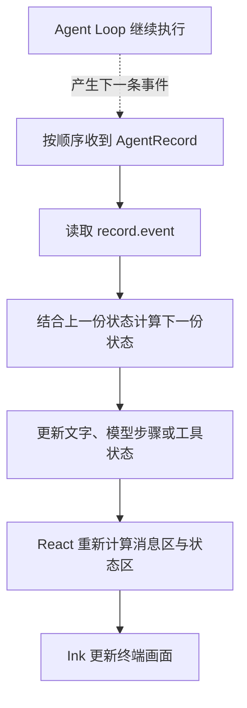

# 10.2 让界面跟着执行变化

[第 10 章首页](../README.md) · [上一节：10.1 把对话放进一个界面](../01-first-screen/README.md) · [下一节：10.3 在界面中批准工具调用](../03-tool-approval/README.md)

## 问题：正在执行，到底执行到了哪里

上一节已经能在界面里完成问答。再输入“读取 `README.md`，说明项目怎样启动”时，界面会等待完整回答。在等待期间，模型可能已经生成了文字、提出了读取请求，工具也可能已经读取完成，但用户仍然只看到一个总体状态。

这些过程并不是没有产生。第九章的 `AgentRecord` 已经把它们按顺序送了出来。本节要解决的是另一半：收到一条事件以后，界面应该保存什么，才能在下一次绘制时显示准确的进展。

## 解决方案：把发生过的事件整理成当前状态

事件与状态看起来相似，但用途不同。`text_delta` 只包含刚刚到达的一段文字，不能单独当成目前的回答；`tool_finish` 只说明某次工具调用结束，不能表示整轮任务已经结束。

所以我们新增一个状态转换函数。它接收“上一份界面状态”和“下一条事件”，返回“更新后的界面状态”。显示组件只读这份状态，不去猜工具输出正文里有没有“成功”二字。

下面用一个简化过程观察两者怎样配合，事件的具体数量与模型回答可以不同：

| 收到的事件 | 界面保存的变化 | 用户可以看到什么 |
| --- | --- | --- |
| `model_start` | 记住正在进行的模型调用 | 模型正在处理当前步骤 |
| `text_delta` | 把新文字接到该次模型调用的已有文字后面 | 文字逐段增长 |
| `tool_start` | 把这次工具调用记为运行中 | `read_file` 正在读取 |
| `tool_finish` | 更新同一次调用的结果状态 | 读取完成或失败 |
| `run_finish` | 更新结束状态与用量 | 本轮完成、取消或失败 |

我们把这部分规则放在 `ui/tui/state.ts`。它只处理数据，不操作终端，也不请求模型。这样既能逐条解释状态为何改变，也能在练习中使用真实事件检查它。

## 工作原理

### 1. 收到新片段，要接在此前的文字后面

假设模型依次返回“先安装”“依赖”“，再启动”。三条事件分别只带这次新增的内容。如果每次都把显示文字替换成事件里的 `text`，最后屏幕只会剩下“，再启动”。

因此，文字增量要在已有文字后面追加。状态转换函数从上一份状态中找到对应的模型调用，把新片段接上去，再返回新状态。React 随后读到的就是“先安装依赖，再启动”。

这解释了为什么文字状态需要区分模型调用编号 `call`。同一轮任务可能先调用模型决定读取文件，工具返回后再调用一次模型组织回答。如果把两次请求的片段随意合到一个消息里，用户就分不清前面的说明和后面的回答分别来自哪个阶段。

一次模型调用结束时，`model_finish` 还会携带完整文字。如果本次调用没有收到任何文字增量，界面用完整文字补上空白；已经累积过增量时，就保留现有文字，不再追加同一份完整内容。整轮的 `run_finish` 则更新结果状态和用量，这样回答不会因为结束事件再次出现一遍。

### 2. 工具状态跟随调用编号，不跟随工具名称

一个任务可能两次使用 `read_file`。工具名称相同，不代表同一次调用。所以工具状态使用事件里的工具步骤号配对：开始时登记，结束时找到原来的那一项并更新。

第九章介绍过两个顺序号。`record.sequence` 是整条事件在该轮中的送达顺序；`record.event.sequence` 出现在工具事件上，用来指向同一次工具调用。状态转换读的是后者。外层记录仍有用途：它把事件与本轮 `runId` 联系起来，保留送达顺序。

工具成功也不等于任务结束。读取工具把内容交回核心以后，模型可能继续搜索或组织回答。只有 `run_finish` 才让整轮显示进入结束状态，这一判断继续沿用第九章的约定。

### 3. 每次更新都接着最新的状态计算

异步循环可能在一次绘制之前连续收到几条事件。假如每次都用循环开始时保存的旧状态计算，新片段便可能覆盖刚刚收到的片段。

本节在消费循环里保留一个 `current` 变量，收到一条事件就执行 `current = updateRunView(current, event)`。下一条事件继续使用刚刚算出的 `current`，所以每次更新都接着上一条结果。计算完成后，程序再用 `setView(current)` 把新状态交给 React。

这样，事件数据的累积不依赖屏幕是否已经画完。React 可以把排队的更新合并到一次绘制中，程序仍然处理了所有已收到的事件。事件顺序与屏幕刷新次数是两件事，React 对排队更新的处理见[官方说明](https://react.dev/learn/queueing-a-series-of-state-updates)。

### 4. 画面只展示需要的字段

事件中可能带有完整参数和工具结果。显示工具进度时，我们通常只需要工具名称、状态和简短结果说明，不需要把整份进程内对象搬进消息区。

文字进入终端显示之前，会把可能影响终端控制的字符转换成可见的转义写法。例如 ESC 字符显示为 `\u001b`，用户能看见它，终端也不会把它当成控制动作执行。工具详情复用已有的教学追踪格式，只选择需要的字段。本节的运行中区域显示当前模型文字的末尾和最近三次工具状态，避免持续增长的回答把输入位置不断向下推。

这些处理只改变显示。完整文字仍保存在本轮状态里，结束后会连同工具摘要进入已完成消息；模型收到的工具结果也不受影响。这里限制的是运行中可见的内容，不是整个会话的内存。完整的浏览、滚动和折叠会在第十一章补充。



状态转换只回答“现在应该显示什么”。它不能因为工具显示为“等待批准”就执行工具，也不能因为画面消失就假设请求已经停止。审批与取消仍各有自己的控制入口，后两节再接到界面。

## 本节改动文件

| 状态 | 文件 | 本节变化 |
| --- | --- | --- |
| NEW | [src/ui/tui/state.ts](src/ui/tui/state.ts) | 把事件转换成文字、工具和任务状态，整理本轮结束摘要 |
| CHANGED | [src/ui/tui/app.tsx](src/ui/tui/app.tsx) | 按顺序更新显示状态，在运行区绘制文字末尾和工具进展 |

## 动手构建

跟写起点是 10.1，本节目标目录是 `chapter-10-terminal-ui/02-live-progress/`。复制上一节完整的 `src/`，先实现状态转换，再让界面读取这份状态。

### 新增事件到状态的转换

新增 `src/ui/tui/state.ts`，完整文件如下：

```ts
/**
 * 10.2 让界面跟着执行变化 | [NEW] ui/tui/state.ts
 *
 * 学习目标：把已经发生的执行事件积累成画面数据，界面不用从输出文字反推工具状态。
 * 输入：上一份 RunView 与下一条 AgentEvent；事件按 streamAgentRun 的顺序送达。
 * 输出：新的显示状态，或本轮结束后留在终端的文字记录；本文件没有终端写入和执行副作用。
 * 状态：更新时返回新对象，不修改传入状态或模型历史；失败与取消只改变显示中的结束状态。
 *
 * 本文件局部流程（全局主流程见 agent/agent-loop.ts）：
 *   事件 -> run_start？-- 是 -> 空白本轮状态
 *                      +-- 否 -> 模型事件？-- 是 -> 按 call 更新文字与阶段
 *                                         +-- 否 -> run_finish？-- 是 -> 写结束状态与用量
 *                                                              |       非 completed 时标记未结束工具为已中断
 *                                                              +-- 否 -> 按 sequence 新建或替换工具行
 *   本轮结束 -> 各次模型文字 + 工具摘要 + 结束状态 -> 终端留存记录
 *
 * 模型的 call 和工具的 sequence 各有用途；都不能替代事件外壳中的送达序号。
 * answers 保存本轮已经收到的文字，画面只显示末尾是 app.tsx 的选择，不在这里丢弃文字。
 * 工具 detail 复用已有教学摘要；它不是原始工具结果，也不能代替后续模型所需的消息历史。
 * 运行观察：工具批准、执行、完成各有状态；取消后尚未结束的工具不再显示为执行中。
 */
import type { AgentEvent } from "../../agent/events.js";
import { formatTeachingTrace } from "../teaching-trace.js";

// [NEW 10.2] 本文件以下实现均为本节新增。
// 这些字段只描述画面，不替代 Agent Loop 的消息历史。
export type RunView = {
  status: string;
  answers: { call: number; text: string }[];
  tools: { sequence: number; name: string; status: string; detail: string }[];
  usage: string;
};

/**
 * 为新一轮任务建立独立的显示状态。
 *
 * - 输入：无参数；调用方在开始任务或收到 run_start 时使用。
 * - 输出：状态为“执行中”，文字、工具和用量均为空的全新对象。
 * - 关键原因：每轮模型调用号和工具步骤号会重新计数，旧数组不能带进下一轮。
 */
export function emptyRunView(): RunView {
  return { status: "执行中", answers: [], tools: [], usage: "" };
}

/**
 * 把终端控制字符显示成可见文字，同时保留正文的换行。
 *
 * - 输入：模型、工具或用户提供的显示文本；这些内容不能直接取得终端控制能力。
 * - 输出：被处理的控制字符写成可见的反斜杠 u 加四位十六进制，制表符显示为四个空格。
 * - 关键原因：直接删除字符会让预览看不出原文含有什么；可见转义保留了这项信息。
 * - 职责边界：只生成显示副本，不改模型历史、待写入正文或审批请求，也不做凭据脱敏。
 */
export function screenText(value: string): string {
  return value.replace(/[\x00-\x08\x0b-\x1f\x7f-\x9f\u202a-\u202e\u2066-\u2069]/g, (character) => `\\u${character.charCodeAt(0).toString(16).padStart(4, "0")}`).replace(/\t/g, "    ");
}

/**
 * 根据一条已发生的事件，返回下一份画面数据。
 *
 * - 输入：上一份 RunView 和有序送达的事件；model_start 必须先于该次文字增量。
 * - 输出：保留旧内容并更新相关字段的新对象，调用方再把它交给 React 显示。
 * - 文字处理：按模型 call 追加片段；没有收到片段时，用 model_finish 的完整文字补齐。
 * - 工具处理：按工具 sequence 替换同一次调用的状态和最新摘要，不从正文猜测成功或失败。
 * - 结束处理：只有 completed 记录用量；错误或取消把尚未结束的工具标为“已中断”。
 * - 职责边界：这里只处理显示副本，不发起网络请求、不执行工具，也不替用户作出审批决定。
 */
export function updateRunView(view: RunView, event: AgentEvent): RunView {
  if (event.type === "run_start") return emptyRunView();
  if (event.type === "model_start") return { ...view, status: `模型第 ${event.call} 次决策`, answers: [...view.answers, { call: event.call, text: "" }] };
  if (event.type === "text_delta") return { ...view, answers: view.answers.map((answer) => answer.call === event.call ? { ...answer, text: answer.text + screenText(event.text) } : answer) };
  // 有的 Model 实现不发送文字回调；只在尚无片段时补完整文字，避免重复一遍回答。
  if (event.type === "model_finish") return { ...view,
    status: event.outcome === "tools" ? `收到 ${event.toolRequests} 个工具请求` : "模型已返回，等待本轮结束",
    answers: view.answers.map((answer) => answer.call === event.call && !answer.text ? { ...answer, text: screenText(event.text) } : answer),
  };
  // run_finish 才结束整轮；异常结束后保留已完成的结果，只收束仍在等待或执行的状态。
  if (event.type === "run_finish") return { ...view,
    tools: event.outcome === "completed" ? view.tools : view.tools.map((tool) =>
      ["完成", "失败", "准备失败", "已拒绝"].includes(tool.status) ? tool : { ...tool, status: "已中断" }),
    status: event.outcome === "completed" ? "已完成" : event.outcome === "cancelled" ? "已取消本轮" : `运行失败：${screenText(event.message)}`,
    usage: event.outcome === "completed" ? `输入 ${event.reply.inputTokens ?? "未知"} / 输出 ${event.reply.outputTokens ?? "未知"} token` : "",
  };
  // 前面的分支已经处理整轮与模型事件；剩下的事件都有工具 sequence，可更新同一行。
  const old = view.tools.find((tool) => tool.sequence === event.sequence);
  const status = event.type === "permission_check" ? ({ allow: "允许", ask: "等待确认", deny: "已拒绝" }[event.decision.action])
    : event.type === "tool_prepare" ? event.outcome === "success" ? "预览已准备" : "准备失败"
    : event.type === "approval_start" ? "等待批准"
    : event.type === "approval_finish" ? event.response.decision === "deny" ? "已拒绝" : "已批准"
    : event.type === "tool_start" ? "执行中"
    : event.outcome === "error" || event.result.isError ? "失败" : "完成";
  const tool = { sequence: event.sequence, name: screenText(event.call.name), status,
    detail: formatTeachingTrace(event).join("\n") };
  return { ...view, status: `${tool.name}：${status}`, tools: old
    ? view.tools.map((item) => item.sequence === event.sequence ? tool : item)
    : [...view.tools, tool] };
}

/**
 * 把本轮显示数据整理成一条可留在终端滚动记录中的消息。
 *
 * - 输入：事件消费结束后的 RunView，包括各次模型文字、每个工具的最新摘要和结束状态。
 * - 输出：用空行分隔的文字；没有正文的模型调用会跳过，结束状态始终保留。
 * - 关键原因：运行中的区域只显示少量末尾内容，结束后仍需保留本轮已收到的文字供回看。
 * - 职责边界：摘要不会写入模型历史，也不是完整的事件日志；原始工具正文仍由核心保存。
 */
export function runTranscript(view: RunView): string {
  return [...view.answers.filter((answer) => answer.text).map((answer) => answer.text),
    ...view.tools.map((tool) => `工具 #${tool.sequence} ${tool.name}：${tool.status}\n${tool.detail}`),
    `状态：${view.status}${view.usage ? ` · ${view.usage}` : ""}`].join("\n\n");
}
```

`answers` 按模型调用号保存文字，`tools` 按工具步骤号保存状态。每个分支只更新对应字段；`run_finish` 统一收尾，取消或失败时还会把没有结束的工具显示为“已中断”。这只是说明本轮停止，不能据此推断某项副作用是否已经发生。

`runTranscript()` 把已收到的模型文字、工具摘要和结束状态整理成一条留存消息。它不写入模型历史，所以不会让下一次模型请求误读一份为显示而缩写的记录。

### 让界面持续读取并显示新状态

在 `src/ui/tui/app.tsx` 中，把文件开头到 `TuiApp` 的说明注释之前这一段替换为下面内容。这会更新导入，沿用会话类型，并把原来的本地 `screenText()` 移到刚创建的状态模块：

```tsx
/**
 * 10.2 让界面跟着执行变化 | [CHANGED] ui/tui/app.tsx
 *
 * 学习目标：让同一界面逐条消费执行事件，显示当前文字、工具状态和本轮用量。
 * 输入：已创建的模型、键盘输入和同一 Agent 事件流；界面使用 .tsx 中的 JSX 描述布局。
 * 输出：终端里的留存消息与当前交互区域；普通问题交给 streamAgentRun 执行。
 * 状态：Session 持有模型历史、只读授权和本轮任务；React state 只保存需要重新绘制的画面数据。
 * 失败：本轮异常显示本地状态，事件生成器清理结束后才恢复输入；已经发生的工具操作不回滚。
 *
 * 本文件局部流程（全局主流程见 agent/agent-loop.ts）：
 *   startTui -> 创建 Session、注册退出监听 -> 挂载 TuiApp
 *   Enter -> 正在执行或关闭？-- 是 -> 忽略提交
 *                            +-- 否 -> 空白？-- 是 -> 等待输入
 *                                           +-- 否 -> 本地命令？-- 是 -> 处理后返回或退出
 *                                                              +-- 否 -> 新建本轮信号、设为忙碌
 *   本轮事件 -> current 逐条更新 RunView -> 通知 React 绘制最新状态
 *   ask -> 尚未传入审批回调 -> 核心返回拒绝结果；本节没有审批输入框
 *   本轮结束 / 抛错 -> finally -> 清理本轮引用 -> 仍在界面？-- 是 -> 留下结果、恢复输入
 *                                                        +-- 否 -> 不再更新画面
 *   Ctrl+C / Ctrl+D / 退出信号 -> quit
 *   quit -> closing=true -> abort -> 等 session.done -> 卸载 Ink
 *   startTui finally -> 再确认任务结束 -> 移除信号与输入监听 -> 返回
 *
 * React 更新状态时会重新调用组件，描述应该出现的画面；实际任务只能由提交回调启动。
 * history 在组件外，所以重新绘制不会清空上下文；Static 的显示记录也不能替代这份模型历史。
 * 本文件只组织输入和显示，模型判断、工具执行、权限范围与历史提交仍由已有执行链负责。
 * 运行观察：文字持续增长，最近工具状态随事件更新；结束后完整已收文字留在上方。
 */
import { useState } from "react";
// [CHANGED 10.2] 显示状态移到 state.ts；窗口尺寸用于决定当前区域能显示多少文字。
import { Box, Static, Text, render, useInput, useWindowSize } from "ink";
import wrapAnsi from "wrap-ansi";
import { emptyRunView, updateRunView, runTranscript, screenText, type RunView } from "./state.js";
import TextInput from "ink-text-input";
import type { Message, Model } from "../../models/client.js";
import { streamAgentRun } from "../../agent/run-stream.js";
import { explainError } from "../../errors.js";

// [KEEP 来自 10.1] Session 属于一次 startTui 调用，不随组件重新绘制而重建。
type Session = {
  history: Message[];
  grants: Set<string>;
  controller?: AbortController;
  done?: Promise<void>;
  closing: boolean;
};
type Entry = { label: "你" | "Agent" | "本地"; text: string };
```

把 `TuiApp()` 连同它上方的说明替换为：

```tsx
/**
 * 保存界面输入，并把逐条收到的执行事件变成当前画面。
 *
 * - 输入：入口创建的模型、整次会话共用的 Session，以及等待清理后退出的 quit 函数。
 * - 输出：描述终端布局的 JSX；Ink 将 Box 和 Text 绘制到终端，不会创建网页元素。
 * - 状态：useState 保存草稿、留存消息、忙闲与 RunView；状态更新触发重新绘制，不会重建 Session。
 * - 事件处理：本轮局部变量 current 按到达顺序处理每条事件，再把最新副本交给 React 显示。
 * - 关键原因：React 可以合并多次绘制，事件累积不能依赖某次画面是否已经出现。
 * - 失败方式：异常更新本轮状态；finally 等事件生成器清理后留下文字记录，再解除忙碌。
 * - 职责边界：运行中的区域只显示回答末尾与最近三个工具；完整已收文字保留在本轮状态中。
 */
function TuiApp({ model, session, quit }: { model: Model; session: Session; quit: (code: number) => void }) {
  // 这些值描述画面；setter 通知 React 重新绘制，不能把模型任务写进组件渲染过程。
  const [draft, setDraft] = useState("");
  const [entries, setEntries] = useState<Entry[]>([]);
  const [busy, setBusy] = useState(false);
  // [CHANGED 10.2] RunView 替换单一状态文字；完整数据在本轮累积，画面可以只选末尾显示。
  const [view, setView] = useState<RunView>({ ...emptyRunView(), status: "就绪" });
  const { columns, rows } = useWindowSize();
  // 函数式更新接在上一次 entries 后追加，连续事件不依赖某次绘制时捕获的旧数组。
  const append = (label: Entry["label"], text: string) => setEntries((old) => [...old, { label, text: screenText(text) }]);

  useInput((input, key) => {
    if (key.ctrl && input === "c") quit(130);
    if (key.ctrl && input === "d") quit(0);
  });

  const submit = (value: string) => {
    // session.done 立即成为并发保护；不必等 React 把输入框换成忙碌画面后才阻止再次发送。
    if (session.done || session.closing) return;
    const prompt = value.trim();
    if (!prompt) return;
    setDraft("");
    // 本地命令只改本地会话；它们不作为 user 消息送给模型。
    if (prompt === "/exit") { quit(0); return; }
    if (prompt === "/reset") { session.history.length = 0; append("本地", "对话历史已清空；会话授权保留。"); return; }
    if (prompt === "/permissions reset") { session.grants.clear(); append("本地", "本次会话的只读授权已撤销。"); return; }
    if (prompt === "/permissions") { append("本地", session.grants.size ? [...session.grants].join("\n") : "当前没有会话授权。"); return; }
    append("你", prompt);
    setBusy(true);
    // [CHANGED 10.2] 新一轮清空显示编号与正文；模型 history 仍保留前几轮上下文。
    setView(emptyRunView());
    // 一轮只对应一个控制器；history 与 grants 比这一轮活得更久，不能一起重新创建。
    const controller = new AbortController();
    session.controller = controller;
    session.done = (async () => {
      // [NEW 10.2] current 属于这次异步运行，顺序保存每条事件处理后的完整显示数据。
      let current = emptyRunView();
      try {
        for await (const { event } of streamAgentRun(model, session.history, prompt, controller.signal, undefined, session.grants)) {
          // [NEW 10.2] 本地变量保留每条事件；React 可以合并绘制，但不能丢掉已收到的数据。
          current = updateRunView(current, event);
          if (!session.closing) setView(current);
        }
      } catch (error) {
        // [CHANGED 10.2] 保留已收到的文字与工具记录，只把本轮结束状态改成失败或取消。
        current = { ...current, status: controller.signal.aborted ? "已取消本轮" : `运行失败：${screenText(explainError(error))}` };
      } finally {
        // for await 完成或抛错前会等待生成器的 finally；此时才解除本轮占用。
        session.controller = undefined;
        session.done = undefined;
        if (!session.closing) {
          // [CHANGED 10.2] 清理结束后把本轮已收文字与工具摘要放进 Static 留存区域。
          append("Agent", runTranscript(current));
          setView(current);
          setBusy(false);
        }
      }
    })();
  };

  // [CHANGED 10.2] 当前区域按窗口折行，只取文字末尾和最近三个工具；完整已收数据仍在 view 中。
  return <Box flexDirection="column">
    <Static items={entries}>{(entry, index) => <Box key={index} flexDirection="column" marginBottom={1}>
      <Text color={entry.label === "你" ? "cyan" : entry.label === "Agent" ? "magenta" : "yellow"} bold>{entry.label}</Text>
      <Text>{entry.text}</Text>
    </Box>}</Static>
    <Box borderStyle="round" paddingX={1} flexDirection="column">
      <Text bold>Hello, My Agent</Text>
      <Text color={busy ? "yellow" : "green"}>状态：{view.status}{view.usage ? ` · ${view.usage}` : ""}</Text>
      {busy && <Box flexDirection="column">
        <Text color="magenta">Agent（当前文字末尾）</Text>
        <Text>{wrapAnsi(view.answers.at(-1)?.text || "等待模型…", Math.max(10, columns - 4), { hard: true, trim: false }).split("\n").slice(-Math.max(2, Math.min(8, rows - 12))).join("\n")}</Text>
        <Text dimColor>本轮工具：{view.tools.length} 次（显示最近 3 次）</Text>
        {view.tools.slice(-3).map((tool) => <Text key={tool.sequence}>#{tool.sequence} {tool.name} · {tool.status}</Text>)}
      </Box>}
      {busy ? <Text dimColor>正在处理本轮任务…</Text> : <Box><Text color="cyan">你 &gt; </Text>
        <TextInput value={draft} onChange={(value) => setDraft(screenText(value).replace(/[\r\n\t]/g, " "))} onSubmit={submit} placeholder="输入问题，Enter 发送" />
      </Box>}
      <Text dimColor>/reset 清空对话 · /permissions 查看授权 · /exit 退出 · Ctrl+C 停止并退出</Text>
    </Box>
  </Box>;
}
```

文件末尾的 `startTui()` 保持上一节的实现。

消费循环里的 `current` 每收到一条事件就更新一次，`setView(current)` 只负责把算好的数据交给 React。结束时追加完整的本轮显示记录，再恢复输入。

`useWindowSize()` 提供当前列数与行数；已安装的 `wrap-ansi` `9.0.2` 按终端显示宽度折行，画面再选择末尾少量行。这里没有自己用字符串长度计算中文占几列，也没有提前加入第十一章的通用滚动功能。

## 运行验证

在仓库根目录构建本节：

```bash
npm run lesson:10.2
```

然后启动 TUI：

```bash
hello-my-agent --output tui
```

提交同一个读取任务：

```text
请使用 read_file 读取 README.md，说明项目怎样启动。
```

观察模型步骤、当前文字和工具状态。模型文字应逐段增长，工具项应随着实际事件改变；一次读取完成以后，整轮仍可能继续等待模型组织回答。读取很快时，中间状态可能来不及被肉眼看到，不能据此判断事件没有经过转换。

任务结束后，完整文字和工具摘要应进入已完成消息区，输入区重新出现。最终回答不应因为同时收到了流式文字和完整结果而重复出现两遍。

如果要更容易观察文字增长，可以再输入：

```text
请分六点解释这个项目的启动过程，每点写两句话，不需要调用工具。
```

动态区只显示当前文字末尾。回答结束后，完整内容会进入终端历史；通用滚动与结果浏览仍留到第十一章。模型是否按要求生成六点不属于状态转换的确定性证明，[章末练习](../EXERCISES.md)会用固定分片检查累计结果。

本节的取消规则仍与 10.1 相同：`Ctrl+C` 停止当前任务并结束界面。

## 本节完成后的 Agent

界面现在能随着同一轮任务持续变化：文字逐段出现，模型调用有自己的步骤，工具也有对应的开始与结束状态。显示规则集中在状态转换中，Agent Loop 和工具实现没有为 TUI 增加特殊分支。

接下来试着要求 Agent 创建文件，就会碰到另一类等待：核心需要一个真实的用户决定。下一节不再只观察发生了什么，而是让审批区把选择交回原有执行流程。
