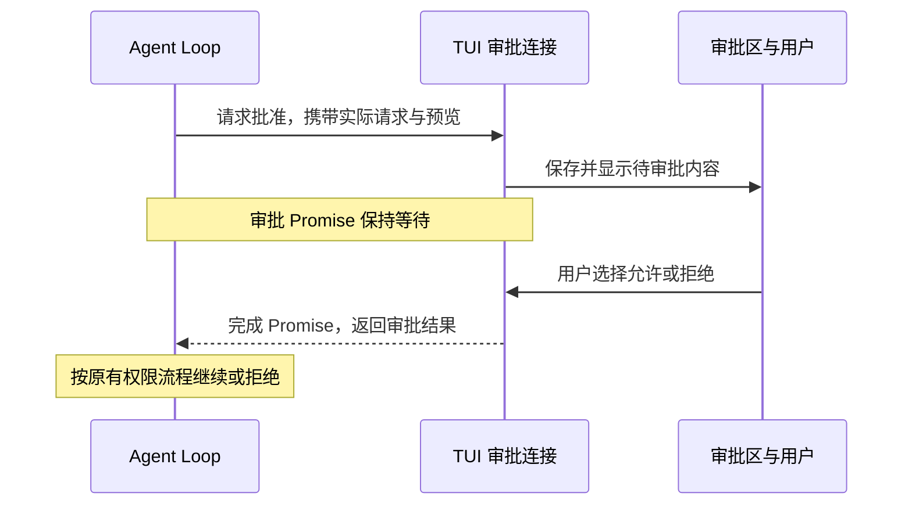

# 10.3 在界面中批准工具调用

[第 10 章首页](../README.md) · [上一节：10.2 让界面跟着执行变化](../02-live-progress/README.md) · [下一节：10.4 取消以后，继续留在对话里](../04-cancel-and-restore/README.md)

## 问题：画面显示“等待批准”，谁来让执行继续

前两节已经能显示问答和工具进展。现在把任务改成“创建一个说明项目启动方式的文件”，已有权限策略会要求先确认写入。核心也会像第六章一样，准备实际修改和预览，等待批准以后再保存。

本章此前没有提供 TUI 审批输入，所以待确认的操作会被拒绝。只加一行“等待批准”还不够：画面虽然变了，Agent Loop 正在等待的审批函数却没有收到结果。

本节要把这段等待接起来。用户应当能在同一个界面中查看请求和预览，再作出选择；选择必须回到原来的审批通道，不能由显示组件绕过权限检查直接调用工具。

## 解决方案：让审批函数等待界面中的一次选择

第五章已经定义了审批函数：它收到 `ApprovalRequest`，最后返回一个 `ApprovalResponse`。两者之间可以异步等待。文本终端等待用户输入一行，TUI 则等待用户在审批区作出选择。

我们保留这个接口，新增一个很小的连接对象。核心调用审批函数时，它创建一个尚未完成的 Promise，并把当前请求交给界面显示。用户作出选择后，连接对象用允许或拒绝完成这个 Promise，核心的 `await` 才得到结果。



图中的虚线是函数异步返回结果。画面显示来自审批请求本身；旁边的 `approval_start`、`approval_finish` 事件继续用于记录过程，二者不互相代替。

## 工作原理

### 1. 一边保存要显示的请求，一边保存等待的返回入口

Promise 可以先创建，稍后再通过它的 `resolve` 给出结果。这使两个发生在不同时间的动作能够衔接：Agent Loop 现在提出审批，用户几秒以后才作出选择。

连接对象需要保留的内容很少：当前请求，以及完成当前 Promise 的方法。请求决定审批区显示什么；完成方法决定用户选择以后，怎样让那个仍在等待的调用继续。

二者的生命周期必须一致。收到选择以后，程序先清除当前等待，再通知界面隐藏审批区，最后完成 Promise。这样同一次审批不能因为多按了一个键而被重复处理。

### 2. 审批预览来自已经准备好的操作

写入前的预览仍由第六章的工具准备过程生成。TUI 不根据聊天里的“我打算创建……”重新拼一份预览，而是显示核心通过 `ApprovalRequest` 交来的内容。

原因是用户确认的应该是即将执行的那次操作。工具名称、资源范围、请求原因和预览都与这次请求有关。预览中的特殊控制字符会像上一节一样显示成 `\u001b` 等可见转义，防止内容本身改变终端画面；准备执行的原始内容仍由核心保存。选择允许以后，核心继续使用已经准备好的调用，原有内容变化检查也继续执行。

只读范围是否可以记住批准，仍由请求里的 `allowSession` 决定。文件写入与命令每次都要单独批准，界面不能为了按钮看起来整齐，就给这些请求也提供“本次会话一直允许”。

预览还可能超过一个屏幕。普通进度可以只显示末尾，审批却不能截掉准备执行的内容后仍让用户批准。本节把完整审批内容按终端宽度折行，再按可用行数分页；输入 `next` 或 `prev` 并按回车即可翻页，只有查看到最后一页才能输入 `y` 批准。`n` 在任意一页都能拒绝。

窗口小于 40 列、16 行时，界面要求先放大，或直接拒绝。窗口尺寸变化后从第一页重新显示，避免布局变化后跳过内容。这里只提供审批需要的基础分页；第十一章再把历史浏览、滚动和焦点作为通用界面能力展开。

### 3. 同一段输入只能有一个用途

普通聊天输入和审批都使用键盘。如果两个输入组件同时接收同一个按键，用户想批准一次工具调用，那个字符却可能同时进入下一条聊天草稿。

所以审批出现时，聊天输入要暂停接收，当前按键只用于审批。审批结束以后，再恢复普通界面的输入规则。这里先建立最基本的输入归属；多处可交互区域之间的焦点切换和草稿编辑，在第十一章进一步展开。

用户在普通消息里说“已经批准”，不等于通过审批区作出选择。模型生成的“用户同意”也没有这个作用。只有本地审批输入交回的 `ApprovalResponse`，才是核心等待的决定。

### 4. 用户离开时，等待也必须结束

如果审批 Promise 一直不完成，核心就无法从审批等待中退出，界面清理也可能等不到任务结束。因此，审批连接同时监听本轮取消信号。

取消或界面关闭时，连接对象要结束尚未处理的请求，移除本次监听，并清空显示状态。核心随后沿用已有取消检查停止本轮。用户没有作出允许选择时，关闭窗口或退出程序都不能被解释成批准。

这条清理路线从本节就完整提供。下一节改变的是取消之后界面是否继续留着，而不是到那时才处理悬空的审批等待。

## 本节改动文件

| 状态 | 文件 | 本节变化 |
| --- | --- | --- |
| NEW | [src/ui/tui/approval.ts](src/ui/tui/approval.ts) | 等待一次真实审批选择，处理取消，并把完整预览折行分页 |
| CHANGED | [src/ui/tui/app.tsx](src/ui/tui/app.tsx) | 接入审批函数，显示审批区，切换当前输入用途 |

## 动手构建

跟写起点是 10.2，本节目标目录是 `chapter-10-terminal-ui/03-tool-approval/`。沿用上一节完整 `src/`，新增审批连接，再把它交给事件流入口和审批区。

### 新增一个等待界面决定的审批函数

新增 `src/ui/tui/approval.ts`，完整文件如下：

```ts
/**
 * 10.3 在界面中批准工具调用 | [NEW] ui/tui/approval.ts
 *
 * 学习目标：让界面把一次明确决定交回原来的审批等待，而不是用显示事件代替授权。
 * 输入：Agent Loop 传来的 ApprovalRequest、同轮取消信号，以及显示或清除面板的函数。
 * 输出：完整分页文字和一个最终批准或拒绝结果；取消或显示失败会让等待抛错。
 * 状态：每次等待独立持有 settled；结束后清理监听和面板，旧 respond 不能再批准任何调用。
 *
 * 本文件局部流程（全局主流程见 agent/agent-loop.ts）：
 *   预览 -> 可见转义 -> 按终端列宽折行 -> 按可用行数分成全部页面
 *   请求 -> 信号已取消？-- 是 -> 抛出取消原因
 *                        +-- 否 -> 创建 Promise、登记取消监听 -> 显示 pending
 *   输入 -> 已结束或已取消？-- 是 -> 返回 false
 *                          +-- 否 -> y / n / 合法的 s？-- 否 -> false，继续等待
 *                                                     +-- 是 -> 清理 -> 返回决定
 *   abort / 显示失败 -> 清理 -> Promise 拒绝；清理面板失败也拒绝
 *
 * 分页只改变显示布局，完整 preview 仍来自已准备的操作；这里不重新解析参数或执行工具。
 * s 只在请求允许会话授权且没有操作预览时有效，写入和命令仍只能批准一次。
 * key 让 app.tsx 为新请求重建输入框；settled 则保证旧输入回调永远不能二次提交。
 * 运行观察：等待批准时工具还未启动；拒绝返回原核心，取消会立即解除这次审批等待。
 */
import { randomUUID } from "node:crypto";
import wrapAnsi from "wrap-ansi";
import type { ApprovalRequest, ApprovalResponse } from "../../permissions/policy.js";
import { screenText } from "./state.js";

// [NEW 10.3] 本文件以下实现均为本节新增。
// 每个界面等待只对应一个原审批请求；key 用来重置输入与页码。
export type PendingApproval = {
  key: string;
  request: ApprovalRequest;
  respond: (choice: string) => boolean;
};

/**
 * 把完整审批内容分成终端能逐页显示的文字。
 *
 * - 输入：原审批请求和当前终端列数、行数；尺寸来自 app.tsx 的窗口状态。
 * - 输出：包含工具、目标、原因和完整预览的页面数组；没有预览时显示对应说明。
 * - 关键步骤：先把控制字符写成可见文字，再按显示宽度折行，最后给边框和输入提示预留行数。
 * - 职责边界：这里只分页，不截去后续页面；是否已看到最后一页由审批组件检查。
 */
export function approvalPages(request: ApprovalRequest, columns: number, rows: number): string[] {
  const content = `工具：${request.call.name}\n目标：${request.resource}\n原因：${request.reason}\n\n${request.preview ?? "本次请求没有文件修改。"}`;
  const lines = wrapAnsi(screenText(content), Math.max(10, columns - 4), { hard: true, trim: false }).split("\n");
  const size = Math.max(1, rows - 11);
  return Array.from({ length: Math.ceil(lines.length / size) }, (_, page) => lines.slice(page * size, (page + 1) * size).join("\n"));
}

/**
 * 保持原审批调用等待，直到界面返回一次决定或本轮被取消。
 *
 * - 输入：核心的审批请求、同轮取消信号，以及接收 pending 或 undefined 的显示函数。
 * - 输出：Promise 只返回一次 ApprovalResponse；respond 的 false 表示输入无效或等待已经结束。
 * - 生命周期：每次调用单独保存 settled 和取消监听，结束时先禁止后续输入，再移除监听、清除面板。
 * - 失败方式：取消使用 signal.reason 拒绝；显示或清除面板抛错也拒绝，不能当作已经获得批准。
 * - 授权范围：y 只允许本次，s 还需本地请求允许且没有预览；本函数不扩大 scope，也不执行工具。
 * - 职责边界：这是核心会等待的控制通道；与只报告已发生事件的观察者不同，失败会结束本轮。
 */
export function waitForApproval(
  request: ApprovalRequest, signal: AbortSignal,
  show: (pending: PendingApproval | undefined) => void,
): Promise<ApprovalResponse> {
  signal.throwIfAborted();
  return new Promise((resolve, reject) => {
    // 这个变量属于本次 Promise；面板消失后旧 respond 仍可能被引用，但不能再次产生决定。
    let settled = false;
    const finish = (response?: ApprovalResponse, error?: unknown) => {
      if (settled) return;
      // 先锁定结束状态，防止清理面板的过程中又收到输入或取消。
      settled = true;
      signal.removeEventListener("abort", abort);
      try { show(undefined); } catch (displayError) { reject(displayError); return; }
      if (response) resolve(response); else reject(error);
    };
    const abort = () => finish(undefined, signal.reason);
    signal.addEventListener("abort", abort, { once: true });
    const pending: PendingApproval = { key: randomUUID(), request, respond(choice) {
      if (settled || signal.aborted) return false;
      if (choice === "y") finish({ decision: "allow_once" });
      else if (choice === "s" && request.allowSession && request.preview === undefined) finish({ decision: "allow_session" });
      else if (choice === "n") finish({ decision: "deny", reason: "用户拒绝了本次操作" });
      else return false;
      return true;
    } };
    try { show(pending); } catch (error) { finish(undefined, error); }
    // 显示函数也可能同步触发取消；补查一次，避免留下永远等不到结果的 Promise。
    if (signal.aborted) abort();
  });
}
```

`waitForApproval()` 返回的 Promise 就是核心原来等待的审批结果。`show(pending)` 让界面知道当前请求，`pending.respond()` 接收一次明确选择；`settled` 防止旧请求被再次使用。取消会移除本轮监听并让等待以取消原因结束，不会返回允许。

`approvalPages()` 先处理用于显示的文字，再按宽度折行、按行数分页。它保留完整审批内容，不用省略号代替尚未展示的预览。页码和按键属于显示层，批准结果仍由原接口返回。

### 把审批显示与原有执行接起来

在 `src/ui/tui/app.tsx` 中，把文件开头到旧 `TuiApp` 的说明注释之前这一段替换为下面内容。这里增加审批模块的导入与 `ApprovalPanel`，会话类型继续沿用：

```tsx
/**
 * 10.3 在界面中批准工具调用 | [CHANGED] ui/tui/app.tsx
 *
 * 学习目标：把工具预览放进界面，让用户决定以后再恢复原来的工具执行。
 * 输入：已创建的模型、键盘输入和同一 Agent 事件流；界面使用 .tsx 中的 JSX 描述布局。
 * 输出：终端里的留存消息与当前交互区域；普通问题交给 streamAgentRun 执行。
 * 状态：Session 持有模型历史、只读授权和本轮任务；React state 只保存需要重新绘制的画面数据。
 * 失败：本轮异常显示本地状态，事件生成器清理结束后才恢复输入；已经发生的工具操作不回滚。
 *
 * 本文件局部流程（全局主流程见 agent/agent-loop.ts）：
 *   startTui -> 创建 Session、注册退出监听 -> 挂载 TuiApp
 *   Enter -> 正在执行或关闭？-- 是 -> 忽略提交
 *                            +-- 否 -> 空白？-- 是 -> 等待输入
 *                                           +-- 否 -> 本地命令？-- 是 -> 处理后返回或退出
 *                                                              +-- 否 -> 新建本轮信号、设为忙碌
 *   本轮事件 -> current 逐条更新 RunView -> 通知 React 绘制最新状态
 *   ask -> waitForApproval -> 隐藏普通输入，显示完整分页请求
 *       -> y / n / 合法 s -> 回原审批 Promise；取消 / 显示失败 -> Promise 拒绝
 *   本轮结束 / 抛错 -> finally -> 清理本轮引用 -> 仍在界面？-- 是 -> 留下结果、恢复输入
 *                                                        +-- 否 -> 不再更新画面
 *   Ctrl+C / Ctrl+D / 退出信号 -> quit
 *   quit -> closing=true -> abort -> 等 session.done -> 卸载 Ink
 *   startTui finally -> 再确认任务结束 -> 移除信号与输入监听 -> 返回
 *
 * React 更新状态时会重新调用组件，描述应该出现的画面；实际任务只能由提交回调启动。
 * history 在组件外，所以重新绘制不会清空上下文；Static 的显示记录也不能替代这份模型历史。
 * 本文件只组织输入和显示，模型判断、工具执行、权限范围与历史提交仍由已有执行链负责。
 * 运行观察：需要批准时普通输入消失；逐页查看并作出决定后，同一轮继续。
 */
import { useState } from "react";
import { Box, Static, Text, render, useInput, useWindowSize } from "ink";
import wrapAnsi from "wrap-ansi";
import { emptyRunView, updateRunView, runTranscript, screenText, type RunView } from "./state.js";
// [NEW 10.3] 审批显示与等待沿用原核心的请求和响应类型。
import { approvalPages, waitForApproval, type PendingApproval } from "./approval.js";
import TextInput from "ink-text-input";
import type { Message, Model } from "../../models/client.js";
import { streamAgentRun } from "../../agent/run-stream.js";
import { explainError } from "../../errors.js";

// [KEEP 来自 10.1] Session 属于一次 startTui 调用，不随组件重新绘制而重建。
type Session = {
  history: Message[];
  grants: Set<string>;
  controller?: AbortController;
  done?: Promise<void>;
  closing: boolean;
};
type Entry = { label: "你" | "Agent" | "本地"; text: string };

/**
 * 让用户逐页查看完整请求，再明确提交这一次审批决定。
 *
 * - 输入：当前 PendingApproval 与终端尺寸；request 和 respond 属于同一次核心审批等待。
 * - 输出：当前页、提示和一个审批输入框；next / prev 只翻页，y / n / s 还要按 Enter 才提交。
 * - 状态：page、answer、hint 属于这次面板；请求 key 或窗口尺寸改变时由父组件重新挂载并清空。
 * - 批准条件：窗口至少 40 列、16 行且已经到最后一页；任何页都可以输入 n 拒绝。
 * - 关键原因：不能在只显示了部分修改时批准全部内容；尺寸变化后需按新分页重新查看。
 * - 职责边界：本函数只检查显示条件，s 是否属于可记住的只读范围仍由 pending.respond 检查。
 */
// [NEW 10.3] 新增审批面板；只有明确提交的决定才回到原审批等待。
function ApprovalPanel({ pending, columns, rows }: { pending: PendingApproval; columns: number; rows: number }) {
  const pages = approvalPages(pending.request, columns, rows);
  const [page, setPage] = useState(0);
  const [answer, setAnswer] = useState("");
  const [hint, setHint] = useState("");
  const tooSmall = columns < 40 || rows < 16;
  // 翻页只更新画面；批准还要满足末页和窗口尺寸条件，拒绝则随时可提交。
  const submit = (value: string) => {
    const choice = value.trim().toLowerCase();
    setAnswer("");
    if (choice === "next" && page < pages.length - 1) { setPage(page + 1); setHint(""); return; }
    if (choice === "prev" && page > 0) { setPage(page - 1); setHint(""); return; }
    if (choice !== "n" && (tooSmall || page !== pages.length - 1)) { setHint("请先逐页查看完整内容，或输入 n 拒绝。"); return; }
    if (!pending.respond(choice)) setHint("请输入 y、n，或当前请求允许的 s，再按 Enter。");
  };
  return <Box borderStyle="round" borderColor="yellow" paddingX={1} flexDirection="column">
    <Text bold color="yellow">等待批准 · 第 {page + 1}/{pages.length} 页</Text>
    {tooSmall ? <Text>窗口过小，请放大至至少 40 列、16 行，或输入 n 拒绝。</Text> : <Text>{pages[page]}</Text>}
    <Text dimColor>next 下一页 · prev 上一页 · n 拒绝</Text>
    <Text>{!tooSmall && page === pages.length - 1 ? `y 批准本次${pending.request.allowSession && !pending.request.preview ? " · s 本次会话允许" : ""}；输入后按 Enter` : "查看到最后一页后才能批准"}</Text>
    {hint && <Text color="yellow">{hint}</Text>}
    <Box><Text color="yellow">审批 &gt; </Text><TextInput value={answer}
      onChange={(value) => setAnswer(screenText(value).replace(/[\r\n\t]/g, " "))} onSubmit={submit} /></Box>
  </Box>;
}
```

接着把 `TuiApp()` 连同说明替换为：

```tsx
/**
 * 消费执行事件，并在核心请求批准时把输入切换到审批面板。
 *
 * - 输入：入口创建的模型、整次会话共用的 Session，以及等待清理后退出的 quit 函数。
 * - 输出：描述终端布局的 JSX；普通输入、执行进度和审批面板按当前状态选择显示。
 * - 状态：useState 保存显示副本；模型 history、授权和运行中的 Promise 仍由 Session 持有。
 * - 事件处理：局部 current 按顺序积累每条事件，React 即使合并绘制也不会丢失已经收到的文字。
 * - 审批处理：把 waitForApproval 作为独立回调交给执行链；显示事件本身不会产生批准。
 * - 输入归属：出现 approval 时只挂载审批输入；任务结束后清除审批，再恢复普通输入。
 * - 失败方式：异常更新本轮状态；finally 等事件生成器清理后留下记录，关闭期间不再更新界面。
 * - 职责边界：组件不执行工具，也不把显示记录写回模型历史；重新绘制不会再次启动任务。
 */
function TuiApp({ model, session, quit }: { model: Model; session: Session; quit: (code: number) => void }) {
  // 这些值描述画面；setter 通知 React 重新绘制，不能把模型任务写进组件渲染过程。
  const [draft, setDraft] = useState("");
  const [entries, setEntries] = useState<Entry[]>([]);
  const [busy, setBusy] = useState(false);
  // [NEW 10.3] undefined 表示没有审批等待；有值时由审批面板独占输入。
  const [approval, setApproval] = useState<PendingApproval>();
  const [view, setView] = useState<RunView>({ ...emptyRunView(), status: "就绪" });
  const { columns, rows } = useWindowSize();
  // 函数式更新接在上一次 entries 后追加，连续事件不依赖某次绘制时捕获的旧数组。
  const append = (label: Entry["label"], text: string) => setEntries((old) => [...old, { label, text: screenText(text) }]);

  useInput((input, key) => {
    if (key.ctrl && input === "c") quit(130);
    if (key.ctrl && input === "d") quit(0);
  });

  const submit = (value: string) => {
    // session.done 立即成为并发保护；不必等 React 把输入框换成忙碌画面后才阻止再次发送。
    if (session.done || session.closing) return;
    const prompt = value.trim();
    if (!prompt) return;
    setDraft("");
    // 本地命令只改本地会话；它们不作为 user 消息送给模型。
    if (prompt === "/exit") { quit(0); return; }
    if (prompt === "/reset") { session.history.length = 0; append("本地", "对话历史已清空；会话授权保留。"); return; }
    if (prompt === "/permissions reset") { session.grants.clear(); append("本地", "本次会话的只读授权已撤销。"); return; }
    if (prompt === "/permissions") { append("本地", session.grants.size ? [...session.grants].join("\n") : "当前没有会话授权。"); return; }
    append("你", prompt);
    setBusy(true);
    setView(emptyRunView());
    // 一轮只对应一个控制器；history 与 grants 比这一轮活得更久，不能一起重新创建。
    const controller = new AbortController();
    session.controller = controller;
    session.done = (async () => {
      let current = emptyRunView();
      try {
        // [CHANGED 10.3] 第五个参数现在是原审批链等待的回调；事件消费仍独立更新进度。
        for await (const { event } of streamAgentRun(model, session.history, prompt, controller.signal, (request, signal) => waitForApproval(request, signal, (pending) => {
          if (!session.closing) setApproval(pending);
        }), session.grants)) {
          // [KEEP 来自 10.2] 本地变量保留每条事件；React 可以合并绘制，但不能丢掉已收到的数据。
          current = updateRunView(current, event);
          if (!session.closing) setView(current);
        }
      } catch (error) {
        current = { ...current, status: controller.signal.aborted ? "已取消本轮" : `运行失败：${screenText(explainError(error))}` };
      } finally {
        // for await 完成或抛错前会等待生成器的 finally；此时才解除本轮占用。
        session.controller = undefined;
        session.done = undefined;
        if (!session.closing) {
          append("Agent", runTranscript(current));
          setView(current);
          // [NEW 10.3] 本轮结束后不保留旧审批输入。
          setApproval(undefined);
          setBusy(false);
        }
      }
    })();
  };

  // [CHANGED 10.3] 审批存在时只挂载审批面板；key 含请求与尺寸，改变后页码和草稿都从头开始。
  return <Box flexDirection="column">
    <Static items={entries}>{(entry, index) => <Box key={index} flexDirection="column" marginBottom={1}>
      <Text color={entry.label === "你" ? "cyan" : entry.label === "Agent" ? "magenta" : "yellow"} bold>{entry.label}</Text>
      <Text>{entry.text}</Text>
    </Box>}</Static>
    {approval ? <ApprovalPanel key={`${approval.key}:${columns}:${rows}`} pending={approval} columns={columns} rows={rows} />
      : <Box borderStyle="round" paddingX={1} flexDirection="column">
      <Text bold>Hello, My Agent</Text>
      <Text color={busy ? "yellow" : "green"}>状态：{view.status}{view.usage ? ` · ${view.usage}` : ""}</Text>
      {busy && <Box flexDirection="column">
        <Text color="magenta">Agent（当前文字末尾）</Text>
        <Text>{wrapAnsi(view.answers.at(-1)?.text || "等待模型…", Math.max(10, columns - 4), { hard: true, trim: false }).split("\n").slice(-Math.max(2, Math.min(8, rows - 12))).join("\n")}</Text>
        <Text dimColor>本轮工具：{view.tools.length} 次（显示最近 3 次）</Text>
        {view.tools.slice(-3).map((tool) => <Text key={tool.sequence}>#{tool.sequence} {tool.name} · {tool.status}</Text>)}
      </Box>}
      {busy ? <Text dimColor>正在处理本轮任务…</Text> : <Box><Text color="cyan">你 &gt; </Text>
        <TextInput value={draft} onChange={(value) => setDraft(screenText(value).replace(/[\r\n\t]/g, " "))} onSubmit={submit} placeholder="输入问题，Enter 发送" />
      </Box>}
      <Text dimColor>/reset 清空对话 · /permissions 查看授权 · /exit 退出 · Ctrl+C 停止并退出</Text>
    </Box>}
  </Box>;
}
```

文件末尾的 `startTui()` 保持上一节实现。

变化集中在两处：调用 `streamAgentRun()` 时传入真正的审批函数；渲染时根据 `approval` 选择审批区或普通交互区。二者不会同时挂载聊天输入框，因此同一段输入只有一个用途。

审批面板的 `key` 包含请求编号和窗口尺寸。新的请求或尺寸变化会重新创建这一面板，页码与审批输入随之重置，旧请求的选择不会带到下一次。

## 运行验证

在仓库根目录构建本节：

```bash
npm run lesson:10.3
```

再启动 TUI：

```bash
hello-my-agent --output tui
```

下面使用新的实验文件 `tui-approval-demo.txt`。如果仓库中已经存在这个名字，改用一个尚不存在的文件名，再提出创建任务：

```text
请使用 write_file 创建 tui-approval-demo.txt，内容只有一行 hello tui。
```

审批区应显示工具、目标、原因和准备写入的预览。先输入 `n` 并按回车，确认界面报告拒绝；模型可以继续解释结果，但没有获得这次写入许可。输入 `/exit` 后，在 shell 检查：

```bash
ls tui-approval-demo.txt
```

预期提示该文件不存在。真实模型若改为提出其他写入请求，同样拒绝；固定检查会使用确定请求验证拒绝分支。

再次启动本节 TUI，提出同一个创建任务。这次查看完整预览，再输入 `y` 并按回车。任务结束并退出后，读取实验文件：

```bash
cat tui-approval-demo.txt
```

预期是刚才批准的 `hello tui`。这个结果应与审批预览一致，不能只根据模型说“已创建”判断写入成功。

### 观察较长的预览

提出创建另一个新文件的任务，让内容超过当前终端一屏。审批应出现页码；输入 `next` 并按回车逐页查看，也可以用 `prev` 回看。未到最后一页时输入 `y`，应继续等待，不执行写入。实验中不需要保存这个文件，在任意页输入 `n` 即可结束审批。

对允许记住的只读请求，最后一页会额外显示 `s`。当前请求不允许会话授权时，输入 `s` 不会使审批通过。

本节按 `Ctrl+C` 仍会取消当前任务并退出界面。审批等待也会结束，未批准的工具不能因此执行。

## 本节完成后的 Agent

TUI 现在既能观察执行，也能在需要时接收用户决定。审批请求和预览来自原有权限与工具准备流程，用户选择通过 Promise 返回原有 Agent Loop；显示组件没有获得额外的执行权限。

不过，本章到这里按下 `Ctrl+C` 仍会在取消后结束整个界面。下一节把退出分成两种情形：任务运行时先停下这一轮，空闲时再离开，让用户能够取消以后继续交流。
