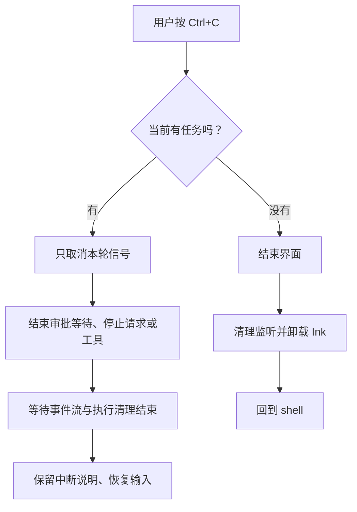

# 10.4 取消以后，继续留在对话里

[第 10 章首页](../README.md) · [上一节：10.3 在界面中批准工具调用](../03-tool-approval/README.md) · [下一步：练习与答案](../EXERCISES.md)

## 问题：只想停下当前任务，为什么整个界面都退出了

第八章的文本终端已经支持取消一轮后继续交流。本章最初接入 TUI 时，为了先走通输入和绘制，采用的是“取消后结束界面”。现在显示和审批都已经接齐，我们可以把熟悉的取消后继续行为接回来。

用户按下 `Ctrl+C` 时，意思取决于当前状态：模型还在生成，通常是想让它先停下来；界面空闲时，则可以用同一个快捷键离开。程序要区分这两种情况，并且不能在按键发生的一瞬间就假设任务已经停止。

本节也把默认启动方式补齐。真正坐在终端前持续交流时，默认进入 TUI；把结果重定向到文件，或只想完成一次 `--prompt` 时，则继续使用文本输出。

## 解决方案：让“取消一轮”和“结束界面”走两条路线

每轮任务仍使用自己的 `AbortController`。运行中按 `Ctrl+C` 只请求取消这一轮，界面显示正在停止，继续等待事件流和真实执行链完成清理。等这一轮结束后，才解除运行状态，恢复输入。

空闲时按 `Ctrl+C`，或输入 `/exit`，才结束界面。如果要连同活动任务一起退出，可以按 `Ctrl+D`。退出前仍保留最后一道清理：如果存在活动任务或待审批请求，先让它们结束，再把终端交回外面的 shell。



这里的“等待”有实际意义。命令进程收到停止请求以后，还要由第七章的进程管理代码回收；模型请求也要沿第八章的信号停止。TUI 使用这些已有能力，不另写一套工具取消逻辑。

## 工作原理

### 1. 收到取消请求，不等于执行已经结束

取消信号传递的是“请停止”。模型或工具还需要在自己的可中断位置响应，然后完成清理。若界面立刻把活动任务删掉并允许提交下一轮，两轮执行就可能在同一份历史上重叠。

所以界面先保存活动任务，直到读取事件的异步过程真正结束。最终清理阶段再移除本轮控制器，恢复可输入状态。下一轮创建新的控制器，不能复用已经取消的信号。

取消也不意味着回滚。文件可能已经写入，命令可能已经产生结果。核心继续保留已经发生的操作和中断说明；界面提示用户本轮停止，但不会声称文件系统已经恢复到执行之前。

### 2. 审批中的取消同样属于当前任务

有时模型并没有在生成，工具也还没有执行，整轮只是停在审批等待。它仍然是一轮活动任务，所以 `Ctrl+C` 应取消这一轮，而不是给审批一个隐含的允许。

上一节的审批连接已经监听取消信号。信号到达以后，连接清空审批区，并让等待中的 Promise 以取消原因结束；核心沿已有取消路线停止本轮。界面等待这段过程完成，然后恢复普通输入。

这也解释了为什么审批显示状态与活动任务不能合并成一个变量：一个负责显示当前请求，另一个负责描述整轮是否已经结束。审批区消失的那一刻，清理可能还没完成。

### 3. 终端环境决定适合哪种输出

TTY 可以理解成程序正在连接的交互终端。键盘输入和屏幕输出都连接着终端时，程序可以接收按键并重新绘制画面；输出被 `>` 重定向到文件时，文件需要的是可顺序读取的内容。

本节增加 `auto` 作为默认输出模式，并按下面的规则选择消费者：

| 启动方式 | 实际输出 |
| --- | --- |
| `auto`，没有 `--prompt`，输入与输出都是真实终端，且 `TERM` 不是 `dumb` | TUI 持续对话 |
| `auto`，提供 `--prompt` | 文本单次任务 |
| `auto`，输入或输出没有连接真实终端，或 `TERM=dumb` | 原有文本模式 |
| 显式 `--output tui` | 要求上述终端条件，且不能同时使用 `--prompt` |
| 显式 `--output text` | 原有文本消费者 |
| 显式 `--output jsonl` | 要求 `--prompt`，逐行输出结构化事件 |

非交互环境仍沿用原有的审批规则：没有真实用户输入时，待确认请求默认拒绝。自动选择显示方式不能改变工具权限。

### 4. 负责启动界面，也要负责把它完整关闭

界面退出会触发组件卸载。此前为按键、信号和审批建立的等待，都需要在对应生命周期内结束。否则进程即使已经不显示界面，也可能仍被监听器或任务占用。

本章让 `startTui()` 持有整个界面的会话对象和 Ink 实例。它启动界面，也等待界面退出；无论正常返回还是途中失败，都在 `finally` 中请求取消、等待活动任务、卸载画面并移除自己注册的进程与输入监听。

界面组件负责响应按键和显示状态，异步清理由启动函数等待。这样，重新绘制不会重新创建会话，组件退出也不等于随意放弃仍在执行的任务。

本节完成最基本的终端交还过程。不同终端的宽度、中文和 emoji 显示，以及窗口变化后的布局，会在第十一章针对实际显示问题继续处理。

## 本节改动文件

| 状态 | 文件 | 本节变化 |
| --- | --- | --- |
| CHANGED | [src/ui/tui/app.tsx](src/ui/tui/app.tsx) | 按忙闲状态区分取消与退出，等待当前任务清理后继续输入 |
| CHANGED | [src/cli.ts](src/cli.ts) | 增加默认 `auto`，根据提问方式与终端条件选择输出 |

## 动手构建

跟写起点是 10.3，本节目标目录是 `chapter-10-terminal-ui/04-cancel-and-restore/`。沿用上一节完整 `src/`，调整界面的取消操作和命令入口的输出选择。

### 让取消操作等待本轮结束，再恢复输入

在 `src/ui/tui/app.tsx` 中，把文件头教学注释替换为：

```ts
/**
 * 10.4 取消以后，继续留在对话里 | [CHANGED] ui/tui/app.tsx
 *
 * 学习目标：把取消当前任务和退出整个界面分开，清理后继续使用原会话。
 * 输入：已创建的模型、键盘输入和同一 Agent 事件流；界面使用 .tsx 中的 JSX 描述布局。
 * 输出：终端里的留存消息与当前交互区域；普通问题交给 streamAgentRun 执行。
 * 状态：Session 持有模型历史、只读授权和本轮任务；React state 只保存需要重新绘制的画面数据。
 * 失败：本轮异常显示本地状态，事件生成器清理结束后才恢复输入；已经发生的工具操作不回滚。
 *
 * 本文件局部流程（全局主流程见 agent/agent-loop.ts）：
 *   startTui -> 创建 Session、注册退出监听 -> 挂载 TuiApp
 *   Enter -> 正在执行或关闭？-- 是 -> 忽略提交
 *                            +-- 否 -> 空白？-- 是 -> 等待输入
 *                                           +-- 否 -> 本地命令？-- 是 -> 处理后返回或退出
 *                                                              +-- 否 -> 新建本轮信号、设为忙碌
 *   本轮事件 -> current 逐条更新 RunView -> 通知 React 绘制最新状态
 *   ask -> waitForApproval -> 隐藏普通输入，显示完整分页请求
 *       -> y / n / 合法 s -> 回原审批 Promise；取消 / 显示失败 -> Promise 拒绝
 *   本轮结束 / 抛错 -> finally -> 清理本轮引用 -> 仍在界面？-- 是 -> 留下结果、恢复输入
 *                                                        +-- 否 -> 不再更新画面
 *   [CHANGED] Ctrl+C -> 有本轮任务？-- 是 -> abort -> 等清理 -> 恢复输入
 *                                  +-- 否 -> quit
 *   quit -> closing=true -> abort -> 等 session.done -> 卸载 Ink
 *   startTui finally -> 再确认任务结束 -> 移除信号与输入监听 -> 返回
 *
 * React 更新状态时会重新调用组件，描述应该出现的画面；实际任务只能由提交回调启动。
 * history 在组件外，所以重新绘制不会清空上下文；Static 的显示记录也不能替代这份模型历史。
 * 本文件只组织输入和显示，模型判断、工具执行、权限范围与历史提交仍由已有执行链负责。
 * 运行观察：运行或审批中 Ctrl+C 后显示取消状态并重新出现输入框；空闲时 Ctrl+C 才退出。
 */
```

导入、会话类型与 `ApprovalPanel()` 沿用 10.3。把 `TuiApp()` 连同说明替换为下面的完整函数，主要变化是接收 `interrupt`、响应 `Ctrl+C` 并更新操作提示：

```tsx
/**
 * 消费执行事件，并在取消完成后让同一个界面继续接收问题。
 *
 * - 输入：入口创建的模型、会话 Session、退出函数 quit，以及按忙闲选择取消或退出的 interrupt。
 * - 输出：描述终端布局的 JSX；普通输入、执行进度和审批面板按当前状态选择显示。
 * - 状态：useState 保存显示副本，Session 保留 history、授权、当前控制器和运行中的 Promise。
 * - 事件处理：局部 current 按顺序积累每条事件，React 即使合并绘制也不会丢失已经收到的文字。
 * - 取消处理：按 Ctrl+C 先说明正在等待清理；busy 保持为真，直到本轮 finally 才恢复输入。
 * - 审批处理：waitForApproval 使用同轮信号，取消会解除等待；旧审批不能接收下一轮输入。
 * - 失败方式：异常更新本轮状态；finally 留下已收到的文字和结束状态，清除本轮控制器与审批。
 * - 职责边界：显示记录不是模型历史；重新绘制不会重开任务，下一次 submit 才创建新的控制器。
 */
// [CHANGED 10.4] 单独接收 interrupt，让组件触发“取消本轮”而不是直接退出。
function TuiApp({ model, session, quit, interrupt }: { model: Model; session: Session; quit: (code: number) => void; interrupt: () => void }) {
  // 这些值描述画面；setter 通知 React 重新绘制，不能把模型任务写进组件渲染过程。
  const [draft, setDraft] = useState("");
  const [entries, setEntries] = useState<Entry[]>([]);
  const [busy, setBusy] = useState(false);
  const [approval, setApproval] = useState<PendingApproval>();
  const [view, setView] = useState<RunView>({ ...emptyRunView(), status: "就绪" });
  const { columns, rows } = useWindowSize();
  // 函数式更新接在上一次 entries 后追加，连续事件不依赖某次绘制时捕获的旧数组。
  const append = (label: Entry["label"], text: string) => setEntries((old) => [...old, { label, text: screenText(text) }]);

  // [CHANGED 10.4] 先提示正在取消，保持 busy；任务真正结束后才由 finally 恢复输入。
  useInput((input, key) => {
    if (key.ctrl && input === "c") {
      if (session.done) { setDraft(""); setView((current) => ({ ...current, status: "正在取消，等待清理…" })); }
      interrupt();
    }
    if (key.ctrl && input === "d") quit(0);
  });

  const submit = (value: string) => {
    // session.done 立即成为并发保护；不必等 React 把输入框换成忙碌画面后才阻止再次发送。
    if (session.done || session.closing) return;
    const prompt = value.trim();
    if (!prompt) return;
    setDraft("");
    // 本地命令只改本地会话；它们不作为 user 消息送给模型。
    if (prompt === "/exit") { quit(0); return; }
    if (prompt === "/reset") { session.history.length = 0; append("本地", "对话历史已清空；会话授权保留。"); return; }
    if (prompt === "/permissions reset") { session.grants.clear(); append("本地", "本次会话的只读授权已撤销。"); return; }
    if (prompt === "/permissions") { append("本地", session.grants.size ? [...session.grants].join("\n") : "当前没有会话授权。"); return; }
    append("你", prompt);
    setBusy(true);
    setView(emptyRunView());
    // 一轮只对应一个控制器；history 与 grants 比这一轮活得更久，不能一起重新创建。
    const controller = new AbortController();
    session.controller = controller;
    session.done = (async () => {
      let current = emptyRunView();
      try {
        for await (const { event } of streamAgentRun(model, session.history, prompt, controller.signal, (request, signal) => waitForApproval(request, signal, (pending) => {
          if (!session.closing) setApproval(pending);
        }), session.grants)) {
          // [KEEP 来自 10.2] 本地变量保留每条事件；React 可以合并绘制，但不能丢掉已收到的数据。
          current = updateRunView(current, event);
          if (!session.closing) setView(current);
        }
      } catch (error) {
        current = { ...current, status: controller.signal.aborted ? "已取消本轮" : `运行失败：${screenText(explainError(error))}` };
      } finally {
        // for await 完成或抛错前会等待生成器的 finally；此时才解除本轮占用。
        session.controller = undefined;
        session.done = undefined;
        if (!session.closing) {
          append("Agent", runTranscript(current));
          setView(current);
          setApproval(undefined);
          setBusy(false);
        }
      }
    })();
  };

  // [CHANGED 10.4] 提示文字同步说明新的 Ctrl+C 规则；普通输入仍只在 busy=false 时挂载。
  return <Box flexDirection="column">
    <Static items={entries}>{(entry, index) => <Box key={index} flexDirection="column" marginBottom={1}>
      <Text color={entry.label === "你" ? "cyan" : entry.label === "Agent" ? "magenta" : "yellow"} bold>{entry.label}</Text>
      <Text>{entry.text}</Text>
    </Box>}</Static>
    {approval ? <ApprovalPanel key={`${approval.key}:${columns}:${rows}`} pending={approval} columns={columns} rows={rows} />
      : <Box borderStyle="round" paddingX={1} flexDirection="column">
      <Text bold>Hello, My Agent</Text>
      <Text color={busy ? "yellow" : "green"}>状态：{view.status}{view.usage ? ` · ${view.usage}` : ""}</Text>
      {busy && <Box flexDirection="column">
        <Text color="magenta">Agent（当前文字末尾）</Text>
        <Text>{wrapAnsi(view.answers.at(-1)?.text || "等待模型…", Math.max(10, columns - 4), { hard: true, trim: false }).split("\n").slice(-Math.max(2, Math.min(8, rows - 12))).join("\n")}</Text>
        <Text dimColor>本轮工具：{view.tools.length} 次（显示最近 3 次）</Text>
        {view.tools.slice(-3).map((tool) => <Text key={tool.sequence}>#{tool.sequence} {tool.name} · {tool.status}</Text>)}
      </Box>}
      {busy ? <Text dimColor>正在处理本轮任务…</Text> : <Box><Text color="cyan">你 &gt; </Text>
        <TextInput value={draft} onChange={(value) => setDraft(screenText(value).replace(/[\r\n\t]/g, " "))} onSubmit={submit} placeholder="输入问题，Enter 发送" />
      </Box>}
      <Text dimColor>/reset 清空对话 · /permissions 查看授权 · /exit 退出 · Ctrl+C 取消本轮，空闲时退出</Text>
    </Box>}
  </Box>;
}
```

再把末尾的 `startTui()` 连同说明替换为：

```tsx
/**
 * 持有整次 TUI 会话，让取消一轮与退出界面分别完成各自的清理。
 *
 * - 输入：CLI 已创建的 Model；终端是否可交互由 CLI 在调用前检查。
 * - 输出：界面卸载且清理完成后返回；进程退出码只在退出入口设置。
 * - 生命周期：Session 在组件外只创建一次，React 重新绘制或一轮取消都不会重建 history 和只读授权。
 * - 中断选择：Ctrl+C / SIGINT 在有控制器时只发取消信号；空闲时才走 quit 并退出。
 * - 退出顺序：quit 先标记 closing，再取消并等待 session.done，最后卸载 Ink；其他退出信号沿用此路径。
 * - 失败方式：挂载或等待抛错仍进入 finally；移除本函数的监听后由调用方报告错误。
 * - 职责边界：Ink 卸载负责恢复终端输入模式；取消不是回滚，下一轮仍须核实之前的工具结果。
 */
export async function startTui(model: Model): Promise<void> {
  // 组件可以多次重新绘制，这个对象只随本次 startTui 创建与销毁。
  const session: Session = { history: [], grants: new Set(), closing: false };
  let instance: ReturnType<typeof render> | undefined;
  const quit = (code: number) => {
    if (session.closing) return;
    // 先封住新的提交和状态更新，再等待当前任务；否则退出期间仍可能继续绘制。
    session.closing = true;
    session.controller?.abort();
    void Promise.resolve(session.done).then(() => { process.exitCode = code; instance?.unmount(); });
  };
  // [CHANGED 10.4] 有任务时只取消它；下一个问题会建立新的控制器。
  const interrupt = () => { if (session.controller) session.controller.abort(); else quit(130); };
  const terminate = () => quit(143);
  const hangup = () => quit(129);
  const endInput = () => quit(0);
  process.on("SIGINT", interrupt);
  process.on("SIGTERM", terminate);
  process.on("SIGHUP", hangup);
  process.stdin.on("end", endInput);
  try {
    // [CHANGED 10.4] 界面按键和进程 SIGINT 使用同一个 interrupt 选择取消或退出。
    instance = render(<TuiApp model={model} session={session} quit={quit} interrupt={interrupt} />, { exitOnCtrlC: false, patchConsole: false });
    await instance.waitUntilExit();
  } finally {
    session.closing = true;
    session.controller?.abort();
    await session.done;
    instance?.unmount();
    // 无论正常退出还是挂载失败，只移除本次添加的监听，避免下次进入界面收到重复通知。
    process.off("SIGINT", interrupt);
    process.off("SIGTERM", terminate);
    process.off("SIGHUP", hangup);
    process.stdin.off("end", endInput);
  }
}
```

`interrupt()` 根据是否存在本轮控制器选择取消或退出。任务仍在清理时控制器还保留着，再次按 `Ctrl+C` 也不会立即开启下一轮。真正解除忙碌的是事件消费结束后的 `finally`，不是按键回调。

`quit()` 继续处理整次界面的关闭。`Ctrl+D`、输入结束和进程退出信号都走已有的取消、等待、卸载路线，新增的取消后继续不会绕过这条清理顺序。

### 根据运行环境选择默认输出

在 `src/cli.ts` 中保留首行 shebang，把文件头教学注释替换为：

```ts
/**
 * 10.4 取消以后，继续留在对话里 | [CHANGED] cli.ts
 *
 * 学习目标：增加 auto，按输入与输出是否连接真实终端选择默认界面。
 * 输入：命令行模型选项、--prompt 与 --output；输出格式默认是 auto。
 * 输出：装配模型后选择一个消费者；入口错误由 stderr 说明并设置 exitCode=1。
 * 状态：入口不保存历史或授权；参数不符合运行方式时不启动任务，运行失败不回滚工具操作。
 *
 * 本文件局部流程（全局主流程见 agent/agent-loop.ts）：
 *   --help / --version -> 显示文字 -> 结束；--doctor -> 显示环境 -> 结束
 *   [CHANGED] 输出格式受支持？-- 否 -> 抛出 UserFacingError
 *                            +-- 是 -> 继续检查运行方式
 *   [NEW] auto？-- 是 -> 无 --prompt 且 stdin/stdout 为 TTY、TERM 非 dumb？
 *                     是 -> tui；否 -> text
 *                +-- 否 -> 保留显式选择
 *   tui？-- 是 -> stdin/stdout 为 TTY、TERM 非 dumb，且没有 --prompt？
 *                否 -> 抛错；是 -> 读取配置、创建模型 -> 动态载入 app -> startTui
 *        +-- 否 -> jsonl 但缺少 --prompt？-- 是 -> 抛错
 *                                          +-- 否 -> 读取配置、创建模型
 *   非 TUI 分支 -> 无 --prompt？-- 是 -> startTerminal
 *                              +-- 否 -> 内容为空？-- 是 -> 抛错
 *                                                  +-- 否 -> jsonl / text 单次消费者
 *   运行抛错 -> explainError -> stderr、exit 1；单次用户取消由消费者设 exit 130
 *
 * auto 在没有 --prompt、stdin/stdout 都是 TTY 且 TERM 不是 dumb 时选择 tui，其余选择 text。
 * TUI 只接受连续输入，单次任务继续用 text 或 jsonl；JSONL 必须同时给 --prompt。
 * 动态 import 只在 tui 分支载入 React / Ink，脚本模式不需要初始化终端界面。
 * --help、--version 和 --doctor 不读取模型配置；界面选择不改变模型、工具或权限协议。
 * 运行观察：直接在交互终端启动会进入 TUI；单次提问、管道和 dumb 终端仍走 text。
 */
```

继续保留原有导入、帮助、版本和模型选项。将 `--output` 选项前的说明、选项本身以及整个 `.action(...)` 替换为：

```ts
  // [CHANGED 10.4] 默认值改为 auto；显式 text、tui、jsonl 仍由用户选择。
  .option("--output <format>", "输出格式：auto、tui、text 或 jsonl", "auto")
  // [KEEP 来自 09.3] 默认动作先检查输出约定，再装配模型并选择对应消费者。
  .action(async () => {
    const options = program.opts<CliOptions>();
    if (options.doctor) {
      printDoctor();
      return;
    }
    // [CHANGED 10.4] 校验允许 auto，下一步再把它解析成具体消费者。
    if (!["auto", "tui", "text", "jsonl"].includes(options.output ?? "auto")) throw new UserFacingError("--output 只能是 auto、tui、text 或 jsonl。");
    // [NEW 10.4] 只在真实终端的连续会话中自动选择 TUI；--prompt 和管道默认仍用文本。
    if (options.output === "auto") options.output = options.prompt === undefined
      && process.stdin.isTTY && process.stdout.isTTY && process.env.TERM !== "dumb" ? "tui" : "text";
    // [KEEP 来自 10.1] 只有真实终端才能把按键交给 Ink；单次问题继续使用已有输出模式。
    if (options.output === "tui" && (!process.stdin.isTTY || !process.stdout.isTTY || process.env.TERM === "dumb")) {
      throw new UserFacingError("TUI 需要交互终端，请使用 --output text 或 --output jsonl --prompt 提问。");
    }
    if (options.output === "tui" && options.prompt !== undefined) throw new UserFacingError("TUI 使用连续输入；单次提问请使用 --output text 或 jsonl。");
    if (options.output === "jsonl" && options.prompt === undefined) throw new UserFacingError("JSONL 模式需要 --prompt 提供一次任务。");
    const config = readConfig(options);
    const model = createModel(config);
    if (options.prompt === undefined) {
      // [KEEP 来自 10.1] 选择 TUI 时才载入 React / Ink，不让脚本模式初始化界面。
      if (options.output === "tui") {
        const { startTui } = await import("./ui/tui/app.js");
        await startTui(model);
        return;
      }
      await startTerminal(model);
      return;
    }
    if (!options.prompt.trim()) throw new UserFacingError("提问内容不能为空。");
    // [KEEP 来自 09.3] 两种显示方式共用核心。
    if (options.output === "jsonl") await runJsonlPrompt(model, options.prompt);
    else await runSinglePrompt(model, options.prompt);
  });
```

末尾的 `program.parseAsync()` 与错误处理不变。`auto` 先被解析成具体的 `tui` 或 `text`，后面的参数检查与消费者选择再沿用已有分支。这样，自动选择只决定如何交互，不改变模型与工具行为。

## 运行验证

在仓库根目录构建本节：

```bash
npm run lesson:10.4
```

在真实终端直接启动，不再需要显式添加 TUI 参数：

```bash
hello-my-agent
```

预期进入 TUI。先提交一个容易完成的问题，确认问答正常，再观察下面的取消过程。

### 取消正在运行的任务

在输入区提出一个运行较久、没有文件副作用的命令：

```text
请使用 run_command 执行 node -e "setTimeout(() => console.log('finished'), 20000)"，timeout_ms 设为 30000。
```

查看命令预览并批准。工具进入执行状态以后按 `Ctrl+C`，界面应请求停止并等待清理，随后恢复输入。已经启动的命令由原有进程管理代码负责停止；TUI 不会把工具仍在运行时的画面提前当成空闲。

恢复输入后，再提交：

```text
只回复一句：可以继续。
```

第二轮应能完成。这表明新任务使用了新的取消信号，而不是继续复用上一轮已经取消的信号。

再请求同一个命令，这次在审批区出现后直接按 `Ctrl+C`。审批区应消失，本轮取消后恢复输入；命令尚未被批准，不能执行。空闲时再按一次 `Ctrl+C`，应回到 shell。

取消不撤销已经发生的写入或其他副作用。这里选用只有等待与打印的命令，方便单独观察停止与继续。

### 检查单次提问与重定向

回到 shell 后，将单次提问的输出保存到临时文件：

```bash
hello-my-agent --prompt "只回复一句：文本模式正常。" > /tmp/hello-my-agent-tui-text.txt
```

再查看文件：

```bash
cat /tmp/hello-my-agent-tui-text.txt
```

文件中应是文本回答，没有 TUI 边框或重绘控制内容。用量与过程提示仍按第九章约定写到标准错误。

如果在重定向时强行要求 TUI：

```bash
hello-my-agent --output tui > /tmp/hello-my-agent-tui-invalid.txt
```

程序应说明 TUI 需要交互终端，且不会启动模型任务。显式 JSONL 的约定也继续保留：

```bash
hello-my-agent --output jsonl --prompt "请用一句话解释 README 的用途。" > /tmp/hello-my-agent-tui-run.jsonl
```

可以使用 09.3 的解析命令检查这个文件；它应仍然逐行包含 `AgentRecord`，不混入界面提示。

### 完成本章的固定检查

使用完整配套仓库并完成本节以后，在仓库根目录运行。自动终端检查需要 macOS、Linux 或 WSL 中的 `python3`，只使用 Python 标准库：

```bash
npm run check:10
```

检查分别验证事件到状态的转换，以及终端中的输入、审批、取消和退出。它使用可控的本地模型，不访问真实模型服务；通过本机的这些检查，也不等于已经覆盖所有终端的显示差异，后续兼容能力仍按第十一章逐步加入。

## 本节完成后的 Agent

本章的 TUI 已经完成一条完整路线：接收输入，用同一条事件流更新画面，必要时显示审批，再把用户决定交回执行链。运行中取消只结束当前任务，等待清理后可以继续对话；真正退出时，终端控制交回 shell。

先完成[章末练习](../EXERCISES.md)，用真实工具事件检查界面状态。接下来第十一章会围绕使用时遇到的显示与输入问题，加入更完整的编辑、焦点、历史浏览和终端兼容能力。
