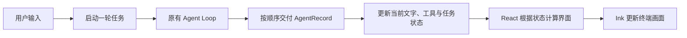

# 第 10 章：第一个真正可用的 TUI

[10.1 把对话放进一个界面](01-first-screen/README.md) · [10.2 让界面跟着执行变化](02-live-progress/README.md) · [10.3 在界面中批准工具调用](03-tool-approval/README.md) · [10.4 取消以后，继续留在对话里](04-cancel-and-restore/README.md) · [练习与答案](EXERCISES.md)

第九章结束时，一轮任务已经能按顺序交出开始、文字、工具和结束事件。文本终端把这些事件打印出来，JSONL 消费者把它们交给脚本。现在，我们来做第三种消费者：一个可以持续输入、显示进展、处理审批的终端界面。

这种界面通常叫 TUI，也就是 Terminal User Interface。它仍运行在终端里，不过画面不再只是向下追加的日志。已经显示的“正在读取”可以变成“读取完成”，输入区可以在任务运行时停用，审批出现时也能给用户一个明确的操作位置。

我们需要先解决一个新的问题：执行事件描述的是“刚才发生了什么”，界面却需要知道“现在应该显示什么”。例如，收到一个文字片段以后，程序得记住之前的片段，才能画出目前为止的整句话。本章从这层关系开始，逐步把已有 Agent 接到 React / Ink 上。

## 这一章怎样展开

继续沿用上一章的任务：“读取 `README.md`，说明项目怎样启动。”同一个任务可以依次帮助我们观察四件事。

| 学习步骤 | 我们要弄明白的事情 | 对应小节 |
| --- | --- | --- |
| 输入与回答 | 界面怎样记住用户输入，并在回答到达后重新绘制？ | [10.1 把对话放进一个界面](01-first-screen/README.md) |
| 执行进展 | 怎样把一条条事件整理成当前文字、模型步骤和工具状态？ | [10.2 让界面跟着执行变化](02-live-progress/README.md) |
| 工具审批 | 核心正在等待批准时，界面怎样把用户的选择交回去？ | [10.3 在界面中批准工具调用](03-tool-approval/README.md) |
| 取消与环境 | 怎样取消当前任务后继续对话，并在适合的环境中启动 TUI？ | [10.4 取消以后，继续留在对话里](04-cancel-and-restore/README.md) |

前两节使用读取和普通问答，先把显示过程走通。到了审批一节，我们再让 Agent 准备创建文件，在真正写入之前显示预览。最后用一个运行较久的任务观察取消：界面必须等执行链完成清理，才能接收下一轮。

## 先保存状态，再根据状态画界面

普通日志收到“工具开始”，便打印一行文字。TUI 收到同一条事件以后，先更新自己保存的工具状态，再让显示组件读取新状态。

可以把本章的显示路线看成下面这条链：



React 帮我们保存会影响显示的状态，并在状态变化后重新计算组件。Ink 负责把组件描述的文字与布局画到终端。两者都不负责选择模型、执行工具或决定权限；这些能力仍在此前的模块里。

审批要再加一条反向路线。事件能告诉界面“正在等待批准”，但不能替用户批准。用户在审批区作出选择后，程序通过原有审批函数返回允许或拒绝，Agent Loop 才能继续。这也让 TUI 与文本终端保持同样的权限规则。

## 学完以后，Agent 能做到哪里

本章结束后，终端界面可以显示对话、文字增量、模型步骤和工具状态。需要审批时，用户可以查看请求与预览，再允许或拒绝。运行中取消只结束当前任务；程序等清理结束后恢复输入，空闲时再退出界面。

文本与 JSONL 两种输出继续保留。最终的默认模式会检查输入和输出是否都连接着真实终端：适合持续交互时进入 TUI，单次提问与非交互输出继续使用文本，脚本也能显式选择 JSONL。

这里先完成最常用的一条输入与执行路线。[第十一章](../chapter-11-terminal-workbench/README.md)会沿着“整理请求、发送、回看结果、继续编辑”的使用过程，加入多行编辑、粘贴与撤销、输入历史和补全、结果浏览、外部编辑器，以及中文和窄窗口下的显示。运行中可以先编辑下一份草稿；第十二章再讨论把补充要求交给活动任务和排队执行。

## 从哪里继续

本章从 [09.3](../chapter-09-observable-runs/03-jsonl-output/README.md)及[第九章练习](../chapter-09-observable-runs/EXERCISES.md)继续。第九章练习只新增独立的计时实验，没有改变正式源码，因此 10.1 的起点就是 09.3 的完整 `src/`。

本章的四个小节分别保留可以独立运行的实现。先按顺序构建，再完成[章末练习](EXERCISES.md)：让真实任务事件经过界面状态转换，检查“执行发生了什么”和“界面保存了什么”是否对应。

使用完整配套仓库并完成 10.4 后，在仓库根目录运行本章固定检查。终端检查使用 Python 标准库创建伪终端并模拟输入，需要 macOS、Linux 或 WSL，以及可用的 `python3`，不需要安装 pip 包：

```bash
npm run check:10
```

检查使用本地模型替身验证事件与界面状态，还会通过终端会话验证输入、审批、取消和退出恢复，不访问真实模型服务。真实服务的账号配置、工具选择与回答质量，仍按各节运行说明观察。
