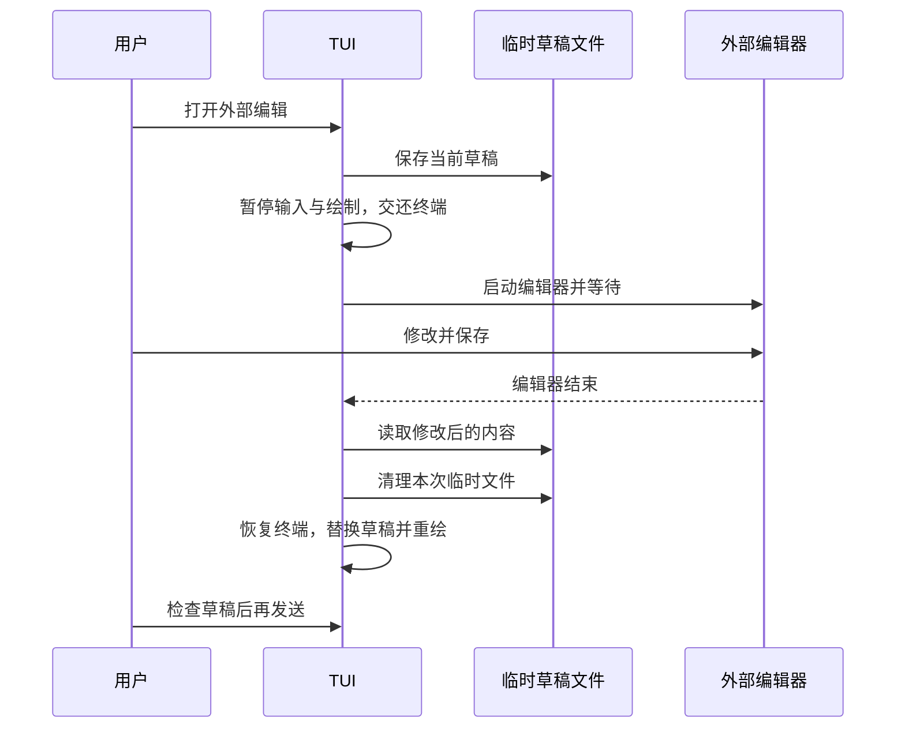

# 11.4 用熟悉的编辑器整理草稿

[第 11 章首页](../README.md) · [上一节：11.3 停下来查看执行结果](../03-browse-results/README.md) · [下一节：11.5 让界面适应终端](../05-terminal-layout/README.md)

## 问题：草稿变长以后，还要在小输入区里逐字修改吗

现在，我们已经能粘贴多行、找回旧输入，并对照结果继续补充要求。假设我们想把项目的启动说明、一次错误输出和自己的限制条件整理成同一个问题，草稿可能很快超过几行。

在这种情况下，用户往往更熟悉 Vim、Nano 或其他编辑器里的选择、搜索和批量修改。TUI 不必把所有编辑器功能再实现一遍，但不能直接启动一个子进程就不管了：两个程序若同时读取键盘或绘制终端，屏幕和输入都会混在一起。

本节让 TUI 暂时把终端交给外部编辑器。编辑器关闭后，程序取回新草稿，恢复原来的界面，用户检查后再发送。

## 解决方案：用临时文件交换文字，用等待交还终端

外部编辑器最普遍的输入是一份文件。程序先把当前草稿写进本次操作专用的临时文件，再让编辑器打开它。编辑器正常结束以后，程序读取文件，把结果作为一整次草稿替换。

终端交接由 Ink 的 [`suspendTerminal`](https://github.com/vadimdemedes/ink#suspendterminalcallback) 完成。暂停期间，Ink 停止消费输入和写画面，恢复外部编辑器需要的终端状态；编辑回调结束后，Ink 重新接管终端并完整重绘。



图中的虚线表示返回结果。读回的文字已经保存在内存中，所以清理临时文件不会丢掉新草稿。编辑器退出与用户发送是两个不同的时刻：前者只把文字交回输入区，后者才启动 Agent。

## 工作原理

### 1. 临时文件让两个程序交换同一份草稿

TUI 的草稿存在内存里，外部编辑器通常接收文件路径。专用临时文件就是两者之间的交换位置：TUI 写入原文，编辑器修改文件，TUI 最后读取。

临时文件不属于用户项目，也不是 Agent 的 `write_file` 工具产物。它由用户主动打开编辑器这一操作创建，只用来交换草稿；读回以后统一换行形式，显示时仍经过终端控制字符转义。

读取成功以前，旧草稿仍留在内存中。程序不会先清空输入框，再寄希望于编辑器一定成功。这样，即使配置的编辑器不存在或启动失败，用户原来的文字仍然可以继续修改。

### 2. 等待的是编辑完成，不只是进程启动

终端编辑器一般一直运行到用户退出。部分图形编辑器却会打开窗口后立即返回，真正编辑文字的工作在另一个进程中继续。

如果 TUI 把“启动命令已经返回”理解成“用户已经编辑完成”，它可能在用户保存之前就读回旧文件，甚至清理掉交换文件。所以选用图形编辑器时，需要使用该编辑器提供的等待选项，让启动命令在关闭当前文件以后才结束。

编辑器配置先取本地环境变量 `VISUAL`，其次取 `EDITOR`，两者都没有时使用 `vi`。本节通过 `/bin/sh` 运行这份用户配置，因此可以带上 `--wait` 等选项。临时文件路径作为独立参数传入，不把文件名拼成一段 shell 命令；这份可执行配置只来自本地环境，不来自模型回答。

本节只接受正常结束后读回的内容。编辑器异常退出、文件无法读取或内容不符合输入限制时，界面报告失败并保留原草稿。这是保护尚未发送文字的回退，不会把编辑失败交给模型处理。

### 3. 终端一次交给一个程序

Ink 在交互模式下控制光标、按键输入和画面更新。外部编辑器也需要这些能力。正确的交接顺序是：先让 Ink 暂停，再启动编辑器，等编辑器结束，最后恢复 Ink。

`suspendTerminal` 的回调形式把恢复放进了这段生命周期：即使编辑步骤抛错，Ink 也会恢复自己的终端状态并重新绘制。我们仍要在自己的清理代码里删除临时文件，因为终端库不知道哪些文件属于这次草稿操作。

为了先把交接关系讲清，本节只在没有活动任务和审批时打开编辑器。运行中补充要求和任务干预会在第十二章继续处理；这里无需同时让模型输出、审批输入和外部程序争用终端。

### 4. 返回以后，仍是一份可以撤销的草稿

编辑器保存成功以后，新正文替换输入区里的旧正文。对于 TUI 来说，这是一整次修改，与粘贴一整段文字相似，因此可以继续沿用前面建立的撤销机制。

用户若发现删多了一段，可以先撤销回外部编辑前的草稿，再决定下一步。程序没有自动提交，所以这个检查仍发生在模型请求之前。

退出 TUI 时仍走第十章的统一清理路径。临时交给编辑器只是一次暂停，不会重新创建模型历史、会话授权或结果记录。

## 本节改动文件

| 状态 | 文件 | 本节变化 |
| --- | --- | --- |
| CHANGED | [src/ui/tui/system-actions.ts](src/ui/tui/system-actions.ts) | 用临时文件等待编辑结果 |
| CHANGED | [src/ui/tui/app.tsx](src/ui/tui/app.tsx) | 暂停终端，再恢复到同一份会话 |

## 动手构建

跟写起点是 11.3，本节目标目录是 `chapter-11-terminal-workbench/04-external-editor/`。沿用上一节完整 `src/`，增加临时文件与编辑器的交接。

### 用临时文件等待编辑结果

新增 `editExternally()`，沿用已有复制函数。它先保存旧草稿，再等待编辑器退出；正常退出、普通文件和长度检查都通过以后，先把新文本留在内存中，清理自己创建的临时目录，再返回给界面。

在 `src/ui/tui/system-actions.ts` 中，先把文件开头的教学说明与导入替换为：

<!-- source: src/ui/tui/system-actions.ts -->
```ts
/**
 * 11.4 把草稿交给外部编辑器 | [CHANGED] ui/tui/system-actions.ts
 *
 * 学习目标：由用户把草稿交给外部编辑器，完成后取回仍待发送的文字。
 * 输入：界面选择的显示文字或当前草稿与取消信号。
 * 输出：复制操作结束通知，或外部编辑后的草稿。失败抛错，由界面说明原因。
 *
 * 本文件局部流程（全局主流程见 agent/agent-loop.ts）：
 *   复制 -> 超过 1000000 字节？-- 是 -> 抛错
 *                               +-- 否 -> 系统剪贴板进程 -> 从 stdin 交付文字
 *   启动失败 / 超过 5 秒 / 非零退出 -> 报错；退出码为 0 -> 完成
 *   外部编辑 -> 创建临时目录与草稿文件 -> 启动本地配置的编辑器
 *   编辑器正常结束？-- 否 -> 抛错，界面保留原草稿
 *                      +-- 是 -> 普通文件且长度允许？-- 否 -> 抛错
 *                                                    +-- 是 -> 读回文字并返回
 *   成功 / 失败 -> finally 删除临时目录
 *
 * VISUAL / EDITOR 来自本地用户配置，允许携带参数；它会交给本机 shell，不是模型可以设置的工具参数。
 * 编辑器运行期间的终端让出与恢复由 app.tsx 负责；这里只管理进程和临时草稿。
 * 运行观察：外部编辑器保存退出后草稿更新，仍要手动发送；编辑器失败时原草稿保留。
 */
import { spawn } from "node:child_process";
// [NEW 11.4] 临时目录和草稿长度限制只服务外部编辑，不改变复制路径。
import { mkdtemp, writeFile, readFile, lstat, rm } from "node:fs/promises";
import { tmpdir } from "node:os";
import { join } from "node:path";
import { MAX_DRAFT } from "./editor.js";
```


在导入之后新增函数 `editExternally()`，连同其前面的教学注释一起更新：

<!-- source: src/ui/tui/system-actions.ts -->
```ts
// [NEW 11.4] 外部编辑器由本地用户选择；只交换草稿，返回后仍需手动发送。
/**
 * 把草稿暂存在文件中，等待本地编辑器结束后取回文字。
 *
 * - 输入：当前草稿与本次编辑专用的取消信号；调用方先暂停 Ink 对终端的占用。
 * - 输出：正常保存退出后的完整草稿，换行统一成 LF；这里不会调用发送函数。
 * - 关键步骤：创建私有临时草稿，依次选择 VISUAL、EDITOR 或 vi；文件路径作为单独参数交给 shell。
 * - 校验：编辑器成功退出后检查普通文件与字节大小，再读回并检查 MAX_DRAFT 个 UTF-16 单元的长度限制。
 * - 失败与清理：取消先请求 SIGTERM，再用 SIGKILL 兜底并等待 close；任何结果都清理临时目录，错误交给界面保留原草稿。
 * - 职责边界：本地编辑器配置是可信配置；路径检查和读取并非同一个原子操作，这不是隔离恶意编辑器的文件系统沙箱。
 */
export async function editExternally(text: string, signal: AbortSignal): Promise<string> {
  signal.throwIfAborted();
  const directory = await mkdtemp(join(tmpdir(), "hello-agent-draft-"));
  const file = join(directory, "prompt.md");
  try {
    await writeFile(file, text, { mode: 0o600 });
    const editor = process.env.VISUAL || process.env.EDITOR || "vi";
    signal.throwIfAborted();
    await new Promise<void>((resolve, reject) => {
      // 用户的编辑器配置可以带 --wait；文件名作为独立参数，不拼入 shell 命令正文。
      const child = spawn("/bin/sh", ["-c", `exec ${editor} "$1"`, "hello-agent-editor", file], { stdio: "inherit" });
      let failure: Error | undefined, timer: ReturnType<typeof setTimeout> | undefined;
      const stop = () => { child.kill("SIGTERM"); timer = setTimeout(() => child.kill("SIGKILL"), 1000); timer.unref(); };
      signal.addEventListener("abort", stop, { once: true });
      child.on("error", (error) => { failure = error; });
      child.on("close", (code) => {
        if (timer) clearTimeout(timer);
        signal.removeEventListener("abort", stop);
        if (signal.aborted) reject(signal.reason);
        else if (failure || code !== 0) reject(new Error("编辑器未正常结束，原草稿已保留。"));
        else resolve();
      });
      if (signal.aborted) stop();
    });
    const stat = await lstat(file);
    if (!stat.isFile() || stat.size > MAX_DRAFT * 4) throw new Error("编辑结果不是普通文件或过大，原草稿已保留。");
    const next = (await readFile(file, "utf8")).replace(/\r\n?/g, "\n");
    if (next.length > MAX_DRAFT) throw new Error("编辑结果超过草稿上限，原草稿已保留。");
    return next;
  } finally { await rm(directory, { recursive: true, force: true }); }
}
```


本文件其余实现沿用上一节。

### 暂停终端，再恢复到同一份会话

`Ctrl+G` 只在空闲时打开外部编辑。回调放进 `suspendTerminal()`，编辑成功后通过 `changeDraft()` 替换文字，因此沿用撤销机制。退出函数还要等待正在进行的编辑交接，不能在子进程仍占用终端时直接卸载界面。

在 `src/ui/tui/app.tsx` 中，先把文件开头的教学说明与导入替换为：

<!-- source: src/ui/tui/app.tsx -->
```tsx
/**
 * 11.4 把草稿交给外部编辑器 | [CHANGED] ui/tui/app.tsx
 *
 * 学习目标：把终端暂时交给本地编辑器，回来后继续检查并发送同一份草稿。
 * 输入：模型、键盘、终端尺寸与同一 Agent 事件流；界面只在用户提交后启动任务。
 * 输出：可浏览的历史区、草稿区和审批面板。
 * 状态：Session 保存模型历史、只读授权与已发送问题；React state 保存草稿和画面。
 * 失败：本轮异常保留已经收到的结果；清理完成前不能发送下一轮，已执行的工具操作不回滚。
 *
 * 本文件局部流程（全局主流程见 agent/agent-loop.ts）：
 *   startTui -> 创建 Session、注册退出监听 -> 挂载 TuiApp
 *   Ctrl+O -> 切换草稿 / 历史焦点；审批中不切换
 *   任务运行中 -> 继续编辑草稿；按 Enter -> 提示保留草稿，等待本轮结束
 *   找回 / 搜索 / 补全 -> 更新草稿，尚未发送
 *   Ctrl+G -> 空闲且没有审批？-- 否 -> 提示稍后编辑
 *                             +-- 是 -> suspendTerminal -> 外部编辑器
 *   外部编辑成功？-- 否 -> 保留原草稿，显示原因
 *                   +-- 是 -> changeDraft -> 恢复界面，仍待发送
 *   普通 Enter -> 可以提交？-- 否 -> 保留现有状态
 *                          +-- 是 -> 空白？-- 是 -> 等待输入
 *                                         +-- 否 -> 本地命令？-- 是 -> 本地处理后返回或退出
 *                                                            +-- 否 -> 新建本轮信号 -> 消费事件
 *   普通问题提交时 -> 保存最近 100 条用户问题；模型历史仍由 Agent 核心提交
 *   ask -> waitForApproval -> 审批面板独占输入 -> y / n / 合法 s -> 原审批 Promise
 *   本轮结束 / 失败 -> 等事件流清理 -> 留下结果、解除忙碌 -> 等待下一次提交
 *   Ctrl+C -> 有本轮任务？-- 是 -> abort -> 等清理；否 -> quit
 *   quit -> closing=true -> 取消并等待模型任务与外部编辑 -> 卸载 Ink、移除监听
 *
 * 草稿、问题历史、显示条目和模型消息各有用途；浏览或编辑不会自动改变模型上下文。
 * 外部编辑占用终端期间不能同时发送；编辑器返回的文字先成为一次可撤销修改。
 * 运行观察：Ctrl+G 保存退出编辑器后回到原界面，草稿更新，模型尚未收到新问题。
 */
import { useState } from "react";
// [CHANGED 11.4] useApp 提供让出终端的能力，供本地编辑器独占输入。
import { Box, Text, render, useInput, usePaste, useWindowSize, useApp } from "ink";
import { emptyRunView, updateRunView, screenText, type RunView } from "./state.js";
import { approvalPages, waitForApproval, type PendingApproval } from "./approval.js";
import TextInput from "ink-text-input";
// [CHANGED 11.4] 外部编辑结果通过同一个 changeDraft 成为可撤销修改。
import { DraftEditor, newDraft, changeDraft } from "./editor.js";
import { Transcript, runEntries, type Entry } from "./transcript.js";
// [NEW 11.4] 系统模块只返回草稿文本，是否发送仍由界面决定。
import { editExternally } from "./system-actions.js";
import type { Message, Model } from "../../models/client.js";
import { streamAgentRun } from "../../agent/run-stream.js";
import { explainError } from "../../errors.js";
```


替换同名类型 `Session`，连同其前面的教学注释一起更新：

<!-- source: src/ui/tui/app.tsx -->
```tsx
// [KEEP 来自 10.1] Session 属于一次 startTui 调用，不随组件重新绘制而重建。
type Session = {
  history: Message[];
  prompts: string[];
  run: number;
  nextId: number;
  grants: Set<string>;
  controller?: AbortController;
  done?: Promise<void>;
  closing: boolean;
  // [NEW 11.4] 外部编辑有自己的取消信号与完成 Promise，退出时也必须等待。
  external?: { controller: AbortController; done: Promise<void> };
};
```


替换同名函数 `TuiApp()`，连同其前面的教学注释一起更新：

<!-- source: src/ui/tui/app.tsx -->
```tsx
/**
 * 把草稿、执行事件和当前交互区域连接起来。
 *
 * - 输入：已创建的模型、整次会话的 Session，以及取消和退出函数。
 * - 输出：界面 JSX；按状态选择草稿区、历史区和审批面板，渲染本身不启动任务。
 * - 提交步骤：先检查本轮占用和空白，再处理本地命令；普通问题才创建控制器并开始消费事件。
 * - 事件处理：局部 current 顺序积累每条事件，React 合并绘制也不丢正文；finally 等清理后才解除占用。
 * - 历史区分：prompts 只记最近 100 条已发送问题，供编辑器找回；history 才是模型实际使用的消息。
 * - 焦点：草稿与历史只有一处消费普通按键；审批出现时暂停两处输入，正在编辑的草稿仍保留。
 * - 外部编辑：仅空闲时让出终端，完成后先更新草稿；失败显示原因，不自动发送或清空原文。
 * - 职责边界：本组件不执行工具或提交模型历史，取消也不会撤销已经发生的文件操作。
 */
// [KEEP 来自 10.4] 单独接收 interrupt，让组件触发“取消本轮”而不是直接退出。
function TuiApp({ model, session, quit, interrupt }: { model: Model; session: Session; quit: (code: number) => void; interrupt: () => void }) {
  // 这些值描述画面；setter 通知 React 重新绘制，不能把模型任务写进组件渲染过程。
  const [draft, setDraft] = useState(newDraft());
  const [entries, setEntries] = useState<Entry[]>([]);
  const [busy, setBusy] = useState(false);
  const [focus, setFocus] = useState<"draft" | "history">("draft");
  const [notice, setNotice] = useState("");
  // [NEW 11.4] 用 editing 暂停普通区域输入，由 Ink 临时让出终端。
  const [editing, setEditing] = useState(false);
  const { suspendTerminal } = useApp();
  const [approval, setApproval] = useState<PendingApproval>();
  const [view, setView] = useState<RunView>({ ...emptyRunView(), status: "就绪" });
  const { columns, rows } = useWindowSize();
  // 函数式更新接在上一次 entries 后追加，连续事件不依赖某次绘制时捕获的旧数组。
  const append = (label: Entry["label"], text: string) => {
    const entry = { id: `local:${session.nextId++}`, label, text: screenText(text) };
    setEntries((old) => [...old, entry]);
  };

  // [NEW 11.4] 暂时把整个终端交给编辑器，结束后只替换草稿。
  const openEditor = () => {
    if (session.done || session.external || session.closing || approval) { setNotice("请在当前任务结束后编辑草稿。"); return; }
    const controller = new AbortController();
    setEditing(true);
    session.external = { controller, done: (async () => {
      try {
        let text = draft.text;
        await suspendTerminal(async () => { text = await editExternally(draft.text, controller.signal); });
        if (!session.closing) { setDraft(changeDraft(draft, text)); setNotice("已取回编辑内容，按 Enter 才会发送。"); }
      } catch (error) { if (!session.closing) setNotice(screenText((error as Error).message)); }
      finally { session.external = undefined; if (!session.closing) setEditing(false); }
    })() };
  };
  // [KEEP 来自 10.4] 先提示正在取消，保持 busy；任务真正结束后才由 finally 恢复输入。
  useInput((input, key) => {
    if (key.ctrl && input === "c") {
      if (session.done) { setView((current) => ({ ...current, status: "正在取消，等待清理…" })); }
      interrupt();
    }
    if (key.ctrl && input === "d") quit(0);
    // [NEW 11.4] 只有草稿焦点的快捷键能打开本地编辑器。
    if (key.ctrl && input === "g" && focus === "draft") openEditor();
    if (key.ctrl && input === "o" && !approval) setFocus((old) => old === "draft" ? "history" : "draft");
  });

  const submit = (value: string) => {
    // session.done 立即成为并发保护；不必等 React 把输入框换成忙碌画面后才阻止再次发送。
    // [CHANGED 11.4] 编辑器占用终端期间不接收新提交。
    if (session.closing || session.external) return;
    if (session.done) { setNotice("本轮仍在运行，草稿已保留；完成后再按 Enter 发送。"); return; }
    setNotice("");
    const prompt = value.trim();
    if (!prompt) return;
    setDraft(newDraft());
    // 本地命令只改本地会话；它们不作为 user 消息送给模型。
    if (prompt === "/exit") { quit(0); return; }
    if (prompt === "/reset") { session.history.length = 0; append("本地", "对话历史已清空；会话授权保留。"); return; }
    if (prompt === "/permissions reset") { session.grants.clear(); append("本地", "本次会话的只读授权已撤销。"); return; }
    if (prompt === "/permissions") { append("本地", session.grants.size ? [...session.grants].join("\n") : "当前没有会话授权。"); return; }
    session.prompts = [...session.prompts, prompt].slice(-100);
    append("你", prompt);
    const run = ++session.run;
    setBusy(true);
    setView(emptyRunView());
    // 一轮只对应一个控制器；history 与 grants 比这一轮活得更久，不能一起重新创建。
    const controller = new AbortController();
    session.controller = controller;
    session.done = (async () => {
      let current = emptyRunView();
      try {
        for await (const { event } of streamAgentRun(model, session.history, prompt, controller.signal, (request, signal) => waitForApproval(request, signal, (pending) => {
          if (!session.closing) setApproval(pending);
        }), session.grants)) {
          // [KEEP 来自 10.2] 本地变量保留每条事件；React 可以合并绘制，但不能丢掉已收到的数据。
          current = updateRunView(current, event);
          if (!session.closing) setView(current);
        }
      } catch (error) {
        current = { ...current, status: controller.signal.aborted ? "已取消本轮" : `运行失败：${screenText(explainError(error))}` };
      } finally {
        // for await 完成或抛错前会等待生成器的 finally；此时才解除本轮占用。
        session.controller = undefined;
        session.done = undefined;
        if (!session.closing) {
          setEntries((old) => [...old, ...runEntries(current, run)]);
          setView(current);
          setApproval(undefined);
          setBusy(false);
        }
      }
    })();
  };

  // [KEEP 来自 11.3] 当前轮与留存消息一起交给历史区，草稿输入由焦点决定。
  const display = busy ? [...entries, ...runEntries(view, session.run)] : entries;
  // [CHANGED 11.4] 外部编辑期间停用草稿和历史键盘监听，保留原组件状态。
  return <Box flexDirection="column">
    <Text bold>Hello, My Agent · Ctrl+O 切换草稿 / 历史</Text>
    {approval && <ApprovalPanel key={`${approval.key}:${columns}:${rows}`} pending={approval} columns={columns} rows={rows} />}
    <Box display={approval ? "none" : "flex"} flexDirection="column">
      <Transcript entries={display} active={focus === "history" && !approval && !editing} width={columns} height={Math.max(2, rows - 12)} />
      <Text>状态：{view.status}</Text>
      <Box borderStyle="round" flexDirection="column" paddingX={1}>
        <Text color="cyan">草稿 {focus === "draft" ? "[焦点]" : ""}{busy ? " · 可编辑，完成本轮后再发送" : ""}</Text>
        <DraftEditor value={draft} onChange={setDraft} onSubmit={submit} active={focus === "draft" && !approval && !editing} prompts={session.prompts} width={columns - 4} />
      </Box>
      <Text wrap="truncate">{notice || "Enter 发送 · Ctrl+J 换行 · Ctrl+G 外部编辑 · Ctrl+C 取消 / 退出"}</Text>
    </Box>
  </Box>;
}
```


替换同名函数 `startTui()`，连同其前面的教学注释一起更新：

<!-- source: src/ui/tui/app.tsx -->
```tsx
/**
 * 持有整次 TUI 会话，并在退出前等所有占用结束。
 *
 * - 输入：CLI 已创建的 Model；终端是否可交互已在入口检查。
 * - 输出：界面卸载并清理本函数监听后返回，退出入口设置进程退出码。
 * - 生命周期：Session 只创建一次，重绘和单轮取消都不重建模型历史、授权或问题历史。
 * - 中断选择：Ctrl+C / SIGINT 取消当前模型任务；空闲时退出，外部编辑占用期间不由此处理 SIGINT。
 * - 退出顺序：先标记 closing 阻止新提交，再取消并等待模型任务与外部编辑，最后卸载 Ink。
 * - 失败方式：挂载或等待失败仍进入 finally；清理后由调用方报告错误。
 * - 职责边界：Ink 负责恢复终端输入与显示模式，核心和系统操作模块负责各自任务清理；取消不是回滚。
 */
export async function startTui(model: Model): Promise<void> {
  // 组件可以多次重新绘制，这个对象只随本次 startTui 创建与销毁。
  const session: Session = { history: [], prompts: [], run: 0, nextId: 0, grants: new Set(), closing: false };
  let instance: ReturnType<typeof render> | undefined;
  const quit = (code: number) => {
    if (session.closing) return;
    // 先封住新的提交和状态更新，再等待当前任务；否则退出期间仍可能继续绘制。
    session.closing = true;
    session.controller?.abort();
    // [CHANGED 11.4] 退出前取消并等待外部编辑，不能把编辑器留在终端上。
    session.external?.controller.abort();
    void Promise.all([session.done, session.external?.done]).then(() => { process.exitCode = code; instance?.unmount(); });
  };
  // [KEEP 来自 10.4] 有任务时只取消它；下一个问题会建立新的控制器。
  // [CHANGED 11.4] 编辑器占用期间让它处理 Ctrl+C，避免后台界面同时退出。
  const interrupt = () => { if (session.external) return; if (session.controller) session.controller.abort(); else quit(130); };
  const terminate = () => quit(143);
  const hangup = () => quit(129);
  const endInput = () => quit(0);
  process.on("SIGINT", interrupt);
  process.on("SIGTERM", terminate);
  process.on("SIGHUP", hangup);
  process.stdin.on("end", endInput);
  try {
    // [KEEP 来自 10.4] 界面按键和进程 SIGINT 使用同一个 interrupt 选择取消或退出。
    instance = render(<TuiApp model={model} session={session} quit={quit} interrupt={interrupt} />, { exitOnCtrlC: false, patchConsole: false, alternateScreen: true });
    await instance.waitUntilExit();
  } finally {
    session.closing = true;
    session.controller?.abort();
    // [CHANGED 11.4] 挂载失败或其他退出路径同样清理外部编辑。
    session.external?.controller.abort();
    await Promise.all([session.done, session.external?.done]);
    instance?.unmount();
    // 无论正常退出还是挂载失败，只移除本次添加的监听，避免下次进入界面收到重复通知。
    process.off("SIGINT", interrupt);
    process.off("SIGTERM", terminate);
    process.off("SIGHUP", hangup);
    process.stdin.off("end", endInput);
  }
}
```


本文件其余实现沿用上一节。

## 运行验证

### 构建并指定编辑器

本节外部编辑使用 `/bin/sh`，以下操作适用于 macOS、Linux 或 WSL。完成代码后，在仓库根目录构建：

```bash
npm run lesson:11.4
```

为这次启动指定 `vi`，同时让 `VISUAL` 为空，以免已有环境变量覆盖 `EDITOR`：

```bash
VISUAL= EDITOR=vi hello-my-agent
```

如果本机没有 `vi`，把它替换成已经安装的终端编辑器。图形编辑器使用其官方提供的等待选项，例如支持该选项的编辑器可以把 `EDITOR` 配置为 `code --wait`；关键是当前文件关闭前，命令不能返回。

### 在编辑器里修改，再回到草稿

先在草稿中写入本章的两行读取请求，暂时不发送。按 `Ctrl+G` 打开外部编辑器。在 `vi` 中按 `i` 进入插入模式，修改第二行，再按 `Esc`，输入 `:wq` 并按回车保存退出。

TUI 应重新出现，显示编辑后的多行草稿，Agent 仍未开始执行。按 `Ctrl+Z`，应回到外部编辑之前的草稿；按 `Ctrl+Y` 可以重做这次替换。最后由用户按 `Enter` 发送。

外部编辑只在空闲时打开。若当前任务还没有结束，`Ctrl+G` 会给出提示，原草稿和运行任务继续保留。

### 让启动失败一次，检查文字有没有丢

先正常退出，再以一个不存在的编辑器命令启动：

```bash
VISUAL= EDITOR=hello-agent-editor-does-not-exist hello-my-agent
```

输入 `这份草稿需要保留`，按 `Ctrl+G`。外部命令应启动失败，随后回到 TUI，显示失败说明，原文字仍在输入区。修改一个字，确认输入和重绘已经恢复，再退出程序。

这里没有向模型发送问题，检查的是终端交接失败后仍能继续编辑。正常保存、非零退出、结果过大和临时文件清理等确定行为，由本章固定检查使用本地编辑器替身验证。

## 本节完成后的 Agent

现在，我们可以先在外部编辑器里整理长请求，回到 TUI 后检查、撤销或继续修改，再明确发送。编辑器处理草稿，原有 Agent Loop 仍只接收最终提交的正文。

编辑体验已经齐了，但画面还要面对不同的终端：中文与 emoji 占多少列，窗口变窄后显示哪部分，没有颜色时如何辨认状态。最后一节把这些布局和恢复问题接上。
