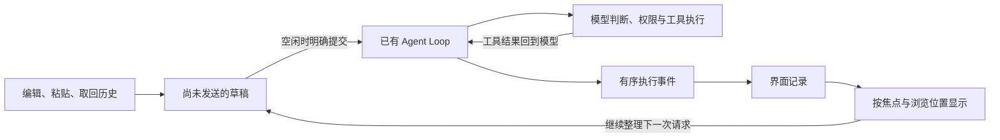

# 第 11 章：做好输入、显示与终端兼容

[11.1 编辑一份多行草稿](01-editable-draft/README.md) · [11.2 找回输入，补全路径](02-recall-and-complete/README.md) · [11.3 停下来查看执行结果](03-browse-results/README.md) · [11.4 用熟悉的编辑器整理草稿](04-external-editor/README.md) · [11.5 让界面适应终端](05-terminal-layout/README.md) · [练习与答案](EXERCISES.md)

第十章结束时，我们已经能在同一个终端界面里输入问题、观察工具进展、批准操作，并在取消以后继续对话。接下来真正用它阅读一个项目，就会遇到另一类问题：请求有好几行，路径很长，模型还在输出，我们却想停下来看看刚才的结果。

这些事情不要求模型多学一种工具，却决定了这个 Agent 是否适合持续使用。本章围绕一次完整的使用过程，把输入框和结果区变成可以编辑、查找和浏览的工作空间，同时处理外部编辑器与终端尺寸变化。

多行粘贴使用终端的 bracketed paste，也就是把粘贴内容包在开始与结束标记之间的能力；本章在支持它的终端中区分整段粘贴与发送按键。中文输入法的候选选择由系统和终端处理，TUI 接收已经提交的字符。各节检查会说明验证范围，不把本机结果当作所有终端平台的保证。

## 从一份读取请求开始

这次，我们准备让 Agent 阅读项目说明，再整理启动步骤。请求可以写成两行：

```text
请读取 README.md，说明这个项目怎样启动。
把安装依赖、启动程序和运行检查分开说明。
```

在发送之前，我们可能要粘贴这段文字、修改文件名，或者撤销刚才的一次删除。发送以后，Agent 仍按原有方式调用模型、读取文件，再把工具结果交回模型。等待时可以先整理下一份草稿，也可以把视线移到已经出现的结果上。

任务结束后，我们想复用上次请求，只修改其中一行。如果草稿越来越长，还可以临时交给熟悉的编辑器，保存后再回到 TUI。整个过程中，终端窗口可能变窄，正文也可能包含中文和 emoji；这些变化不应让文字变得难以阅读，更不应改变请求的内容。

## 这一章怎样展开

| 学习问题 | 我们要掌握的方法 | 对应小节 |
| --- | --- | --- |
| 怎样修改一份尚未发送的请求？ | 保存正文与光标位置，把插入、删除、粘贴和撤销视为草稿编辑 | [11.1 编辑一份多行草稿](01-editable-draft/README.md) |
| 怎样少输一些重复的文字？ | 从本次输入记录取回请求，按已有命令和真实项目路径给出补全 | [11.2 找回输入，补全路径](02-recall-and-complete/README.md) |
| 怎样边运行边回看结果？ | 明确按键焦点，分别保存结果内容与浏览位置，按需展开工具结果 | [11.3 停下来查看执行结果](03-browse-results/README.md) |
| 怎样在完整编辑器里继续写？ | 暂时交还终端，用临时文件交换草稿，等编辑器结束后恢复界面 | [11.4 用熟悉的编辑器整理草稿](04-external-editor/README.md) |
| 换个终端以后怎样保持可读？ | 按显示宽度换行，根据窗口尺寸分配空间，并保留无颜色提示与退出恢复 | [11.5 让界面适应终端](05-terminal-layout/README.md) |

每节解决一个新的使用问题，接在上一节之后。小节数量由这些问题决定；不需要把外部编辑器或终端布局硬塞进输入框的实现里。

## 草稿、执行与浏览各自记住什么

我们先把三份容易混淆的数据区分开。

**草稿**是输入区里尚未发送的文字。插入、撤销、取回历史和外部编辑都先改变它。只有用户明确提交，程序才把当时的完整正文交给一轮任务。

**模型历史**由已有执行链管理，保存已经提交的用户问题、模型消息和工具结果。草稿多了一个字、结果区向上滚了一屏，都不该改变这份历史。

**界面记录**帮助人阅读已经发生的事情。模型文字与工具状态沿用第十章的显示状态；本章再保存工具返回的结果正文，记住浏览位置、当前焦点与哪些工具项已经展开。折叠一项只改变它在屏幕上占多少行，不能删除模型下一次决策需要的工具结果。



运行时能编辑草稿，不代表能同时提交第二轮。本章继续保持一次只执行一轮任务；第十二章再解决运行中补充要求、立即干预与排队的生效时机。输入记录也只保留在当前进程内，退出后恢复会话是第十三章的主题。

## 从哪里继续

本章从 [10.4](../chapter-10-terminal-ui/04-cancel-and-restore/README.md)和[第十章练习](../chapter-10-terminal-ui/EXERCISES.md)继续。第十章练习新增的是独立的界面状态实验，没有改动正式实现，所以 11.1 从 10.4 的完整 `src/` 开始。

各小节仍保留独立的 `README.md + src/`。输入和显示都在 `ui/tui/` 内演进，模型协议、Agent Loop、工具与权限规则继续沿用。完整实现后再做[章末练习](EXERCISES.md)，用固定输入检查编辑与显示状态，不需要真实模型服务。

使用完整配套仓库并完成 11.5 后，在仓库根目录运行本章检查：

```bash
npm run check:11
```

检查使用固定数据验证编辑、补全与浏览状态，并在伪终端里实际发送按键、粘贴和尺寸变化。模型、剪贴板与外部编辑器采用本地替身，不访问真实模型服务，也不改系统剪贴板。终端检查需要 macOS、Linux 或 WSL 中的 `python3`，只使用 Python 标准库。

这些检查覆盖本章约定的交互；实际终端、字体和本地编辑器仍按各节的手动操作观察。学完以后，我们拥有的是一套可编辑、可浏览、可恢复终端控制的界面；任务调度和会话持久化继续留给后面的章节。
